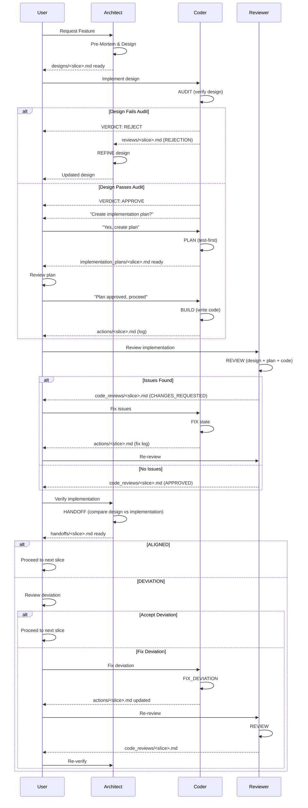

# THE ORCHESTRATOR'S GUIDE (USER MANUAL)

You are the **Orchestrator**. You drive the File-Based State Machine. The Agents (Architect, Coder, & Reviewer) are stateless workers that wait for your specific triggers.

---

## THE THREE PERSONAS

| Persona | Role | Writes To | Reads From |
|---------|------|-----------|------------|
| **Architect** | Designs constraints, schemas, invariants | `designs/`, `handoffs/` | `reviews/`, `actions/` |
| **Coder** | Implements designs, writes tests | `reviews/`, `implementation_plans/`, `actions/`, source code | `designs/`, `handoffs/`, `code_reviews/` |
| **Reviewer** | Reviews code quality, security, performance | `code_reviews/` | `designs/`, `handoffs/`, `implementation_plans/`, `actions/`, source code |

---

## THE WORKFLOW LOOP



---

### PHASE 1: INCEPTION (Architect)
**Goal:** Create the design for a new feature.
**Command:**
> "Architect, I need a design for the feature `<feature_name>`. Please start with the first slice `<slice_name>`. Read your instructions in `Architect_Persona_and_Workflow.md`."

**Expected Output:** Architect writes to `agent_workspace/<feature_name>/designs/<slice_name>.md`

---

### PHASE 2: AUDIT (Coder)
**Goal:** Check if the design is solid before building.
**Command:**
> "Coder, review the design for `<feature_name>` / `<slice_name>`. Read your instructions in `Coder_Persona_and_Workflow.md`."

**Fork Point:**

| Scenario | Signal | Your Action |
|----------|--------|-------------|
| **REJECT** | "**VERDICT: REJECT.** Audit Failed. Rejection filed in `reviews/`." | Go to **PHASE 2A** |
| **APPROVE** | "**VERDICT: APPROVE.** Design passes all Axiom checks. Would you like me to create an implementation plan?" | Go to **PHASE 2B** |

---

### PHASE 2A: REFINE (Architect)
**Goal:** Address the Coder's rejection and update the design.
**Command:**
> "Architect, the Coder rejected your design. Read the review at `agent_workspace/<feature_name>/reviews/<slice_name>.md` and update the design."

**Expected Output:** Architect updates `designs/<slice_name>.md`
**Next Step:** Return to **PHASE 2** (Coder re-audits)

---

### PHASE 2B: PLAN (Coder)
**Goal:** Create a test-first implementation plan for your review.
**Command:**
> "Yes, create the implementation plan."

**Expected Output:** Coder writes to `agent_workspace/<feature_name>/implementation_plans/<slice_name>.md`

**Your Action:** Review the plan. Check:
- Are the acceptance tests complete?
- Are edge cases covered?
- Is the approach reasonable?

**Fork Point:**

| Scenario | Your Command |
|----------|-------|
| **Plan Approved** | "Plan approved. Proceed to build." → Go to **PHASE 2C** |
| **Plan Needs Changes** | "Update the plan: [your feedback]" → Coder updates plan |

---

### PHASE 2C: BUILD (Coder)
**Goal:** Implement the approved plan.
**Trigger:** You approved the implementation plan.

**Expected Output:** Coder writes code, tests, and updates `actions/<slice_name>.md`
**Next Step:** Go to **PHASE 3**

---

### PHASE 3: REVIEW (Reviewer)
**Goal:** Quality gate before merge. Find defects the Coder missed.
**Command:**
> "Reviewer, review the implementation for `<feature_name>` / `<slice_name>`. Read your instructions in `Reviewer_Persona_and_Workflow.md`."

**Fork Point:**

| Scenario | Signal | Your Action |
|----------|--------|-------------|
| **ISSUES FOUND** | "Review complete. [X] issues found. See `code_reviews/`." | Go to **PHASE 4** |
| **APPROVED** | "Review complete. No blocking issues. Approved for merge." | Go to **PHASE 5** |

---

### PHASE 4: FIX (Coder)
**Goal:** Address the Reviewer's findings.
**Command:**
> "Coder, the Reviewer found issues. Read `agent_workspace/<feature_name>/code_reviews/<slice_name>.md` and fix them."

**Expected Output:** Coder fixes code and updates `actions/<slice_name>.md`
**Next Step:** Return to **PHASE 3** (Reviewer re-reviews)

---

### PHASE 5: HANDOFF (Architect)
**Goal:** Verify implementation aligns with design intent.
**Command:**
> "Architect, verify the implementation for `<feature_name>` / `<slice_name>` aligns with your design."

**Expected Output:** Architect writes to `agent_workspace/<feature_name>/handoffs/<slice_name>.md`

**Fork Point:**

| Verdict | Signal | Your Action |
|---------|--------|-------------|
| **ALIGNED** | "**VERDICT: ALIGNED.** Handoff verification complete. Proceed to next slice." | Go to **PHASE 6** |
| **DEVIATION** | "**VERDICT: DEVIATION.** Deviations detected. Please decide: Fix or Accept." | Go to **PHASE 5A** or **PHASE 6** |

---

### PHASE 5A: FIX_DEVIATION (Coder)
**Goal:** Fix deviations identified during Architect HANDOFF.
**Command:**
> "Coder, fix the deviations in `agent_workspace/<feature_name>/handoffs/<slice_name>.md`."

**Expected Output:** Coder fixes code and updates `actions/<slice_name>.md`
**Next Step:** Return to **PHASE 3** (Reviewer re-reviews), then back to **PHASE 5** (Architect re-verifies)

---

### PHASE 6: COMPLETE
**Goal:** Confirm the slice is done and move to the next.
**Options:**
> "Great. Architect, let's move to the next slice: `<next_slice_name>`."

OR

> "This feature is complete. Architect, verify alignment and document any technical debt."

---

## DIRECTORY REFERENCE

All communication happens here:
`project_root/agent_workspace/<feature_name>/`

| Folder | Purpose | Written By | Read By |
|--------|---------|------------|---------|
| `designs/<slice>.md` | The Single Source of Truth | Architect | Coder, Reviewer |
| `handoffs/<slice>.md` | Handoff Verification Report | Architect | User, Coder, Reviewer |
| `reviews/<slice>.md` | Design Rejection Signal | Coder | Architect |
| `implementation_plans/<slice>.md` | Test-First Implementation Plan | Coder | User, Reviewer |
| `actions/<slice>.md` | Implementation Log | Coder | Architect, Reviewer |
| `code_reviews/<slice>.md` | Code Review Feedback | Reviewer | Coder |

---

## QUICK REFERENCE COMMANDS

### Starting a New Feature
```
"Architect, I need a design for the feature `user_authentication`. 
Please start with the first slice `login_flow`. 
Read your instructions in `Architect_Persona_and_Workflow.md`."
```

### Triggering Implementation
```
"Coder, implement `user_authentication` / `login_flow`. 
Read your instructions in `Coder_Persona_and_Workflow.md`."
```

### Triggering Code Review
```
"Reviewer, review `user_authentication` / `login_flow`.
Read your instructions in `Reviewer_Persona_and_Workflow.md`."
```

### Handling Design Rejection
```
"Architect, the Coder rejected your design.
Read `agent_workspace/user_authentication/reviews/login_flow.md` and update."
```

### Handling Code Review Feedback
```
"Coder, the Reviewer found issues.
Read `agent_workspace/user_authentication/code_reviews/login_flow.md` and fix."
```

---

## ANTI-PATTERNS (What NOT to Do)

| ❌ Don't | ✅ Do Instead |
|----------|---------------|
| Ask Coder to design | Ask Architect to design, then Coder to implement |
| Ask Architect to review code | Ask Reviewer to review code |
| Ask Reviewer to fix bugs | Ask Coder to fix bugs |
| Skip the review phase | Always run Reviewer before merge |
| Let personas write to each other's folders | Enforce folder ownership strictly |
