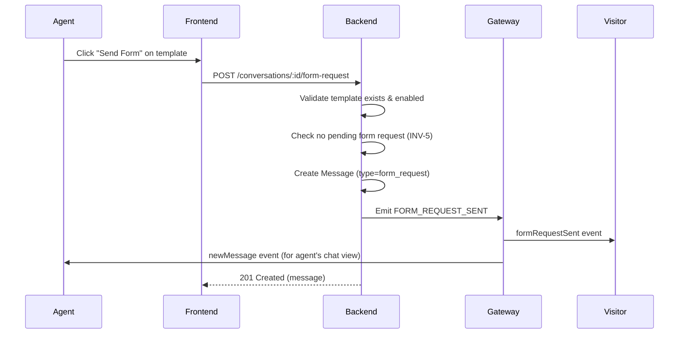
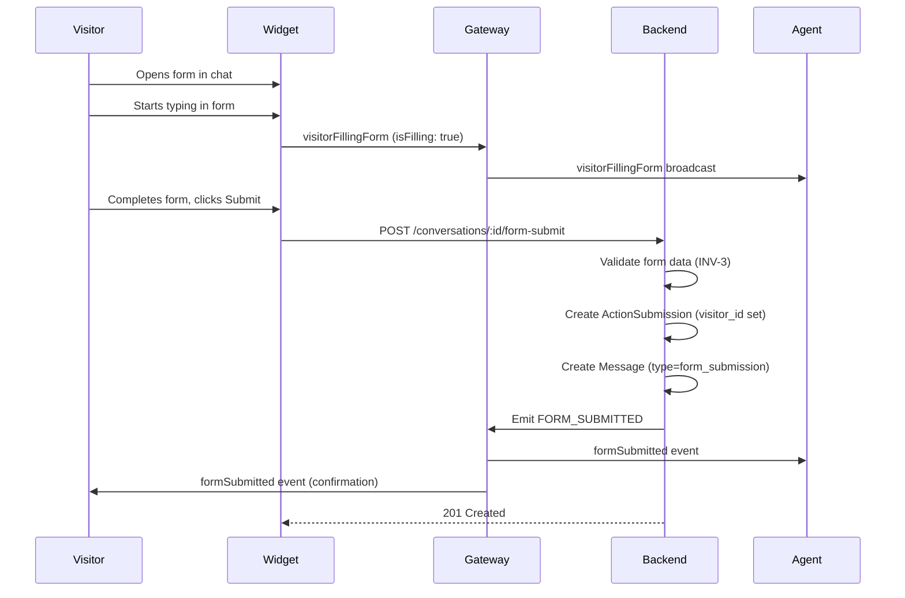

# Design: Send Form to Chat

## 0. Investigation Summary

### Key Files Discovered
| File | Purpose |
|------|---------|
| `packages/backend/src/actions/entities/action-submission.entity.ts` | Submission entity with `creatorId` FK to `users` table |
| `packages/backend/src/gateway/events.gateway.ts` | WebSocket gateway with typing indicator pattern |
| `packages/shared-types/src/websocket.types.ts` | WebSocket event definitions |
| `packages/shared-types/src/message.types.ts` | Message interface with `contentType` field |
| `packages/frontend/src/widget/components/Message.tsx` | Widget message rendering (currently text-only) |

### Patterns Observed
- **Typing indicator**: `VISITOR_TYPING` broadcasts to project room; `AGENT_TYPING` emits to specific visitor socket
- **Message types**: Messages have optional `contentType` field (defaults to 'text')
- **Real-time events**: Gateway uses `emitToProject()` for agent broadcasts, `sendReplyToVisitor()` for visitor-targeted events

### Integration Points
1. **Message entity**: Use `contentType` field to distinguish form requests/submissions
2. **ActionSubmission entity**: `creatorId` currently requires UUID (User FK) — needs schema change for visitor submissions
3. **WebSocket gateway**: Add new events for form request/filling/submission

### Constraints from Existing Code
- `ActionSubmission.creatorId` is a UUID FK to `users` table — visitors don't have User records
- Form validation uses `validateActionData()` which is field-type-aware
- Widget uses Preact (not React) with a separate component tree

---

## 1. Domain Physics (Invariants)

> These rules must ALWAYS be true. The Coder must enforce these.

| ID | Invariant | Enforcement |
|----|-----------|-------------|
| **INV-1** | A form request message MUST reference a valid, enabled ActionTemplate | Validate on send; reject if template is disabled/deleted |
| **INV-2** | A visitor can only submit a form if they have an active form request in the conversation | Backend must track pending form requests |
| **INV-3** | Form submission data MUST pass the same validation as agent submissions | Reuse `validateActionData()` |
| **INV-4** | A submitted form MUST be linked to its original form request message | FK or reference field required |
| **INV-5** | Only ONE active form request can exist per conversation at a time | Reject new request if one is pending |
| **INV-6** | "Filling form" status MUST timeout after inactivity (e.g., 60s) | Client-side timeout; server ignores stale status |

---

## 2. Data Structures

### 2.1 New Message Content Types

```typescript
// packages/shared-types/src/message.types.ts

export enum MessageContentType {
  TEXT = 'text',
  FORM_REQUEST = 'form_request',      // Agent sends form to visitor
  FORM_SUBMISSION = 'form_submission' // Visitor/Agent submits filled form
}
```

### 2.2 Form Request Metadata (stored in Message)

```typescript
// packages/shared-types/src/actions.ts

export interface FormRequestMetadata {
  templateId: number;
  templateName: string;
  templateDescription?: string;
  definition: ActionDefinition; // Snapshot at time of send
  expiresAt?: string;           // ISO 8601, optional
}

export interface FormSubmissionMetadata {
  formRequestMessageId: string; // Links to original form request
  submissionId: string;         // Links to ActionSubmission record
  templateName: string;
  data: Record<string, any>;    // The filled form data for display
}
```

### 2.3 ActionSubmission Entity Changes

> **Migration Workflow**: The Coder modifies the entity file below, then runs:
> ```bash
> npm run migration:generate -- src/database/migrations/AddVisitorToActionSubmission
> npm run migration:run
> ```

**Changes to `packages/backend/src/actions/entities/action-submission.entity.ts`:**

```typescript
import {
  Entity,
  PrimaryGeneratedColumn,
  Column,
  CreateDateColumn,
  UpdateDateColumn,
  ManyToOne,
  JoinColumn,
  Check,
} from "typeorm";
import { ActionTemplate } from "./action-template.entity";
import { Conversation } from "../../database/entities/conversation.entity";
import { User } from "../../database/entities/user.entity";
import { Visitor } from "../../database/entities/visitor.entity";
import { Message } from "../../database/entities/message.entity";
import { ActionSubmissionStatus } from "@live-chat/shared-types";

@Entity("action_submissions")
@Check(`
  (creator_id IS NOT NULL AND visitor_id IS NULL) OR 
  (creator_id IS NULL AND visitor_id IS NOT NULL)
`)
export class ActionSubmission {
  @PrimaryGeneratedColumn("uuid")
  id: string;

  @Column({ type: "integer", name: "template_id" })
  templateId: number;

  @ManyToOne(() => ActionTemplate)
  @JoinColumn({ name: "template_id" })
  template: ActionTemplate;

  @Column({ type: "bigint", name: "conversation_id" })
  conversationId: string;

  @ManyToOne(() => Conversation)
  @JoinColumn({ name: "conversation_id" })
  conversation: Conversation;

  // NEW: Made nullable for visitor submissions
  @Column({ type: "uuid", name: "creator_id", nullable: true })
  creatorId: string | null;

  @ManyToOne(() => User, { nullable: true })
  @JoinColumn({ name: "creator_id" })
  creator: User | null;

  // NEW: For visitor submissions
  @Column({ type: "integer", name: "visitor_id", nullable: true })
  visitorId: number | null;

  @ManyToOne(() => Visitor, { nullable: true })
  @JoinColumn({ name: "visitor_id" })
  visitor: Visitor | null;

  // NEW: Links submission to the form request message
  @Column({ type: "bigint", name: "form_request_message_id", nullable: true })
  formRequestMessageId: string | null;

  @ManyToOne(() => Message, { nullable: true })
  @JoinColumn({ name: "form_request_message_id" })
  formRequestMessage: Message | null;

  @Column({ type: "jsonb" })
  data: Record<string, any>;

  @Column({
    type: "enum",
    enum: ActionSubmissionStatus,
    default: ActionSubmissionStatus.SUBMITTED,
  })
  status: ActionSubmissionStatus;

  @CreateDateColumn({ name: "created_at", type: "timestamptz" })
  createdAt: Date;

  @UpdateDateColumn({ name: "updated_at", type: "timestamptz" })
  updatedAt: Date;
}
```

**Key Changes:**
| Field | Change |
|-------|--------|
| `creatorId` | Now `nullable: true` with type `string \| null` |
| `visitorId` | NEW column, FK to `visitors.id` |
| `formRequestMessageId` | NEW column, FK to `messages.id` |
| `@Check` decorator | Ensures exactly one of `creator_id` or `visitor_id` is set |

### 2.4 New WebSocket Events

```typescript
// packages/shared-types/src/websocket.types.ts

export enum WebSocketEvent {
  // ... existing events ...
  
  // Form-related events
  FORM_REQUEST_SENT = 'formRequestSent',       // Server → Visitor
  VISITOR_FILLING_FORM = 'visitorFillingForm', // Visitor → Server → Agents
  FORM_SUBMITTED = 'formSubmitted',            // Server → Agents & Visitor
  FORM_UPDATED = 'formUpdated',                // Server → Agents & Visitor
  FORM_DELETED = 'formDeleted',                // Server → Agents & Visitor
}

export interface FormRequestSentPayload {
  messageId: string;
  conversationId: string;
  templateId: number;
  templateName: string;
  definition: ActionDefinition;
}

export interface VisitorFillingFormPayload {
  conversationId: number;
  isFilling: boolean;
}

export interface FormSubmittedPayload {
  conversationId: string;
  submissionId: string;
  messageId: string;          // The form_submission message ID
  submittedBy: 'agent' | 'visitor';
  data: Record<string, any>;
}
```

### 2.5 API Endpoints

| Method | Endpoint | Purpose | Auth |
|--------|----------|---------|------|
| `POST` | `/conversations/:id/form-request` | Agent sends form to visitor | JWT (Agent) |
| `POST` | `/conversations/:id/form-submit` | Visitor submits filled form | Visitor session |
| `PUT` | `/submissions/:id` | Update submission | JWT or Visitor session |
| `DELETE` | `/submissions/:id` | Delete submission | JWT (with permission check) |

---

## 3. Sequence Diagrams

### 3.1 Agent Sends Form to Visitor



### 3.2 Visitor Fills and Submits Form



### 3.3 Form Update/Delete Flow

```mermaid
sequenceDiagram
    participant Actor
    participant Backend
    participant Gateway
    participant Agents
    participant Visitor

    Actor->>Backend: PUT /submissions/:id or DELETE
    Backend->>Backend: Permission check (owner or agent with rights)
    Backend->>Backend: Update/Delete submission
    Backend->>Backend: Update related Message metadata
    Backend->>Gateway: Emit FORM_UPDATED or FORM_DELETED
    Gateway->>Agents: formUpdated/formDeleted event
    Gateway->>Visitor: formUpdated/formDeleted event (if visible to visitor)
```

---

## 4. Pre-Mortem (Failure Modes)

| Failure | Impact | Mitigation |
|---------|--------|------------|
| **Visitor disconnects mid-form** | Form progress lost | Accept per requirements (no save). Show warning before navigation. |
| **Template disabled after form sent** | Visitor can't submit | Allow submission of already-sent forms; only block new sends |
| **Race condition: 2 agents send forms** | INV-5 violated | Pessimistic locking or optimistic version check |
| **Visitor submits after request expired** | Stale submission | Validate `expiresAt` on backend; return 410 Gone |
| **Large form data** | Slow/timeout | Set reasonable field limits in template definition |

---

## 5. Error Taxonomy

| Error | HTTP | Type | Recovery |
|-------|------|------|----------|
| Template not found/disabled | 400 | User Error | Show template unavailable message |
| Pending form exists | 409 | User Error | Show "Form already pending" message |
| Form request expired | 410 | User Error | Agent must resend form |
| Validation failed | 400 | User Error | Highlight invalid fields |
| Visitor not in conversation | 403 | User Error | Reject submission |
| Database error | 500 | System Error | Log, alert, generic error to user |

---

## 6. Testability Strategy

### Seams (Dependency Injection Points)
| Dependency | Seam | Mock Strategy |
|------------|------|---------------|
| `ActionTemplate` | Repository | In-memory mock |
| `ActionSubmission` | Repository | In-memory mock |
| `Message` | Repository | In-memory mock |
| `EventsGateway` | Injected | Spy on emit methods |
| `validateActionData` | Import | Can be tested in isolation |

### State Setup
- Factory methods for creating test templates, conversations, visitors
- Existing test patterns in `actions.service.spec.ts` can be extended

### Determinism
- No time-dependent logic except optional `expiresAt` (inject clock)
- No randomness

---

## 7. Self-Audit (The Defense)

| Axiom | Justification |
|-------|---------------|
| **Gall's Law** | Uses existing Message and ActionSubmission patterns; adds minimal new entities (no new tables, only columns) |
| **DDD** | Uses established terminology: "Form Request", "Submission"; aligns with existing "ActionTemplate" language |
| **Testability** | All external dependencies injectable; validation logic isolated; event emission mockable |
| **Reversibility** | Schema changes are additive (nullable columns); can be rolled back without data loss |

---

## 8. Impact Analysis

### Components to Modify
| Component | Change Type | Risk |
|-----------|-------------|------|
| `ActionSubmission` entity | Add columns | Low (additive) |
| `Message` interface | Add content types | Low (additive) |
| `websocket.types.ts` | Add events | Low (additive) |
| `ActionsService` | Add methods | Medium (new logic) |
| `EventsGateway` | Add handlers | Medium (new WebSocket events) |
| Widget `Message.tsx` | Render forms | Medium (new UI component) |

### Downstream Dependents
- Existing submission queries unaffected (new columns nullable)
- Existing message rendering unaffected (new contentType handled separately)

### Migration Required
- Add `visitor_id` and `form_request_message_id` columns to `action_submissions`
- Make `creator_id` nullable with CHECK constraint

### Rollback Complexity
- **Low**: Drop new columns, remove new event handlers, revert code changes
