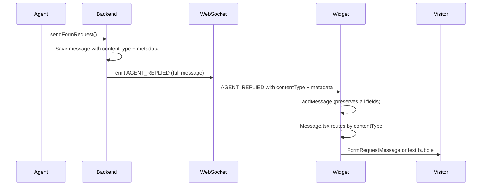
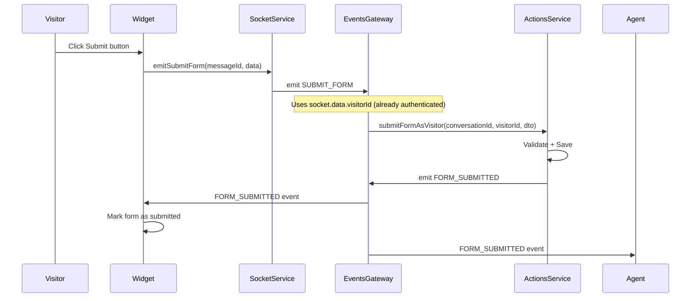

# Design: Widget Form Event Handling (Slice 4)

## 0. Context

**Problem 1:** Widget does not display form messages when agent sends them in real-time.
**Problem 2:** Widget cannot submit forms — form submission is not wired up.

**Root Causes:** 
1. Backend emits `FORM_REQUEST_SENT` to visitor (gateway.event-listener.ts L112)
2. Widget only listens to `AGENT_REPLIED` for agent messages (socketService.ts L204)
3. `AGENT_REPLIED` handler drops `contentType` and `metadata` (socketService.ts L168-176)
4. MessageList.tsx L85 does NOT pass `onFormSubmit` prop to Message
5. ChatWindow.tsx and App.tsx do NOT define form submission handler

## 1. Objective

1. Unify all agent-to-visitor message delivery through a single, consistent channel that preserves form metadata.
2. Wire up form submission from widget to backend.

## 2. Consistency Analysis

| Current State | Problem | Consistent Solution |
|---------------|---------|---------------------|
| Regular text: `AGENT_REPLIED` | Works | Keep as-is |
| Form request: `FORM_REQUEST_SENT` | Widget ignores | Use `AGENT_REPLIED` |
| Form submission: separate event | Fragmented | Use `AGENT_REPLIED` |

**Decision:** Route ALL agent messages (text, form_request, form_submission) through `AGENT_REPLIED` event.

## 3. Information Flow Diagram



## 4. Changes Required

### 4.1 Backend: gateway.event-listener.ts

**Change:** Replace `FORM_REQUEST_SENT` emission with `AGENT_REPLIED`.

```typescript
// BEFORE (L109-119)
if (event.visitorUid) {
  const visitorSocketId = await this.getVisitorSocket(event.visitorUid);
  if (visitorSocketId) {
    this.eventsGateway.emitFormRequestSent(visitorSocketId, {
      conversationId: String(event.conversationId),
      messageId: String(event.message.id),
      // ... partial data
    });
  }
}

// AFTER
if (event.visitorUid) {
  const visitorSocketId = await this.getVisitorSocket(event.visitorUid);
  if (visitorSocketId) {
    // Send full message through AGENT_REPLIED (consistent with text messages)
    this.eventsGateway.server.to(visitorSocketId).emit(WebSocketEvent.AGENT_REPLIED, event.message);
  }
}
```

### 4.2 Widget: socketService.ts

**Change:** Preserve `contentType` and `metadata` in `agentRepliedHandler`.

```typescript
// BEFORE (L168-176)
const newMessage: Message = {
  id: data.id,
  content: data.content,
  sender: { type: data.fromCustomer ? "visitor" : "agent" },
  status: MessageStatus.SENT,
  timestamp: data.createdAt,
  // ❌ Missing contentType and metadata
};

// AFTER
const newMessage: Message = {
  id: data.id,
  content: data.content,
  sender: { type: data.fromCustomer ? "visitor" : "agent" },
  status: MessageStatus.SENT,
  timestamp: data.createdAt,
  contentType: data.contentType,  // ✅ Preserve
  metadata: data.metadata,        // ✅ Preserve
};
```

### 4.3 Backend: inbox-event.handler.ts (History Loading)

**Change:** Include `contentType` and `metadata` when converting Message entity to WidgetMessageDto.

```typescript
// BEFORE (L123-132)
messagesForFrontend = conversation.messages.map((msg) => ({
  id: msg.id,
  content: msg.content || '',
  sender: {
    type: msg.fromCustomer ? 'visitor' : 'agent',
    name: msg.senderId,
  },
  status: msg.status as any,
  timestamp: typeof msg.createdAt === 'string' ? msg.createdAt : msg.createdAt.toISOString(),
  // ❌ Missing contentType and metadata
}));

// AFTER
messagesForFrontend = conversation.messages.map((msg) => ({
  id: msg.id,
  content: msg.content || '',
  sender: {
    type: msg.fromCustomer ? 'visitor' : 'agent',
    name: msg.senderId,
  },
  status: msg.status as any,
  timestamp: typeof msg.createdAt === 'string' ? msg.createdAt : msg.createdAt.toISOString(),
  contentType: msg.contentType,   // ✅ Add
  metadata: msg.metadata,         // ✅ Add
}));
```

### 4.4 Cleanup: Remove Orphaned Code

After this change, `FORM_REQUEST_SENT` becomes orphaned for visitor delivery. Consider:
- Keep `FORM_REQUEST_SENT` for agents (project room broadcast)
- Or deprecate entirely and use `NEW_MESSAGE` for both

**Recommendation:** Keep current behavior for agents (uses `NEW_MESSAGE`), simplify visitor path.
---

## Part B: Form Submission Wiring

### Investigation Findings

**Current Widget Communication Pattern:**
| Channel | Usage | Security |
|---------|-------|----------|
| HTTP API | Only `GET /public/projects/{id}/settings` | Public endpoint |
| WebSocket | All real-time: messages, typing, identify | Socket session holds `socket.data.visitorUid` |

**Conclusion:** Form submission MUST use WebSocket (not HTTP POST) for consistency.

### 4.5 Information Flow Diagram



### 4.6 Security Model

**Authentication:** Socket session identity (no JWT needed)
- Visitor identified via `IDENTIFY` event at connection
- `socket.data.visitorId` set by gateway (events.gateway.ts L177)
- All subsequent events use socket's identity

**Invariants:**
- INV-1: `socket.data.visitorId` must exist
- INV-2: Form request message must belong to visitor's conversation
- INV-3: Form must not already be submitted

### 4.7 WebSocket Event Specifications

**4.7.1 Client → Server: SUBMIT_FORM**

| Field | Type | Description |
|-------|------|-------------|
| `formRequestMessageId` | `string` | ID of the form request message |
| `data` | `Record<string, unknown>` | Form field values |

**4.7.2 Server → Client: FORM_SUBMITTED**

Already exists in `WebSocketEvent` enum — verify payload structure.

### 4.8 Backend Changes

**MODIFY: `events.gateway.ts`**
- Add handler: `@SubscribeMessage(WebSocketEvent.SUBMIT_FORM)`
- Extract `visitorId` from `socket.data.visitorId`
- Extract `conversationId` from `socket.data.conversationId`
- Call `ActionsService.submitFormAsVisitor()`
- Emit `FORM_SUBMITTED` to room and visitor

### 4.9 Widget Changes

**MODIFY: `socketService.ts`**
- Add method: `emitSubmitForm(formRequestMessageId, data)`
- Add handler: listen for `FORM_SUBMITTED` → update store

**MODIFY: `useChatStore.ts`**
- Add state: `submittedFormMessageIds: Set<string>`
- Add action: `markFormAsSubmitted(messageId)`

**MODIFY: Props threading**
- `App.tsx` → `ChatWindow.tsx` → `MessageList.tsx` → `Message.tsx`
- Pass `onFormSubmit` callback and `submittedFormMessageIds`

### 4.10 Error Handling

**Widget must handle:**
| Error | Display |
|-------|---------|
| Socket disconnected | "Connection lost. Please try again." |
| Form expired | Form shows expired state (already implemented) |
| Already submitted | Form shows submitted state |
| Validation error | Inline field errors |

**Backend returns errors via:**
- WebSocket error event or acknowledgement callback

---

## 5. Files to Modify

| File | Change |
|------|--------|
| `packages/backend/src/gateway/gateway.event-listener.ts` | Replace `emitFormRequestSent` with `AGENT_REPLIED` |
| `packages/frontend/src/widget/services/socketService.ts` | Add `contentType`/`metadata` to handler, add `emitSubmitForm`, add `FORM_SUBMITTED` listener |
| `packages/backend/src/inbox/inbox-event.handler.ts` | Add `contentType`/`metadata` to history DTO |
| `packages/backend/src/gateway/events.gateway.ts` | Add `SUBMIT_FORM` handler |
| `packages/shared-types/src/websocket.types.ts` | Add `SUBMIT_FORM` event and payload type |
| `packages/frontend/src/widget/store/useChatStore.ts` | Add `submittedFormMessageIds` state |
| `packages/frontend/src/widget/components/ChatWindow.tsx` | Pass form submission props |
| `packages/frontend/src/widget/components/MessageList.tsx` | Pass form submission props |
| `packages/frontend/src/widget/App.tsx` | Wire form submission callback |

## 6. Verification Plan

### Backend Tests
- `events.gateway.spec.ts`: Verify `SUBMIT_FORM` handler calls service with correct params
- `actions.service.spec.ts`: Existing tests cover `submitFormAsVisitor`

### Manual Verification
1. Agent sends form to visitor
2. Visitor sees fillable form in widget
3. Visitor fills and submits form
4. Widget shows "✓ Submitted" state
5. Agent dashboard shows FormSubmissionBubble
6. Refresh page → form still shows submitted state

## 7. Self-Audit

| Axiom | Compliance |
|-------|------------|
| **Complete Path Principle** | ✅ Traced: Visitor → Widget → Socket → Gateway → Service → Socket → Agent |
| **Gall's Law** | ✅ Uses existing WebSocket pattern |
| **No Orphaned Artifacts** | ✅ Every emit has a handler |
| **Consistency** | ✅ All widget actions use WebSocket |
| **No Implementation Code** | ✅ Specifications only |

