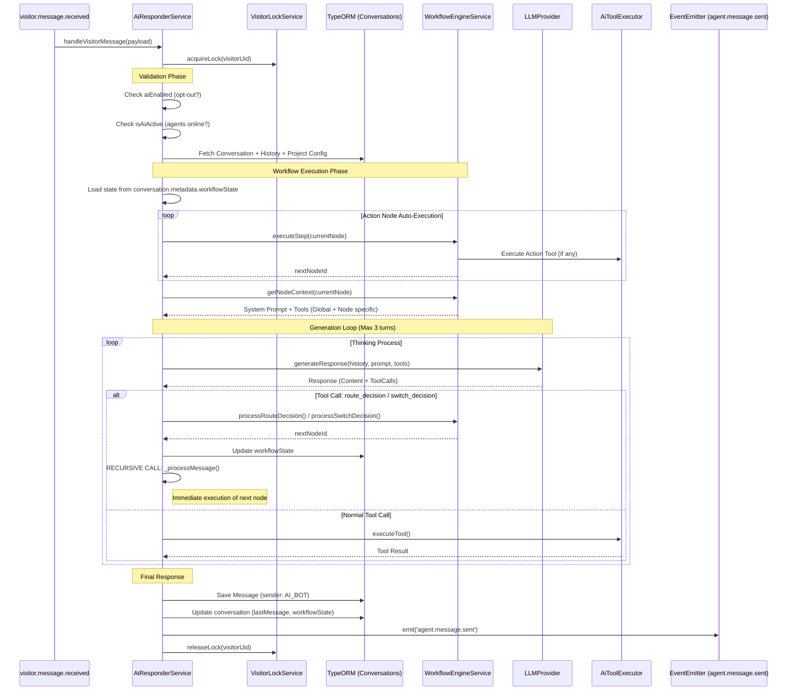

# Feature Investigation: AI Automation Workflow (Frontend to Backend)

## Overview

This document investigates the AI Responder system, focusing on the "Orchestrator" mode which enables graph-based conversational workflows. The system allows agents to design decision trees (Workflows) that the AI executes statefully across multiple turns.

The flow is bidirectional:
1.  **Configuration Flow:** Agents design workflows in the Dashboard → Saved to Backend Project configuration.
2.  **Runtime Flow:** Visitor sends message → AI Engine loads state → Executes Workflow Nodes → Generates Reply → Sends back to Visitor.

---

## Slice 1: Configuration (Frontend → Backend)

### Entry Points

| Component/Function        | File                                                                                                                      | Purpose                                                   |
| ------------------------- | ------------------------------------------------------------------------------------------------------------------------- | --------------------------------------------------------- |
| `AiResponderSettingsForm` | [AiResponderSettingsForm.tsx](../../../packages/frontend/src/components/features/projects/ai-responder/AiResponderSettingsForm.tsx) | Main configuration UI for AI mode, prompts, and workflow. |
| `WorkflowEditor`          | [WorkflowEditor.tsx](../../../packages/frontend/src/components/features/workflow/WorkflowEditor.tsx)                      | Visual graph editor (React Flow) for `aiConfig`.          |
| `updateProject()`         | [projectApi.ts](../../../packages/frontend/src/services/projectApi.ts)                                                    | API client to save configuration.                         |

### Data Structure (`aiConfig`)

The workflow is persisted as a JSON object in the `Project` entity:

```typescript
interface AiConfig {
  nodes: WorkflowNode[]; // React Flow nodes (Start, Action, Condition, Switch, LLM)
  edges: WorkflowEdge[]; // Connections between nodes
  globalTools: GlobalToolConfig[]; // Tools available globally (e.g. "add_visitor_note")
  variables: Record<string, string>; // Global variables
  language: 'en' | 'vi'; // AI reasoning/output language
}
```

### Execution Flow

1.  **User Action:** Agent toggles "Orchestrator" mode and modifies the workflow graph.
2.  **Form Submission:**
    *   `AiResponderSettingsForm` collects `nodes`, `edges`, `globalTools`, and `language`.
    *   Constructs `UpdateProjectDto` with `aiConfig`.
3.  **API Call:**
    *   `PATCH /projects/:id`
    *   Payload: `{ aiMode: 'orchestrator', aiConfig: { ... } }`
4.  **Backend Persistence:**
    *   `ProjectService.updateProject` saves the JSON to PostgreSQL `projects` table.

---

## Slice 2: Runtime Flow (Message Reception → AI Response)

### Entry Points

| Class/Method             | File                                                                                                       | Purpose                                                     |
| ------------------------ | ---------------------------------------------------------------------------------------------------------- | ----------------------------------------------------------- |
| `AiResponderService`     | [ai-responder.service.ts](../../../packages/backend/src/ai-responder/ai-responder.service.ts)              | Main orchestrator service. Listens for new messages.        |
| `WorkflowEngineService`  | [workflow-engine.service.ts](../../../packages/backend/src/ai-responder/services/workflow-engine.service.ts)| State machine executing workflow nodes.                     |
| `AiToolExecutor`         | [ai-tool.executor.ts](../../../packages/backend/src/ai-responder/services/ai-tool.executor.ts)             | Executes tools (e.g., add note, send form).                 |

### Execution Flow



### Step-by-Step Description

1.  **Trigger:** `AiResponderService` listens to `visitor.message.received`.
2.  **Locking:** Acquires a lock for the `visitorUid` to ensure sequential processing.
3.  **State Loading:**
    *   Fetches `Conversation` entity.
    *   Reads `conversation.metadata.workflowState.currentNodeId`.
    *   If no state, finds the `Start` node from `project.aiConfig`.
4.  **Workflow Traversal:**
    *   **Action Nodes:** Automatically executed in a loop. The engine calls `AiToolExecutor` and advances to `nextNodeId` without LLM intervention.
    *   **Condition/Switch Nodes:** The engine constructs a special "Routing Prompt" and restricts tools to `route_decision` or `switch_decision`.
    *   **LLM Nodes:** Standard generation with configured system prompt and tools.
5.  **LLM Generation Loop:**
    *   Calls Provider (OpenAI/Groq).
    *   **Routing Decisions:** If LLM calls `route_decision`, the service updates the persisted state to the target node and **recursively calls itself** to immediately process that new node (chaining).
    *   **Tool Execution:** Regular tools (`add_visitor_note`) are executed via `AiToolExecutor` using `SYSTEM_USER_ID`.
6.  **Completion:**
    *   If a text response is generated, it is saved to the DB as a `Message`.
    *   `agent.message.sent` is emitted.
    *   This event is handled by `GatewayEventListener` (same as human messages), ensuring delivery to the Widget via Socket.IO.

---

## Key Components & Abstractions

### 1. Workflow Engine (`WorkflowEngineService`)
A stateless service that interprets the `WorkflowDefinition`.
*   **`executeStep()`**: Handles logic for Start, Action, and LLM nodes.
*   **`processRouteDecision()`**: Maps "yes"/"no" from LLM to the correct outgoing edge for Condition nodes.
*   **`processSwitchDecision()`**: Maps case names to edges for Switch nodes.
*   **`getNodeContext()`**: Assembles the System Prompt, injecting global tool instructions and language constraints (`vi` vs `en`).

### 2. AI Tool Executor (`AiToolExecutor`)
Adapts AI tool calls to internal service calls.
*   **Bypassing Permissions:** Uses `SYSTEM_USER_ID` when calling `ConversationService.updateStatus` or `ActionsService.sendFormRequest` to bypass project membership checks.
*   **Available Tools:**
    *   `add_visitor_note`: Adds internal note.
    *   `change_status`: Updates conversation status (OPEN/SOLVED).
    *   `send_form`: Triggers a Smart Form.
    *   `route_decision` / `switch_decision`: Virtual tools for flow control.

### 3. State Persistence
Workflow state is stored in the `Conversation` entity's JSONB column:
```json
{
  "metadata": {
    "workflowState": {
      "currentNodeId": "node-123-abc"
    }
  }
}
```
This ensures the AI "remembers" where it is in the flow across different messages.

---

## Data Lineage (End-to-End)

| Data Artifact | Origin | Path | Destination |
| ------------- | ------ | ---- | ----------- |
| **User Message** | Widget | `Socket` → `Backend` → `AiResponderService` | LLM Context |
| **Workflow Config** | Dashboard | `ProjectService` → `DB` → `AiResponderService` | `WorkflowEngine` |
| **Workflow State** | Logic | `WorkflowEngine` → `AiResponderService` | `Conversation.metadata` (DB) |
| **AI Response** | LLM | `AiResponderService` → `MessageRepository` | `Message` Table |
| **Socket Event** | AI Svc | `AiResponderService` → `GatewayEventListener` | Visitor Widget |

### Integration with Existing Flows
*   **Incoming:** The AI hooks into the **Slice 2: Backend Processing** described in `widget_to_dashboard_message_flow.md`. Specifically, it listens to the `visitor.message.received` event emitted by `EventsGateway`.
*   **Outgoing:** The AI reuses the **Slice 2: Backend Processing → Widget** flow described in `dashboard_to_widget_message_flow.md`. By emitting `agent.message.sent`, it triggers the exact same logic as a human agent sending a reply.

## Error Handling
*   **Locks:** If a lock cannot be acquired (visitor spamming), the message is skipped.
*   **Empty Response:** If LLM loops 3 times without text, execution stops (no message sent).
*   **Invalid Workflow:** If state points to a missing node, it attempts to reset or fallback to tools.
