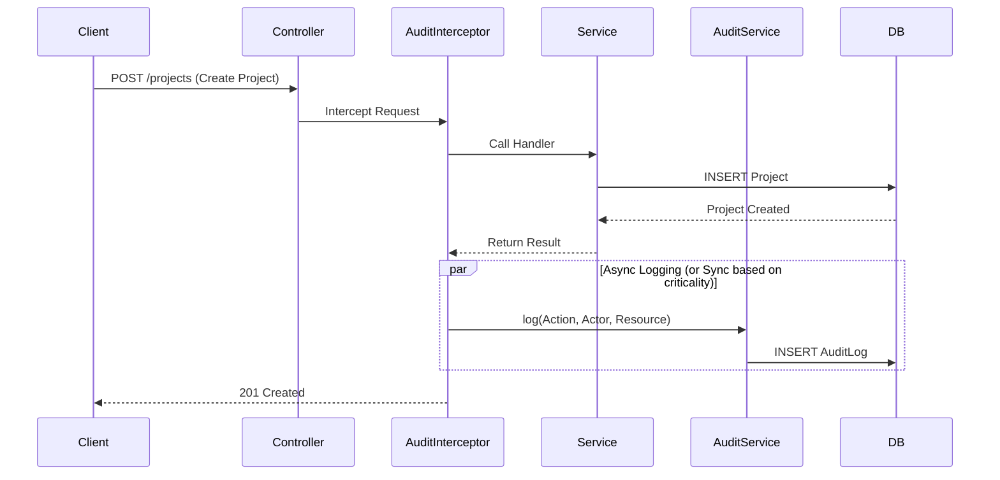

# Design: Audit Logging System
## Slice: audit_log_core

### 1. The Domain Physics (Invariants)
1.  **Immutability:** The Audit Log is a **Write-Only** ledger. Records must never be updated or deleted by the application logic.
2.  **Attribution:** Every state change to a `CriticalResource` (Project, User, Role, Config) must be attributable to an `Actor` (User ID) or `SystemProcess`.
3.  **Contextuality:** A log entry must answer: *Who* (Actor), *What* (Action), *When* (Timestamp), *Where* (IP/Origin), and *Why* (Payload/Diff).
4.  **Fail-Safe:** If the system cannot write the audit log for a critical action (e.g., "Change Admin Password"), the action itself must fail (Atomicity).
5.  **Type Fidelity:** Metadata payloads must be strictly serializable JSON. Circular references or function types are forbidden.

### 2. The Data Structure

#### 2.1 Schema (TypeORM Entity)

```typescript
// Enums
enum AuditAction {
  CREATE = 'CREATE',
  UPDATE = 'UPDATE',
  DELETE = 'DELETE',
  LOGIN = 'LOGIN',
  LOGOUT = 'LOGOUT',
  FAILED_LOGIN = 'FAILED_LOGIN'
}

// Type Definitions (Strict JSON)
type JsonPrimitive = string | number | boolean | null;
type JsonArray = JsonValue[];
type JsonObject = { [key: string]: JsonValue };
type JsonValue = JsonPrimitive | JsonObject | JsonArray;

// Entity: AuditLog
interface AuditLog {
  id: string; // UUID, Primary Key
  
  // Who
  actorId: string | null; // Nullable for System actions
  actorType: 'USER' | 'SYSTEM' | 'API_KEY';
  ipAddress: string | null;
  userAgent: string | null;

  // What
  action: AuditAction;
  entity: string; // e.g., 'Project', 'User', 'Inbox'
  entityId: string; // The ID of the modified resource

  // Context (The Payload)
  // We store the data payload that triggered the change.
  metadata: Record<string, JsonValue>; // JSONB (Strictly Typed)

  // When
  createdAt: Date;
}
```

#### 2.2 API Interface (Internal Service)

```typescript
interface CreateAuditLogDto {
  actorId?: string;
  ipAddress?: string;
  action: AuditAction;
  entity: string;
  entityId: string;
  metadata?: Record<string, JsonValue>;
}
```

### 3. The Architecture (Sequence Diagram)

We will use an **Interceptor-based** approach for HTTP traffic to automatically capture metadata, but delegate the actual saving to a dedicated Service to ensure transactional integrity if needed.



### 4. Implementation Guidelines

1.  **The Module:** Create a `AuditModule`.
2.  **The Interceptor:** `AuditLoggerInterceptor`.
    *   Should listen for a custom metadata decorator `@Auditable(entity: 'Project')`.
    *   Extracts `user` from `request.user` (Passport).
    *   Extracts `ip` from `request.ip`.
3.  **The Service:** `AuditService`.
    *   Provides a clean API `log()` for use inside the Interceptor AND for manual usage in Cron Jobs/Workers.
    *   **Validation:** Must strictly validate that `metadata` does not contain circular references before attempting to save (using `JSON.stringify` check or similar util).
4.  **Database:**
    *   Use JSONB for `metadata` to allow flexible schema evolution.
    *   Index `entityId` and `actorId` for fast lookup.

### 5. Pre-Mortem (Failure Analysis)

*   **Failure Mode:** Database Transaction Rollback.
    *   *Scenario:* User creates Project, Audit Log insert fails.
    *   *Strategy:* Wrap both in a transaction? 
        *   *Decision:* For V1, Audit Log failure **should not block** the main operation unless strict compliance is required. However, the "System Legislator" requires safety.
        *   *Constraint:* **Fail Open** for this iteration (Log error to console if Audit write fails), BUT ensure `AuditService` catches its own errors so it doesn't crash the request.
*   **Failure Mode:** High Volume.
    *   *Scenario:* Logging every chat message crashes the DB.
    *   *Strategy:* Scope strictly to **Administrative Actions** (Project settings, User roles). Do NOT audit `Message` creation in this table.

### 6. Error Taxonomy

*   `AuditLogWriteError` (System Error):
    *   Severity: High (Investigate immediately).
    *   Behavior: Log to stderr, but allow the user operation to proceed (Availability > strict auditing for v1).

### 7. Technical Debt / Deviations
*   **Deferred Component:** The `AuditLoggerInterceptor` (and the interceptor-based architecture described in Section 3) was deferred to a subsequent slice (`audit_log_interceptor`) to reduce scope complexity. Current implementation includes only `AuditService`, `AuditLog` entity, and `AuditModule`.