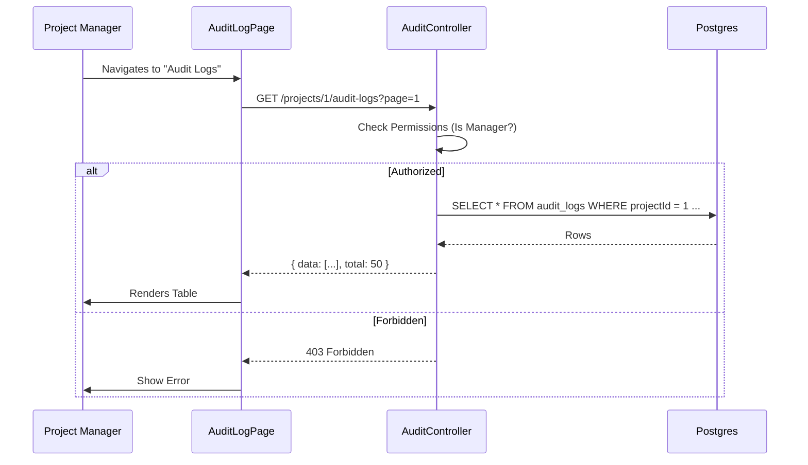

# Design: Audit Log Frontend & API
## Slice: audit_log_frontend

### 1. Objective
To provide Project Managers with visibility into critical system events (e.g., "User A changed role of User B", "Project Settings updated"). This requires exposing the existing backend Audit Logs via an API and building a UI for inspection.

### 2. The Domain Physics (Invariants)
1.  **Read-Only Access:** The API is strictly read-only (`GET`).
2.  **Scope Isolation:** A user can only view logs for projects they are a member of.
3.  **Role Restriction:** Only users with `MANAGER` role (or higher) in the project can view audit logs. `AGENTS` cannot see them.
4.  **Pagination:** Logs can be voluminous; pagination is mandatory.

### 3. Architecture Changes

#### 3.1 Shared Types (Refactoring)
The `AuditAction` enum and `AuditLog` shape currently reside in the Backend. They must be promoted to `shared-types` so the Frontend can use them.

*   **Move** `AuditAction` enum to `packages/shared-types/src/audit.types.ts`.
*   **Create** `AuditLogDto` interface in `packages/shared-types` (representing the public view of the entity).

#### 3.2 Backend: The API Layer
We need a new controller to expose the data.

**Controller:** `AuditController` (`packages/backend/src/audit/audit.controller.ts`)

**Endpoints:**
*   `GET /projects/:projectId/audit-logs`
    *   **Guards:** `JwtAuthGuard`, `ProjectGuard` (Check Membership), `RoleGuard` (Manager Only).
    *   **Query Params:** `page`, `limit`, `action?`, `actorId?`, `startDate?`, `endDate?`.
    *   **Response:** `PaginationDto<AuditLogDto>`

**Service Update:**
*   Update `AuditService` to include a `findAll(projectId, options)` method using `TypeORM` QueryBuilder.

#### 3.3 Frontend: The UI Layer
A new "Security & Audit" section in Project Settings.

**Route:** `/projects/:projectId/settings/audit-logs`

**Components:**
1.  **AuditLogTable:**
    *   Columns: Date, Actor (Avatar + Name), Action (Badge), Entity (Type + ID), Description (Metadata summary).
    *   Actions: "View Details" (opens modal).
2.  **AuditLogFilters:**
    *   Date Range Picker.
    *   Action Dropdown.
    *   Actor Search (optional for V1, maybe just simple text filter).
3.  **LogDetailsModal:**
    *   Displays the full `metadata` JSON in a readable format (`<pre>` block or JSON viewer).

### 4. Data Structure

#### 4.1 DTOs (`packages/shared-dtos`)

```typescript
export class ListAuditLogsDto {
  @IsOptional()
  @IsEnum(AuditAction)
  action?: AuditAction;

  @IsOptional()
  @IsUUID()
  actorId?: string;

  @IsOptional()
  @IsDateString()
  startDate?: string;

  @IsOptional()
  @IsDateString()
  endDate?: string;

  @IsOptional()
  @IsInt()
  @Min(1)
  page?: number = 1;

  @IsOptional()
  @IsInt()
  @Min(1)
  @Max(100)
  limit?: number = 20;
}
```

### 5. Sequence Diagram



### 6. Implementation Plan
1.  **Refactor:** Extract `AuditAction` to `shared-types`.
2.  **Backend:** Implement `AuditService.findAll` and `AuditController`.
3.  **Frontend API:** Create `auditApi.ts` (React Query hooks).
4.  **Frontend UI:** Build `AuditLogTable` and `AuditLogPage`.

### 7. Pre-Mortem
*   **Issue:** `AuditLog` entity currently stores `entityId` but doesn't have a direct `projectId` column?
    *   *Check:* `AuditLog` entity in `backend` has `entity`, `entityId`. It does **NOT** currently have `projectId`.
    *   *Critical Gap:* How do we filter logs by Project?
    *   *Resolution:*
        1.  We must add a `projectId` column to the `AuditLog` entity.
        2.  Update `AuditService.log` to accept `projectId`.
        3.  Update `AuditLoggerInterceptor` to extract `projectId` from request params (`:projectId`) or body.
    *   *Migration:* Add column `projectId` (nullable for system events, but required for project-scoped events).
    *   *Correction:* The design MUST include adding `projectId` to the `audit_logs` table.

### 8. Revised Schema Change
**Entity:** `AuditLog`
*   **Add Column:** `projectId` (int, nullable, indexed).
*   **Reason:** Essential for multi-tenancy filtering.
