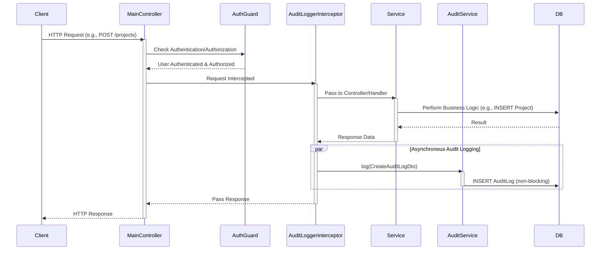

# Design: Audit Logging System - Interceptor

## Slice: audit_log_interceptor

### 1. The Domain Physics (Invariants)

1.  **Non-Blocking:** The `AuditLoggerInterceptor` must execute asynchronously and should not block the primary request-response cycle. If audit logging fails, the main request must still succeed.
2.  **Configurable Granularity:** Auditing should be opt-in via a decorator, allowing developers to precisely control which endpoints and actions are auditable.
3.  **Data Minimization:** Only relevant audit data (Actor, Action, Entity, EntityId, select Metadata) should be captured to prevent over-logging or logging sensitive information by default.
4.  **Contextual Data:** The interceptor must reliably extract `actorId`, `ipAddress`, and `userAgent` from the request context.
5.  **Type Safety:** The `@Auditable` decorator arguments must be strictly typed, aligning with `AuditAction` and `entity` definitions.

### 2. The Data Structure

#### 2.1 Decorator: `@Auditable()`

```typescript
// packages/backend/src/audit/auditable.decorator.ts
import { SetMetadata } from "@nestjs/common";
import { AuditAction } from "./audit.entity";

export const AUDIT_LOG_METADATA = "audit_log_metadata";

export interface AuditableMetadata {
  action: AuditAction;
  entity: string; // The name of the resource being acted upon (e.g., 'Project', 'User')
  entityIdExtractor?: (data: any) => string; // Optional: Function to extract entityId from response/request body
  metadataExtractor?: (
    request: any,
    response: any
  ) => Record<string, JsonValue>; // Optional: Function to extract additional metadata
}

export const Auditable = (metadata: AuditableMetadata) =>
  SetMetadata(AUDIT_LOG_METADATA, metadata);
```

#### 2.2 Interceptor: `AuditLoggerInterceptor`

```typescript
// packages/backend/src/audit/audit.interceptor.ts
import {
  CallHandler,
  ExecutionContext,
  Injectable,
  NestInterceptor,
} from "@nestjs/common";
import { Reflector } from "@nestjs/core";
import { Observable } from "rxjs";
import { tap } from "rxjs/operators";
import { AuditService } from "./audit.service";
import { AUDIT_LOG_METADATA, AuditableMetadata } from "./auditable.decorator";
import { AuditAction, JsonValue } from "./audit.entity";
import { Request } from "express"; // Assuming Express for request type

@Injectable()
export class AuditLoggerInterceptor implements NestInterceptor {
  constructor(
    private readonly reflector: Reflector,
    private readonly auditService: AuditService
  ) {}

  intercept(context: ExecutionContext, next: CallHandler): Observable<any> {
    const auditableMetadata = this.reflector.get<AuditableMetadata>(
      AUDIT_LOG_METADATA,
      context.getHandler()
    );

    if (!auditableMetadata) {
      return next.handle(); // Not an auditable action, skip
    }

    const request = context.switchToHttp().getRequest<Request>();
    const { user, ip, headers, body, params } = request; // Assuming user is available via Passport
    const actorId = user?.id; // Or whatever your user object provides
    const ipAddress = ip;
    const userAgent = headers["user-agent"];

    return next.handle().pipe(
      tap(
        (responseBody) => {
          // Log on successful response
          const entityId = auditableMetadata.entityIdExtractor
            ? auditableMetadata.entityIdExtractor(
                responseBody || body || params
              )
            : params.id || responseBody?.id; // Default extraction

          let metadata: Record<string, JsonValue> = {};
          if (auditableMetadata.metadataExtractor) {
            metadata = auditableMetadata.metadataExtractor(
              request,
              responseBody
            );
          } else {
            // Default metadata to include relevant data
            metadata = {
              requestBody: body,
              params: params,
              responseBody: responseBody,
            };
          }

          this.auditService
            .log({
              actorId,
              actorType: actorId ? "USER" : "SYSTEM", // Infer type
              ipAddress,
              userAgent,
              action: auditableMetadata.action,
              entity: auditableMetadata.entity,
              entityId: entityId || "unknown", // Ensure entityId is always present
              metadata,
            })
            .catch((error) => {
              // Interceptor must not crash if audit logging fails
              console.error(
                "Failed to log audit event from interceptor:",
                error
              );
            });
        },
        (error) => {
          // Log on error, only if not already handled by a lower-level exception filter
          // For now, simpler: just log the error if auditableMetadata exists
          this.auditService
            .log({
              actorId,
              actorType: actorId ? "USER" : "SYSTEM",
              ipAddress,
              userAgent,
              action: auditableMetadata.action,
              entity: auditableMetadata.entity,
              entityId: params.id || "unknown", // Try to get entityId from params on error
              metadata: {
                error: error.message,
                stack: error.stack,
                requestBody: body,
                params: params,
              },
            })
            .catch((auditError) => {
              console.error(
                "Failed to log audit event on error from interceptor:",
                auditError
              );
            });
          throw error; // Re-throw the original error
        }
      )
    );
  }
}
```

### 3. The Architecture (Sequence Diagram)



### 4. Pre-Mortem (Failure Analysis)

- **Failure Mode:** Performance Overhead.
  - _Scenario:_ Interceptor performs heavy synchronous operations, slowing down all audited requests.
  - _Strategy:_ Ensure `auditService.log()` is inherently non-blocking (asynchronous `await`) and any JSON processing is optimized. If `metadataExtractor` is used, it should be lightweight.
- **Failure Mode:** Decorator Misuse / Missing `entityId`.
  - _Scenario:_ Developer forgets `entityIdExtractor` for a complex entity, resulting in "unknown" `entityId`.
  - _Strategy:_ Interceptor will log a warning for "unknown" `entityId`. Documentation will heavily emphasize the importance of `entityIdExtractor` for non-standard responses.
- **Failure Mode:** Sensitive Data Leakage.
  - _Scenario:_ Request `body` or `responseBody` contains sensitive information that gets logged in `metadata`.
  - _Strategy:_ Provide `metadataExtractor` to allow explicit filtering/transformation of metadata. Default metadata should be reviewed. Documentation will warn against logging raw request/response bodies for sensitive endpoints.

### 5. Error Taxonomy

- `InterceptorConfigurationError` (User Error):
  - Severity: Low (runtime log).
  - Behavior: Log a warning if `@Auditable` is used without proper configuration (e.g., missing `action` or `entity`).
- `AuditLogExtractionError` (System Error / User Error):
  - Severity: Medium (runtime log).
  - Behavior: Log an error if `entityIdExtractor` or `metadataExtractor` throws an exception, or if `entityId` cannot be determined. The audit log itself should still attempt to save with available data, indicating the extraction failure.
- `AuditLogInterceptorWriteError` (System Error):
  - Severity: High (runtime log).
  - Behavior: This is a re-capture of `AuditLogWriteError` from `AuditService` but specifically within the interceptor context. Interceptor must `console.error` but **not** re-throw, allowing the main request to proceed.
