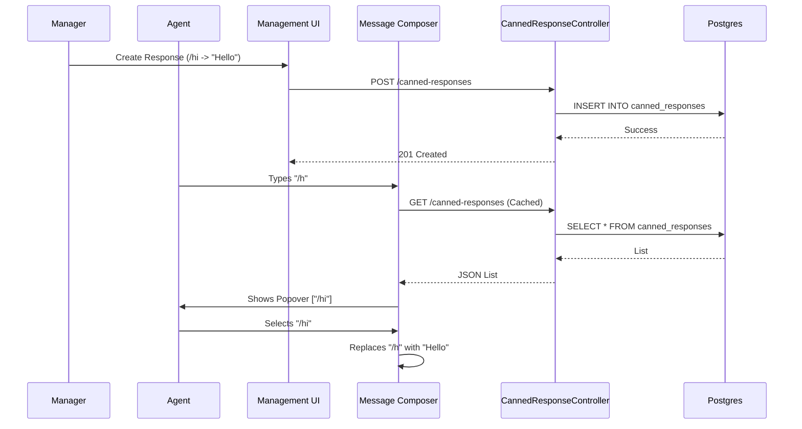

# Architecture: Canned Responses

## System Diagram

## Components

### CannedResponseController
-   **Location:** `packages/backend/src/canned-responses/canned-responses.controller.ts`
-   **Purpose:** Exposes CRUD endpoints.
-   **Security:**
    -   `GET`: Accessible by `AGENT` and `MANAGER`.
    -   `POST/PATCH/DELETE`: Accessible only by `MANAGER`.

### CannedResponsesService
-   **Location:** `packages/backend/src/canned-responses/canned-responses.service.ts`
-   **Purpose:** Business logic.
-   **Key Logic:** Handles unique constraint violations (Error 23505) and throws `ConflictException`.

### SlashCommandPopover
-   **Location:** `packages/frontend/src/components/features/canned-responses/SlashCommandPopover.tsx`
-   **Purpose:** The "Autocomplete" widget.
-   **Logic:**
    -   Filters the list of responses client-side based on the text after `/`.
    -   Handles keyboard navigation (Up/Down/Enter).

### MessageComposer (Integration)
-   **Location:** `packages/frontend/src/components/features/inbox/MessageComposer.tsx`
-   **Logic:**
    -   Detects if `/` is typed at the start of a line or after a space.
    -   Calculates the "filter text" (the characters after `/`).
    -   Performs the text replacement upon selection.

## Data Model

### CannedResponse Entity
-   **Table:** `canned_responses`
-   **Columns:**
    -   `id`: UUID (PK)
    -   `projectId`: Integer (FK to Project)
    -   `shortcut`: String (50 chars) - The trigger key (e.g., `welcome`).
    -   `content`: Text - The expansion text.
-   **Constraints:**
    -   `UNIQUE(projectId, shortcut)`: Ensures no duplicate shortcuts in a project.

## Error Handling

### Duplicate Shortcut
-   **Scenario:** Manager tries to create `/welcome` but it already exists.
-   **Backend:** Catches DB error 23505.
-   **Response:** `409 Conflict`.
-   **Frontend:** Displays "Shortcut already exists".

### Unauthorized Write
-   **Scenario:** Agent tries to create a response via API.
-   **Backend:** `RolesGuard` rejects request.
-   **Response:** `403 Forbidden`.
