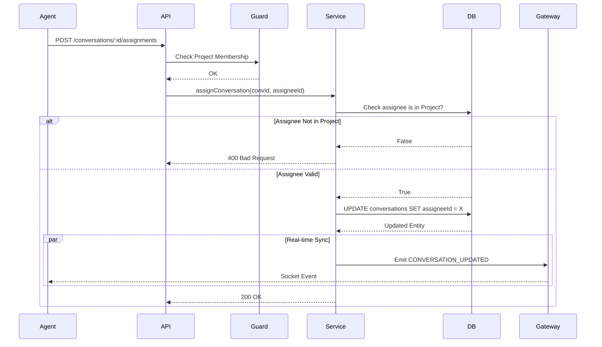

# Design: Conversation Assignment Engine
## Slice: assignment_engine

### 1. Objective
To transition the inbox from a "Shared Pool" model to an "Ownership" model. This allows agents to claim responsibility for specific conversations, reducing collisions and ensuring accountability.

### 2. The Domain Physics (Invariants)
1.  **Membership Requirement:** A Conversation can only be assigned to a User who is an **active member** of the Conversation's parent Project.
2.  **Single Ownership:** A Conversation can have at most **one** assignee at a time.
3.  **Explicit Handoff:** Re-assigning a conversation overwrites the previous assignee (Last-Write-Wins).
4.  **State Consistency:** When a conversation is assigned, the system must emit a `CONVERSATION_UPDATED` event to sync all connected clients immediately.

### 3. The Data Structure

#### 3.1 Schema Changes (`Conversation` Entity)

We will modify the existing `conversations` table.

| Column | Type | Nullable | Description |
| :--- | :--- | :--- | :--- |
| `assigneeId` | UUID | YES | FK to `users.id` |
| `assignedAt` | Timestamp | YES | When the assignment occurred |

```typescript
// packages/backend/src/database/entities/conversation.entity.ts
// ... imports

@Entity("conversations")
export class Conversation {
  // ... existing fields

  @ManyToOne(() => User, { nullable: true, onDelete: 'SET NULL' })
  @JoinColumn({ name: "assignee_id" })
  assignee: User | null;

  @Column({ type: "uuid", nullable: true, name: "assignee_id" })
  assigneeId: string | null;

  @Column({ type: "timestamptz", nullable: true, name: "assigned_at" })
  assignedAt: Date | null;
}
```

#### 3.2 DTOs

```typescript
// packages/backend/src/inbox/dto/assign-conversation.dto.ts
export class AssignConversationDto {
  @IsUUID()
  @IsNotEmpty()
  assigneeId: string;
}
```

### 4. The Architecture (Sequence Diagram)



### 5. API Interface

#### 5.1 Endpoints
*   `POST /conversations/:id/assignments`: Assign the conversation.
    *   **Body:** `{ "assigneeId": "uuid" }`
    *   **Logic:** Validates membership, updates DB, emits event.
*   `DELETE /conversations/:id/assignments`: Unassign the conversation.
    *   **Logic:** Sets `assigneeId = null`, emits event.

### 6. Pre-Mortem (Failure Analysis)

*   **Scenario:** Assignee leaves the project.
    *   *Impact:* Foreign Key constraint violation?
    *   *Mitigation:* The FK `onDelete: 'SET NULL'` on the `assignee` relation ensures that if a User is deleted, the field becomes null. However, if a User is just *removed* from a project (ProjectMember deleted) but not deleted globally, the assignment persists.
    *   *Refinement:* We should ideally add a hook/subscriber: When `ProjectMember` is deleted, unassign all conversations for that user in that project. *Decision for V1:* Keep it simple. If an agent is removed from a project, they keep the assignment in the DB but can't access it. This is acceptable for V1.
*   **Scenario:** Race Condition (Two agents claim same ticket).
    *   *Impact:* Last write wins. The second agent "steals" it.
    *   *Mitigation:* Acceptable behavior for a collaborative support tool. No complex locking needed.

### 7. Implementation Plan (High Level)
1.  **Migration:** Generate migration to add `assignee_id` and `assigned_at` to `conversations`.
2.  **Entity:** Update `Conversation.ts`.
3.  **Service:** Add `assign()` and `unassign()` methods to `ConversationsService`.
    *   Include `ProjectMember` check.
4.  **Controller:** Add new endpoints.
5.  **Tests:** Unit tests for membership validation; E2E for full flow.
