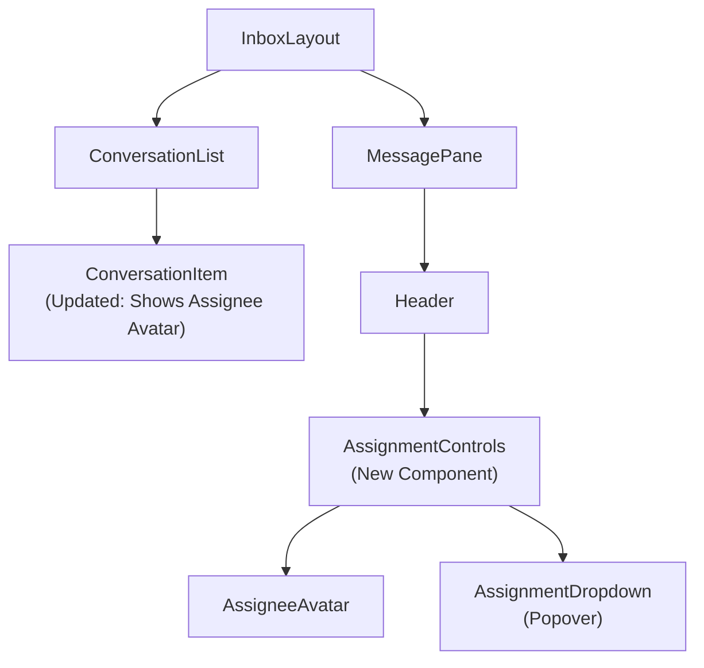

# Design: Frontend Conversation Assignment

## Slice: frontend_assignment

### 1. Objective

To implement the user interface for assigning conversations to agents. This enables users to visualize ownership and take action (Assign/Unassign) directly from the conversation view.

### 2. The Domain Physics (Invariants)

1.  **Visual Clarity:** It must be immediately obvious if a conversation is unassigned, assigned to me, or assigned to someone else.
2.  **One-Click Ownership:** "Assign to Me" should be a single click action for unassigned conversations.
3.  **Real-time Synchronization:** When an assignment changes (by self or peer), the UI must update immediately without a page refresh.
4.  **Optimistic UI:** Assignment actions should reflect immediately in the UI while the API request processes.

### 3. Architecture & Components

#### 3.1 Component Hierarchy



#### 3.2 `AssignmentControls` Component

- **Location:** `MessagePane` Header.
- **States:**
  1.  **Unassigned:** Shows "Unassigned" icon + "Assign to Me" button.
  2.  **Assigned to Me:** Shows My Avatar + "Unassign" (or dropdown to reassign).
  3.  **Assigned to Others:** Shows Their Avatar + Name + Dropdown to reassign.
- **Interactions:**
  - Click "Assign to Me" -> Optimistic update -> API Call.
  - Click Avatar -> Open Dropdown -> Select Agent -> Optimistic update -> API Call.

#### 3.3 `ConversationList` Update

- **Visual:** Add a small avatar of the assignee to the right of the conversation item or near the timestamp.
- **Tooltip:** Hovering the avatar shows the assignee's name.

### 4. Data Strategy (State Management)

#### 4.1 React Query Mutations (`inboxApi.ts`)

We need two new hooks:

- `useAssignConversation(projectId, conversationId)`
- `useUnassignConversation(projectId, conversationId)`

**Optimistic Update Strategy:**

1.  `onMutate`:
    - Cancel outgoing queries for `['conversations']` and `['conversation', id]`.
    - Snapshot previous state.
    - Update Cache: Set `assigneeId` and `assignee` object in the specific conversation query and the list query.
2.  `onError`: Rollback to snapshot.
3.  `onSettled`: Invalidate queries.

#### 4.2 Real-time Updates (`SocketContext.tsx`)

We must handle the `CONVERSATION_UPDATED` event.

- **Event Payload:**
  ```typescript
  {
    conversationId: string;
    fields: {
      assigneeId: string | null;
      assignedAt: Date | null;
    }
  }
  ```
- **Handler Logic:**
  - Find the conversation in the React Query cache (both List and Detail views).
  - Merge the new fields (`assigneeId`, `assignedAt`).
  - (Crucial): If `assigneeId` is non-null, we might lack the full `User` object (avatar, name) in the payload.
  - _Mitigation:_ The backend payload only sends IDs. The frontend might need to fetch the User profile or look it up from a `useProjectMembers` cache.
  - _Decision:_ For V1, if the user is not in the local cache, we might show a generic avatar or trigger a refetch. Ideally, the `CONVERSATION_UPDATED` event should include a minimal `assignee` object (id, fullName, avatarUrl) to avoid N+1 fetches. **However**, the backend implementation currently only sends `fields: { assigneeId, assignedAt }`.
  - _Frontend Workaround:_ We will trigger `queryClient.invalidateQueries(['conversations'])` on this event to ensure data consistency, or we rely on the fact that `ProjectMembers` are likely cached.

### 5. Implementation Plan

1.  **API Services:** Add `assign` and `unassign` to `inboxApi.ts`.
2.  **Component:** Create `AssignmentControls.tsx`.
3.  **Integration:** Add `AssignmentControls` to `MessagePane.tsx`.
4.  **List View:** Update `ConversationList.tsx` to show assignee.
5.  **Realtime:** Update `SocketContext.tsx` to listen for `CONVERSATION_UPDATED`.

### 6. Pre-Mortem

- **Scenario:** Assignee data missing.
  - _Issue:_ Realtime event comes with `assigneeId`, but we don't have the name/avatar loaded.
  - _Fix:_ The `ConversationList` relies on the `conversations` query which does `leftJoinAndSelect('assignee')`. So a simple `invalidateQueries` is the safest, most robust approach for V1, even if slightly less performant than manual cache surgery.
- **Scenario:** Optimistic update fails.
  - _Issue:_ UI shows "Assigned" but API failed.
  - _Fix:_ React Query `onError` rollback handles this automatically.
