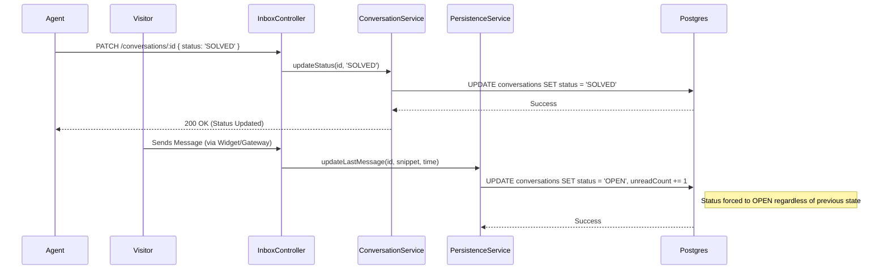

# Architecture: Conversation Status Lifecycle

## System Diagram

## Components

### ConversationPersistenceService
-   **Location**: `packages/backend/src/inbox/services/persistence/conversation.persistence.service.ts`
-   **Role**: Handles low-level database updates triggered by incoming messages.
-   **Logic**:
    -   `updateLastMessage`: Automatically sets `status = ConversationStatus.OPEN` when updating the last message timestamp. This implements the "Auto-Open" invariant.

### ConversationService
-   **Location**: `packages/backend/src/inbox/services/conversation.service.ts`
-   **Role**: Handles business logic for manual updates and listing.
-   **Logic**:
    -   `updateStatus`: Validates project membership and executes the status change transaction.
    -   `listByProject`: Accepts a `status` filter in the query builder to return only relevant conversations.

### Database Schema
-   **Table**: `conversations`
-   **Column**: `status` (Enum: `conversation_status_enum`)
-   **Enum Values**: `'open', 'pending', 'solved', 'spam'` (Migrated from `'open', 'closed', 'pending'`).

## Data Flow

### Status Transition Matrix
| Current | Target | Trigger |
| :--- | :--- | :--- |
| Any | `OPEN` | Customer Reply (Auto) OR Agent Manual |
| `OPEN` | `PENDING` | Agent Manual (Waiting for reply) |
| `OPEN` | `SOLVED` | Agent Manual (Issue resolved) |
| `PENDING`| `SOLVED` | Agent Manual (No reply received) |
| Any | `SPAM` | Agent Manual |

## Failure Modes
-   **Migration Failure**: If the enum migration fails (e.g., locking issues), the system might be in a mixed state. We used `ALTER TYPE ADD VALUE` which is generally safe in Postgres, followed by a data update (`closed` -> `solved`).
-   **Race Condition**: Agent marks as `SOLVED` while Customer sends a message.
    -   *Result*: Customer message wins. The "Auto-Open" logic runs *after* or *during* the new message processing, ensuring the ticket re-opens.
