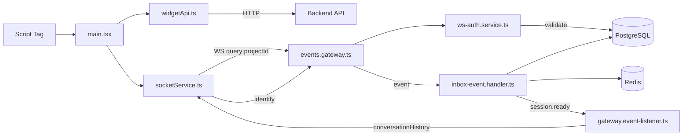

# Feature Investigation: Widget Connection Flow

## Overview

This investigation traces the embeddable chat widget's connection establishment, authentication, and message sending from a customer website to the backend. The widget uses **domain whitelisting** for connection authorization and **visitor UID** (persisted in localStorage) for session continuity. Agents authenticate via JWT tokens through a separate path.

## Entry Points

| Function/Method        | File                                                                                        | Purpose                      |
| ---------------------- | ------------------------------------------------------------------------------------------- | ---------------------------- |
| `initLiveChat()`       | [main.tsx](../../../packages/frontend/src/widget/main.tsx)#L116                             | Widget initialization        |
| `connect()`            | [socketService.ts](../../../packages/frontend/src/widget/services/socketService.ts)#L24     | WebSocket connection         |
| `handleConnection()`   | [events.gateway.ts](../../../packages/backend/src/gateway/events.gateway.ts)#L100           | Backend connection lifecycle |
| `validateConnection()` | [ws-auth.service.ts](../../../packages/backend/src/gateway/services/ws-auth.service.ts)#L37 | Connection validation        |

## Execution Flow

1. **Widget loads on customer site** ([main.tsx](../../../packages/frontend/src/widget/main.tsx#L116-140))

   - Calls: `getWidgetSettings(projectId)` — HTTP GET to `/public/projects/${projectId}/settings`
   - Side effect: Creates Shadow DOM, stores `visitor_uid` in localStorage if absent

2. **WebSocket connection established** ([socketService.ts](../../../packages/frontend/src/widget/services/socketService.ts#L24-60))

   - Calls: `io(WS_URL, { query: { projectId } })` — Socket.IO connect with projectId query
   - Side effect: None until connected

3. **Backend receives connection** ([events.gateway.ts](../../../packages/backend/src/gateway/events.gateway.ts#L100-114))

   - Calls: `wsAuthService.validateConnection(client)` — Delegates all validation

4. **Connection validation** ([ws-auth.service.ts](../../../packages/backend/src/gateway/services/ws-auth.service.ts#L37-60))

   - Calls: `validateWidgetConnection()` for widget connections
   - Check: `projectService.findByProjectId()` — Project exists?
   - Check: `project.whitelistedDomains.includes(originDomain)` — Origin allowed?
   - Side effect: Rejects via `client.disconnect(true)` if invalid

5. **Widget emits identify event** ([socketService.ts](../../../packages/frontend/src/widget/services/socketService.ts#L287-300))

   - Calls: `socket.emit(WebSocketEvent.IDENTIFY, { projectId: Number(projectId), visitorUid })`

6. **Gateway receives identify** ([events.gateway.ts](../../../packages/backend/src/gateway/events.gateway.ts#L209-232))

   - Calls: `eventEmitter.emit('visitor.identified', event)`
   - Side effect: Emits `VISITOR_STATUS_CHANGED` to project room

7. **Session created in Redis** ([inbox-event.handler.ts](../../../packages/backend/src/inbox/inbox-event.handler.ts#L79-145))

   - Calls: `realtimeSessionService.setVisitorSession(visitorUid, socketId)`
   - Calls: `visitorService.findOrCreateByUid()` — DB transaction
   - Side effect: Redis key `session:visitor:${visitorUid}` set with 3-day TTL

8. **History sent to widget** ([gateway.event-listener.ts](../../../packages/backend/src/gateway/gateway.event-listener.ts#L57-67))

   - Calls: `eventsGateway.prepareSocketForVisitor()` — Emits `conversationHistory`

9. **Message sending** ([events.gateway.ts](../../../packages/backend/src/gateway/events.gateway.ts#L234-251))
   - Calls: `eventEmitter.emit('visitor.message.received', event)`
   - Queued via `bullMqProducerService.sendMessage()` to `live-chat-events-queue`

## Data Flow



## Interfaces & Abstractions

### Input Types

```typescript
interface IdentifyPayload {
  projectId: number;
  visitorUid: string;
}

interface SendMessagePayload {
  content: string;
  tempId: string;
  sessionMetadata?: Record<string, unknown>;
}
```

### Output Types

```typescript
interface ConversationHistoryPayload {
  messages: WidgetMessageDto[];
}

interface WsAuthResult {
  valid: boolean;
  user?: { id: string; email: string };
  error?: string;
}
```

### Key Abstractions

| Abstraction                | Location                                                                                                  | Purpose               | Key Methods                                          |
| -------------------------- | --------------------------------------------------------------------------------------------------------- | --------------------- | ---------------------------------------------------- |
| `WsAuthService`            | [ws-auth.service.ts](../../../packages/backend/src/gateway/services/ws-auth.service.ts)                   | Connection validation | `validateConnection()`, `validateWidgetConnection()` |
| `RealtimeSessionService`   | [realtime-session.service.ts](../../../packages/backend/src/realtime-session/realtime-session.service.ts) | Redis session mgmt    | `setVisitorSession()`, `deleteVisitorSession()`      |
| `InboxEventHandlerService` | [inbox-event.handler.ts](../../../packages/backend/src/inbox/inbox-event.handler.ts)                      | Domain event handler  | `handleVisitorIdentified()`                          |

## Dependencies

### Internal Dependencies

| Dependency                                      | Type           | What It Does (NOT what you assume)                                                                |
| ----------------------------------------------- | -------------- | ------------------------------------------------------------------------------------------------- |
| `RealtimeSessionService.setVisitorSession()`    | Infrastructure | Stores `session:visitor:${visitorUid}` → `socketId` in Redis, sets 3-day TTL via `redis.expire()` |
| `RealtimeSessionService.deleteVisitorSession()` | Infrastructure | Deletes key only if stored socketId matches param (race condition prevention)                     |
| `ProjectService.findByProjectId()`              | Core           | TypeORM `findOne()` with `whitelistedDomains` selected                                            |
| `BullMqProducerService.sendMessage()`           | Infrastructure | Adds to `live-chat-events-queue`, `removeOnComplete: true`, `removeOnFail: false`                 |

### External Dependencies

| Dependency         | Type        | Standard Behavior           |
| ------------------ | ----------- | --------------------------- |
| `socket.io-client` | Third-Party | WebSocket with reconnection |
| `ioredis`          | Third-Party | Redis client                |
| `bullmq`           | Third-Party | Job queue                   |

## Error Handling

| Error                    | When It Occurs                | How It's Handled                            |
| ------------------------ | ----------------------------- | ------------------------------------------- |
| `Project not found`      | Invalid projectId             | `client.disconnect(true)`                   |
| `No whitelisted domains` | Empty `whitelistedDomains`    | `client.disconnect(true)`                   |
| `Origin not whitelisted` | Origin hostname not in list   | `client.disconnect(true)`                   |
| `Missing origin`         | No Origin header              | `client.disconnect(true)`                   |
| HTTP 404                 | Project not found on settings | `WidgetApiError` thrown, retry with backoff |

## Side Effects

- **Database:** Visitor record created if not exists
- **Cache:** `session:visitor:${visitorUid}` → socketId (3-day TTL)
- **Events:** `visitor.identified`, `visitor.connected`, `VISITOR_STATUS_CHANGED`
- **External APIs:** None

## Data Lineage (Origin → Destination)

| Data Artifact | Origin                               | Components in Path                                                                                                                                          | Final Destination                                                                       |
| ------------- | ------------------------------------ | ----------------------------------------------------------------------------------------------------------------------------------------------------------- | --------------------------------------------------------------------------------------- |
| `projectId`   | `data-project-id` attr               | [main.tsx](../../../packages/frontend/src/widget/main.tsx) → [socketService.ts](../../../packages/frontend/src/widget/services/socketService.ts) → WS query | [ws-auth.service.ts](../../../packages/backend/src/gateway/services/ws-auth.service.ts) |
| `visitorUid`  | localStorage / `crypto.randomUUID()` | [main.tsx](../../../packages/frontend/src/widget/main.tsx) → identify event                                                                                 | Redis session, Visitor DB                                                               |
| `socketId`    | Socket.IO server                     | [events.gateway.ts](../../../packages/backend/src/gateway/events.gateway.ts)                                                                                | Redis session value                                                                     |

### Event Flow (Emitter → Handler)

| Event Name                 | Emitted By                                                                                | Handled By                                                                                       | Purpose                    |
| -------------------------- | ----------------------------------------------------------------------------------------- | ------------------------------------------------------------------------------------------------ | -------------------------- |
| `visitor.identified`       | [events.gateway.ts](../../../packages/backend/src/gateway/events.gateway.ts)#L222         | [inbox-event.handler.ts](../../../packages/backend/src/inbox/inbox-event.handler.ts)#L79         | Session + visitor creation |
| `visitor.session.ready`    | [inbox-event.handler.ts](../../../packages/backend/src/inbox/inbox-event.handler.ts)#L144 | [gateway.event-listener.ts](../../../packages/backend/src/gateway/gateway.event-listener.ts)#L57 | Send history               |
| `visitor.message.received` | [events.gateway.ts](../../../packages/backend/src/gateway/events.gateway.ts)#L250         | [inbox-event.handler.ts](../../../packages/backend/src/inbox/inbox-event.handler.ts)#L147        | Queue message              |

### Orphan Audit

> [!WARNING]
> No orphaned artifacts found.

## Configuration

| Config Key                   | Default | Purpose          |
| ---------------------------- | ------- | ---------------- |
| `VITE_API_BASE_URL`          | -       | Backend URL      |
| `FRONTEND_URL`               | -       | Dashboard bypass |
| `project.whitelistedDomains` | `[]`    | Allowed origins  |

## Integration Points

### To Call This Feature

```html
<script src="https://domain.com/widget.js" data-project-id="123"></script>
```

### To Extend This Feature

- Add `@SubscribeMessage` in [events.gateway.ts](../../../packages/backend/src/gateway/events.gateway.ts)
- Add `@OnEvent` handler in [inbox-event.handler.ts](../../../packages/backend/src/inbox/inbox-event.handler.ts)

## Files Investigated

| File                                                                                                      | Lines Read | Key Findings                        |
| --------------------------------------------------------------------------------------------------------- | ---------- | ----------------------------------- |
| [main.tsx](../../../packages/frontend/src/widget/main.tsx)                                                | L1-362     | Shadow DOM, retry, visitorUid       |
| [socketService.ts](../../../packages/frontend/src/widget/services/socketService.ts)                       | L1-373     | Event handlers, identify on connect |
| [widgetApi.ts](../../../packages/frontend/src/widget/services/widgetApi.ts)                               | L1-89      | HTTP fetch, error handling          |
| [events.gateway.ts](../../../packages/backend/src/gateway/events.gateway.ts)                              | L1-479     | WS handlers, event emission         |
| [ws-auth.service.ts](../../../packages/backend/src/gateway/services/ws-auth.service.ts)                   | L1-135     | Whitelist validation                |
| [inbox-event.handler.ts](../../../packages/backend/src/inbox/inbox-event.handler.ts)                      | L1-300     | Event handlers, BullMQ              |
| [gateway.event-listener.ts](../../../packages/backend/src/gateway/gateway.event-listener.ts)              | L1-129     | Event routing                       |
| [realtime-session.service.ts](../../../packages/backend/src/realtime-session/realtime-session.service.ts) | L1-143     | Redis session                       |
