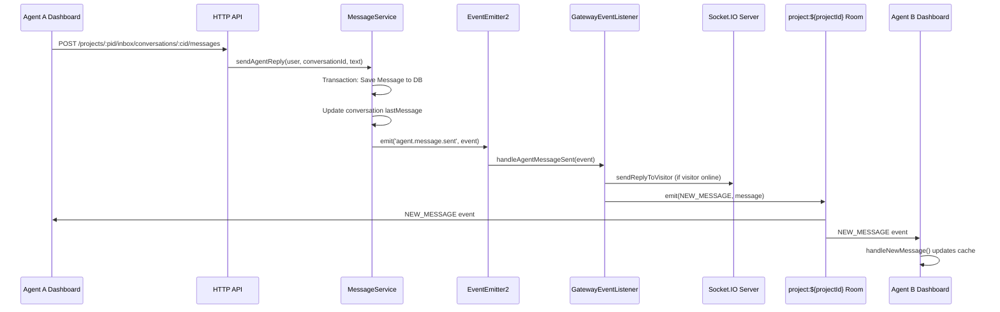
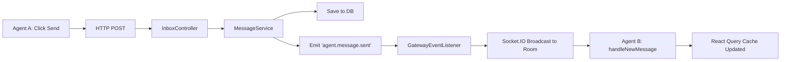

# Feature Investigation: Agent Message Broadcast to Other Agents

## Overview

This document traces **how a message sent from an agent to a visitor appears in another agent's dashboard**. The flow involves an HTTP API call, internal event emission, Socket.IO room broadcasting, and frontend cache updates.

The key insight is that all agents viewing the same project join a shared Socket.IO room (`project:${projectId}`). When Agent A sends a message, the backend broadcasts to this room, causing Agent B's dashboard to update in real-time.

## Entry Points

| Function/Method    | File                                                                                          | Purpose                                      |
| ------------------ | --------------------------------------------------------------------------------------------- | -------------------------------------------- |
| `sendAgentReply()` | [inboxApi.ts](../../../packages/frontend/src/services/inboxApi.ts#L92-108)                    | Frontend API call to send agent message      |
| `sendReply()`      | [inbox.controller.ts](../../../packages/backend/src/inbox/inbox.controller.ts#L55-62)         | Backend HTTP endpoint handling agent reply   |
| `sendAgentReply()` | [message.service.ts](../../../packages/backend/src/inbox/services/message.service.ts#L65-169) | Core business logic to persist and broadcast |

## Execution Flow



### Step-by-Step Description

**Step 1: Frontend Initiates API Call**

- Agent A clicks "Send" in the chat UI.
- The hook [`useSendAgentReply()`](../../../packages/frontend/src/services/inboxApi.ts#L150-216) calls `sendAgentReply()`.
- HTTP request: `POST /projects/:projectId/inbox/conversations/:conversationId/messages` with body `{ text: "..." }`.

**Step 2: Backend Controller Receives Request**

- [`InboxController.sendReply()`](../../../packages/backend/src/inbox/inbox.controller.ts#L55-62) receives the request.
- Extracts authenticated `user`, `conversationId`, and `body.text`.
- Calls `messageService.sendAgentReply(user, conversationId, body.text)`.

**Step 3: MessageService Persists and Emits Event**

- [`MessageService.sendAgentReply()`](../../../packages/backend/src/inbox/services/message.service.ts#L65-169):
  1. **Database Transaction** (L74-111): Finds conversation, validates project membership, creates and saves `Message` entity.
  2. **Lookup Visitor Socket** (L117-119): Queries Redis via `realtimeSessionService.getVisitorSession()` to check if visitor is online.
  3. **Emit Internal Event** (L121-134):
     ```typescript
     const event = new AgentMessageSentEvent();
     event.visitorSocketId = visitorSocketId;
     event.message = savedMessage;
     event.projectId = project.id;
     this.eventEmitter.emit("agent.message.sent", event);
     ```

**Step 4: GatewayEventListener Broadcasts to Room**

- [`GatewayEventListener.handleAgentMessageSent()`](../../../packages/backend/src/gateway/gateway.event-listener.ts#L48-55):
  ```typescript
  @OnEvent('agent.message.sent')
  handleAgentMessageSent(event: AgentMessageSentEvent) {
    if (event.visitorSocketId) {
      this.eventsGateway.sendReplyToVisitor(event.visitorSocketId, event.message);
    }
    // KEY LINE: Broadcast to all agents in the project room
    this.eventsGateway.server.to(`project:${event.projectId}`).emit(WebSocketEvent.NEW_MESSAGE, event.message);
  }
  ```

**Step 5: Other Agents Receive Message via Socket.IO**

- All agents who joined `project:${projectId}` room receive the `NEW_MESSAGE` event.

**Step 6: Frontend Updates Cache**

- [`SocketContext.handleNewMessage()`](../../../packages/frontend/src/contexts/SocketContext.tsx#L43-104):
  - Appends new message to React Query cache for `["messages", projectId, conversationId]`.
  - Invalidates `["conversations", currentProjectId]` to refresh conversation list snippets and timestamps.

## How Agents Join the Project Room

Agents automatically join the project room when entering the inbox for a specific project.

| Function/Method           | File                                                                                  | Purpose                          |
| ------------------------- | ------------------------------------------------------------------------------------- | -------------------------------- |
| `useEffect` hook          | [InboxLayout.tsx](../../../packages/frontend/src/pages/inbox/InboxLayout.tsx#L32-66)  | Frontend emits `joinProjectRoom` |
| `handleJoinProjectRoom()` | [events.gateway.ts](../../../packages/backend/src/gateway/events.gateway.ts#L306-327) | Backend handles room join        |

**Frontend (InboxLayout.tsx L41-51):**

```typescript
socket.emit(
  "joinProjectRoom",
  { projectId: Number(projectId) },
  (response: { status: string; roomName: string }) => {
    if (response.status === "ok") {
      console.log(`✅ Successfully joined room: ${response.roomName}`);
    }
  }
);
```

**Backend (events.gateway.ts L306-327):**

```typescript
@SubscribeMessage('joinProjectRoom')
async handleJoinProjectRoom(
  @ConnectedSocket() client: Socket,
  @MessageBody() payload: JoinRoomPayload
): Promise<{ status: string; roomName: string }> {
  // Security: Validate user is authenticated
  // Security: Validate user is a member of the project
  const roomName = `project:${payload.projectId}`;
  client.join(roomName);
  return { status: 'ok', roomName };
}
```

## Data Flow



## Data Lineage (Origin → Destination)

| Data Artifact              | Origin                            | Components in Path                                                  | Final Destination                        |
| -------------------------- | --------------------------------- | ------------------------------------------------------------------- | ---------------------------------------- |
| `Message` (agent reply)    | Agent A UI input                  | `sendAgentReply()` → `InboxController` → `MessageService` → DB save | Persisted in PostgreSQL `messages` table |
| `AgentMessageSentEvent`    | `MessageService.sendAgentReply()` | `EventEmitter2` → `GatewayEventListener`                            | Consumed by `handleAgentMessageSent()`   |
| `NEW_MESSAGE` socket event | `GatewayEventListener`            | Socket.IO server → `project:${projectId}` room                      | All agents in room (including sender)    |
| Updated message cache      | `handleNewMessage()`              | React Query `setQueryData`                                          | Agent B's UI re-renders with new message |

### Event Flow (Emitter → Handler)

| Event Name                | Emitted By                             | Handled By                                             | Purpose                                      |
| ------------------------- | -------------------------------------- | ------------------------------------------------------ | -------------------------------------------- |
| `agent.message.sent`      | `MessageService.sendAgentReply()` L134 | `GatewayEventListener.handleAgentMessageSent()` L48-55 | Bridge internal event to WebSocket broadcast |
| `NEW_MESSAGE` (WebSocket) | `GatewayEventListener` L54             | `SocketContext.handleNewMessage()` L326                | Real-time UI update for all agents           |

### Orphan Audit

> [!NOTE]
> No orphaned artifacts found. All events have handlers.

## Dependencies

### Internal Dependencies

| Dependency                                   | Type           | What It Does                                                      |
| -------------------------------------------- | -------------- | ----------------------------------------------------------------- |
| `RealtimeSessionService.getVisitorSession()` | Infrastructure | Fetches visitor's Socket.IO socket ID from Redis by `visitorUid`. |
| `EventEmitter2.emit()`                       | Infrastructure | Publishes internal events for decoupled service communication.    |
| `Socket.IO server.to().emit()`               | Infrastructure | Broadcasts events to all sockets in a named room.                 |

### External Dependencies

| Dependency              | Type        | Standard Behavior                                            |
| ----------------------- | ----------- | ------------------------------------------------------------ |
| `socket.io`             | Third-Party | WebSocket library for real-time bidirectional communication. |
| `@tanstack/react-query` | Third-Party | Manages server state caching in React.                       |

## Error Handling

| Error                       | When It Occurs             | How It's Handled                                                    |
| --------------------------- | -------------------------- | ------------------------------------------------------------------- |
| `NotFoundException`         | Conversation not found     | Thrown at `MessageService` L86-89, propagated as 404 response       |
| Unauthorized project access | User not member of project | `projectService.validateProjectMembership()` throws, results in 403 |
| Visitor offline             | `visitorSocketId` is null  | Message still saved; broadcast to agents proceeds (L50-52 check)    |

## Side Effects

- **Database:** Creates new `Message` row, updates `Conversation.lastMessage`, `lastMessageId`, `lastMessageAt`.
- **WebSocket:** Broadcasts to `project:${projectId}` room.
- **BullMQ:** Schedules `auto-pending` job if `project.autoResolveMinutes > 0` (L147-159).

## Files Investigated

| File                                                                                         | Lines Read    | Key Findings                            |
| -------------------------------------------------------------------------------------------- | ------------- | --------------------------------------- |
| [inboxApi.ts](../../../packages/frontend/src/services/inboxApi.ts)                           | L92-216       | Frontend API hook `useSendAgentReply()` |
| [inbox.controller.ts](../../../packages/backend/src/inbox/inbox.controller.ts)               | L55-62        | HTTP endpoint for agent replies         |
| [message.service.ts](../../../packages/backend/src/inbox/services/message.service.ts)        | L65-169       | Core logic: save + emit event           |
| [gateway.event-listener.ts](../../../packages/backend/src/gateway/gateway.event-listener.ts) | L48-55        | Handles event, broadcasts to room       |
| [events.gateway.ts](../../../packages/backend/src/gateway/events.gateway.ts)                 | L306-327      | Handles `joinProjectRoom` subscription  |
| [SocketContext.tsx](../../../packages/frontend/src/contexts/SocketContext.tsx)               | L43-104, L326 | Frontend socket event listener          |
| [InboxLayout.tsx](../../../packages/frontend/src/pages/inbox/InboxLayout.tsx)                | L32-66        | Frontend room join logic                |
