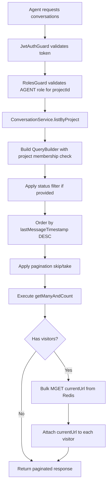
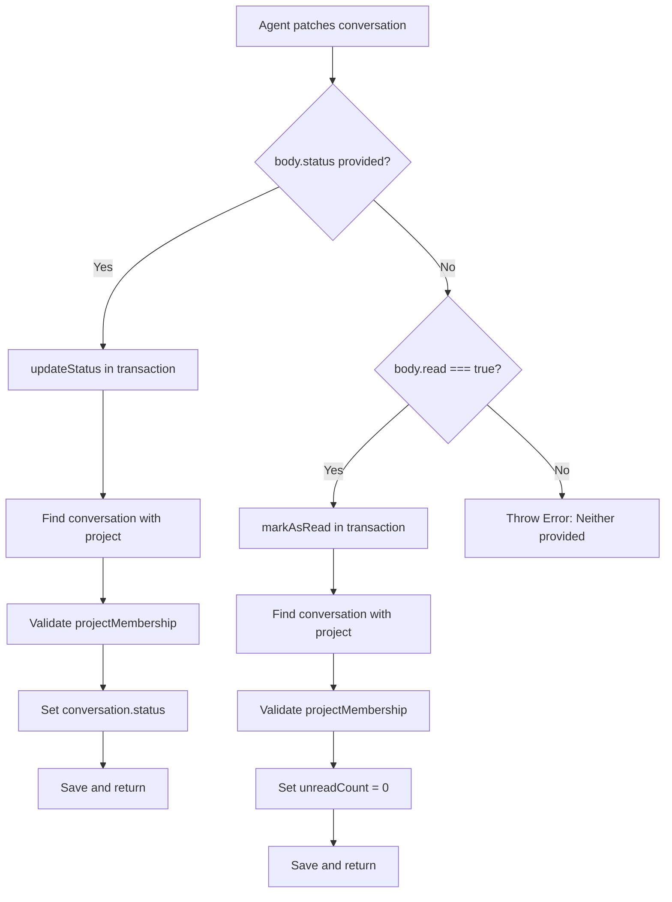
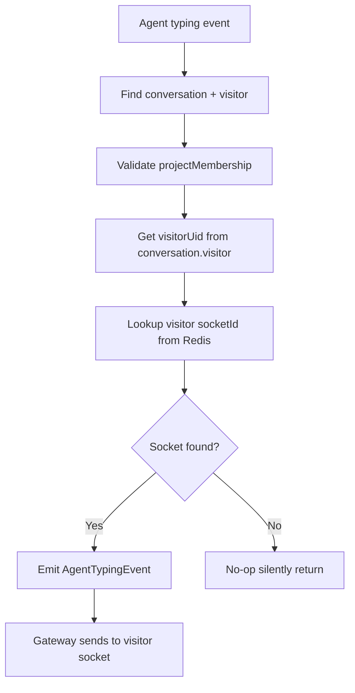
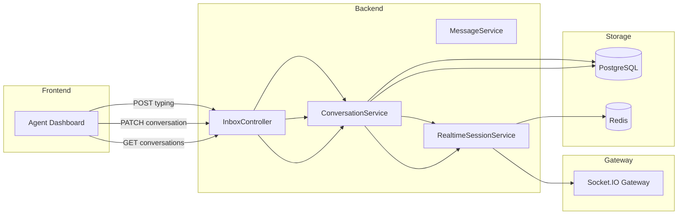

# Feature Investigation: Inbox Operations

## Overview

This investigation documents the inbox management operations beyond the "Send Reply" flow that was previously investigated. It covers conversation listing, status updates, marking as read, agent typing indicators, and conversation deletion. These operations are essential for agents to manage their conversation workload in the dashboard.

All inbox endpoints are scoped to a project via the route pattern `/projects/:projectId/inbox/*` and require `AGENT` role or higher.

## Entry Points

| Function/Method        | File                                                                        | Lines    | Purpose                                     |
| :--------------------- | :-------------------------------------------------------------------------- | :------- | :------------------------------------------ |
| `listConversations()`  | [inbox.controller.ts](../../packages/backend/src/inbox/inbox.controller.ts) | L45-53   | List paginated conversations for a project  |
| `updateConversation()` | [inbox.controller.ts](../../packages/backend/src/inbox/inbox.controller.ts) | L64-84   | Update status or mark as read               |
| `listMessages()`       | [inbox.controller.ts](../../packages/backend/src/inbox/inbox.controller.ts) | L86-93   | Paginated messages for a conversation       |
| `handleAgentTyping()`  | [inbox.controller.ts](../../packages/backend/src/inbox/inbox.controller.ts) | L94-106  | Broadcast agent typing indicator to visitor |
| `getVisitor()`         | [inbox.controller.ts](../../packages/backend/src/inbox/inbox.controller.ts) | L108-114 | Get visitor details by ID                   |
| `deleteConversation()` | [inbox.controller.ts](../../packages/backend/src/inbox/inbox.controller.ts) | L116-125 | Permanently delete conversation (MANAGER)   |

## Execution Flow

### Flow 1: List Conversations (`GET /projects/:projectId/inbox/conversations`)



1. **Authentication/Authorization**: `JwtAuthGuard` + `RolesGuard` verify project membership with AGENT role
2. **Query Building**:
   - Joins `conversation` → `project` → `project_member` (validated by userId)
   - Left joins `visitor` to include visitor data
   - Optional `status` filter (open, resolved, pending)
   - Pagination via `skip()` and `take()`
3. **Redis Enrichment**: Bulk fetches `currentUrl` for all visitors via `realtimeSessionService.getManyVisitorCurrentUrls()`
4. **Returns**: `{ data, total, page, limit }`

### Flow 2: Update Conversation Status (`PATCH /projects/:projectId/inbox/conversations/:id`)



1. **Route**: Uses `@Auditable` decorator for audit logging
2. **Status Update**: Validates membership, sets `conversation.status` (OPEN, RESOLVED, PENDING)
3. **Mark as Read**: Validates membership, sets `unreadCount = 0`
4. **Error**: If neither `status` nor `read` provided, throws error

### Flow 3: List Messages (`GET /projects/:projectId/inbox/conversations/:id/messages`)

1. **Permission Check**: Validates user has access to conversation's project
2. **Cursor-based Pagination**: Uses `cursor` (message ID) for infinite scroll
3. **Query**: Fetches `limit + 1` messages to detect `hasNextPage`
4. **Returns**: `{ data, hasNextPage, nextCursor }` with messages in chronological order

### Flow 4: Agent Typing Indicator (`POST /projects/:projectId/inbox/conversations/:id/typing`)



1. **Returns**: HTTP 204 No Content
2. **Event Payload**: `{ visitorSocketId, isTyping, agentName }`
3. **Event Handler**: `gateway.event-listener.ts` handles `agent.typing` event

### Flow 5: Delete Conversation (`DELETE /projects/:projectId/inbox/conversations/:id`)

1. **Authorization**: Requires `MANAGER` role (not just AGENT)
2. **Audit**: Decorated with `@Auditable({ action: DELETE })`
3. **Hard Delete**: Messages cascade-deleted via entity configuration
4. **Event**: Emits `ConversationDeletedEvent` with `projectId` and `conversationId`
5. **Handler**: Gateway broadcasts to project channel so other agents' UIs update

## Data Flow



## Interfaces & Abstractions

### Input Types

```typescript
// Conversation list query params
interface ListConversationsDto {
  status?: ConversationStatus; // 'open' | 'resolved' | 'pending'
  page?: number; // Default: 1
  limit?: number; // Default: 10
}

// Conversation update body
interface UpdateConversationDto {
  status?: ConversationStatus; // Update status
  read?: boolean; // Mark as read (true only)
}

// Agent typing body
interface AgentTypingDto {
  isTyping: boolean;
}

// Message list query params
interface ListMessagesDto {
  limit?: number; // Default: 20
  cursor?: string; // Message ID for pagination
}
```

### Output Types

```typescript
// Conversation list response
interface ConversationListResponseDto {
  data: Conversation[]; // With visitor attached
  total: number;
  page: number;
  limit: number;
}

// Message list response
interface MessageListResponse {
  data: Message[];
  hasNextPage: boolean;
  nextCursor: string | null;
}
```

### Key Abstractions

| Abstraction              | Location                                                                                               | Purpose                            | Key Methods                                                                                        |
| :----------------------- | :----------------------------------------------------------------------------------------------------- | :--------------------------------- | :------------------------------------------------------------------------------------------------- |
| `ConversationService`    | [conversation.service.ts](../../packages/backend/src/inbox/services/conversation.service.ts)           | Conversation CRUD + business logic | `listByProject()`, `updateStatus()`, `markAsRead()`, `handleAgentTyping()`, `deleteConversation()` |
| `MessageService`         | [message.service.ts](../../packages/backend/src/inbox/services/message.service.ts)                     | Message operations                 | `listByConversation()`, `sendAgentReply()`                                                         |
| `RealtimeSessionService` | [realtime-session.service.ts](../../packages/backend/src/realtime-session/realtime-session.service.ts) | Redis session management           | `getVisitorSession()`, `getManyVisitorCurrentUrls()`                                               |
| `ProjectService`         | [project.service.ts](../../packages/backend/src/projects/project.service.ts)                           | Project membership validation      | `validateProjectMembership()`                                                                      |

## Dependencies

### Internal Dependencies

| Dependency                                           | Type           | What It Does                                                              |
| :--------------------------------------------------- | :------------- | :------------------------------------------------------------------------ |
| `ConversationService.listByProject()`                | Core           | Builds TypeORM query with membership join, enriches with Redis currentUrl |
| `ConversationService.updateStatus()`                 | Core           | Transaction: validates membership, updates status, saves                  |
| `ConversationService.markAsRead()`                   | Core           | Transaction: validates membership, sets unreadCount=0, saves              |
| `ConversationService.handleAgentTyping()`            | Core           | Looks up visitor socket in Redis, emits AgentTypingEvent                  |
| `ConversationService.deleteConversation()`           | Core           | Hard deletes with cascade, emits ConversationDeletedEvent                 |
| `MessageService.listByConversation()`                | Core           | Cursor-based pagination with hasNextPage detection                        |
| `RealtimeSessionService.getManyVisitorCurrentUrls()` | Infrastructure | Redis MGET for bulk visitor URL lookup                                    |
| `RealtimeSessionService.getVisitorSession()`         | Infrastructure | Redis GET for visitor's socket ID                                         |
| `ProjectService.validateProjectMembership()`         | Core           | Throws ForbiddenException if user not member of project                   |
| `EventEmitter2.emit()`                               | Infrastructure | Emits internal events for gateway broadcasting                            |

### External Dependencies

| Dependency              | Type        | Standard Behavior                        |
| :---------------------- | :---------- | :--------------------------------------- |
| `TypeORM EntityManager` | Third-Party | Database query building and transactions |
| `EventEmitter2`         | Third-Party | NestJS event bus for internal events     |

## Error Handling

| Error                   | When It Occurs                         | How It's Handled                             |
| :---------------------- | :------------------------------------- | :------------------------------------------- |
| `NotFoundException`     | Conversation ID not found              | Returns 404 with message                     |
| `ForbiddenException`    | User not member of project             | Returns 403 (from validateProjectMembership) |
| `Error`                 | Neither status nor read in update body | Returns 500 (should be BadRequest)           |
| `UnauthorizedException` | Invalid JWT token                      | Returns 401                                  |

## Side Effects

- **Database (PostgreSQL)**:

  - `conversation` table: Status updates, unreadCount resets, deletions
  - `message` table: Cascade deletion when conversation deleted

- **Cache (Redis)**: Read-only for session lookups

- **Events Emitted**:

  - `agent.typing` → Handled by Gateway to emit to visitor
  - `conversation.deleted` → Handled by Gateway to broadcast to project agents

- **External APIs**: None

## Data Lineage (Origin → Destination)

| Data Artifact              | Origin              | Components in Path                               | Final Destination         |
| :------------------------- | :------------------ | :----------------------------------------------- | :------------------------ |
| `ListConversationsDto`     | HTTP Query Params   | Controller → ConversationService                 | SQL WHERE/ORDER/LIMIT     |
| `UpdateConversationDto`    | HTTP Request Body   | Controller → ConversationService → EntityManager | `conversation` table      |
| `visitorCurrentUrl`        | Redis cache         | RealtimeSessionService → ConversationService     | API response enrichment   |
| `AgentTypingEvent`         | ConversationService | EventEmitter → Gateway → Socket.IO               | Visitor widget            |
| `ConversationDeletedEvent` | ConversationService | EventEmitter → Gateway                           | Agent dashboard broadcast |

### Event Flow (Emitter → Handler)

| Event Name             | Emitted By                                      | Handled By                                                                                    | Purpose                      |
| :--------------------- | :---------------------------------------------- | :-------------------------------------------------------------------------------------------- | :--------------------------- |
| `agent.typing`         | `ConversationService.handleAgentTyping():L308`  | [gateway.event-listener.ts](../../packages/backend/src/gateway/gateway.event-listener.ts)     | Emit to visitor socket       |
| `conversation.updated` | `ConversationService.assign():L352`             | [gateway.event-listener.ts](../../packages/backend/src/gateway/gateway.event-listener.ts#L33) | Broadcast to project channel |
| `conversation.deleted` | `ConversationService.deleteConversation():L427` | [gateway.event-listener.ts](../../packages/backend/src/gateway/gateway.event-listener.ts)     | Broadcast deletion to agents |

### Orphan Audit

> [!NOTE]
> No orphaned events found. All emitted events have registered handlers in `gateway.event-listener.ts`.

## Configuration

| Config Key | Default | Purpose |
| :--------- | :------ | :------ |
| (none)     | —       | —       |

## Integration Points

### To Call This Feature

```typescript
// List conversations with status filter
const response = await fetch(
  `/projects/${projectId}/inbox/conversations?status=open&page=1&limit=20`,
  {
    headers: { Authorization: `Bearer ${accessToken}` },
  }
);

// Update conversation status
await fetch(`/projects/${projectId}/inbox/conversations/${conversationId}`, {
  method: "PATCH",
  headers: {
    Authorization: `Bearer ${accessToken}`,
    "Content-Type": "application/json",
  },
  body: JSON.stringify({ status: "resolved" }),
});

// Mark as read
await fetch(`/projects/${projectId}/inbox/conversations/${conversationId}`, {
  method: "PATCH",
  headers: {
    Authorization: `Bearer ${accessToken}`,
    "Content-Type": "application/json",
  },
  body: JSON.stringify({ read: true }),
});

// Send typing indicator
await fetch(
  `/projects/${projectId}/inbox/conversations/${conversationId}/typing`,
  {
    method: "POST",
    headers: {
      Authorization: `Bearer ${accessToken}`,
      "Content-Type": "application/json",
    },
    body: JSON.stringify({ isTyping: true }),
  }
);
```

## Files Investigated

| File                                                                                         | Lines Read | Key Findings                                   |
| :------------------------------------------------------------------------------------------- | :--------- | :--------------------------------------------- |
| [inbox.controller.ts](../../packages/backend/src/inbox/inbox.controller.ts)                  | L1-127     | All inbox endpoints, RBAC guards               |
| [conversation.service.ts](../../packages/backend/src/inbox/services/conversation.service.ts) | L1-536     | List, update, typing, delete logic with events |
| [message.service.ts](../../packages/backend/src/inbox/services/message.service.ts)           | L171-217   | Cursor-based message listing                   |
| [list-conversations.dto.ts](../../packages/shared-dtos/src/list-conversations.dto.ts)        | L1-23      | Pagination and status filter params            |
| [update-conversation.dto.ts](../../packages/shared-dtos/src/update-conversation.dto.ts)      | L1-25      | Status and read flag for updates               |
