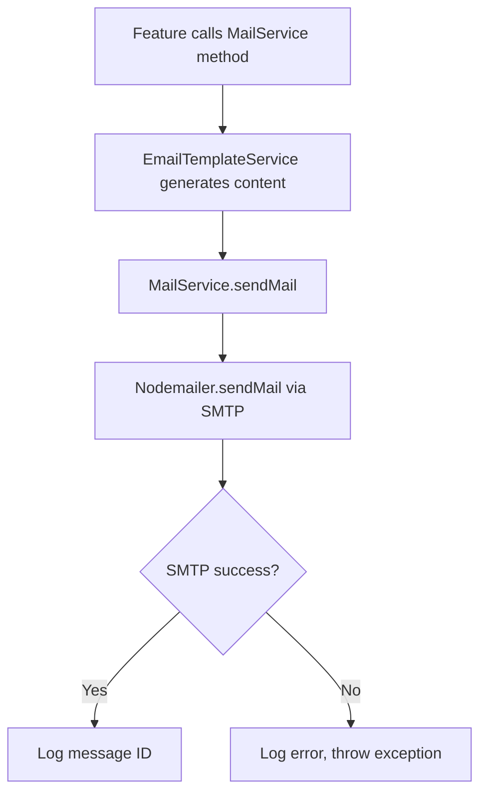
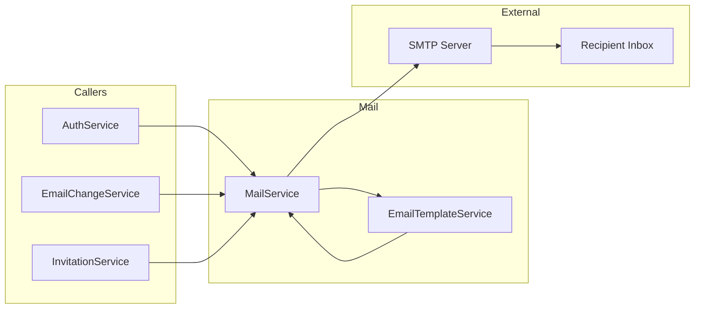

# Feature Investigation: Mail Service

## Overview

The mail service provides transactional email delivery for the application using Nodemailer with SMTP transport. It supports multiple email types including user confirmation, password reset, email change flows, and project invitations. All email content is generated using the `EmailTemplateService` which provides internationalization (English and Vietnamese).

## Entry Points

| Function/Method                 | File                                                                     | Lines    | Purpose                                   |
| :------------------------------ | :----------------------------------------------------------------------- | :------- | :---------------------------------------- |
| `sendMail()`                    | [mail.service.ts](../../packages/backend/src/mail/mail.service.ts)       | L36-53   | Core email sending method                 |
| `sendUserConfirmation()`        | [mail.service.ts](../../packages/backend/src/mail/mail.service.ts)       | L55-58   | New user email verification               |
| `sendPasswordResetEmail()`      | [mail.service.ts](../../packages/backend/src/mail/mail.service.ts)       | L60-63   | Password reset flow                       |
| `sendEmailChangeVerification()` | [mail.service.ts](../../packages/backend/src/mail/mail.service.ts)       | L71-78   | Email change verification to new address  |
| `sendEmailChangeConfirmation()` | [mail.service.ts](../../packages/backend/src/mail/mail.service.ts)       | L86-94   | Confirmation to old address after change  |
| `sendEmailChangeNotification()` | [mail.service.ts](../../packages/backend/src/mail/mail.service.ts)       | L101-104 | Alert to old address about pending change |
| `sendInvitationEmail()`         | [mail.service.ts](../../packages/backend/src/mail/mail.service.ts)       | L106-116 | Project invitation (new/existing user)    |
| `sendTestEmail()` (Controller)  | [mail.controller.ts](../../packages/backend/src/mail/mail.controller.ts) | L18-30   | Admin-only test endpoint                  |

## Execution Flow

### Flow 1: Send Transactional Email



1. **Template Generation**: Each email type delegates to `EmailTemplateService`
2. **Language Detection**: Uses `user.language` field (defaults to English)
3. **SMTP Delivery**: Sends via configured SMTP server (Gmail recommended)
4. **Error Handling**: Logs errors and throws on failure

### Flow 2: Email Types Matrix

| Email Type           | Recipient         | Trigger                  | Token Expiry |
| :------------------- | :---------------- | :----------------------- | :----------- |
| User Confirmation    | New user          | Registration             | 15 minutes   |
| Password Reset       | Existing user     | Forgot password request  | 15 minutes   |
| Email Change Verify  | New email address | Email change request     | 24 hours     |
| Email Change Confirm | Old email address | After successful change  | N/A          |
| Email Change Notify  | Old email address | When change is requested | N/A          |
| Project Invitation   | Invitee           | Manager invites user     | 7 days       |

## Data Flow



## Interfaces & Abstractions

### Input Types

```typescript
// Core send method
interface SendMailParams {
  to: string; // Recipient email
  subject: string; // Email subject
  html: string; // HTML body content
}

// Template outputs
interface EmailTemplate {
  subject: string;
  html: string;
}

// Invitation template includes URL
interface InvitationTemplate extends EmailTemplate {
  invitationUrl: string;
}
```

### Key Abstractions

| Abstraction            | Location                                                                               | Purpose                             | Key Methods                         |
| :--------------------- | :------------------------------------------------------------------------------------- | :---------------------------------- | :---------------------------------- |
| `MailService`          | [mail.service.ts](../../packages/backend/src/mail/mail.service.ts)                     | SMTP transport + high-level methods | `sendMail()`, type-specific methods |
| `EmailTemplateService` | [email-template.service.ts](../../packages/backend/src/mail/email-template.service.ts) | Template generation + i18n          | `get*Template()` methods            |

## Dependencies

### Internal Dependencies

| Dependency                            | Type           | What It Does                                  |
| :------------------------------------ | :------------- | :-------------------------------------------- |
| `EmailTemplateService.get*Template()` | Core           | Returns `{ subject, html }` with i18n support |
| `ConfigService.get('FRONTEND_URL')`   | Infrastructure | Constructs verification/reset URLs            |
| `ConfigService.get('API_BASE_URL')`   | Infrastructure | Constructs email change callback URL          |

### External Dependencies

| Dependency   | Type        | Standard Behavior                 |
| :----------- | :---------- | :-------------------------------- |
| `nodemailer` | Third-Party | SMTP transport for email delivery |

## Error Handling

| Error             | When It Occurs     | How It's Handled          |
| :---------------- | :----------------- | :------------------------ |
| SMTP failure      | Network/auth issue | Logged + exception thrown |
| Invalid recipient | SMTP rejection     | Exception from nodemailer |

## Side Effects

- **Database (PostgreSQL)**: None (email service only sends)

- **Cache (Redis)**: None

- **External APIs**: SMTP server (Gmail, etc.)

## Configuration

| Config Key          | Purpose                            |
| :------------------ | :--------------------------------- |
| `MAIL_HOST`         | SMTP server hostname               |
| `MAIL_PORT`         | SMTP port (465 for SSL)            |
| `MAIL_SECURE`       | Use TLS (true for port 465)        |
| `MAIL_USER`         | SMTP auth username (email)         |
| `MAIL_APP_PASSWORD` | SMTP auth password (app password)  |
| `FRONTEND_URL`      | Base URL for frontend links        |
| `API_BASE_URL`      | Base URL for email change callback |

## Internationalization

The `EmailTemplateService` supports two languages:

- **English (en)**: Default
- **Vietnamese (vi)**: Detected via `user.language` field

Template selection example:

```typescript
if (user.language === "vi") {
  // Vietnamese template
} else {
  // English template (default)
}
```

## Data Lineage (Origin → Destination)

| Data Artifact    | Origin               | Components in Path                 | Final Destination |
| :--------------- | :------------------- | :--------------------------------- | :---------------- |
| User entity      | Service caller       | MailService → EmailTemplateService | Email template    |
| Verification URL | Config + Token       | EmailTemplateService               | Email HTML body   |
| Email content    | EmailTemplateService | MailService → Nodemailer           | SMTP → Inbox      |

### Event Flow (Emitter → Handler)

| Event Name | Emitted By | Handled By | Purpose |
| :--------- | :--------- | :--------- | :------ |
| (none)     | —          | —          | —       |

### Orphan Audit

> [!NOTE]
> No orphaned events. This is a synchronous service called by other features.

## Integration Points

### From Other Services

```typescript
// User confirmation (AuthService)
await mailService.sendUserConfirmation(user, token);

// Password reset (AuthService)
await mailService.sendPasswordResetEmail(user, token);

// Email change flow (EmailChangeService)
await mailService.sendEmailChangeVerification(user, newEmail, token);
await mailService.sendEmailChangeNotification(user, newEmail);
await mailService.sendEmailChangeConfirmation(
  user,
  oldEmail,
  newEmail,
  user.fullName
);

// Project invitation (InvitationService)
await mailService.sendInvitationEmail(invitation, project, existingUser);
```

### Admin Test Endpoint

```typescript
// POST /mail/test-send (ADMIN only)
await fetch("/mail/test-send", {
  method: "POST",
  headers: {
    Authorization: `Bearer ${adminToken}`,
    "Content-Type": "application/json",
  },
  body: JSON.stringify({ to: "test@example.com" }),
});
```

## Files Investigated

| File                                                                                   | Lines Read | Key Findings                               |
| :------------------------------------------------------------------------------------- | :--------- | :----------------------------------------- |
| [mail.service.ts](../../packages/backend/src/mail/mail.service.ts)                     | L1-118     | SMTP transport, 7 email methods            |
| [email-template.service.ts](../../packages/backend/src/mail/email-template.service.ts) | L1-323     | i18n templates (EN/VI) for all email types |
| [mail.controller.ts](../../packages/backend/src/mail/mail.controller.ts)               | L1-32      | Admin-only test endpoint                   |
