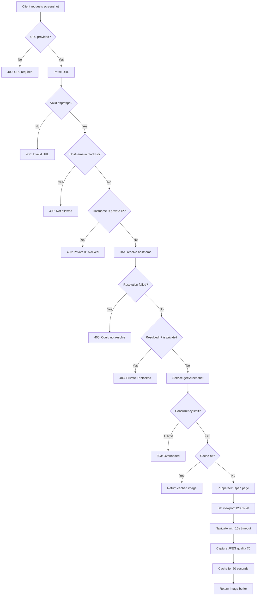
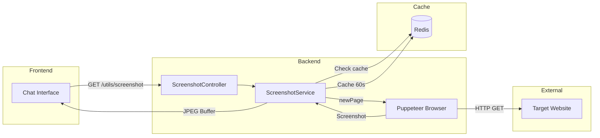

# Feature Investigation: Screenshot Service

## Overview

The screenshot service provides URL-to-image conversion using Puppeteer (headless Chrome). It is designed for previewing external links in the chat interface. The service includes comprehensive SSRF (Server-Side Request Forgery) protection to prevent attackers from using the screenshot endpoint to probe internal infrastructure.

Key security features:

- Blocked hostname list (cloud metadata endpoints)
- Private/reserved IP range blocking
- DNS rebinding protection (resolves hostname before request)
- Concurrency limits to prevent resource exhaustion
- Redis caching to reduce duplicate requests

## Entry Points

| Function/Method   | File                                                                                       | Lines   | Purpose                      |
| :---------------- | :----------------------------------------------------------------------------------------- | :------ | :--------------------------- |
| `getScreenshot()` | [screenshot.controller.ts](../../packages/backend/src/screenshot/screenshot.controller.ts) | L81-181 | Validate URL + capture image |

## Execution Flow

### Flow 1: Capture Screenshot (`GET /utils/screenshot?url=...`)



1. **URL Validation**: Parses and decodes URL, ensures HTTP/HTTPS protocol
2. **Hostname Blocklist**: Checks against known dangerous endpoints
3. **Direct IP Check**: Blocks if hostname is already a private IP
4. **DNS Resolution**: Resolves hostname to detect DNS rebinding attacks
5. **Resolved IP Check**: Validates resolved IP is not private/reserved
6. **Concurrency Check**: Rejects if at max capacity (5 concurrent)
7. **Cache Check**: Returns cached result if available
8. **Puppeteer Capture**: Opens page, screenshots, caches, returns

## Data Flow



## Interfaces & Abstractions

### Input Types

```typescript
// Query parameter
interface ScreenshotQuery {
  url: string; // URL-encoded target URL
}
```

### Output Types

```typescript
// Response: image/jpeg binary stream
type ScreenshotResponse = StreamableFile; // JPEG buffer
```

### Key Abstractions

| Abstraction               | Location                                                                                       | Purpose                        | Key Methods                   |
| :------------------------ | :--------------------------------------------------------------------------------------------- | :----------------------------- | :---------------------------- |
| `ScreenshotService`       | [screenshot.service.ts](../../packages/backend/src/screenshot/screenshot.service.ts)           | Puppeteer wrapper with caching | `getScreenshot()`             |
| `isPrivateOrReservedIP()` | [screenshot.controller.ts](../../packages/backend/src/screenshot/screenshot.controller.ts#L34) | IP range validation            | Checks against blocked ranges |
| `resolveHostname()`       | [screenshot.controller.ts](../../packages/backend/src/screenshot/screenshot.controller.ts#L67) | DNS lookup wrapper             | Returns IP or null            |

## Dependencies

### Internal Dependencies

| Dependency                          | Type           | What It Does                               |
| :---------------------------------- | :------------- | :----------------------------------------- |
| `ScreenshotService.getScreenshot()` | Core           | Manages browser pool, caching, concurrency |
| `isPrivateOrReservedIP()`           | Utility        | Parses IP and checks range via ipaddr.js   |
| `resolveHostname()`                 | Utility        | Async DNS lookup, returns null on failure  |
| `CACHE_MANAGER`                     | Infrastructure | Redis cache for storing screenshot base64  |

### External Dependencies

| Dependency            | Type        | Standard Behavior                      |
| :-------------------- | :---------- | :------------------------------------- |
| `puppeteer`           | Third-Party | Headless Chrome automation             |
| `ipaddr.js`           | Third-Party | IP address parsing and range detection |
| `dns.promises.lookup` | Third-Party | DNS resolution                         |

## Error Handling

| Error                       | When It Occurs              | How It's Handled      |
| :-------------------------- | :-------------------------- | :-------------------- |
| `400 BAD_REQUEST`           | Missing URL parameter       | Returns error message |
| `400 BAD_REQUEST`           | Invalid/malformed URL       | Returns error message |
| `400 BAD_REQUEST`           | DNS resolution failed       | Returns error message |
| `403 FORBIDDEN`             | Blocked hostname (metadata) | Returns "not allowed" |
| `403 FORBIDDEN`             | Private/reserved IP         | Returns "not allowed" |
| `500 INTERNAL_SERVER_ERROR` | Puppeteer navigation failed | Returns error message |
| `503 SERVICE_UNAVAILABLE`   | At concurrency limit        | Returns "overloaded"  |

## Side Effects

- **Database (PostgreSQL)**: None

- **Cache (Redis)**:

  - Key: URL string
  - Value: Base64 encoded JPEG
  - TTL: 60 seconds

- **Browser (Puppeteer)**:
  - Opens new page (tab) per request
  - Navigates to target URL
  - Max 5 concurrent pages

## SSRF Protection Details

### Blocked Hostnames

```typescript
const BLOCKED_HOSTNAMES = new Set([
  "localhost",
  "metadata.google.internal", // GCP metadata
  "metadata.google.com",
  "169.254.169.254", // AWS/Azure metadata
]);
```

### Blocked IP Ranges

```typescript
const blockedRanges = new Set([
  "unspecified", // 0.0.0.0, ::
  "loopback", // 127.0.0.0/8, ::1
  "private", // 10.0.0.0/8, 172.16.0.0/12, 192.168.0.0/16, fc00::/7
  "linkLocal", // 169.254.0.0/16, fe80::/10
  "reserved", // Various reserved ranges
  "carrierGradeNat", // 100.64.0.0/10
  "uniqueLocal", // fc00::/7 (IPv6 private)
]);
```

### DNS Rebinding Prevention

The controller resolves hostnames to IP addresses **before** passing to Puppeteer. This prevents attackers from using domains that resolve to internal IPs after the initial validation.

## Data Lineage (Origin → Destination)

| Data Artifact   | Origin         | Components in Path                   | Final Destination |
| :-------------- | :------------- | :----------------------------------- | :---------------- |
| URL parameter   | HTTP Query     | Controller → Service → Puppeteer     | Target website    |
| Screenshot JPEG | Target website | Puppeteer → Service → Cache → Client | HTTP Response     |

### Event Flow (Emitter → Handler)

| Event Name | Emitted By | Handled By | Purpose |
| :--------- | :--------- | :--------- | :------ |
| (none)     | —          | —          | —       |

### Orphan Audit

> [!NOTE]
> No orphaned events. This feature is request-response based with no event emission.

## Configuration

| Config Key             | Default  | Purpose                      |
| :--------------------- | :------- | :--------------------------- |
| `MAX_CONCURRENT_PAGES` | 5        | Concurrency limit            |
| Cache TTL              | 60000ms  | Screenshot cache duration    |
| Puppeteer timeout      | 15000ms  | Page navigation timeout      |
| JPEG quality           | 70       | Screenshot compression level |
| Viewport               | 1280x720 | Screenshot dimensions        |

## Integration Points

### To Capture a Screenshot

```typescript
// GET request with URL-encoded target
const response = await fetch(
  `/utils/screenshot?url=${encodeURIComponent("https://example.com")}`
);
const imageBlob = await response.blob();
```

### Response Headers

```
Content-Type: image/jpeg
```

## Lifecycle

- **Module Init**: Launches Puppeteer browser (singleton)
- **Module Destroy**: Closes browser instance
- **Graceful Degradation**: If Chrome not installed, service marks itself unavailable

## Files Investigated

| File                                                                                       | Lines Read | Key Findings                              |
| :----------------------------------------------------------------------------------------- | :--------- | :---------------------------------------- |
| [screenshot.controller.ts](../../packages/backend/src/screenshot/screenshot.controller.ts) | L1-183     | SSRF protection, URL validation           |
| [screenshot.service.ts](../../packages/backend/src/screenshot/screenshot.service.ts)       | L1-138     | Puppeteer lifecycle, caching, concurrency |
