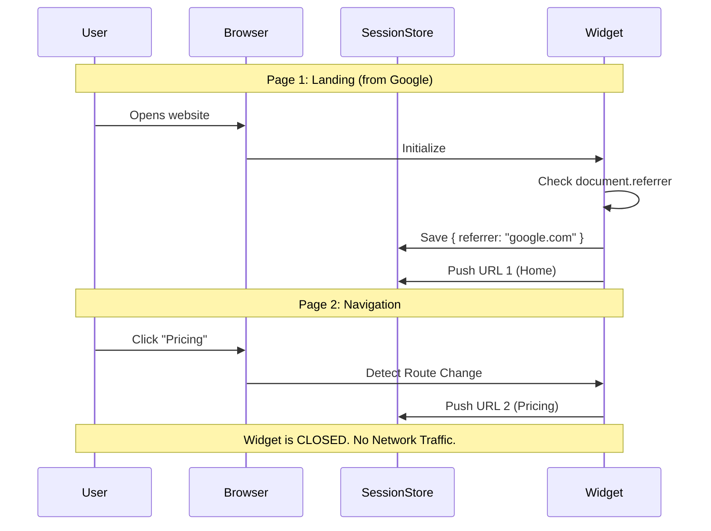
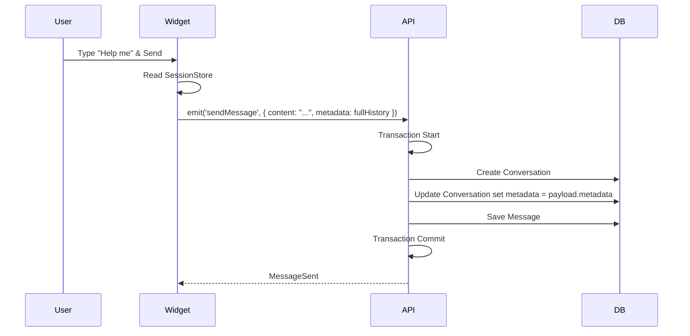
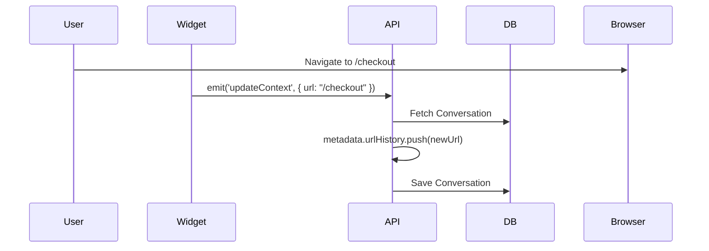
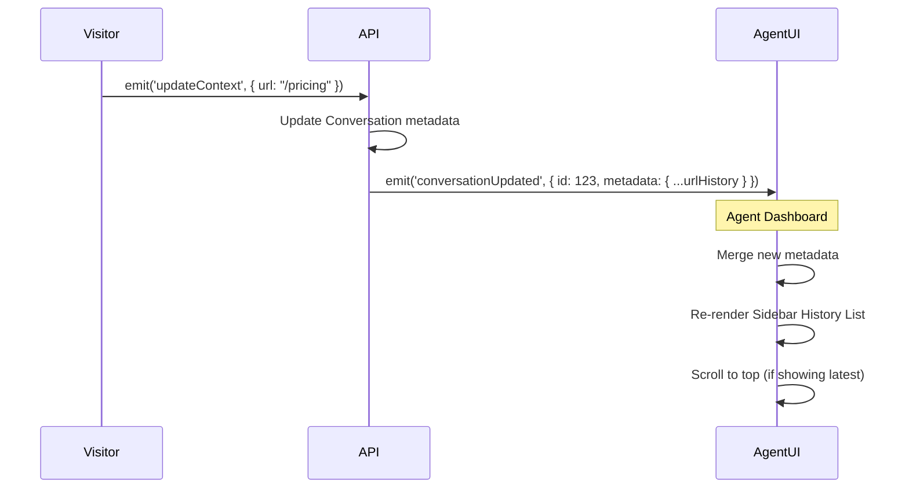

# Design: Session-Based URL History & Referrer Tracking

## 1. Context & Objective

Currently, the system only tracks the *current* page URL of a visitor. Agents lack context regarding the visitor's journey (e.g., "Visitor looked at Pricing, then Docs, then Home") and their origin (Referrer).

**Objective:**
1.  **Silent Recording:** The widget must track navigation history locally (Client-Side) from the moment the script loads.
2.  **Lazy Sync:** This history is transmitted to the backend *only* when a conversation starts (First Message).
3.  **Visualization (Agent Dashboard):** Agents can view the full session history in the sidebar.
    *   **Default View:** Show last 5 visited pages (Newest first).
    *   **Interaction:** "Show All" button to expand the full list in a scrollable container.
    *   **Live Updates:** The list updates in real-time as the visitor navigates while chatting.

## 2. Domain Physics (Invariants)

1.  **Session Scope:** A "History Session" is defined by the browser tab lifecycle (`sessionStorage`). Closing the tab clears the pending history.
2.  **Immutable Archives:** Once history is attached to a Conversation, it is immutable. It represents the context *at the time of that conversation*.
3.  **Origin Truth:** The `Referrer` must be captured on the *very first* load of the widget in that session. Subsequent internal navigation must not overwrite the original external referrer.
4.  **Capacity Limit:** The client will buffer a maximum of 50 URLs to prevent payload bloat. FIFO (First-In-First-Out) if limit exceeded.

## 3. Data Structure & Schema

### 3.1. Shared Types (JSON Payload)

We will introduce a structured JSON schema for the `metadata` column.

```typescript
// packages/shared-types/src/conversation.ts

export interface NavigationEntry {
  url: string;
  title: string;
  timestamp: string; // ISO 8601
}

export interface VisitorSessionMetadata {
  referrer: string | null;     // e.g., "https://google.com" or null (direct)
  landingPage: string;         // The first page they hit
  urlHistory: NavigationEntry[];
  browser?: string;            // User-Agent summary (optional future proofing)
  os?: string;                 // OS summary (optional future proofing)
}
```

### 3.2. Database Schema (PostgreSQL)

We will leverage the flexibility of `jsonb` to store this context without creating high-churn relational tables.

**Entity:** `Conversation`

| Column | Type | Nullable | Default | Description |
| :--- | :--- | :--- | :--- | :--- |
| `metadata` | `jsonb` | `true` | `null` | Stores `VisitorSessionMetadata` |

> **Gall's Law Justification:** We avoid creating a `visitor_page_views` table because this data is read-heavy (display) and rarely queried for aggregate analytics in this MVP. A JSON document on the Conversation is the simplest "Modular Monolith" approach.

### 3.3. WebSocket Events

**Event:** `sendMessage` (Client -> Server)
We extend the payload to include the session dump.

```typescript
// packages/shared-types/src/websocket.ts

export interface SendMessagePayload {
  content: string;
  tempId: string;
  // NEW FIELDS
  sessionMetadata?: VisitorSessionMetadata; 
}
```

**Event:** `visit` (Client -> Server) *Existing*
This event currently updates the "current url". We will keep it but the backend handler will now *append* this new URL to the `metadata.urlHistory` array if a conversation is open.

### 3.4. Agent Dashboard UI & State

**Location:** Right Sidebar (Visitor Details Panel).

**Component Structure:**
1.  **Referrer Field:** Displays `metadata.referrer` (e.g., "Google" or "Direct").
2.  **History List:**
    *   **Header:** "Session History"
    *   **Items:** List of `NavigationEntry` (Time + Page Title/URL).
    *   **Truncation:** Render only the latest 5 entries by default.
    *   **Expansion:** Button "View all X pages" expands the container (max-height + scroll).
    *   **Real-time:** When `conversationUpdated` event arrives (triggered by visitor navigation), the list must re-render.

## 4. Sequence Diagrams

### 4.1. The "Silent" Recorder (Frontend)



### 4.2. The "Loud" Sync (First Message)



### 4.3. Ongoing Updates



### 4.4. Real-time Visualization Flow (Agent)



## 5. Pre-Mortem & Error Taxonomy

| Failure Mode | Impact | Mitigation Strategy |
| :--- | :--- | :--- |
| **Payload Bloat** | If a user visits 1000 pages, the `sendMessage` packet becomes huge, potentially causing WS timeout. | **Hard Limit:** Client slices history to last 50 entries before sending. |
| **Privacy/Security** | URL may contain sensitive tokens (`/reset-password?token=xyz`). | **Sanitization:** Widget strips query parameters matching sensitive keys (password, token, secret) before storing. |
| **Race Condition** | User navigates *immediately* after sending message. | **Ordering:** The `sendMessage` contains the state *at that moment*. Subsequent `updateContext` events are processed serially by the server. |
| **Storage Quota** | `sessionStorage` is full. | **Fail Silent:** If storage is full, we stop recording. The core chat functionality must not break. `try/catch` around all storage ops. |

## 6. Testability Strategy

### 6.1. Seams
*   **Time:** We need to mock `Date.now()` (or `new Date()`) in the Widget to verify timestamp ordering.
*   **Storage:** In Frontend tests (Vitest), we will mock `window.sessionStorage` to verify persistence logic.
*   **Socket:** We will inspect the `emit` payload to ensure `metadata` is present only on the first message.

### 6.2. Scenarios
*   **Scenario A (Direct):** User comes directly. Referrer should be null.
*   **Scenario B (External):** Mock `document.referrer = "twitter.com"`. Verify it persists across route changes.
*   **Scenario C (Reload):** Reload page. `sessionStorage` should persist. History should not be wiped.
*   **Scenario D (New Tab):** Open new tab. `sessionStorage` is empty. History starts fresh.

## 7. Self-Audit (The Defense)

*   **Gall's Law:** We are using existing `sessionStorage` and an existing Database Entity. We are not introducing new infrastructure (No new tables, No new Redis keys).
*   **DDD:** The "User Journey" is an aggregate of the Conversation context. It belongs on the Conversation.
*   **Reversibility:** If we decide later to move this to a `VisitorPageViews` table for analytics, we can write a migration script to extract the JSON blobs into rows. The data is not lost.
*   **Blast Radius:** The logic is largely client-side "observation." If the history recording fails, the chat still works. The feature is "Progressive Enhancement."
