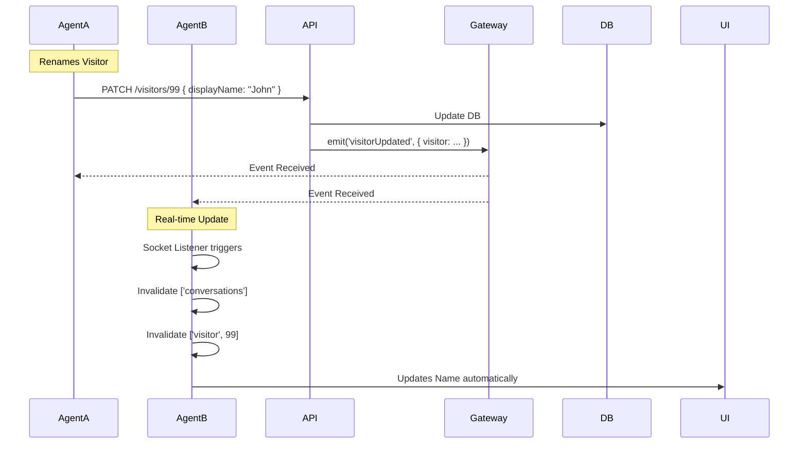

# Design: Visitor Name Editing

## 1. Context & Objective

Currently, visitor names are auto-generated (e.g., "Visitor #123456") and cannot be changed. Agents often want to rename a visitor once they identify them.

**Objective:**
1.  **Backend:** Allow updating the `displayName` of a specific visitor.
2.  **Frontend (Details):** Provide an inline "Slack-style" editing experience in the Visitor Details panel.
3.  **Frontend (List):** Provide a "Rename Visitor" option in the Conversation List context menu.
4.  **Consistency:** Ensure the new name propagates to all UI surfaces immediately.

## 2. Domain Physics (Invariants)

1.  **Scope:** Renaming a visitor applies to **all** their conversations in that project.
2.  **Permissions:** Any `AGENT` or `MANAGER` can rename a visitor.
3.  **Validation:** Name cannot be empty. Max length 50 chars.

## 3. Data Structure & Schema

### 3.1. API Schema

**Endpoint:** `PATCH /projects/:projectId/visitors/:visitorId`

**Request Body:**
```typescript
{
  "displayName": string; // Required, Min 1, Max 50
}
```

**Response:**
*   Returns the updated `Visitor` entity.

### 3.2. WebSocket Events

**Event:** `visitorUpdated` (Server -> Client)
*   **Scope:** Broadcast to all agents in the `project.room`.
*   **Payload:**
    ```typescript
    {
      projectId: number;
      visitorId: number;
      visitor: Visitor; // The full updated entity
    }
    ```

## 4. Component Design (Frontend)

### 4.1. `VisitorNameEditor` (Inline - Details Panel)

*   **Location:** `packages/frontend/src/components/features/inbox/VisitorNameEditor.tsx`
*   **Behavior:**
    *   Displays name + Pencil Icon (on hover).
    *   Clicking triggers Edit Mode (Input + Save/Cancel).
    *   On Save: Calls API, invalidates cache.

### 4.2. `RenameVisitorDialog` (Modal - List Context)

*   **Location:** `packages/frontend/src/components/features/inbox/RenameVisitorDialog.tsx`
*   **Behavior:**
    *   Standard shadcn/ui `Dialog`.
    *   Input field for name.
    *   Save/Cancel buttons.

### 4.3. `ConversationList` Integration

*   **Menu Update:**
    *   Add `DropdownMenuItem` "Rename Visitor" above "Delete Conversation".
    *   Clicking opens `RenameVisitorDialog`.

### 4.4. `VisitorContextPanel` Integration

*   **Update:** Replace static name with `<VisitorNameEditor />`.

## 5. Sequence Diagram (Sync)



## 6. Implementation Plan

### 6.1. Backend
1.  **Controller:** `VisitorController` -> `update` method.
2.  **Service:** `VisitorService` -> `update` method.
3.  **Gateway:** Inject `EventsGateway` into `VisitorService` (or Controller) to emit `visitorUpdated`.
4.  **DTO:** `UpdateVisitorDto`.

### 6.2. Frontend
1.  **API:** `useUpdateVisitor` mutation in `inboxApi.ts`.
2.  **Components:** `VisitorNameEditor` and `RenameVisitorDialog`.
3.  **Socket Listener:** Add logic in `InboxLayout` (or a dedicated `useVisitorEvents` hook) to listen for `visitorUpdated` and invalidate `queryClient`.
4.  **Integration:** Modify `ConversationList.tsx` and `VisitorContextPanel.tsx`.

## 7. Pre-Mortem (Risks)

1.  **Stale Data:** If the agent renames the visitor, the Chat Header (MessagePane) might still show the old name.
    *   *Mitigation:* The frontend `useMutation` **MUST** invalidate `['conversations']` and `['visitor']` queries upon success.
