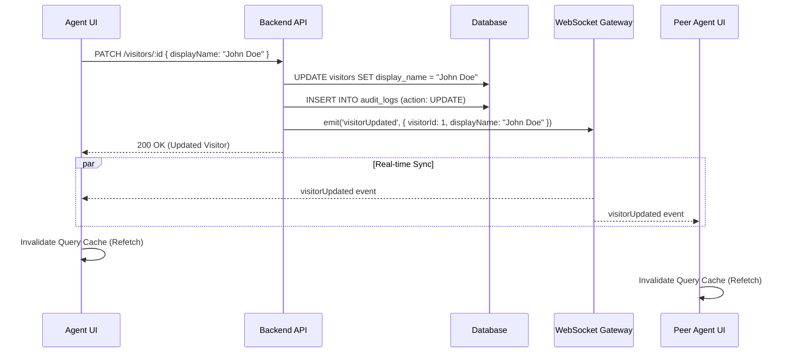

# Architecture: Visitor Name Editing

## System Diagram

## Components

### 1. Frontend
- **VisitorNameEditor (`VisitorNameEditor.tsx`)**: 
  - Handles inline state (isEditing, value).
  - Uses `useUpdateVisitor` mutation.
- **RenameVisitorDialog (`RenameVisitorDialog.tsx`)**:
  - Controlled dialog component.
  - Shares the same mutation hook.
- **useUpdateVisitor Hook**:
  - Wrapper around `useMutation`.
  - Optimistically updates UI or invalidates cache on success.
- **useVisitorEvents Hook**:
  - Listens for `visitorUpdated`.
  - Triggers cache invalidation for `['conversations']` and `['visitor', id]`.

### 2. Backend
- **VisitorController**:
  - Endpoint: `PATCH /projects/:projectId/visitors/:visitorId`
  - Guards: `JwtAuthGuard`, `RolesGuard` (Agent/Manager only).
  - Decorator: `@Auditable({ action: AuditAction.UPDATE, resource: 'visitor' })`
- **VisitorsService**:
  - Logic: Finds visitor -> Updates field -> Saves -> Emits Event.
- **EventsGateway**:
  - Emits: `visitorUpdated` to room `project:{projectId}`.

## Data Flow
- **Input**: User provides string (max 50 chars).
- **Validation**: Backend `UpdateVisitorDto` enforces constraints.
- **Storage**: `display_name` column in `visitors` table.
- **Audit**: Every name change is recorded in `audit_logs`.

## Error Handling
- **Validation Error (400)**: Name too long or empty.
- **Not Found (404)**: Visitor ID does not exist.
- **Forbidden (403)**: User does not have permission (e.g., Viewer role).
