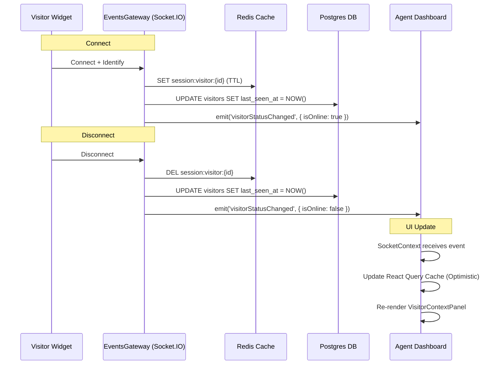

# Architecture: Visitor Online/Offline Status

## System Diagram

## Components

### 1. Backend
- **RealtimeSessionService**:
  - Abstraction over Redis.
  - `isVisitorOnline(uid)`: Checks existence of session key.
  - `getManyVisitorOnlineStatus(uids)`: Batch check via `MGET`.
- **EventsGateway**:
  - Intercepts `handleIdentify` and `handleDisconnect`.
  - Calls `visitorsService.updateLastSeenAtByUid`.
  - Emits `WebSocketEvent.VISITOR_STATUS_CHANGED`.
- **VisitorsService**:
  - `findOne`: Enriches the static DB entity with dynamic `isOnline` status from Redis.

### 2. Frontend
- **VisitorContextPanel**:
  - **Online**: Shows Green Dot, Current URL, Page Preview.
  - **Offline**: Shows Gray Dot, "Last seen X ago". **Hides** stale URL/Preview.
- **SocketContext**:
  - Listens for `VISITOR_STATUS_CHANGED`.
  - Updates `['conversations']` and `['visitor', id]` queries directly.

## Data Flow
- **Source of Truth (Online)**: Redis (Ephemeral).
- **Source of Truth (History)**: Postgres (`lastSeenAt`).
- **Sync**: WebSocket events push state changes. REST APIs pull state on load.

## Error Handling
- **Redis Down**: `RealtimeSessionService` catches errors and defaults to `false` (Offline). "When in doubt, assume they are gone."
- **Ghost Sessions**: Redis keys have TTLs to prevent stuck "Online" states if a server crashes.
