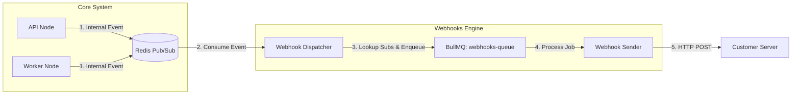

# Design: Outbound Webhooks Engine

## 1. Objective
To empower customers to build integrations by providing real-time HTTP notifications for system events (e.g., "New Message", "Conversation Started").

## 2. Architecture: The Dispatcher Pattern

The Webhooks Engine is built as an asynchronous sidecar to the main event loop. It taps into the existing "Reactive" architecture without blocking the core chat path.

### 2.1 The Dispatcher (Producer)
*   **Role:** Listens to internal Redis channels (e.g., `NEW_MESSAGE_CHANNEL`).
*   **Logic:**
    1.  Decodes the internal event.
    2.  Queries `WebhookSubscription` (cached) for the associated `projectId`.
    3.  Filters subscriptions based on `eventTriggers`.
    4.  Enqueues a job to `webhooks-queue` for each matching subscription.

### 2.2 The Sender (Consumer)
*   **Role:** Reliable HTTP delivery.
*   **Queue Settings:**
    *   `attempts`: 5
    *   `backoff`: `{ type: 'exponential', delay: 1000 }` (1s, 2s, 4s, 8s, 16s).
*   **Security:**
    *   Generates `X-Hub-Signature-256`: HMAC-SHA256 of the payload using the subscription's `secret`.
    *   Sets `User-Agent`: `LiveChat-Webhooks/1.0`.

## 3. Data Model

### 3.1 Webhook Subscription (`webhook_subscriptions`)
Represents a customer's configuration to receive events at a specific URL.

| Column | Type | Description |
| :--- | :--- | :--- |
| `id` | UUID | Primary Key |
| `projectId` | Int | FK to `projects.id` |
| `url` | Varchar | The target URL (must be HTTPS) |
| `secret` | Varchar | Generated secret for signature verification (sk_wh_...) |
| `eventTriggers` | Text[] | List of events to listen to (e.g., `['message.created']`) |
| `isActive` | Boolean | Switch to enable/disable without deleting |
| `createdAt` | Timestamp | |

### 3.2 Webhook Delivery (`webhook_deliveries`)
Audit log of attempted deliveries. Useful for debugging and customer visibility.

| Column | Type | Description |
| :--- | :--- | :--- |
| `id` | UUID | Primary Key |
| `subscriptionId` | UUID | FK to `webhook_subscriptions.id` |
| `eventId` | Varchar | ID of the source event (idempotency key) |
| `status` | Enum | `SUCCESS`, `FAILURE`, `PENDING` |
| `requestPayload` | JSONB | The exact body sent |
| `responseStatus` | Int | HTTP Status Code received (e.g., 200, 500) |
| `error` | Text | Error message (e.g., "Connection Timeout") |

## 4. Public Event Taxonomy

We map internal system events to stable public event names.

| Internal Event | Public Event Name | Description |
| :--- | :--- | :--- |
| `NEW_MESSAGE_FROM_VISITOR` | `message.created` | Visitor sent a message |
| `AGENT_REPLY` | `message.created` | Agent sent a reply |
| `CONVERSATION_CREATED`* | `conversation.created` | New conversation started |

*(Note: `CONVERSATION_CREATED` needs to be ensured as an explicit event if not already present).*

## 5. Security & Invariants

1.  **Isolation:** Webhook failures MUST NOT impact the chat latency. This is guaranteed by the `webhooks-queue`.
2.  **No Leaks:** Secrets are generated on the server and displayed *once* (or masked).
3.  **Verification:** All requests MUST be signed.
4.  **SSRF Protection:** The `url` validator MUST block internal IP ranges (localhost, 127.0.0.1, 10.x.x.x, etc.) to prevent users from scanning the internal network.

## 6. Pre-Mortem

*   **Scenario:** Customer endpoint is slow (30s timeout).
    *   *Mitigation:* `Sender` sets a hard timeout of 5s. Job fails and retries.
*   **Scenario:** Redis is down.
    *   *Mitigation:* The "Dispatcher" is part of the system. If Redis Pub/Sub is down, the whole realtime system is degraded. Webhooks will be lost unless we tail the `outbox_events` table directly. *Decision:* Accept Pub/Sub risk for V1 as it matches the Realtime Gateway SLA.
*   **Scenario:** Flood of events.
    *   *Mitigation:* `webhooks-queue` is separate. If it backs up, it doesn't hurt the `live-chat-events-queue`.

