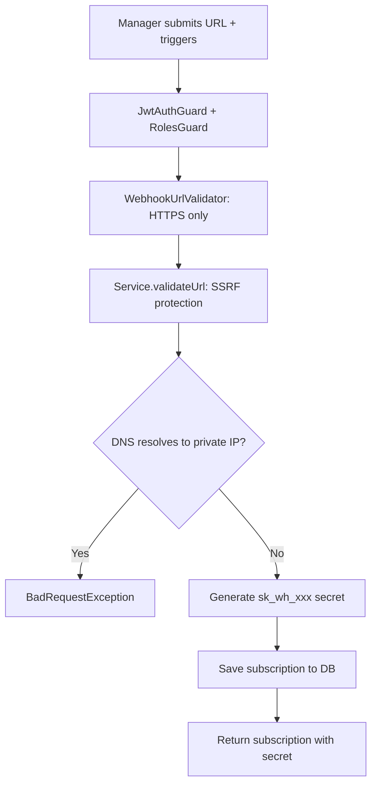
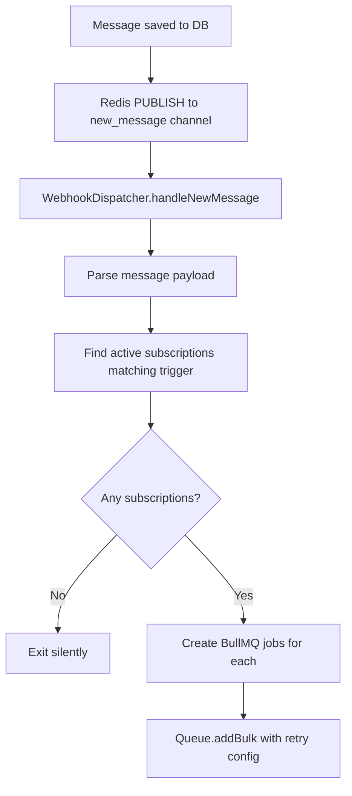
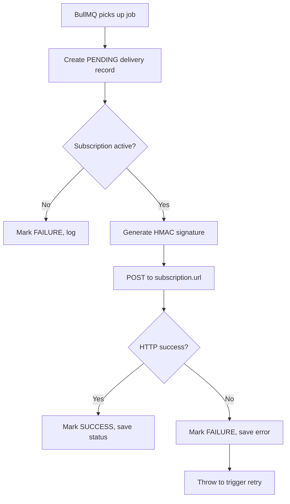
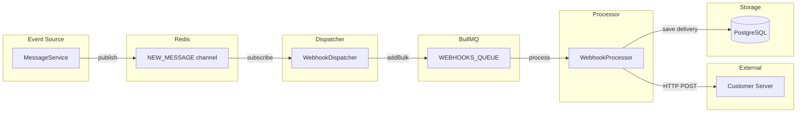

# Feature Investigation: Webhooks

## Overview

Webhooks allow projects to subscribe to events (e.g., `message.created`) and receive HTTP POST notifications when those events occur. The system includes SSRF protection, HMAC signature verification, delivery tracking, and automatic retries via BullMQ.

The architecture consists of:

1. **CRUD API** - Managers create/manage subscriptions
2. **Dispatcher** - Listens to Redis pub/sub and enqueues jobs
3. **Processor** - Executes HTTP deliveries with retries and logging

## Entry Points

| Function/Method  | File                                                                                 | Lines  | Purpose                       |
| :--------------- | :----------------------------------------------------------------------------------- | :----- | :---------------------------- |
| `create()`       | [webhooks.controller.ts](../../packages/backend/src/webhooks/webhooks.controller.ts) | L24-32 | Create webhook subscription   |
| `findAll()`      | [webhooks.controller.ts](../../packages/backend/src/webhooks/webhooks.controller.ts) | L34-38 | List project subscriptions    |
| `delete()`       | [webhooks.controller.ts](../../packages/backend/src/webhooks/webhooks.controller.ts) | L40-45 | Delete subscription           |
| `onModuleInit()` | [webhook.dispatcher.ts](../../packages/backend/src/webhooks/webhook.dispatcher.ts)   | L19-34 | Initialize Redis subscription |
| `process()`      | [webhook.processor.ts](../../packages/backend/src/webhooks/webhook.processor.ts)     | L26-75 | Execute webhook HTTP delivery |

## Execution Flow

### Flow 1: Create Webhook Subscription (`POST /projects/:projectId/webhooks`)



1. **URL Validation (DTO level)**: Only HTTPS allowed (HTTP allowed for localhost in test)
2. **SSRF Protection (Service level)**:
   - Resolves hostname via DNS
   - Blocks loopback, private, uniqueLocal, carrierGradeNat ranges
   - Handles IPv4-mapped IPv6 addresses
3. **Secret Generation**: `sk_wh_` + 24 random bytes (hex)
4. **Audit**: Logged via `@Auditable` decorator

### Flow 2: Webhook Dispatch (On New Message)



1. **Redis Subscription**: Dispatcher subscribes to `NEW_MESSAGE_CHANNEL` on module init
2. **Payload Parsing**: Expects `{ message, tempId, visitorUid, projectId }`
3. **Subscription Matching**: Queries `WebhookSubscription` where `isActive=true` and trigger in `eventTriggers`
4. **Job Creation**: Each subscription gets a BullMQ job with:
   - 5 attempts (3 in test)
   - Exponential backoff starting at 1s
   - `removeOnComplete: true`

### Flow 3: Webhook Delivery (BullMQ Processor)



1. **Delivery Record**: Created with `PENDING` status before HTTP call
2. **HMAC Signature**: `sha256=<hmac>` using subscription secret
3. **HTTP Headers**:
   - `Content-Type: application/json`
   - `X-Hub-Signature-256: sha256=xxx`
   - `User-Agent: LiveChat-Webhooks/1.0`
   - `X-LiveChat-Event: message.created`
4. **Timeout**: 5 seconds hard limit
5. **Retry**: On failure, error is re-thrown to trigger BullMQ retry

## Data Flow



## Interfaces & Abstractions

### Input Types

```typescript
// Create subscription
interface CreateSubscriptionDto {
  url: string; // HTTPS URL (HTTP allowed for localhost in test)
  eventTriggers: string[]; // e.g., ['message.created']
  isActive?: boolean; // Default: true
}
```

### Output Types

```typescript
// Subscription entity
interface WebhookSubscription {
  id: string; // UUID
  projectId: number;
  url: string;
  secret: string; // sk_wh_xxx (shown once on create)
  eventTriggers: string[];
  isActive: boolean;
  createdAt: Date;
}

// Delivery tracking
interface WebhookDelivery {
  id: string;
  subscriptionId: string;
  eventId: string;
  status: "SUCCESS" | "FAILURE" | "PENDING";
  requestPayload: any;
  responseStatus?: number;
  error?: string;
  createdAt: Date;
}
```

### Key Abstractions

| Abstraction         | Location                                                                           | Purpose                    | Key Methods                                          |
| :------------------ | :--------------------------------------------------------------------------------- | :------------------------- | :--------------------------------------------------- |
| `WebhooksService`   | [webhooks.service.ts](../../packages/backend/src/webhooks/webhooks.service.ts)     | CRUD + SSRF validation     | `create()`, `findAll()`, `delete()`, `validateUrl()` |
| `WebhookDispatcher` | [webhook.dispatcher.ts](../../packages/backend/src/webhooks/webhook.dispatcher.ts) | Redis → BullMQ bridge      | `onModuleInit()`, `handleNewMessage()`               |
| `WebhookProcessor`  | [webhook.processor.ts](../../packages/backend/src/webhooks/webhook.processor.ts)   | HTTP delivery with signing | `process()`, `signPayload()`                         |

## Dependencies

### Internal Dependencies

| Dependency                                        | Type           | What It Does                                     |
| :------------------------------------------------ | :------------- | :----------------------------------------------- |
| `WebhooksService.validateUrl()`                   | Core           | DNS lookup + IP range check for SSRF protection  |
| `WebhooksService.findActiveByProjectAndTrigger()` | Core           | Queries subscriptions matching project + trigger |
| `WebhookProcessor.signPayload()`                  | Core           | HMAC-SHA256 signature: `sha256={hex}`            |
| `REDIS_SUBSCRIBER_CLIENT`                         | Infrastructure | ioredis client for pub/sub                       |
| `@InjectQueue(WEBHOOKS_QUEUE)`                    | Infrastructure | BullMQ queue for delivery jobs                   |

### External Dependencies

| Dependency            | Type        | Standard Behavior                   |
| :-------------------- | :---------- | :---------------------------------- |
| `axios`               | Third-Party | HTTP POST with timeout              |
| `ipaddr.js`           | Third-Party | IP address parsing + range checking |
| `dns.promises.lookup` | Third-Party | DNS resolution                      |

## Error Handling

| Error                 | When It Occurs                  | How It's Handled                          |
| :-------------------- | :------------------------------ | :---------------------------------------- |
| `BadRequestException` | URL fails SSRF validation       | Returns 400 with message                  |
| `BadRequestException` | DNS resolution fails            | Returns 400: "Could not resolve hostname" |
| Axios timeout         | Target server slow/unresponsive | Delivery marked FAILURE, job retried      |
| HTTP 4xx/5xx          | Target server error response    | Delivery marked FAILURE, job retried      |

## Side Effects

- **Database (PostgreSQL)**:

  - `webhook_subscriptions` table: Create, delete operations
  - `webhook_deliveries` table: Every delivery attempt logged

- **Cache (Redis)**: Subscribes to `NEW_MESSAGE_CHANNEL` pub/sub

- **External APIs**: HTTP POST to customer webhook URLs

- **BullMQ**: Jobs added to `WEBHOOKS_QUEUE`

## Data Lineage (Origin → Destination)

| Data Artifact           | Origin                      | Components in Path              | Final Destination             |
| :---------------------- | :-------------------------- | :------------------------------ | :---------------------------- |
| `CreateSubscriptionDto` | HTTP Request                | Controller → Service            | `webhook_subscriptions` table |
| Message payload         | Redis `NEW_MESSAGE` channel | Dispatcher → BullMQ → Processor | Customer webhook URL          |
| Delivery record         | Processor                   | Process → Repository            | `webhook_deliveries` table    |

### Event Flow (Emitter → Handler)

| Event Name          | Emitted By               | Handled By                    | Purpose              |
| :------------------ | :----------------------- | :---------------------------- | :------------------- |
| Redis `new_message` | MessageService (via pub) | `WebhookDispatcher` (via sub) | Trigger webhook jobs |

### Orphan Audit

> [!NOTE]
> No orphaned events found. Redis pub/sub message is consumed by Dispatcher.

## Configuration

| Config Key | Default | Purpose                                              |
| :--------- | :------ | :--------------------------------------------------- |
| `NODE_ENV` | —       | When `test`, allows HTTP localhost + reduces retries |

## Security Features

### SSRF Protection

```typescript
// Blocked IP ranges:
"loopback"; // 127.0.0.0/8
"private"; // 10.0.0.0/8, 172.16.0.0/12, 192.168.0.0/16
"uniqueLocal"; // fc00::/7
"carrierGradeNat"; // 100.64.0.0/10
```

### Signature Verification

Customers verify webhook authenticity by computing HMAC:

```javascript
// Customer verification code
const crypto = require("crypto");

function verifyWebhook(payload, signature, secret) {
  const expected =
    "sha256=" +
    crypto
      .createHmac("sha256", secret)
      .update(JSON.stringify(payload))
      .digest("hex");
  return crypto.timingSafeEqual(Buffer.from(signature), Buffer.from(expected));
}
```

## Integration Points

### To Create a Webhook

```typescript
await fetch(`/projects/${projectId}/webhooks`, {
  method: "POST",
  headers: {
    Authorization: `Bearer ${accessToken}`,
    "Content-Type": "application/json",
  },
  body: JSON.stringify({
    url: "https://example.com/webhook",
    eventTriggers: ["message.created"],
  }),
});
// Response includes `secret` - save it for verification!
```

### Supported Event Triggers

- `message.created` - New message in a conversation

## Files Investigated

| File                                                                                                          | Lines Read | Key Findings                                 |
| :------------------------------------------------------------------------------------------------------------ | :--------- | :------------------------------------------- |
| [webhooks.controller.ts](../../packages/backend/src/webhooks/webhooks.controller.ts)                          | L1-47      | CRUD endpoints with MANAGER role             |
| [webhooks.service.ts](../../packages/backend/src/webhooks/webhooks.service.ts)                                | L1-99      | SSRF protection, secret generation           |
| [webhook.dispatcher.ts](../../packages/backend/src/webhooks/webhook.dispatcher.ts)                            | L1-84      | Redis sub → BullMQ enqueue                   |
| [webhook.processor.ts](../../packages/backend/src/webhooks/webhook.processor.ts)                              | L1-83      | HTTP delivery with HMAC + retries            |
| [webhook-subscription.entity.ts](../../packages/backend/src/webhooks/entities/webhook-subscription.entity.ts) | L1-27      | Entity structure                             |
| [webhook-delivery.entity.ts](../../packages/backend/src/webhooks/entities/webhook-delivery.entity.ts)         | L1-40      | Delivery tracking entity                     |
| [create-subscription.dto.ts](../../packages/backend/src/webhooks/dto/create-subscription.dto.ts)              | L1-48      | URL validator with test environment handling |
