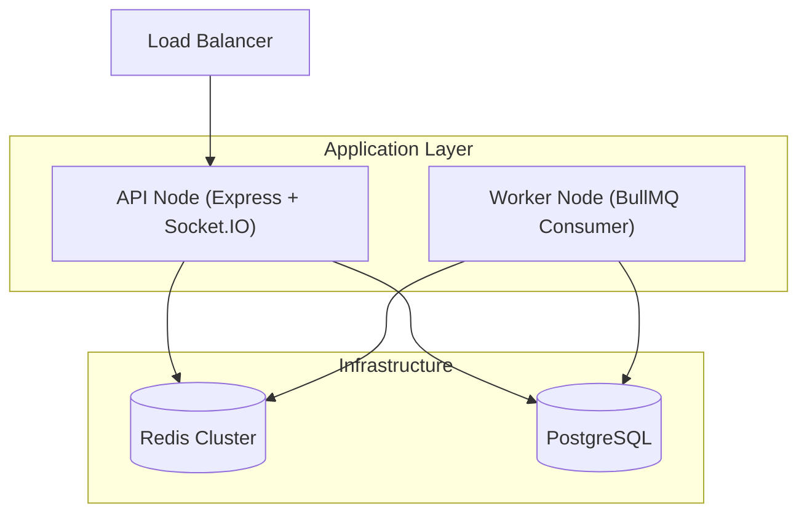

# System Architecture

## 1. High-Level Topology: Split-Process Monolith

The Live Chat system is architected as a **Split-Process Monolith**. While the codebase resides in a single repository (Monorepo), the runtime is divided into two distinct node types to separate concerns and ensure scalability.

### 1.1 API Node (`src/main.ts`)

- **Role**: Handles HTTP requests (REST) and Real-time connections (WebSockets).
- **Responsibilities**:
  - Authentication & Authorization (Guards).
  - Request Validation (DTOs).
  - Real-time Gateway (Socket.IO).
  - Read-heavy operations.
  - **Ingestion**: Pushes heavy write operations (e.g., Visitor Messages) to the Job Queue.

### 1.2 Worker Node (`src/worker.ts`)

- **Role**: Background processing.
- **Responsibilities**:
  - Consumes jobs from `live-chat-events-queue`.
  - Executes heavy database transactions (Persistence).
  - Handles "Fan-out" logic for notifications.
  - Ensures data consistency via the Transactional Outbox pattern.

---

## 2. The Multi-Role Redis Backbone

Redis is the central nervous system of this architecture, serving five distinct architectural roles. It is critical that the Redis instance is highly available.

| Role                     | Module/Service           | Description                                                                                                |
| :----------------------- | :----------------------- | :--------------------------------------------------------------------------------------------------------- |
| **1. WebSocket Adapter** | `RedisIoAdapter`         | Enables horizontal scaling of WebSocket servers. Broadcasts events across multiple API nodes.              |
| **2. Pub/Sub Bus**       | `RedisModule`            | Dedicated `PUBLISHER` and `SUBSCRIBER` clients for inter-service communication (e.g., Outbox events).      |
| **3. Job Queue**         | `BullModule`             | Backing store for `live-chat-events-queue`. Persists jobs for the Worker node.                             |
| **4. Ephemeral State**   | `RealtimeSessionService` | Stores transient data like `visitorUid` -> `socketId` mappings and Visitor "Current URL" navigation state. |
| **5. Application Cache** | `CacheModule`            | Caches expensive read operations (e.g., Screenshot generation results).                                    |

---

## 3. Project-Based Multi-Tenancy

The system enforces strict **Project-Based Multi-Tenancy**. The `Project` entity acts as the root aggregate for isolation.

### 3.1 Data Model

- **Root**: `Project` (ID: Integer).
- **Isolation**: All operational entities (`Conversation`, `Message`, `Visitor`) have a foreign key to `Project`.
- **Cascade Policy**: `onDelete: "CASCADE"` is set on Project relations. Deleting a project physically wipes all associated data.

### 3.2 Access Control (RBAC)

Access is controlled via a dual-layer RBAC system:

1.  **Global Scope**: `GlobalRole` (ADMIN vs USER). Controls system-level access.
2.  **Project Scope**: `ProjectRole` (MANAGER vs AGENT). Controls resource-level access within a specific tenant.

**Resolution Logic**:
The `RolesGuard` dynamically resolves permissions based on the route context. If a route contains `:projectId`, it enforces Project Roles. If not, it falls back to Global Roles.

---

## 4. Hybrid State Model

The system utilizes a **Hybrid State Architecture** where persistent data is stored in PostgreSQL, but high-frequency ephemeral data is stored exclusively in Redis.

- **Persistent**: User accounts, Project settings, Message history.
- **Ephemeral**: Visitor "Presence" (Online status), Current URL navigation.

**Hydration Pattern**:
When fetching a list of conversations (`ConversationService.listByProject`), the system performs a "Hydration" step:

1.  Query PostgreSQL for conversations.
2.  Extract Visitor UIDs.
3.  Perform a Redis `MGET` (Multi-Get) to fetch the `currentUrl` for all visitors in parallel.
4.  Merge the data before returning the response to the frontend.