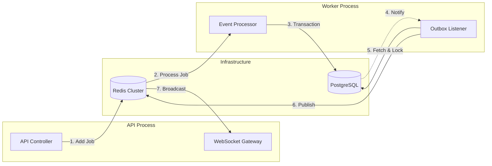

# Backend Event Worker & Transactional Outbox

## 1. Overview

The backend employs a **Split-Process Architecture** to decouple high-throughput ingestion (API) from heavy business logic and persistence (Worker). This ensures that the API remains responsive while complex operations—such as message persistence, visitor identification, and third-party integrations—are handled asynchronously.

To guarantee data consistency between the primary database (PostgreSQL) and the realtime broadcasting layer (Redis Pub/Sub -> WebSockets), the system implements the **Transactional Outbox Pattern**.

## 2. High-Level Architecture

The system consists of two distinct Node.js processes sharing the same database and Redis cluster:

1.  **API Server (`main.ts`)**: Handles HTTP requests and WebSocket connections. Acts as the **Producer**.
2.  **Worker Server (`worker.ts`)**: Consumes background jobs. Acts as the **Consumer** and **Relay**.



## 3. Data Flow Lifecycle

### Phase 1: Ingestion (Producer)
1.  **Trigger**: A visitor sends a message via the WebSocket or HTTP API.
2.  **Action**: The `InboxEventHandler` or Controller calls `BullMqProducerService`.
3.  **Queueing**: A job is added to the `live-chat-events-queue` in Redis.
4.  **Response**: The API responds immediately to the client (Optimistic UI), acknowledging receipt.

### Phase 2: Processing (Consumer)
1.  **Consumption**: The `EventProcessor` (Worker Host) picks up the job.
2.  **Routing**: The job is delegated to `EventConsumerService.processEvent`.
3.  **Transaction**: A single ACID transaction is opened (`entityManager.transaction`).
    *   **Step A**: Find or Create `Visitor` entity.
    *   **Step B**: Find or Create `Conversation` entity.
    *   **Step C**: Persist `Message` entity.
    *   **Step D**: Insert `OutboxEvent` entity.
4.  **Commit**: The transaction commits. If any step fails, the entire operation rolls back, ensuring no "ghost messages" exist without corresponding events.

### Phase 3: The Outbox Relay
1.  **Signaling**: The database commit triggers a `NOTIFY outbox_channel` signal (via DB trigger) OR the `OutboxListenerService` wakes up via its polling interval (60s fallback).
2.  **Locking**: `OutboxListenerService` queries for unprocessed events using `FOR UPDATE SKIP LOCKED`.
3.  **Publishing**: The service publishes the event payload to the `NEW_MESSAGE_CHANNEL` in Redis.
4.  **Cleanup**: Successfully published events are deleted from the `outbox_events` table.

### Phase 4: Broadcasting
1.  **Subscription**: The API Server's `InboxEventHandler` subscribes to `NEW_MESSAGE_CHANNEL`.
2.  **Emission**: The event is forwarded to the `EventsGateway`, which broadcasts it to relevant WebSocket rooms (e.g., `project:{id}`).

## 4. Transactional Outbox Pattern

The core reliability mechanism is implemented in `EventConsumerService` and `OutboxPersistenceService`.

### Why it's needed
Without this pattern, a "Dual Write" problem exists:
*   *Scenario*: We save the message to DB but fail to publish to Redis (process crash).
*   *Result*: The message exists in history but never appears on the Agent's dashboard in realtime.

### Implementation Details

**Entity Definition (`OutboxEvent`)**:
```typescript
@Entity('outbox_events')
export class OutboxEvent {
  @PrimaryGeneratedColumn('uuid') id: string;
  @Column() aggregateType: string; // e.g., 'message'
  @Column() aggregateId: string;   // e.g., message.id
  @Column() eventType: string;     // e.g., 'NEW_MESSAGE_FROM_VISITOR'
  @Column({ type: 'jsonb' }) payload: Record<string, unknown>;
}
```

**Atomic Write (`EventConsumerService`)**:
```typescript
await this.entityManager.transaction(async (manager) => {
  // 1. Save Business Data
  const savedMessage = await this.messagePersistenceService.createMessage(..., manager);
  
  // 2. Save Outbox Event (Same Transaction Manager)
  await this.outboxPersistenceService.createEvent(
    'message',
    savedMessage.id,
    WorkerEventTypes.NEW_MESSAGE_FROM_VISITOR,
    { ...payload },
    manager
  );
});
```

## 5. Outbox Listener Service

The `OutboxListenerService` is a specialized component responsible for the "Relay" phase.

### Dedicated PostgreSQL Client
Unlike the rest of the application which uses TypeORM's connection pool, this service instantiates a **dedicated raw `pg` Client**.
*   **Reason**: The `LISTEN` command blocks the connection waiting for notifications. Using a pool connection would exhaust the pool.
*   **Lifecycle**: Connected on `onModuleInit`, closed on `onModuleDestroy`.

### Concurrency Strategy (`SKIP LOCKED`)
To allow multiple Worker instances to run simultaneously without processing the same event twice, the service uses a specific SQL locking strategy:

```sql
SELECT * FROM outbox_events 
ORDER BY created_at ASC 
LIMIT 100 
FOR UPDATE SKIP LOCKED
```

*   **FOR UPDATE**: Locks the selected rows.
*   **SKIP LOCKED**: If Row A is locked by Worker 1, Worker 2 skips it and locks Row B.
*   **Result**: High throughput parallel processing with zero contention errors.

## 6. Infrastructure & Configuration

### Dependencies
*   **Redis**:
    *   **Role 1**: BullMQ Job Store.
    *   **Role 2**: Pub/Sub Message Bus (`new_message_channel`).
*   **PostgreSQL**:
    *   **Role 1**: Persistent storage for Entities.
    *   **Role 2**: Outbox Queue (`outbox_events` table).
    *   **Role 3**: Signaling Channel (`outbox_channel`).

### Key Constants (`common/constants.ts`)
| Constant | Value | Description |
| :--- | :--- | :--- |
| `LIVE_CHAT_EVENTS_QUEUE` | `live-chat-events-queue` | BullMQ Queue Name |
| `OUTBOX_CHANNEL` | `outbox_channel` | PostgreSQL LISTEN/NOTIFY Channel |
| `NEW_MESSAGE_CHANNEL` | `new_message_channel` | Redis Pub/Sub Channel |

### Environment Variables
The worker requires the same database configuration as the API:
*   `PSQL_HOST`, `PSQL_PORT`, `PSQL_USER`, `PSQL_PASSWORD`, `PSQL_DATABASE`
*   `REDIS_HOST`, `REDIS_PORT`
