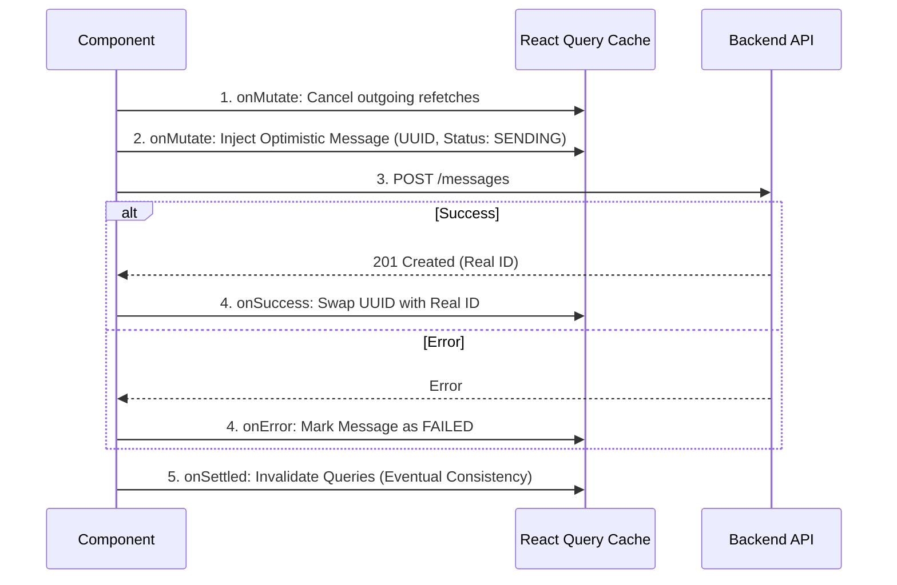
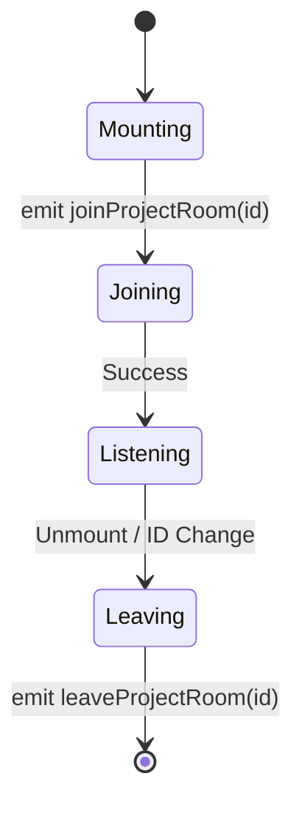

# Inbox Engine & Optimistic UI Architecture

## 1. Overview
The Inbox Engine is the core frontend subsystem responsible for managing real-time conversations between Agents and Visitors. It is designed to provide a "zero-latency" feel for agents through aggressive **Optimistic UI** patterns, while maintaining data consistency via **Real-time Cache Hydration** and **Infinite Scroll Pagination**.

## 2. Optimistic UI Strategy
To ensure the interface feels responsive, the system updates the UI immediately when an agent sends a message, without waiting for the server response. This logic is encapsulated in the `useSendAgentReply` hook within `packages/frontend/src/services/inboxApi.ts`.

### Mutation Lifecycle
The mutation follows a strict `onMutate` -> `onSuccess` / `onError` -> `onSettled` lifecycle managed by TanStack Query.



### Implementation Details

1.  **Cache Injection (`onMutate`)**:
    *   A temporary ID is generated using `uuidv4()`.
    *   A message object is constructed with `status: MessageStatus.SENDING`.
    *   `queryClient.setQueryData` is used to append this message to the `['messages', conversationId]` cache key immediately.
    *   **Return Value**: The context returns `{ optimisticMessageId }` to allow reconciliation later.

2.  **Reconciliation (`onSuccess`)**:
    *   The hook receives the actual `Message` entity from the backend.
    *   It iterates through the cache, finding the message with the `optimisticMessageId` and replacing it entirely with the server response. This ensures the ID is updated for subsequent interactions (e.g., editing/deleting).

3.  **Rollback (`onError`)**:
    *   If the API call fails, the message is **not removed**. Instead, its status is updated to `MessageStatus.FAILED`.
    *   This allows the UI to display a "Retry" button (future implementation) rather than silently losing the user's input.

## 3. Real-time Cache Hydration
The `SocketContext.tsx` acts as a bridge between the WebSocket layer and the React Query cache. It ingests events and surgically mutates the cache to reflect state changes without triggering full network refetches.

### Event Handlers

#### `handleNewMessage`
Triggered by `newMessage` or `agentReplied` events.
*   **Logic**: Appends the incoming message to the specific conversation's message list.
*   **Read Receipt**: If the message belongs to the *currently open* conversation (determined by URL matching), the client immediately fires an API call to mark it as read.
*   **List Invalidation**: It invalidates `['conversations', projectId]` to ensure the "Last Message" snippet and "Unread Count" in the sidebar are updated.

#### `handleVisitorContextUpdated`
Triggered when a visitor navigates to a new URL on the widget side.
*   **Challenge**: The conversation list is paginated (Infinite Query). The specific conversation object might be buried deep within `pages[2].data[4]`.
*   **Strategy**: Performs a **Deep Cache Update**. It iterates through every page in the `['conversations']` query data, finds the matching conversation ID, and updates `visitor.currentUrl`.
*   **Benefit**: This updates the UI (e.g., "Viewing: /pricing") instantly without re-fetching the entire conversation list, preserving the agent's scroll position.

```typescript
// Conceptual Logic in SocketContext.tsx
queryClient.setQueriesData({ queryKey: ["conversations"] }, (oldData) => {
  return {
    ...oldData,
    pages: oldData.pages.map((page) => ({
      ...page,
      data: page.data.map((conv) => 
        conv.id === payload.conversationId 
          ? { ...conv, visitor: { ...conv.visitor, currentUrl: payload.currentUrl } }
          : conv
      ),
    })),
  };
});
```

## 4. Infinite Scroll & Pagination
The conversation list (`ConversationList.tsx`) handles potentially thousands of conversations using an **Infinite Scroll** pattern backed by `useInfiniteQuery`.

### Architecture
*   **Hook**: `useGetConversations` in `inboxApi.ts`.
*   **Key**: `['conversations', projectId, filters]`.
*   **Next Page Logic**:
    ```typescript
    getNextPageParam: (lastPage) => {
      const hasMore = lastPage.page * lastPage.limit < lastPage.total;
      return hasMore ? lastPage.page + 1 : undefined;
    }
    ```

### UI Implementation
*   **Flattening**: The component flattens the array of pages into a single list: `data?.pages.flatMap((page) => page.data)`.
*   **Trigger**: A manual "Load More" button is rendered at the bottom of the list if `hasNextPage` is true.
    *   *Note*: While currently manual, this can be easily converted to an Intersection Observer for automatic loading.

## 5. Socket Room Lifecycle
Real-time events are scoped to **Projects** to ensure multi-tenant security and reduce bandwidth. This scoping is managed by `InboxLayout.tsx`.

### The `project:{id}` Room
*   **Join**: When the `InboxLayout` mounts or the `projectId` URL parameter changes, the client emits `joinProjectRoom` with `{ projectId }`.
*   **Leave**: When the component unmounts or the project changes, the cleanup function emits `leaveProjectRoom`.

### Implication
Components nested within `InboxLayout` (like `ConversationList` and `MessagePane`) assume the socket is already joined to the correct room. If these components are used outside this layout, real-time updates will fail silently.


