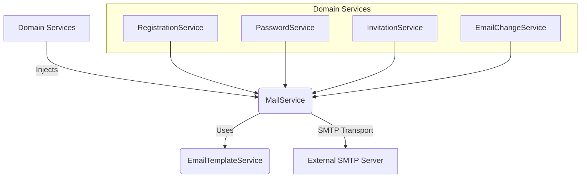
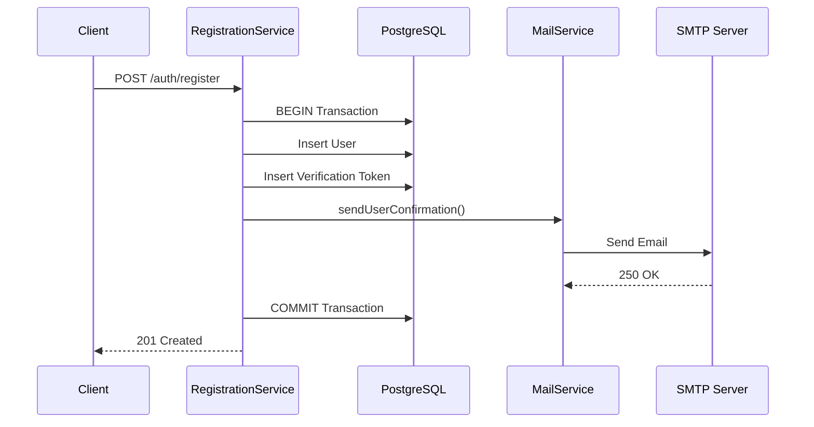

# Mail Service & Notifications

## 1. Overview

The **Mail Service** is a core infrastructure module responsible for delivering transactional emails to users. It handles user onboarding, security notifications, and project invitations.

Unlike the Event Worker system, the Mail Service currently operates **synchronously**. It is directly invoked by domain services during the execution of business logic, often within database transactions.

## 2. Architecture

The module is built on top of **Nodemailer**, utilizing standard SMTP transport.

### 2.1 Component Topology



### 2.2 Transport Configuration
The service initializes a singleton `nodemailer.Transporter` using the SMTP configuration provided in the environment variables. Connection pooling is managed implicitly by Nodemailer's transport mechanism.

## 3. Configuration

The service requires the following environment variables to be defined in `.env`.

| Variable | Description | Example | Required |
| :--- | :--- | :--- | :--- |
| `MAIL_HOST` | SMTP Server Hostname | `smtp.gmail.com` | Yes |
| `MAIL_PORT` | SMTP Port | `465` (SSL) or `587` (TLS) | Yes |
| `MAIL_SECURE` | Use SSL/TLS | `true` or `false` | Yes |
| `MAIL_USER` | SMTP Username | `user@example.com` | Yes |
| `MAIL_APP_PASSWORD` | SMTP Password / App Password | `xxxx-xxxx-xxxx-xxxx` | Yes |
| `FRONTEND_URL` | Base URL for client links | `https://app.example.com` | Yes |
| `API_BASE_URL` | Base URL for API links | `https://api.example.com` | Yes |

> **Note:** For Gmail, you must use an **App Password** if 2-Step Verification is enabled.

## 4. Email Templates

Templates are managed by `EmailTemplateService`. Currently, templates are **hardcoded HTML strings** within the service code. They support dynamic data injection via template literals.

### 4.1 Available Templates

| Template Name | Context | Data Required | Description |
| :--- | :--- | :--- | :--- |
| **User Confirmation** | Registration | `User`, `token` | Sent after signup. Contains a link to `/verify-email`. |
| **Password Reset** | Forgot Password | `User`, `token` | Sent upon request. Contains a link to `/reset-password`. |
| **Invitation** | Project Invite | `Invitation`, `Project`, `User?` | Sent to invitees. Adapts content based on whether the user already exists or needs to register. |
| **Email Change Verify** | Security | `User`, `newEmail`, `token` | Sent to the **new** email address to verify ownership. |
| **Email Change Notify** | Security | `User`, `newEmail` | Sent to the **old** email address to warn about the requested change. |
| **Email Change Confirm** | Security | `oldEmail`, `newEmail`, `userName` | Sent to the **old** email address confirming the change was successful. |

### 4.2 Deep Linking Strategy
Templates rely on `ConfigService` to construct deep links.
*   **Frontend Links**: Used for user actions (e.g., `${FRONTEND_URL}/verify-email?token=...`).
*   **API Links**: Used for direct verification (rare, mostly handled via frontend redirection).

## 5. Integration Patterns & Flow

### 5.1 Synchronous Execution Model
Emails are sent **inline** with the HTTP request. This has critical implications for latency and reliability.

**Example: Registration Flow**


### 5.2 Transactional Coupling
In services like `RegistrationService` and `InvitationService`, the email sending logic occurs **inside** the database transaction.

*   **Failure Scenario**: If `MailService.sendMail` throws an error (e.g., SMTP timeout, auth failure), the **entire transaction rolls back**. The user is not created, and the client receives an error.
*   **Benefit**: Ensures data consistency. We never have a "ghost user" who exists in the DB but never received a verification email.
*   **Risk**: High latency from the SMTP server directly impacts the API response time.

## 6. Usage Guide

### Injecting the Service
To use email capabilities in a new module, import `MailModule` and inject `MailService`.

```typescript
// my.module.ts
import { Module } from '@nestjs/common';
import { MailModule } from '../mail/mail.module';
import { MyService } from './my.service';

@Module({
  imports: [MailModule], // Import the module
  providers: [MyService],
})
export class MyModule {}

// my.service.ts
import { Injectable } from '@nestjs/common';
import { MailService } from '../mail/mail.service';

@Injectable()
export class MyService {
  constructor(private readonly mailService: MailService) {}

  async doWork() {
    // ... logic ...
    await this.mailService.sendMail('user@example.com', 'Subject', '<p>Body</p>');
  }
}
```

## 7. Future Improvements (Technical Debt)

1.  **Asynchronous Queueing**: Move email sending to `BullMQ` (similar to `EventConsumer`) to decouple SMTP latency from the HTTP response.
2.  **Template Externalization**: Move HTML strings to `.hbs` or `.ejs` files to separate content from logic.
3.  **Resilience**: Implement retry logic for SMTP failures (currently, a failure fails the request).
