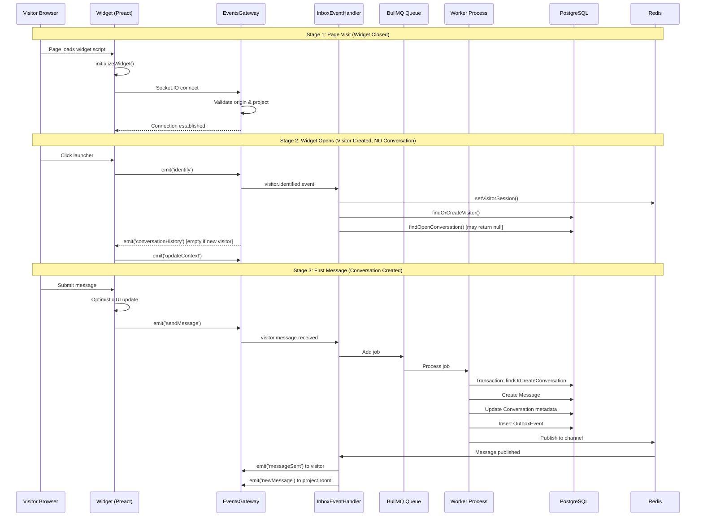

# Visitor Lifecycle: Widget Signal Flow & Backend Handling

This document describes the complete flow of signals between the widget (frontend) and backend when a new visitor interacts with the live chat system.

## Overview

The visitor lifecycle consists of three main stages:
1. **Page Visit** - Widget loads but remains closed
2. **Widget Open** - Visitor identity is established (Visitor record created)
3. **First Message** - Conversation is created and becomes active

> [!IMPORTANT]
> **Lazy Conversation Creation**: Conversations are only created when the visitor sends their first message, NOT when the widget is opened. This prevents "ghost" conversations (empty conversations with no messages) from cluttering the agent inbox.



---

## Design Rationale: Lazy Conversation Creation

### Problem with Eager Creation

If conversations were created when the widget opens (eager creation), the system would create "ghost" conversations:

| Scenario | With Eager Creation | With Lazy Creation |
|----------|---------------------|-------------------|
| Visitor opens widget, sends message | 1 conversation ✅ | 1 conversation ✅ |
| Visitor opens widget, closes without sending | 1 empty conversation ❌ | 0 conversations ✅ |
| 100 visitors browse, 10 chat | 100 conversations (90 empty) ❌ | 10 conversations ✅ |

### Benefits of Lazy Creation

1. **Clean Inbox** - Agents only see meaningful conversations
2. **Accurate Metrics** - Conversation count reflects actual interactions
3. **Efficient Storage** - No wasted database records
4. **Industry Standard** - Matches behavior of Intercom, Zendesk, etc.

---

## Stage 1: Visit Website (Widget Closed)

### What Happens

When a visitor lands on a page with the widget script, the widget initializes but does **not** create any database records until the widget is opened.

### Widget (Frontend) Flow

```
main.tsx:initializeWidget()
  ├── Fetch widget settings from backend
  ├── Generate/retrieve visitor_uid from localStorage
  ├── Call socketService.connect(projectId, visitorUid)
  └── Render widget (closed by default)
```

**Key Files:**
- [`packages/frontend/src/widget/main.tsx`](file:///home/hoang/node/packages/frontend/src/widget/main.tsx) - Widget initialization
- [`packages/frontend/src/widget/services/socketService.ts`](file:///home/hoang/node/packages/frontend/src/widget/services/socketService.ts) - Socket connection

### Backend Flow

```
EventsGateway.handleConnection()
  ├── Validate authToken (if agent) OR
  ├── Validate origin against project.whitelistedDomains
  └── Allow connection (no DB writes yet)
```

**Key Files:**
- [`packages/backend/src/gateway/events.gateway.ts`](file:///home/hoang/node/packages/backend/src/gateway/events.gateway.ts#L81-L173) - Connection handling

### Database State

| Entity | Status |
|--------|--------|
| Visitor | **Not created** |
| Conversation | **Not created** |
| Session (Redis) | **Not created** |

> [!NOTE]
> At this stage, the visitor only exists as a UUID in the browser's localStorage. No server-side record exists.

---

## Stage 2: Open Widget (Visitor Created, Conversation NOT Created)

### What Happens

When the visitor clicks the launcher to open the chat window, the widget sends an `identify` event that triggers **Visitor** creation only. **Conversation is NOT created yet.**

### Widget (Frontend) Flow

```
App.tsx: useEffect[isWindowOpen]
  ├── Check: isWindowOpen && widgetConfig && connectionStatus === 'connected'
  ├── socketService.emitIdentify(projectId, visitorUid)
  └── socketService.emitUpdateContext(currentUrl)
```

**Relevant Code** ([App.tsx:85-97](file:///home/hoang/node/packages/frontend/src/widget/App.tsx#L85-L97)):
```typescript
useEffect(() => {
  if (isWindowOpen && widgetConfig && connectionStatus === 'connected') {
    const visitorUid = localStorage.getItem("visitor_uid");
    if (visitorUid) {
      socketService.emitIdentify(widgetConfig.projectId, visitorUid);
      socketService.emitUpdateContext(window.location.href);
    }
  }
}, [isWindowOpen, widgetConfig, connectionStatus]);
```

### Backend Flow

```
EventsGateway.handleIdentify()
  └── eventEmitter.emit('visitor.identified', event)
        │
        ▼
InboxEventHandlerService.handleVisitorIdentified()
  ├── realtimeSessionService.setVisitorSession(visitorUid, socketId)  [Redis]
  │
  ├── [TRANSACTION START]
  │   ├── visitorService.findOrCreateByUid(projectId, visitorUid)
  │   │     └── Creates Visitor if not exists
  │   │
  │   └── conversationService.findOpenByVisitorId()
  │         └── Finds existing OPEN conversation (returns null if none)
  │         └── Does NOT create new conversation
  │
  ├── [TRANSACTION COMMIT]
  │
  └── eventsGateway.prepareSocketForVisitor()
        ├── Set socket.data.{projectId, visitorUid, visitorId}
        ├── Set socket.data.conversationId (if existing conversation found)
        └── emit('conversationHistory', { messages })  [empty if new visitor]
```

**Key Files:**
- [`packages/backend/src/inbox/inbox-event.handler.ts`](file:///home/hoang/node/packages/backend/src/inbox/inbox-event.handler.ts#L78-L114) - Event handler
- [`packages/backend/src/inbox/services/persistence/visitor.persistence.service.ts`](file:///home/hoang/node/packages/backend/src/inbox/services/persistence/visitor.persistence.service.ts) - Visitor creation
- [`packages/backend/src/inbox/services/conversation.service.ts`](file:///home/hoang/node/packages/backend/src/inbox/services/conversation.service.ts) - Conversation lookup (NOT creation)

### Database State

| Entity | Status | Fields |
|--------|--------|--------|
| Visitor | **Created** | `visitorUid`, `displayName: "Visitor #xxxxxx"`, `lastSeenAt` |
| Conversation | **NOT created** | - |
| Messages | N/A | - |
| Session (Redis) | **Created** | `session:visitor:{uid}` → `socketId` |

### Socket Data After Identification

```typescript
socket.data = {
  projectId: number,
  visitorUid: string,
  visitorId: number,
  conversationId: number | undefined  // undefined if no existing conversation
}
```

> [!TIP]
> If the visitor is returning and has an existing open conversation, that conversation is loaded. If the visitor is new or all previous conversations are closed, `conversationId` will be undefined until they send a message.

---

## Stage 3: Send First Message (Conversation Created)

### What Happens

When the visitor submits their first message, it triggers conversation creation (if needed) plus the full message processing pipeline.

### Widget (Frontend) Flow

```
App.tsx:handleSendMessage()
  ├── Generate tempId (UUID)
  ├── Create optimistic message { id: tempId, status: 'sending' }
  ├── addMessage() → Immediate UI update
  └── socketService.emitSendMessage(content, tempId)
```

**Relevant Code** ([App.tsx:106-121](file:///home/hoang/node/packages/frontend/src/widget/App.tsx#L106-L121)):
```typescript
const handleSendMessage = useCallback((content: string) => {
  const tempId = crypto.randomUUID();
  const optimisticMessage: Message = {
    id: tempId,
    content,
    sender: { type: "visitor" },
    status: MessageStatus.SENDING,
    timestamp: new Date().toISOString(),
  };
  addMessage(optimisticMessage);
  socketService.emitSendMessage(content, tempId);
}, [addMessage]);
```

### Backend Flow (API Server)

```
EventsGateway.handleSendMessage()
  ├── Validate: client.data.visitorUid && client.data.projectId
  └── eventEmitter.emit('visitor.message.received', event)
        │
        ▼
InboxEventHandlerService.handleVisitorMessageReceived()
  ├── realtimeSessionService.setVisitorSession()  [Refresh Redis TTL]
  └── bullMqProducerService.sendMessage(eventPayload)  [Add to queue]
```

### Backend Flow (Worker Process)

```
EventConsumerService.handleNewMessageFromVisitor()
  │
  ├── [TRANSACTION START]
  │   ├── visitorPersistenceService.findOrCreateByUid()
  │   │     └── Get existing Visitor, update lastSeenAt
  │   │
  │   ├── conversationPersistenceService.findOrCreateByVisitorId()
  │   │     └── Find existing OR CREATE NEW Conversation
  │   │     └── This is where Conversation is created for new visitors!
  │   │
  │   ├── messagePersistenceService.createMessage()
  │   │     └── Insert Message record
  │   │
  │   ├── conversationPersistenceService.updateLastMessage()
  │   │     └── Update lastMessageSnippet, lastMessageTimestamp
  │   │     └── Increment unreadCount
  │   │
  │   └── outboxPersistenceService.createEvent()
  │         └── Insert OutboxEvent record
  │
  └── [TRANSACTION COMMIT]
        │
        ▼
OutboxListenerService (pg_notify)
  └── Publish message to Redis channel
        │
        ▼
InboxEventHandlerService.handleRedisMessageReceived()
  ├── emit('messageSent', { tempId, finalMessage }) → to visitor socket
  └── emit('newMessage', message) → to project room (agents)
```

**Key Files:**
- [`packages/backend/src/event-consumer/event-consumer.service.ts`](file:///home/hoang/node/packages/backend/src/event-consumer/event-consumer.service.ts) - Worker message processing
- [`packages/backend/src/inbox/inbox-event.handler.ts`](file:///home/hoang/node/packages/backend/src/inbox/inbox-event.handler.ts#L145-L201) - Redis message handler

### Database State

| Entity | Status | Changes |
|--------|--------|---------|
| Visitor | Updated | `lastSeenAt` refreshed |
| Conversation | **Created** (if new) or Updated | `status: 'open'`, `lastMessageSnippet`, `lastMessageTimestamp`, `unreadCount++`, `lastMessageId` |
| Message | **Created** | `conversationId`, `content`, `fromCustomer: true`, `status: 'sent'` |
| OutboxEvent | Created → Processed | Ensures at-least-once delivery |

### Widget State After Message Sent

When the widget receives the `messageSent` event:

```typescript
// Before (optimistic)
{ id: "temp-uuid", status: "sending", ... }

// After (finalized)
{ id: "db-generated-id", status: "sent", ... }
```

---

## Summary Table

| Stage | Socket Events | DB Entities Created | Redis Keys |
|-------|---------------|---------------------|------------|
| **Visit (closed)** | `connection` | None | None |
| **Open widget** | `identify`, `updateContext` | `Visitor` only | `session:visitor:{uid}` |
| **Send message** | `sendMessage` → `messageSent` | `Conversation`, `Message`, `OutboxEvent` | Session refreshed |

---

## Edge Cases

### Returning Visitor with Existing OPEN Conversation

If a visitor returns and has an existing `OPEN` conversation:
- Stage 2 finds the existing conversation and loads its messages
- Widget displays the full conversation history
- Stage 3 adds new messages to the existing conversation

```
Visitor returns → findOpenByVisitorId() → Found! → Load 15 messages → Widget shows history
```

### Returning Visitor with SOLVED/CLOSED Conversation

> [!IMPORTANT]
> **Current Behavior**: If a visitor's previous conversation was marked as `SOLVED`, `PENDING`, or `SPAM`, they will NOT see their previous messages. The widget will show an empty chat window.

**Flow:**
```
Agent marks conversation as SOLVED
    ↓
Visitor returns, opens widget
    ↓
findOpenByVisitorId() → Query: WHERE status = 'open'
    ↓
No match (status is 'solved') → Returns null
    ↓
Widget receives: { messages: [] }
    ↓
Visitor sees: Empty chat (no history)
```

**Behavior Matrix:**

| Previous Conversation Status | Widget Shows | On First New Message |
|------------------------------|--------------|---------------------|
| `open` | ✅ Full history | Adds to existing conversation |
| `pending` | ❌ Empty | Creates NEW conversation |
| `solved` | ❌ Empty | Creates NEW conversation |
| `spam` | ❌ Empty | Creates NEW conversation |
| None (new visitor) | ❌ Empty | Creates NEW conversation |

**Rationale:** This is a "ticket-based" approach where each solved conversation is treated as a closed ticket. When the visitor returns, they start a fresh conversation rather than continuing the old one.

### Visitor Opens Widget Multiple Times Without Sending

Each widget open will:
- Reuse the existing `Visitor` record (update `lastSeenAt`)
- Find existing open `Conversation` if any
- **NOT create new empty conversations** ✅

### Same Visitor, Multiple Conversations Over Time

A single visitor can have multiple conversations:

```
Timeline:
Day 1: Visitor opens widget, sends message → Conversation #1 created (status: open)
Day 1: Agent resolves issue → Conversation #1 (status: solved)
Day 5: Visitor returns, opens widget → Empty chat (no open conversation)
Day 5: Visitor sends new message → Conversation #2 created (status: open)
```

**Database State:**
```
visitors:
  id: 1, visitorUid: "abc-123", displayName: "Visitor #abc123"

conversations:
  id: 1, visitorId: 1, status: "solved", lastMessageSnippet: "Thanks!"
  id: 2, visitorId: 1, status: "open", lastMessageSnippet: "New question..."
```

---

## Conversation Status Reference

```typescript
enum ConversationStatus {
  OPEN = "open",       // Active conversation, visitor sees history
  PENDING = "pending", // Awaiting response, visitor does NOT see history
  SOLVED = "solved",   // Resolved, visitor does NOT see history
  SPAM = "spam"        // Marked as spam, visitor does NOT see history
}
```

| Status | Agent Can See | Visitor Sees History | New Message Creates |
|--------|---------------|---------------------|---------------------|
| `open` | ✅ In inbox | ✅ Yes | Adds to this conversation |
| `pending` | ✅ In inbox | ❌ No | New conversation |
| `solved` | ✅ In archive | ❌ No | New conversation |
| `spam` | ✅ In spam folder | ❌ No | New conversation |

---

## Agent Dashboard Visibility

The agent dashboard only shows conversations where visitors have sent at least one message:

| Visitor State | Has Visitor Record | Has Conversation | Visible in Dashboard |
|--------------|-------------------|------------------|---------------------|
| Never visited | ❌ No | ❌ No | ❌ No |
| Visited, widget closed | ❌ No | ❌ No | ❌ No |
| Opened widget, no message | ✅ Yes | ❌ No | ❌ No |
| Sent first message | ✅ Yes | ✅ Yes | ✅ Yes |

> [!NOTE]
> There is no "browsing visitors" feature. Agents cannot see visitors who have opened the widget but not yet sent a message. This could be added as a future enhancement.

---

## Related Documentation

- [Event Worker & Transactional Outbox](./EVENT_WORKER_AND_OUTBOX.md)
- [Widget Internals](./WIDGET_INTERNALS.md)
- [WebSocket Events Reference](../packages/shared-types/src/websocket.types.ts)

