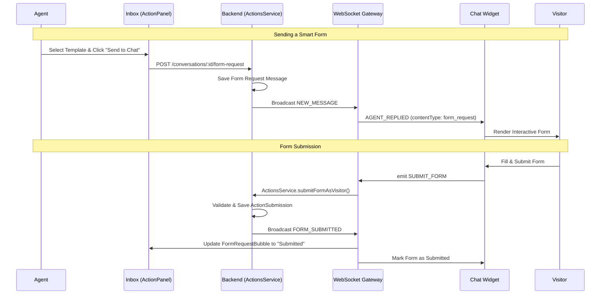

# Architecture: Actions and Smart Forms

## System Diagram

## Components

### ActionPanel
- **Location:** `packages/frontend/src/components/features/actions/ActionPanel.tsx`
- **Purpose:** Interface for agents to interact with form templates and view submission history.
- **Dependencies:** `actionsApi`, `react-hook-form`.

### FormRequestBubble
- **Location:** `packages/frontend/src/components/features/inbox/FormRequestBubble.tsx`
- **Purpose:** Displays a sent form request in the agent's message pane.
- **Features:** Collapsible field preview, real-time status (Pending, Filling, Submitted, Expired).

### FormSubmissionBubble
- **Location:** `packages/frontend/src/components/features/inbox/FormSubmissionBubble.tsx`
- **Purpose:** Displays the data from a completed form submission.

### ActionsService (Backend)
- **Location:** `packages/backend/src/actions/actions.service.ts`
- **Purpose:** Central business logic for creating templates and processing submissions.
- **Validation:** Uses `validateActionData` utility for strict type and required field checking.

### EventsGateway (WebSocket)
- **Location:** `packages/backend/src/gateway/events.gateway.ts`
- **Purpose:** Handles real-time communication between agent dashboard and chat widget.

## Data Flow

### Form Delivery
1.  Agent initiates request via `ActionsController`.
2.  `Message` is created with `contentType: 'form_request'` and template metadata.
3.  WebSocket broadcasts `AGENT_REPLIED` to the visitor's socket.
4.  Widget's `socketService` preserves metadata and updates the local store.

### Form Submission
1.  Widget emits `SUBMIT_FORM` event over WebSocket.
2.  Gateway validates visitor identity and calls `ActionsService`.
3.  `ActionSubmission` is saved with a link to the visitor and the original request message.
4.  `FORM_SUBMITTED` event is broadcasted to update all participants.

## Error Handling
- **Validation Errors**: The `validateActionData` utility ensures all fields match the template definition.
- **Expired Forms**: The `expiresAt` metadata is checked both locally (UI) and on the backend during submission.
- **Permission Errors**: `ProjectService` verifies if an agent has the necessary role to manage templates or if a visitor belongs to the conversation.

## Failure Modes
- **Disconnected Socket**: If a visitor submits while disconnected, the widget shows a "Connection lost" error.
- **Template Modification**: If a template is changed after a form is sent, the submission still validates against the snapshot stored in the message metadata.
