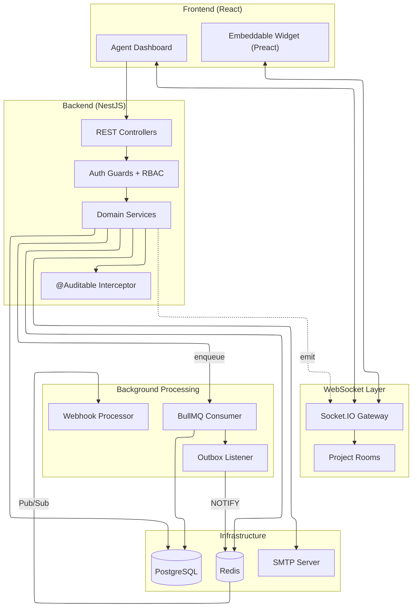

# Architecture Overview

> **Source:** This document synthesizes findings from 17 investigation documents in `docs/deep_investigation/`.

## System Components



## Component Descriptions

### Projects (Multi-Tenancy Core)

The `Project` entity is the root isolation unit. All data (conversations, visitors, messages) is scoped by `projectId`. Access control is enforced via `RolesGuard` which validates `ProjectMember` records with role hierarchy: **MANAGER > AGENT**.

> **Source:** [projects-feature.md](deep_investigation/projects-feature.md) | [project-event-flow.md](deep_investigation/project-event-flow.md)

### Authentication System

Hybrid token model with:

- **Access Tokens:** Short-lived JWTs (validated via `JwtAuthGuard`)
- **Refresh Tokens:** Database-stored with rotation + grace period
- **2FA:** TOTP-based with partial tokens
- **OAuth:** Google provider with automatic account linking/creation

> **Source:** [user-authentication-flow.md](deep_investigation/user-authentication-flow.md)

### WebSocket Gateway

All real-time events are scoped to **Socket.IO rooms** named `project:{id}`. This ensures:

- Agents only receive events for their projects
- Visitors are authenticated via domain whitelisting
- Events broadcast to room members only

> **Source:** [widget_connection_flow.md](deep_investigation/widget_connection_flow.md) | [project-event-flow.md](deep_investigation/project-event-flow.md)

### Inbox Engine

Manages conversations between agents and visitors:

- **Optimistic UI:** Frontend immediately shows messages with `SENDING` status
- **Cursor-based pagination:** For message history
- **Real-time cache hydration:** Socket events update React Query cache directly

> **Source:** [inbox-operations.md](deep_investigation/inbox-operations.md) | [dashboard_to_widget_message_flow.md](deep_investigation/dashboard_to_widget_message_flow.md)

### Background Workers

Heavy operations are offloaded to BullMQ workers:

- **Message persistence:** Visitor messages saved asynchronously
- **Outbox pattern:** Ensures exactly-once event delivery via PostgreSQL NOTIFY
- **Webhook delivery:** HTTP POST with HMAC signatures and retries

> **Source:** [widget_to_dashboard_message_flow.md](deep_investigation/widget_to_dashboard_message_flow.md) | [webhooks-flow.md](deep_investigation/webhooks-flow.md)

## Data Flow Patterns

### 1. Visitor Message → Agent Dashboard

```
Widget → Socket.IO → Gateway → EventEmitter → BullMQ Queue
                                                    ↓
                                              Worker (DB write)
                                                    ↓
                                              Outbox Pattern
                                                    ↓
                                           PG NOTIFY → Redis Pub/Sub
                                                    ↓
                                           Gateway → Dashboard (broadcast)
```

### 2. Agent Reply → Widget

```
Dashboard → REST API → MessageService → PostgreSQL
                            ↓
               Redis lookup (visitor socket)
                            ↓
                      Gateway → Widget
                            ↓
             Broadcast NEW_MESSAGE → other agents
```

### Pattern 3: Lazy Conversation Creation

Conversations are created **only when first message is sent**, not when widget opens. This prevents ghost conversations.

## Key Patterns

| Pattern                   | Where Used            | Purpose                         |
| ------------------------- | --------------------- | ------------------------------- |
| **Transactional Outbox**  | Message processing    | Atomic DB write + event publish |
| **Optimistic UI**         | Agent message sending | Zero-latency feel               |
| **Decorator-based Audit** | `@Auditable`          | Automatic audit logging         |
| **Domain Whitelisting**   | Widget connection     | SSRF protection                 |
| **HMAC Signatures**       | Webhooks              | Verify payload authenticity     |
| **Fail-Open Logging**     | Audit system          | Never block main flow           |

## External Dependencies

| Dependency     | Purpose                          | Used By                      |
| -------------- | -------------------------------- | ---------------------------- |
| **PostgreSQL** | Persistent storage               | All entities                 |
| **Redis**      | Sessions, Pub/Sub, Cache, BullMQ | Gateway, Workers, Cache      |
| **Socket.IO**  | Real-time bidirectional          | Dashboard, Widget            |
| **BullMQ**     | Job queue                        | Message processing, Webhooks |
| **Nodemailer** | SMTP emails                      | Mail Service                 |
| **Puppeteer**  | Screenshots                      | Screenshot Service           |

## Security Considerations

| Feature            | Protection                                      |
| ------------------ | ----------------------------------------------- |
| **Authentication** | JWT + Refresh token rotation + 2FA              |
| **Authorization**  | RolesGuard with project membership validation   |
| **Widget**         | Domain whitelisting + visitor UID               |
| **Screenshots**    | SSRF blocking (private IPs, metadata endpoints) |
| **Webhooks**       | HTTPS-only + SSRF protection + HMAC             |
| **Audit**          | Automatic logging with sensitive data redaction |

## Further Reading

All detailed investigations are located in `docs/deep_investigation/`:

| Area            | Investigation                                                                                                                                                                                                                                  |
| --------------- | ---------------------------------------------------------------------------------------------------------------------------------------------------------------------------------------------------------------------------------------------- |
| Auth            | [user-authentication-flow.md](deep_investigation/user-authentication-flow.md)                                                                                                                                                                  |
| Projects        | [projects-feature.md](deep_investigation/projects-feature.md), [project-event-flow.md](deep_investigation/project-event-flow.md)                                                                                                               |
| Inbox           | [inbox-operations.md](deep_investigation/inbox-operations.md), [conversation-assignments.md](deep_investigation/conversation-assignments.md)                                                                                                   |
| Messaging       | [dashboard_to_widget_message_flow.md](deep_investigation/dashboard_to_widget_message_flow.md), [widget_to_dashboard_message_flow.md](deep_investigation/widget_to_dashboard_message_flow.md)                                                   |
| Widget          | [widget_connection_flow.md](deep_investigation/widget_connection_flow.md), [visitor_session_management.md](deep_investigation/visitor_session_management.md)                                                                                   |
| Features        | [actions_template_flow.md](deep_investigation/actions_template_flow.md), [canned-responses-flow.md](deep_investigation/canned-responses-flow.md), [visitor-notes-flow.md](deep_investigation/visitor-notes-flow.md)                            |
| Infrastructure  | [audit-logs-flow.md](deep_investigation/audit-logs-flow.md), [mail-service.md](deep_investigation/mail-service.md), [screenshot-service.md](deep_investigation/screenshot-service.md), [webhooks-flow.md](deep_investigation/webhooks-flow.md) |
| User Management | [user-profile-settings.md](deep_investigation/user-profile-settings.md)                                                                                                                                                                        |
