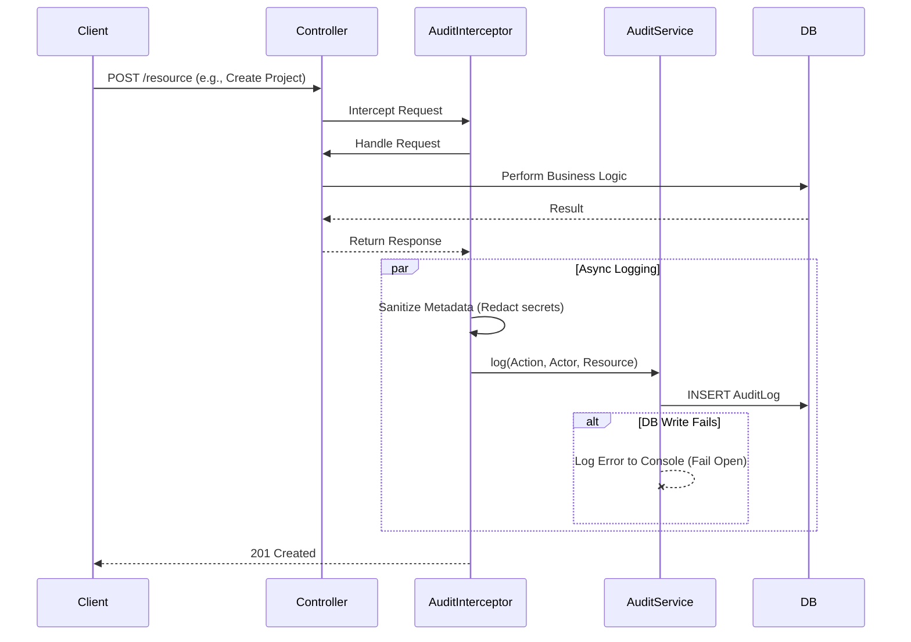

# Architecture: Audit Logging System

## System Diagram



## Components

### AuditService
- **Location:** `packages/backend/src/audit/audit.service.ts`
- **Purpose:** Central API for writing audit logs. Handles "Fail Open" logic and basic validation.
- **Dependencies:** `TypeORM` (Repository).
- **Key Methods:**
    - `log(dto: CreateAuditLogDto)`: Validates metadata serializability and saves the record.

### AuditLoggerInterceptor
- **Location:** `packages/backend/src/audit/audit.interceptor.ts`
- **Purpose:** Automates logging for HTTP endpoints.
- **Dependencies:** `Reflector`, `AuditService`.
- **Configuration:** Uses `@Auditable` decorator to determine `action`, `entity`, and extraction logic.

### Auditable Decorator
- **Location:** `packages/backend/src/audit/auditable.decorator.ts`
- **Purpose:** Metadata storage for audit configuration.
- **Usage:**
  ```typescript
  @Auditable({
    action: AuditAction.UPDATE,
    entity: 'User',
    entityIdExtractor: (res) => res.id
  })
  ```

### Sanitizer Utility
- **Location:** `packages/backend/src/audit/audit.utils.ts`
- **Purpose:** Protects PII and secrets.
- **Logic:** Recursively traverses objects and replaces keys in `DEFAULT_SENSITIVE_KEYS` (e.g., 'password', 'token') with `'[REDACTED]'`.

## Data Model

### AuditLog Entity
- **Table:** `audit_logs`
- **Columns:**
    - `id`: UUID (PK)
    - `actorId`: String (Nullable) - ID of the user performing the action.
    - `actorType`: Enum (`USER`, `SYSTEM`, `API_KEY`)
    - `action`: Enum (`CREATE`, `UPDATE`, `DELETE`, `LOGIN`, ...)
    - `entity`: String - The resource type (e.g., 'Project').
    - `entityId`: String - The specific resource ID.
    - `metadata`: JSONB - Contextual data (diffs, request params).
    - `createdAt`: Timestamp.

## Failure Modes

### Database Down
- **Behavior:** `AuditService` catches the TypeORM error.
- **Outcome:** The error is logged to the server's standard error output (`Logger.error`). The original user request completes successfully.
- **Rationale:** Availability > Audit Completeness for V1.

### Metadata Circular Reference
- **Behavior:** `AuditService` checks `JSON.stringify`.
- **Outcome:** Throws an error before saving, which is caught by the "Fail Open" block.
- **Rationale:** Prevent crashing the DB driver or application with bad objects.

### Sensitive Data Leak
- **Defense:** `sanitizeMetadata` is applied to `request.body` and `response.body` by default in the interceptor.
