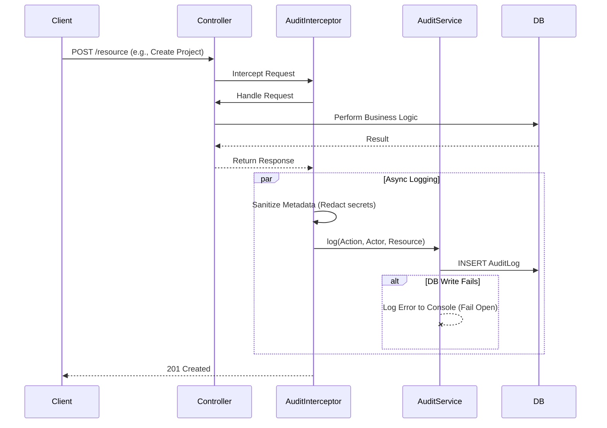
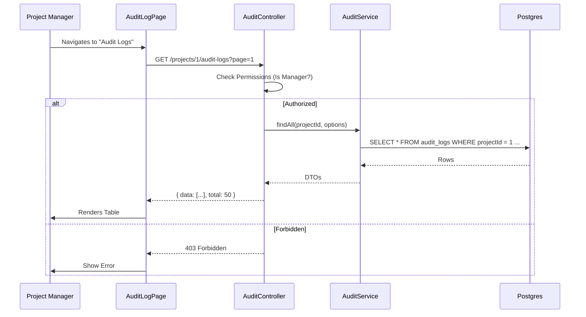

# Architecture: Audit Logging System

## System Diagram (Write Path)

## System Diagram (Read Path)

## Components

### AuditService
- **Location:** `packages/backend/src/audit/audit.service.ts`
- **Purpose:** Central API for writing and reading audit logs.
- **Dependencies:** `TypeORM` (Repository).
- **Key Methods:**
    - `log(dto)`: Validates metadata serializability and saves the record.
    - `findAll(projectId, query)`: Returns paginated logs scoped to a project.

### AuditController
- **Location:** `packages/backend/src/audit/audit.controller.ts`
- **Purpose:** Exposes audit data via REST API.
- **Security:** Protected by `JwtAuthGuard`, `ProjectGuard`, and `RolesGuard(ProjectRole.MANAGER)`.

### AuditLoggerInterceptor
- **Location:** `packages/backend/src/audit/audit.interceptor.ts`
- **Purpose:** Automates logging for HTTP endpoints.
- **Logic:** Extracts `projectId` from route params to ensure logs are correctly scoped.

### Sanitizer Utility
- **Location:** `packages/backend/src/audit/audit.utils.ts`
- **Purpose:** Protects PII and secrets.
- **Logic:** Recursively traverses objects and replaces keys in `DEFAULT_SENSITIVE_KEYS` (e.g., 'password', 'token') with `'[REDACTED]'`.

## Data Model

### AuditLog Entity
- **Table:** `audit_logs`
- **Columns:**
    - `id`: UUID (PK)
    - `projectId`: Integer (Nullable, Indexed) - **New in Slice 3**. Scopes the log to a tenant.
    - `actorId`: String (Nullable) - ID of the user performing the action.
    - `actorType`: Enum (`USER`, `SYSTEM`, `API_KEY`)
    - `action`: Enum (`CREATE`, `UPDATE`, `DELETE`, `LOGIN`, ...)
    - `entity`: String - The resource type (e.g., 'Project').
    - `entityId`: String - The specific resource ID.
    - `metadata`: JSONB - Contextual data (diffs, request params).
    - `createdAt`: Timestamp.

## Failure Modes

### Database Down (Write)
- **Behavior:** `AuditService` catches the TypeORM error.
- **Outcome:** The error is logged to the server's standard error output (`Logger.error`). The original user request completes successfully (Fail Open).

### Sensitive Data Leak
- **Defense:** `sanitizeMetadata` is applied to `request.body` and `response.body` by default in the interceptor.

### Unauthorized Access (Read)
- **Defense:** `AuditController` strictly enforces `ProjectRole.MANAGER`. Agents or unrelated users cannot query the API.