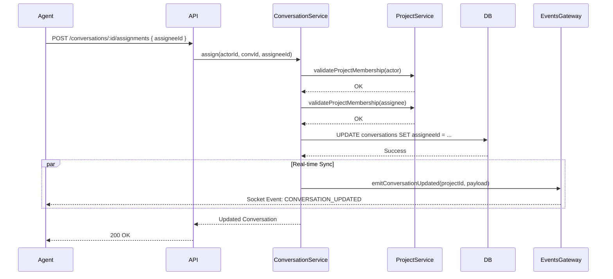

# Architecture: Conversation Assignment

## System Diagram

## Components

### ConversationService
- **Location:** `packages/backend/src/inbox/services/conversation.service.ts`
- **Purpose:** Core business logic for assignments.
- **Dependencies:**
  - `ProjectService`: Used to verify that both the actor (requester) and the target assignee belong to the project.
  - `EventsGateway`: Used to broadcast updates to connected clients.
- **Key Methods:**
  - `assign(actorId, conversationId, assigneeId)`: Validates membership and updates the record.
  - `unassign(actorId, conversationId)`: Removes the current assignee.

### AssignmentsController
- **Location:** `packages/backend/src/inbox/assignments.controller.ts`
- **Purpose:** HTTP interface for assignment operations.
- **Guards:** `JwtAuthGuard` (Requires login).

### Database Schema
- **Entity:** `Conversation` (`packages/backend/src/database/entities/conversation.entity.ts`)
- **Columns:**
  - `assigneeId`: `UUID` (Nullable). Foreign Key to `users.id`.
  - `assignedAt`: `Timestamp` (Nullable). Records when the assignment happened.
- **Constraints:**
  - `ON DELETE SET NULL`: If the assigned User is deleted, the conversation becomes unassigned rather than deleted.

## Data Flow
1.  **Input:** User ID (Assignee) and Conversation ID.
2.  **Processing:** 
    -   Membership checks ensure cross-tenant security (user A cannot assign user B to a conversation in a project user B doesn't belong to).
    -   Transaction ensures atomicity.
3.  **Output:** 
    -   Database is updated.
    -   WebSocket event notifies all peers.

## Error Handling
- **404 Not Found:** If the conversation ID does not exist.
- **403 Forbidden:** If the actor is not a member of the project.
- **400 Bad Request:** If the target assignee is not a member of the project.
