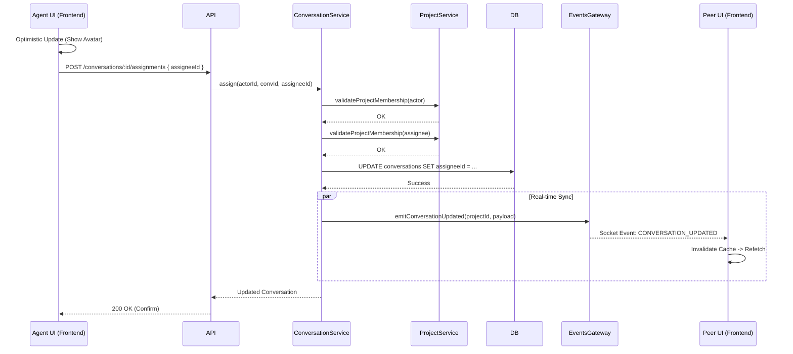

# Architecture: Conversation Assignment

## System Diagram

## Components

### Backend Components

#### ConversationService
- **Location:** `packages/backend/src/inbox/services/conversation.service.ts`
- **Purpose:** Core business logic for assignments.
- **Dependencies:** `ProjectService`, `EventsGateway`.

#### AssignmentsController
- **Location:** `packages/backend/src/inbox/assignments.controller.ts`
- **Purpose:** HTTP interface for assignment operations.

### Frontend Components

#### AssignmentControls
- **Location:** `packages/frontend/src/components/features/inbox/AssignmentControls.tsx`
- **Purpose:** Header widget in the Message Pane.
- **States:**
  - Unassigned: Shows "Assign to Me".
  - Assigned: Shows assignee avatar and "Unassign" option.
- **Interactions:** Triggers `useAssignConversation` and `useUnassignConversation`.

#### ConversationList
- **Location:** `packages/frontend/src/components/features/inbox/ConversationList.tsx`
- **Purpose:** Displays the list of conversations with the assignee's avatar (if any).

#### Inbox API (State Management)
- **Location:** `packages/frontend/src/services/inboxApi.ts`
- **Purpose:** React Query hooks for API interaction.
- **Strategy:** Uses **Optimistic Updates**. When an assignment happens, the cache is manually updated immediately. If the API call fails, it rolls back.

#### SocketContext
- **Location:** `packages/frontend/src/contexts/SocketContext.tsx`
- **Purpose:** Listens for `CONVERSATION_UPDATED`.
- **Action:** Invalidates `['conversations']` queries to ensure all clients have the latest assignment data.

## Data Flow
1.  **Input:** User ID (Assignee) and Conversation ID.
2.  **Processing:** 
    -   Frontend applies optimistic update.
    -   Backend validates membership and persists change.
3.  **Output:** 
    -   Database is updated.
    -   WebSocket event notifies all peers.
    -   Peers refetch data to sync UI.

## Error Handling
- **404 Not Found:** If the conversation ID does not exist.
- **403 Forbidden:** If the actor is not a member of the project.
- **Optimistic Rollback:** If the API fails (e.g., network error), the frontend UI automatically reverts to the previous state.