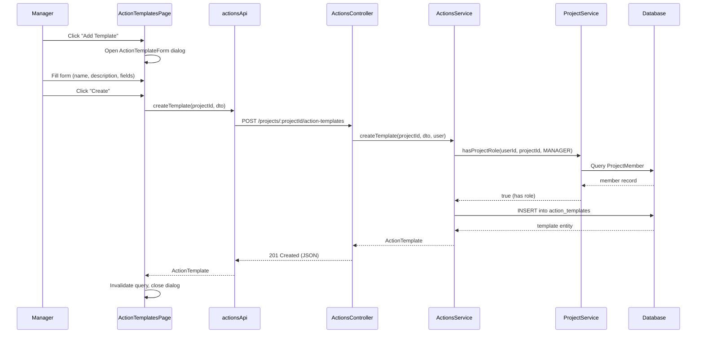
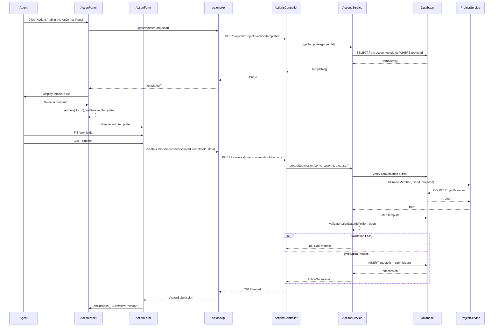
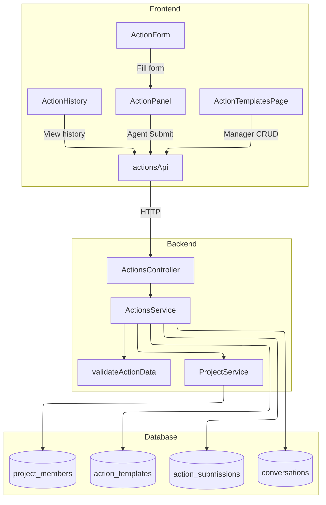

# Feature Investigation: Actions Template Flow (Frontend to Backend)

## Overview

The **Actions Template** feature allows project **Managers** to define reusable form templates (e.g., "Create Order", "Request Refund"), and **Agents** to fill out these forms during conversations with visitors. Each filled form is called a **Submission** and is linked to a specific **Conversation**.

The feature follows a typical CRUD pattern with strict role-based access control:
- **Managers** can create, read, update, delete, and toggle templates.
- **Agents** (and Managers) can create submissions and view submission history for a conversation.

---

## Entry Points

### Frontend Entry Points

| Function/Component         | File                                                                 | Purpose                                                  |
| -------------------------- | -------------------------------------------------------------------- | -------------------------------------------------------- |
| `ActionTemplatesPage`      | `packages/frontend/src/pages/settings/ActionTemplatesPage.tsx`       | Manager-facing page for template CRUD                    |
| `ActionPanel`              | `packages/frontend/src/components/features/actions/ActionPanel.tsx`  | Agent-facing panel in inbox for submitting actions       |
| `actionsApi`               | `packages/frontend/src/services/actionApi.ts`                        | API service layer (axios wrapper)                        |

### Backend Entry Points

| Function/Method          | File                                                              | Purpose                                              |
| ------------------------ | ----------------------------------------------------------------- | ---------------------------------------------------- |
| `ActionsController`      | `packages/backend/src/actions/actions.controller.ts`              | HTTP endpoints for templates and submissions         |
| `ActionsService`         | `packages/backend/src/actions/actions.service.ts`                 | Business logic, validation, and database operations  |

---

## Execution Flow

### Flow 1: Manager Creates a Template



**Step-by-step:**

1. **Manager clicks "Add Template"** in `ActionTemplatesPage`.
   - Sets `showForm = true`, `editingTemplate = null`.
   - Opens `ActionTemplateForm` in a dialog.

2. **Manager fills the form** via `ActionTemplateForm`:
   - Enters `name`, `description`.
   - Uses `ActionFieldEditor` to define fields (key, label, type, required, options).
   - Each field has: `key` (auto-generated from label), `label`, `type` (text/number/date/boolean/select), `required`, `options` (for select).

3. **Manager submits the form**:
   - `ActionTemplateForm.handleSubmit()` validates locally (name required, all fields have key/label).
   - Calls `actionsApi.createTemplate(projectId, { name, description, definition: { fields } })`.

4. **API call to backend**:
   - `POST /projects/:projectId/action-templates`
   - DTO: `CreateActionTemplateDto` with `name`, `description?`, `definition` (validated via `ActionDefinitionDto`).

5. **Backend processes**:
   - `ActionsController.createTemplate()` → `ActionsService.createTemplate()`.
   - **Permission check**: `requireManagerRole()` calls `ProjectService.hasProjectRole(userId, projectId, MANAGER)`.
   - `ProjectService.hasProjectRole()` queries `ProjectMember` table. If `member.role === MANAGER`, returns true.
   - Creates entity via `templatesRepository.create()` and saves.

6. **Response**:
   - Returns saved `ActionTemplate` entity.
   - Frontend invalidates `["actionTemplates", projectId]` query, refreshing the list.

---

### Flow 2: Agent Submits an Action



**Step-by-step:**

1. **Agent opens "Actions" tab**:
   - `VisitorContextPanel` has tabs for "Notes" and "Actions".
   - Clicking "Actions" sets `activeTab = "actions"`, rendering `ActionPanel`.

2. **ActionPanel fetches templates**:
   - `useEffect` calls `loadTemplates()` → `actionsApi.getTemplates(projectId)`.
   - Backend: `GET /projects/:projectId/action-templates` → returns all **non-deleted, enabled** templates.
   - (Note: `getTemplates` returns all templates; filtering by `isEnabled` happens in UI selection.)

3. **Agent selects a template**:
   - Clicking a template sets `selectedTemplate` and `view = "form"`.
   - `ActionForm` is rendered with the selected template.

4. **Agent fills the form**:
   - `ActionForm` uses `react-hook-form` with `Controller` for each field.
   - Field rendering is based on `field.type`:
     - `TEXT`: `<input type="text">`
     - `NUMBER`: `<input type="number">` with `Number(e.target.value)` conversion
     - `BOOLEAN`: Toggle switch button
     - `DATE`: Three inputs (DD/MM/YYYY) with auto-jump between fields
     - `SELECT`: `<Select>` dropdown with template-defined options

5. **Agent submits**:
   - `handleSubmit(onSubmit)` validates via react-hook-form (required fields).
   - Calls `actionsApi.createSubmission(conversationId, template.id, data)`.

6. **Backend creates submission**:
   - `POST /conversations/:conversationId/actions`
   - DTO: `CreateActionSubmissionDto` with `templateId` and `data` (key-value object).
   - `ActionsService.createSubmission()`:
     - **Verify conversation exists** via `conversationRepository.findOne()`.
     - **Permission check**: `ProjectService.isProjectMember(userId, projectId)` — checks if user is **any** member of the project.
     - **Fetch template** and verify it belongs to the conversation's project.
     - **Verify template is enabled** — throws `BadRequestException` if disabled.
     - **Validate data** via `validateActionData(template.definition, dto.data)`.
     - **Create and save submission**.

7. **Response**:
   - Returns saved `ActionSubmission` entity.
   - Frontend calls `onSuccess()` → switches to "history" view.

---

### Flow 3: View Submission History

**Frontend**: `ActionHistory` component fetches `GET /conversations/:conversationId/actions`.

**Backend**: `ActionsService.getSubmissions()`:
- Queries `action_submissions` with `relations: ["template", "creator"]`.
- Orders by `createdAt DESC`.

**Display**: For each submission, shows template name, relative time, status, and data key-value pairs (with labels from template definition if available).

---

## Data Flow Diagram



---

## Interfaces & Abstractions

### Shared Types (from `@live-chat/shared-types`)

```typescript
// Field type enum
enum ActionFieldType {
  TEXT = "text",
  NUMBER = "number",
  DATE = "date",
  BOOLEAN = "boolean",
  SELECT = "select",
}

// Single field definition
interface ActionFieldDefinition {
  key: string;        // e.g., "order_id"
  label: string;      // e.g., "Order ID"
  type: ActionFieldType;
  required: boolean;
  options?: string[]; // For SELECT type
}

// Template schema
interface ActionDefinition {
  fields: ActionFieldDefinition[];
}

// Template entity
interface ActionTemplate {
  id: number;
  projectId: number;
  name: string;
  description?: string;
  definition: ActionDefinition;
  isEnabled: boolean;
  deletedAt: Date | null;
  createdAt: Date;
  updatedAt: Date;
}

// Submission status enum
enum ActionSubmissionStatus {
  SUBMITTED = "submitted",
  PROCESSING = "processing",
  COMPLETED = "completed",
  FAILED = "failed",
  CANCELLED = "cancelled",
}

// Submission entity
interface ActionSubmission {
  id: string;          // UUID
  templateId: number;
  template?: ActionTemplate;
  conversationId: string;
  creatorId: string;
  data: Record<string, any>;
  status: ActionSubmissionStatus;
  createdAt: Date;
  updatedAt: Date;
}
```

### DTOs (from `@live-chat/shared-dtos`)

```typescript
// Create template
class CreateActionTemplateDto {
  name: string;
  description?: string;
  definition: ActionDefinitionDto;
}

// Update template (partial)
class UpdateActionTemplateDto extends PartialType(CreateActionTemplateDto) {
  isEnabled?: boolean;
}

// Create submission
class CreateActionSubmissionDto {
  templateId: number;
  data: Record<string, any>;
}
```

---

## Dependencies

### Internal Dependencies

| Dependency                      | Type           | Actual Behavior (from code)                                                                                   |
| ------------------------------- | -------------- | ------------------------------------------------------------------------------------------------------------- |
| `ProjectService.hasProjectRole` | Permission     | Queries `ProjectMember` by `projectId + userId`. Returns `true` if role is MANAGER or matches requested role |
| `ProjectService.isProjectMember`| Permission     | Counts `ProjectMember` records for `projectId + userId`. Returns `true` if count > 0                         |
| `validateActionData`            | Validation     | Strict validation: rejects unknown fields, checks required, validates types (string/number/boolean/date/select) |

### External Dependencies

| Dependency          | Type        | Standard Behavior                                  |
| ------------------- | ----------- | -------------------------------------------------- |
| `TypeORM Repository`| ORM         | Standard CRUD with soft delete support             |
| `class-validator`   | Validation  | DTO validation via decorators                      |
| `react-hook-form`   | Form        | Form state management with validation              |
| `@tanstack/react-query` | Data Fetching | Query caching and mutation management         |

---

## Error Handling

| Error                          | When It Occurs                                     | How It's Handled                                      |
| ------------------------------ | -------------------------------------------------- | ----------------------------------------------------- |
| `ForbiddenException`           | User lacks MANAGER role for template operations    | Propagated to client, displays error toast            |
| `ForbiddenException`           | User not a project member for submission           | Propagated to client, displays error toast            |
| `NotFoundException`            | Template/Conversation not found                    | Propagated to client, displays error toast            |
| `BadRequestException`          | Template is disabled                               | Propagated to client, displays error toast            |
| `BadRequestException`          | Data validation fails (wrong types, unknown fields)| Propagated to client, displays error toast            |

---

## Side Effects

- **Database Writes**:
  - `action_templates`: INSERT/UPDATE on create/update, soft DELETE (sets `deleted_at`)
  - `action_submissions`: INSERT on create

- **No Events Emitted**: The current implementation does not emit any WebSocket or internal events for actions.

- **No External API Calls**: Submissions are stored locally; no webhooks or integrations.

---

## Configuration

No environment variables are used specifically for this feature. The feature inherits:
- Database connection from TypeORM config
- JWT authentication from `JwtAuthGuard`

---

## Database Schema

### `action_templates` Table

| Column       | Type          | Constraints                      |
| ------------ | ------------- | -------------------------------- |
| `id`         | SERIAL        | PRIMARY KEY                      |
| `project_id` | INTEGER       | FK → projects.id                 |
| `name`       | VARCHAR(100)  | NOT NULL                         |
| `description`| TEXT          | NULLABLE                         |
| `definition` | JSONB         | NOT NULL                         |
| `is_enabled` | BOOLEAN       | DEFAULT true                     |
| `deleted_at` | TIMESTAMP     | NULLABLE (soft delete)           |
| `created_at` | TIMESTAMP     | NOT NULL DEFAULT now()           |
| `updated_at` | TIMESTAMP     | NOT NULL DEFAULT now()           |

### `action_submissions` Table

| Column          | Type                      | Constraints                      |
| --------------- | ------------------------- | -------------------------------- |
| `id`            | UUID                      | PRIMARY KEY                      |
| `template_id`   | INTEGER                   | FK → action_templates.id         |
| `conversation_id`| BIGINT                   | FK → conversations.id            |
| `creator_id`    | UUID                      | FK → users.id                    |
| `data`          | JSONB                     | NOT NULL                         |
| `status`        | ENUM                      | DEFAULT 'submitted'              |
| `created_at`    | TIMESTAMPTZ               | NOT NULL DEFAULT now()           |
| `updated_at`    | TIMESTAMPTZ               | NOT NULL DEFAULT now()           |

---

## Integration Points

### Where ActionPanel is Rendered

`ActionPanel` is integrated into `VisitorContextPanel.tsx` (line 217):
```tsx
<ActionPanel conversationId={String(conversation.id)} projectId={Number(conversation.projectId)} />
```

It appears as a tab alongside "Notes" in the bottom section of the right sidebar when viewing a conversation.

### API Routes

| Method | Route                                              | Purpose                  |
| ------ | -------------------------------------------------- | ------------------------ |
| POST   | `/projects/:projectId/action-templates`            | Create template          |
| GET    | `/projects/:projectId/action-templates`            | List templates           |
| GET    | `/projects/:projectId/action-templates/:templateId`| Get single template      |
| PUT    | `/projects/:projectId/action-templates/:templateId`| Update template          |
| DELETE | `/projects/:projectId/action-templates/:templateId`| Soft delete template     |
| PATCH  | `/projects/:projectId/action-templates/:templateId/toggle` | Toggle enabled   |
| POST   | `/conversations/:conversationId/actions`           | Create submission        |
| GET    | `/conversations/:conversationId/actions`           | List submissions         |

---

## Validation Logic (`validateActionData`)

Location: `packages/backend/src/actions/utils/action-validator.ts`

```typescript
function validateActionData(definition: ActionDefinition, data: Record<string, any>): boolean
```

**Rules:**
1. **Strict Mode**: Rejects any keys in `data` not defined in `definition.fields`.
2. **Required Check**: Returns false if required field is missing/empty.
3. **Type Validation**:
   - `TEXT`: Must be `typeof string`
   - `NUMBER`: Must be `typeof number` and not `NaN`
   - `BOOLEAN`: Must be `typeof boolean`
   - `DATE`: Must be `Date` instance or valid parseable date string
   - `SELECT`: Must be string and included in `field.options`

---

## Files Investigated

| File                                                                      | Lines Read | Key Findings                                                   |
| ------------------------------------------------------------------------- | ---------- | -------------------------------------------------------------- |
| `packages/frontend/src/services/actionApi.ts`                             | 1-119      | API wrapper with 8 methods for templates and submissions       |
| `packages/frontend/src/pages/settings/ActionTemplatesPage.tsx`            | 1-299      | Manager CRUD page with React Query mutations                   |
| `packages/frontend/src/components/features/actions/ActionPanel.tsx`       | 1-120      | Agent panel with "list/form/history" view states               |
| `packages/frontend/src/components/features/actions/ActionForm.tsx`        | 1-249      | Dynamic form renderer with 5 field types                       |
| `packages/frontend/src/components/features/actions/ActionHistory.tsx`     | 1-80       | Submission history list with template label resolution         |
| `packages/frontend/src/components/features/actions/ActionTemplateForm.tsx`| 1-227      | Template builder form with field editor                        |
| `packages/frontend/src/components/features/actions/ActionFieldEditor.tsx` | 1-170      | Single field editor with auto-key generation                   |
| `packages/frontend/src/components/features/inbox/VisitorContextPanel.tsx` | 1-227      | Parent component hosting ActionPanel as a tab                  |
| `packages/backend/src/actions/actions.controller.ts`                      | 1-95       | REST controller with 8 endpoints                               |
| `packages/backend/src/actions/actions.service.ts`                         | 1-226      | Business logic with permission checks and validation           |
| `packages/backend/src/actions/actions.module.ts`                          | 1-19       | NestJS module definition                                       |
| `packages/backend/src/actions/entities/action-template.entity.ts`         | 1-47       | TypeORM entity with soft delete                                |
| `packages/backend/src/actions/entities/action-submission.entity.ts`       | 1-57       | TypeORM entity with status enum                                |
| `packages/backend/src/actions/utils/action-validator.ts`                  | 1-61       | Strict validation function                                     |
| `packages/backend/src/projects/project.service.ts`                        | 110-137    | Permission check methods                                       |
| `packages/shared-types/src/actions.ts`                                    | 1-52       | Shared interfaces and enums                                    |
| `packages/shared-dtos/src/action-template.dto.ts`                         | 1-70       | Validation DTOs with class-validator                           |
| `packages/shared-dtos/src/action-submission.dto.ts`                       | 1-13       | Submission DTO                                                 |
| `packages/backend/src/database/migrations/1766826642219-CreateActionTables.ts` | 1-31 | Database migration creating both tables                        |
