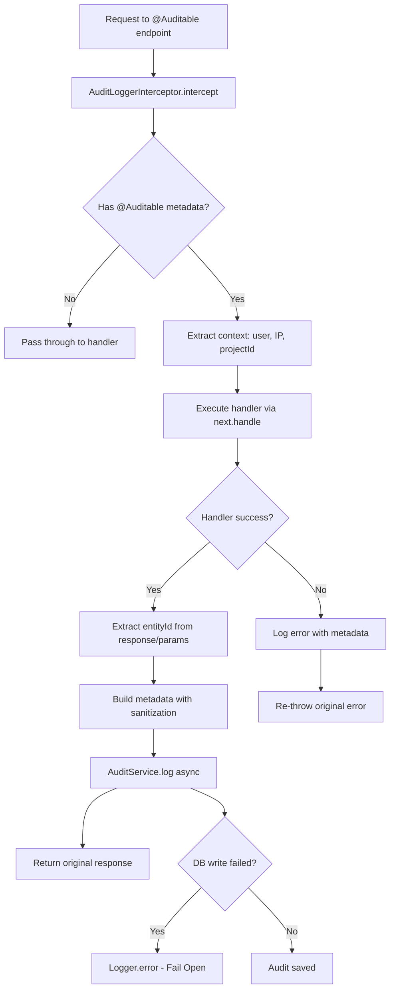
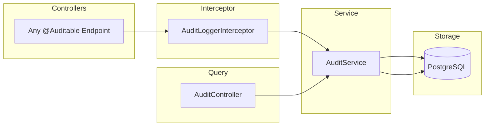

# Feature Investigation: Audit Logs

## Overview

The audit logging system provides compliance and security tracking by recording all significant user actions across the application. It uses a decorator-based approach (`@Auditable`) that integrates with a NestJS interceptor to capture request/response data automatically. Managers can query audit logs per project with filtering by action, actor, and date range.

The system is designed to "fail open" - audit logging failures do not block the original operation, ensuring business continuity while logging errors for monitoring.

## Requirement Traceability

### User Story
**As a** manager, **I want** to track all sensitive actions in the system, **so that** I can audit user behavior and maintain security compliance.

### Acceptance Criteria
1. Capture CREATE, UPDATE, and DELETE actions on core entities automatically.
2. Sanitize sensitive information (passwords, tokens) from logged metadata.
3. Allow managers to filter logs by action type, actor, and date range.

## Verification
- **Unit Tests**: `packages/backend/src/audit-logs/audit.service.spec.ts`, `packages/backend/src/audit-logs/audit.interceptor.spec.ts`
- **E2E Tests**: `packages/backend/test/audit.e2e-spec.ts`

## Entry Points

| Function/Method | File                                                                                   | Lines   | Purpose                                     |
| :-------------- | :------------------------------------------------------------------------------------- | :------ | :------------------------------------------ |
| `findAll()`     | [audit.controller.ts](../../packages/backend/src/audit-logs/audit.controller.ts)       | L14-21  | Query audit logs for a project              |
| `@Auditable`    | [auditable.decorator.ts](../../packages/backend/src/audit-logs/auditable.decorator.ts) | L17-18  | Decorator to mark auditable endpoints       |
| `intercept()`   | [audit.interceptor.ts](../../packages/backend/src/audit-logs/audit.interceptor.ts)     | L27-128 | Global interceptor that captures audit data |
| `log()`         | [audit.service.ts](../../packages/backend/src/audit-logs/audit.service.ts)             | L30-62  | Persist audit entry to database             |

## Execution Flow

### Flow 1: Automatic Audit Logging (Via Decorator)



1. **Interceptor Activation**: Global `AuditLoggerInterceptor` checks for `@Auditable` metadata on handler
2. **Context Extraction**: From request: `user.id`, `ip`, `user-agent`, `projectId` (from params or body)
3. **Handler Execution**: Original request handler runs normally
4. **Success Path**:
   - Extract `entityId` via custom extractor or from `params.id` / `response.id`
   - Build metadata (sanitized to remove sensitive keys)
   - Call `AuditService.log()` asynchronously (fire-and-forget)
5. **Error Path**:
   - Still attempts to log with error details in metadata
   - Re-throws original error to client
6. **Fail Open**: Any audit logging failure is logged but doesn't affect the response

### Flow 2: Query Audit Logs (`GET /projects/:projectId/audit-logs`)

1. **Authorization**: Requires `MANAGER` role
2. **Filtering**: Optional filters for `action`, `actorId`, `startDate`, `endDate`
3. **Pagination**: Default page=1, limit=20 (max 100)
4. **Query**: TypeORM QueryBuilder with dynamic WHERE clauses
5. **Returns**: Paginated `{ data, total, page, limit }`

## Data Flow



## Interfaces & Abstractions

### Input Types

```typescript
// Decorator configuration
interface AuditableMetadata {
  action: AuditAction; // CREATE, UPDATE, DELETE, LOGIN, LOGOUT, etc.
  entity: string; // Entity name: 'User', 'Project', 'Conversation'
  entityIdExtractor?: (data: unknown) => string; // Custom ID extraction
  metadataExtractor?: (
    request: unknown,
    response: unknown
  ) => Record<string, JsonValue>;
}

// Query filters
interface ListAuditLogsDto {
  action?: AuditAction; // Filter by action type
  actorId?: string; // Filter by user UUID
  startDate?: string; // ISO date string
  endDate?: string; // ISO date string
  page?: number; // Default: 1
  limit?: number; // Default: 20, max: 100
}
```

### Output Types

```typescript
// Audit log entity
interface AuditLog {
  id: string; // UUID
  projectId: number | null; // Can be null for global actions
  actorId: string | null; // User ID or null for SYSTEM
  actorType: "USER" | "SYSTEM" | "API_KEY";
  ipAddress: string | null;
  userAgent: string | null;
  action: AuditAction;
  entity: string;
  entityId: string;
  metadata: Record<string, JsonValue>; // JSONB - sanitized request/response
  createdAt: Date;
}

// Paginated response
interface PaginationDto<AuditLog> {
  data: AuditLog[];
  total: number;
  page: number;
  limit: number;
}
```

### Key Abstractions

| Abstraction              | Location                                                                           | Purpose                          | Key Methods             |
| :----------------------- | :--------------------------------------------------------------------------------- | :------------------------------- | :---------------------- |
| `AuditLoggerInterceptor` | [audit.interceptor.ts](../../packages/backend/src/audit-logs/audit.interceptor.ts) | Capture audit data from requests | `intercept()`           |
| `AuditService`           | [audit.service.ts](../../packages/backend/src/audit-logs/audit.service.ts)         | Persist and query audit logs     | `log()`, `findAll()`    |
| `sanitizeMetadata()`     | [audit.utils.ts](../../packages/backend/src/audit-logs/audit.utils.ts)             | Remove sensitive data            | Recursive key redaction |

## Dependencies

### Internal Dependencies

| Dependency               | Type           | What It Does                                                             |
| :----------------------- | :------------- | :----------------------------------------------------------------------- |
| `AuditService.log()`     | Core           | Validates metadata JSON, creates entity, saves to DB, catches all errors |
| `AuditService.findAll()` | Core           | QueryBuilder with dynamic filters, pagination                            |
| `sanitizeMetadata()`     | Utility        | Recursively replaces sensitive keys with '[REDACTED]' (case-insensitive) |
| `Reflector.get()`        | Infrastructure | Retrieves `@Auditable` metadata from handler                             |

### External Dependencies

| Dependency           | Type        | Standard Behavior            |
| :------------------- | :---------- | :--------------------------- |
| `TypeORM Repository` | Third-Party | Standard CRUD + QueryBuilder |

## Error Handling

| Error                  | When It Occurs               | How It's Handled                                              |
| :--------------------- | :--------------------------- | :------------------------------------------------------------ |
| Circular JSON          | Metadata serialization fails | Error thrown (caught in interceptor)                          |
| DB write failure       | PostgreSQL error             | Logged via `Logger.error`, operation continues                |
| Interceptor error      | Any exception in audit logic | Logged via `Logger.error`, operation continues                |
| Original handler error | Controller throws            | Audit attempted with error metadata, original error re-thrown |

## Side Effects

- **Database (PostgreSQL)**:

  - `audit_logs` table: INSERT on every `@Auditable` decorated endpoint call

- **Cache (Redis)**: None

- **Events Emitted**: None

- **External APIs**: None

## Data Lineage (Origin → Destination)

| Data Artifact     | Origin                    | Components in Path                         | Final Destination      |
| :---------------- | :------------------------ | :----------------------------------------- | :--------------------- |
| Request metadata  | HTTP Request              | Interceptor → sanitizeMetadata() → Service | `audit_logs.metadata`  |
| Response metadata | Controller response       | Interceptor → sanitizeMetadata() → Service | `audit_logs.metadata`  |
| Actor context     | JWT token (req.user)      | Interceptor → Service                      | `audit_logs.actorId`   |
| Project context   | URL params / request body | Interceptor → Service                      | `audit_logs.projectId` |

### Event Flow (Emitter → Handler)

| Event Name | Emitted By | Handled By | Purpose |
| :--------- | :--------- | :--------- | :------ |
| (none)     | —          | —          | —       |

### Orphan Audit

> [!NOTE]
> No orphaned events, producers, or consumers found. Audit data is consumed by the query endpoint.

## Configuration

| Config Key | Default | Purpose |
| :--------- | :------ | :------ |
| (none)     | —       | —       |

## Sensitive Data Handling

The audit system automatically redacts sensitive data using `sanitizeMetadata()`:

```typescript
const DEFAULT_SENSITIVE_KEYS = new Set([
  "password",
  "token",
  "secret",
  "authorization",
  "creditcard",
  "cvv",
  "ssn",
  "apikey",
]);
```

Matching is **case-insensitive** and **recursive** (handles nested objects and arrays).

## Integration Points

### To Add Auditing to an Endpoint

```typescript
import { Auditable } from '../audit-logs/auditable.decorator';
import { AuditAction } from '@live-chat/shared-types';

@Auditable({ action: AuditAction.CREATE, entity: 'Project' })
@Post()
async create(@Body() dto: CreateProjectDto) {
  return this.projectService.create(dto);
}
```

### Custom Entity ID Extraction

```typescript
@Auditable({
  action: AuditAction.UPDATE,
  entity: 'User',
  entityIdExtractor: (response: User) => response.id,
})
```

### Custom Metadata Extraction

```typescript
@Auditable({
  action: AuditAction.UPDATE,
  entity: 'Project',
  metadataExtractor: (req, res) => ({
    changedFields: Object.keys(req.body),
    newStatus: res.status,
  }),
})
```

### To Query Audit Logs

```typescript
// Query with filters
const logs = await fetch(
  `/projects/${projectId}/audit-logs?action=UPDATE&startDate=2024-01-01&limit=50`,
  { headers: { Authorization: `Bearer ${accessToken}` } }
);
```

## Files Investigated

| File                                                                                   | Lines Read | Key Findings                                        |
| :------------------------------------------------------------------------------------- | :--------- | :-------------------------------------------------- |
| [audit.controller.ts](../../packages/backend/src/audit-logs/audit.controller.ts)       | L1-23      | Single GET endpoint for querying                    |
| [auditable.decorator.ts](../../packages/backend/src/audit-logs/auditable.decorator.ts) | L1-19      | SetMetadata wrapper with typed options              |
| [audit.interceptor.ts](../../packages/backend/src/audit-logs/audit.interceptor.ts)     | L1-130     | Global interceptor with fail-open pattern           |
| [audit.service.ts](../../packages/backend/src/audit-logs/audit.service.ts)             | L1-100     | Log + query with validation                         |
| [audit.entity.ts](../../packages/backend/src/audit-logs/audit.entity.ts)               | L1-42      | Entity with indexes on projectId, actorId, entityId |
| [audit.utils.ts](../../packages/backend/src/audit-logs/audit.utils.ts)                 | L1-49      | Sensitive key redaction utility                     |
| [list-audit-logs.dto.ts](../../packages/shared-dtos/src/list-audit-logs.dto.ts)        | L1-35      | Query params validation                             |
