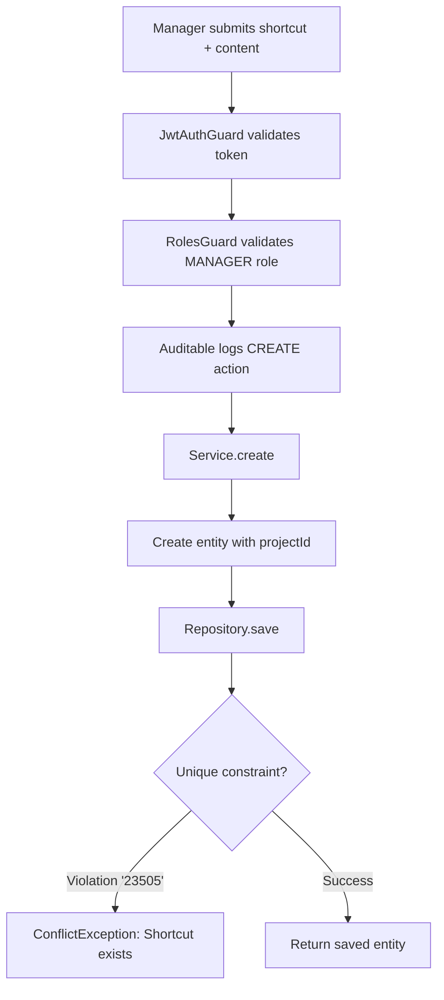
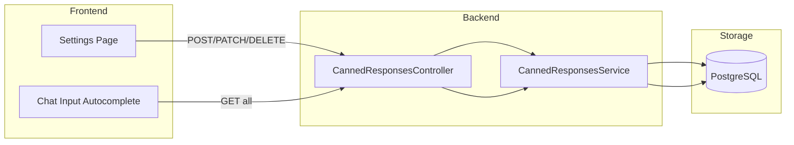

# Feature Investigation: Canned Responses

## Overview

Canned responses (also known as "quick replies" or "macros") are predefined text snippets that agents can quickly insert into conversations. Each canned response has a shortcut (e.g., `/greeting`) that agents can type to auto-expand the full response text. This feature improves agent efficiency by reducing repetitive typing.

Canned responses are scoped to projects, with managers having full CRUD access while agents can only read.

## Entry Points

| Function/Method | File                                                                                                         | Lines  | Purpose                    |
| :-------------- | :----------------------------------------------------------------------------------------------------------- | :----- | :------------------------- |
| `create()`      | [canned-responses.controller.ts](../../packages/backend/src/canned-responses/canned-responses.controller.ts) | L15-20 | Create new canned response |
| `findAll()`     | [canned-responses.controller.ts](../../packages/backend/src/canned-responses/canned-responses.controller.ts) | L22-26 | List all project responses |
| `update()`      | [canned-responses.controller.ts](../../packages/backend/src/canned-responses/canned-responses.controller.ts) | L28-37 | Update existing response   |
| `remove()`      | [canned-responses.controller.ts](../../packages/backend/src/canned-responses/canned-responses.controller.ts) | L39-44 | Delete response            |

## Execution Flow

### Flow 1: Create Canned Response (`POST /projects/:projectId/canned-responses`)



1. **Authorization**: Requires `MANAGER` role (agents cannot create)
2. **Validation**: DTO validates shortcut format (alphanumeric + underscore/dash, max 50 chars) and content (max 5000 chars)
3. **Unique Constraint**: Database enforces unique `(projectId, shortcut)` combination
4. **Audit**: Logged via `@Auditable` decorator

### Flow 2: List Canned Responses (`GET /projects/:projectId/canned-responses`)

1. **Authorization**: Requires `AGENT` role (or higher)
2. **Query**: Simple `find({ where: { projectId } })`
3. **Returns**: Array of all canned responses for the project

### Flow 3: Update Canned Response (`PATCH /projects/:projectId/canned-responses/:id`)

1. **Authorization**: Requires `MANAGER` role
2. **Lookup**: FindOne by `id` AND `projectId` (prevents cross-project access)
3. **Update**: Merges DTO into entity via `Object.assign()`
4. **Unique Check**: Catches PostgreSQL error code `23505` if shortcut conflicts
5. **Audit**: Logged via `@Auditable` decorator

### Flow 4: Delete Canned Response (`DELETE /projects/:projectId/canned-responses/:id`)

1. **Authorization**: Requires `MANAGER` role
2. **Delete**: Direct delete by `{ id, projectId }`
3. **Validation**: Checks `affected === 0` to throw NotFoundException
4. **Audit**: Logged via `@Auditable` decorator

## Data Flow



## Interfaces & Abstractions

### Input Types

```typescript
// Create request body
interface CreateCannedResponseDto {
  shortcut: string; // Regex: /^[a-zA-Z0-9_-]+$/, max 50 chars
  content: string; // Max 5000 chars
}

// Update request body (partial of Create)
type UpdateCannedResponseDto = Partial<CreateCannedResponseDto>;
```

### Output Types

```typescript
// Entity structure returned from all endpoints
interface CannedResponse {
  id: string; // UUID
  projectId: number;
  shortcut: string;
  content: string;
  createdAt: Date;
  updatedAt: Date;
}
```

### Key Abstractions

| Abstraction              | Location                                                                                               | Purpose         | Key Methods                                     |
| :----------------------- | :----------------------------------------------------------------------------------------------------- | :-------------- | :---------------------------------------------- |
| `CannedResponsesService` | [canned-responses.service.ts](../../packages/backend/src/canned-responses/canned-responses.service.ts) | CRUD operations | `create()`, `findAll()`, `update()`, `remove()` |

## Dependencies

### Internal Dependencies

| Dependency                         | Type           | What It Does                                         |
| :--------------------------------- | :------------- | :--------------------------------------------------- |
| `CannedResponsesService.create()`  | Core           | Creates entity, catches unique violation (23505)     |
| `CannedResponsesService.findAll()` | Core           | Returns all responses for projectId                  |
| `CannedResponsesService.findOne()` | Core           | Finds by id AND projectId, throws NotFoundException  |
| `CannedResponsesService.update()`  | Core           | Merges DTO, saves, catches unique violation          |
| `CannedResponsesService.remove()`  | Core           | Deletes by id AND projectId, validates affected rows |
| `RolesGuard`                       | Infrastructure | Validates user's project role from JWT               |
| `@Auditable` decorator             | Infrastructure | Logs action to audit system                          |

### External Dependencies

| Dependency           | Type        | Standard Behavior        |
| :------------------- | :---------- | :----------------------- |
| `TypeORM Repository` | Third-Party | Standard CRUD operations |

## Error Handling

| Error                | When It Occurs                   | How It's Handled              |
| :------------------- | :------------------------------- | :---------------------------- |
| `ConflictException`  | Shortcut already exists (23505)  | Returns 409 with message      |
| `NotFoundException`  | ID not found in project          | Returns 404 with message      |
| `ForbiddenException` | User lacks required project role | Returns 403 (from RolesGuard) |

## Side Effects

- **Database (PostgreSQL)**:

  - `canned_responses` table: Create, update, delete operations

- **Cache (Redis)**: None

- **Events Emitted**: None

- **External APIs**: None

## Data Lineage (Origin → Destination)

| Data Artifact             | Origin            | Components in Path                | Final Destination        |
| :------------------------ | :---------------- | :-------------------------------- | :----------------------- |
| `CreateCannedResponseDto` | HTTP Request Body | Controller → Service → Repository | `canned_responses` table |
| `UpdateCannedResponseDto` | HTTP Request Body | Controller → Service → Repository | `canned_responses` table |

### Event Flow (Emitter → Handler)

| Event Name | Emitted By | Handled By | Purpose |
| :--------- | :--------- | :--------- | :------ |
| (none)     | —          | —          | —       |

### Orphan Audit

> [!NOTE]
> No orphaned events, producers, or consumers found. This feature has no event-based communication.

## Configuration

| Config Key | Default | Purpose |
| :--------- | :------ | :------ |
| (none)     | —       | —       |

## Integration Points

### To Call This Feature

```typescript
// List all canned responses for a project
const responses = await fetch(`/projects/${projectId}/canned-responses`, {
  headers: { Authorization: `Bearer ${accessToken}` },
});

// Create new canned response (MANAGER only)
await fetch(`/projects/${projectId}/canned-responses`, {
  method: "POST",
  headers: {
    Authorization: `Bearer ${accessToken}`,
    "Content-Type": "application/json",
  },
  body: JSON.stringify({
    shortcut: "greeting",
    content: "Hello! How can I help you today?",
  }),
});

// Update existing (MANAGER only)
await fetch(`/projects/${projectId}/canned-responses/${responseId}`, {
  method: "PATCH",
  headers: {
    Authorization: `Bearer ${accessToken}`,
    "Content-Type": "application/json",
  },
  body: JSON.stringify({ content: "Updated greeting text" }),
});

// Delete (MANAGER only)
await fetch(`/projects/${projectId}/canned-responses/${responseId}`, {
  method: "DELETE",
  headers: { Authorization: `Bearer ${accessToken}` },
});
```

### Frontend Usage

Agents typically use canned responses by:

1. Typing a trigger character (e.g., `/`) in the chat input
2. Autocomplete shows matching shortcuts
3. Selecting a shortcut replaces current input with the full content

## Files Investigated

| File                                                                                                         | Lines Read | Key Findings                                           |
| :----------------------------------------------------------------------------------------------------------- | :--------- | :----------------------------------------------------- |
| [canned-responses.controller.ts](../../packages/backend/src/canned-responses/canned-responses.controller.ts) | L1-46      | CRUD endpoints with RBAC guards                        |
| [canned-responses.service.ts](../../packages/backend/src/canned-responses/canned-responses.service.ts)       | L1-62      | CRUD logic with unique violation handling              |
| [canned-response.entity.ts](../../packages/backend/src/canned-responses/entities/canned-response.entity.ts)  | L1-29      | Entity with unique constraint on (projectId, shortcut) |
| [canned-response.dto.ts](../../packages/shared-dtos/src/canned-response.dto.ts)                              | L1-24      | Validation rules for shortcut and content              |
