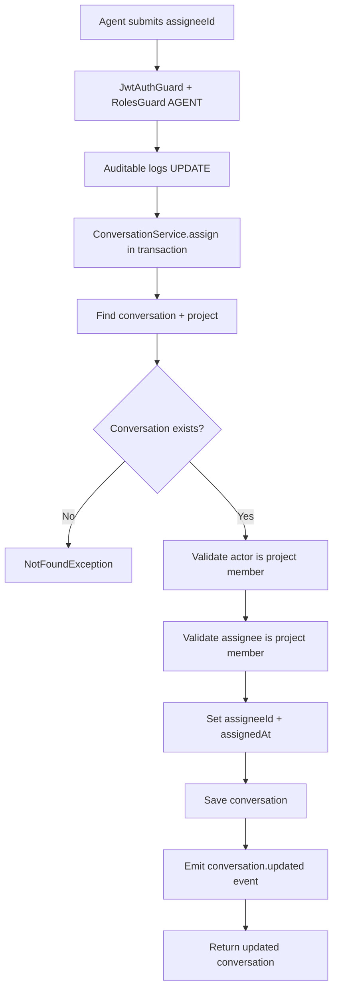
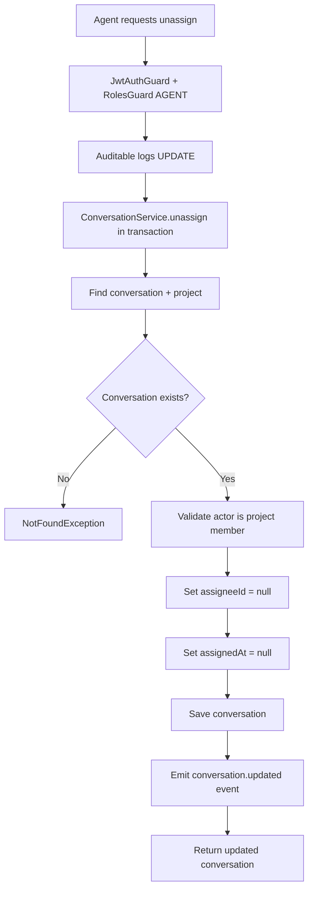
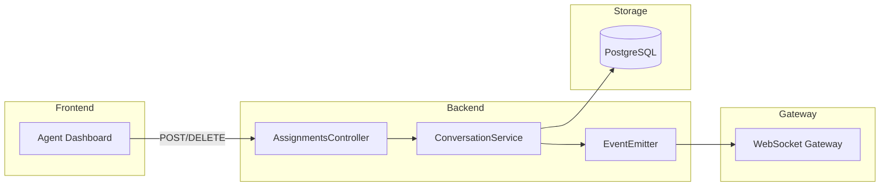

# Feature Investigation: Conversation Assignments

## Overview

Conversation assignments allow agents to take ownership of specific conversations. This is critical for multi-agent support where workload needs to be distributed. Agents can assign conversations to themselves or other team members, and unassign when needed.

Assignments are tracked via `assigneeId` and `assignedAt` fields on the `Conversation` entity, with real-time updates broadcast to the project.

## Entry Points

| Function/Method | File                                                                                    | Lines  | Purpose                      |
| :-------------- | :-------------------------------------------------------------------------------------- | :----- | :--------------------------- |
| `assign()`      | [assignments.controller.ts](../../packages/backend/src/inbox/assignments.controller.ts) | L16-26 | Assign conversation to agent |
| `unassign()`    | [assignments.controller.ts](../../packages/backend/src/inbox/assignments.controller.ts) | L28-37 | Unassign conversation        |

## Execution Flow

### Flow 1: Assign Conversation (`POST /projects/:projectId/inbox/conversations/:id/assignments`)



1. **Authorization**: Requires `AGENT` role
2. **Actor Validation**: Checks that requesting user is a project member
3. **Assignee Validation**: Checks that target user is also a project member
4. **Transaction**: All operations in atomic transaction
5. **Event**: Emits `conversation.updated` with assignee fields

### Flow 2: Unassign Conversation (`DELETE /projects/:projectId/inbox/conversations/:id/assignments`)



1. **No Assignee Validation**: Any project member can unassign any conversation
2. **Clears Both Fields**: `assigneeId` and `assignedAt` set to `null`

## Data Flow



## Interfaces & Abstractions

### Input Types

```typescript
// Assign request
interface AssignConversationDto {
  assigneeId: string; // UUID of user to assign
}
```

### Output Types

```typescript
// Updated Conversation (relevant fields)
interface Conversation {
  id: string;
  assigneeId: string | null;
  assignedAt: Date | null;
  // ... other fields
}
```

### Key Abstractions

| Abstraction           | Location                                                                                     | Purpose               | Key Methods                   |
| :-------------------- | :------------------------------------------------------------------------------------------- | :-------------------- | :---------------------------- |
| `ConversationService` | [conversation.service.ts](../../packages/backend/src/inbox/services/conversation.service.ts) | Assignment logic      | `assign()`, `unassign()`      |
| `ProjectService`      | [project.service.ts](../../packages/backend/src/projects/project.service.ts)                 | Membership validation | `validateProjectMembership()` |

## Dependencies

### Internal Dependencies

| Dependency                                   | Type           | What It Does                                                            |
| :------------------------------------------- | :------------- | :---------------------------------------------------------------------- |
| `ConversationService.assign()` (L318-356)    | Core           | Transaction: validates memberships, sets assignment fields, emits event |
| `ConversationService.unassign()` (L363-398)  | Core           | Transaction: validates actor, clears assignment fields, emits event     |
| `ProjectService.validateProjectMembership()` | Core           | Throws ForbiddenException if user not in project                        |
| `EventEmitter.emit('conversation.updated')`  | Infrastructure | Triggers gateway broadcast                                              |

### External Dependencies

| Dependency              | Type        | Standard Behavior   |
| :---------------------- | :---------- | :------------------ |
| `TypeORM EntityManager` | Third-Party | Transaction support |

## Error Handling

| Error                | When It Occurs              | How It's Handled |
| :------------------- | :-------------------------- | :--------------- |
| `NotFoundException`  | Conversation ID not found   | Returns 404      |
| `ForbiddenException` | Actor not project member    | Returns 403      |
| `ForbiddenException` | Assignee not project member | Returns 403      |

## Side Effects

- **Database (PostgreSQL)**:

  - `conversation` table: `assigneeId` and `assignedAt` updated

- **Events Emitted**:
  - `conversation.updated` with payload `{ conversationId, fields: { assigneeId, assignedAt } }`

## Data Lineage (Origin → Destination)

| Data Artifact           | Origin       | Components in Path                   | Final Destination            |
| :---------------------- | :----------- | :----------------------------------- | :--------------------------- |
| `AssignConversationDto` | HTTP Request | Controller → Service → EntityManager | `conversation` table         |
| Assignment event        | Service      | EventEmitter → Gateway               | Agent dashboards (WebSocket) |

### Event Flow (Emitter → Handler)

| Event Name             | Emitted By                          | Handled By                                                                                    | Purpose              |
| :--------------------- | :---------------------------------- | :-------------------------------------------------------------------------------------------- | :------------------- |
| `conversation.updated` | `ConversationService.assign():L352` | [gateway.event-listener.ts](../../packages/backend/src/gateway/gateway.event-listener.ts#L33) | Broadcast to project |

### Orphan Audit

> [!NOTE]
> No orphaned events. `conversation.updated` is handled by `gateway.event-listener.ts`.

## Configuration

| Config Key | Default | Purpose |
| :--------- | :------ | :------ |
| (none)     | —       | —       |

## Integration Points

### To Manage Assignments

```typescript
// Assign conversation to agent
await fetch(
  `/projects/${projectId}/inbox/conversations/${conversationId}/assignments`,
  {
    method: "POST",
    headers: {
      Authorization: `Bearer ${accessToken}`,
      "Content-Type": "application/json",
    },
    body: JSON.stringify({ assigneeId: "user-uuid" }),
  }
);

// Unassign (release) conversation
await fetch(
  `/projects/${projectId}/inbox/conversations/${conversationId}/assignments`,
  {
    method: "DELETE",
    headers: { Authorization: `Bearer ${accessToken}` },
  }
);
```

## Files Investigated

| File                                                                                          | Lines Read | Key Findings                               |
| :-------------------------------------------------------------------------------------------- | :--------- | :----------------------------------------- |
| [assignments.controller.ts](../../packages/backend/src/inbox/assignments.controller.ts)       | L1-39      | POST/DELETE endpoints with AGENT role      |
| [conversation.service.ts](../../packages/backend/src/inbox/services/conversation.service.ts)  | L318-398   | assign/unassign with membership validation |
| [assign-conversation.dto.ts](../../packages/backend/src/inbox/dto/assign-conversation.dto.ts) | L1-8       | UUID validation for assigneeId             |
