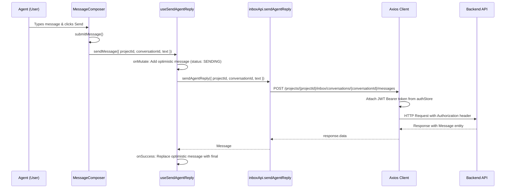
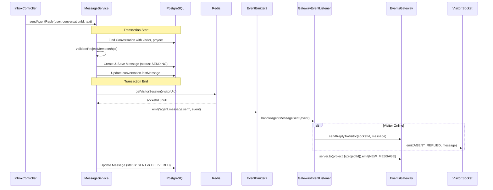
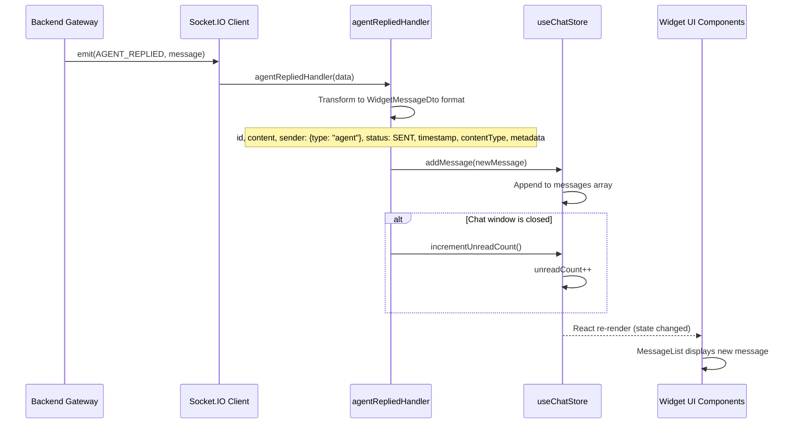
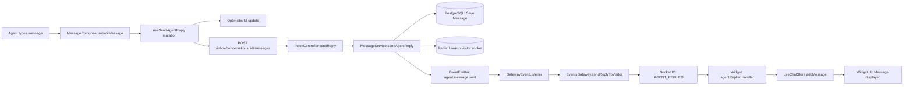

# Feature Investigation: Dashboard to Widget Message Flow

## Overview

This document investigates the complete message flow when an agent sends a message from the frontend dashboard to a visitor's widget. The flow spans three layers: Frontend Dashboard → Backend API → Widget (via WebSocket).

## Requirement Traceability

### User Story
**As an** agent, **I want** to send messages to a visitor, **so that** I can provide support and answer their inquiries in real-time.

### Acceptance Criteria
1. Agent messages must be delivered to the visitor widget via WebSocket.
2. The agent dashboard should show an optimistic update for immediate feedback.
3. Message status should be updated to reflection delivery success (SENT/DELIVERED).

## Verification
- **Unit Tests**: `packages/backend/src/inbox/services/message.service.spec.ts`
- **E2E Tests**: `packages/backend/test/chat.e2e-spec.ts`

---

## Slice 1: Frontend Dashboard → Backend

### Entry Points

| Function/Method       | File                                                                                                         | Purpose                                               |
| --------------------- | ------------------------------------------------------------------------------------------------------------ | ----------------------------------------------------- |
| `submitMessage()`     | [MessageComposer.tsx](../../../packages/frontend/src/components/features/inbox/MessageComposer.tsx#L107-121) | Handles form submission, calls `sendMessage` mutation |
| `useSendAgentReply()` | [inboxApi.ts](../../../packages/frontend/src/services/inboxApi.ts#L150-216)                                  | React Query mutation hook for sending agent replies   |
| `sendAgentReply()`    | [inboxApi.ts](../../../packages/frontend/src/services/inboxApi.ts#L92-108)                                   | Axios POST function to backend API                    |

### Execution Flow



### Step-by-step Description

1. **User Action:** Agent types a message in the `MessageComposer` textarea and presses Enter or clicks Send button.

2. **`submitMessage()` Called:**

   - Trims the message content
   - Calls `sendMessage({ projectId, conversationId, text: messageToSend })`
   - Clears the input field
   - Stops typing indicator

3. **`useSendAgentReply` Mutation Executes:**

   - **`onMutate`** (Optimistic Update):
     - Cancels any pending queries for this conversation's messages
     - Creates an optimistic message with `id`: UUID v4, `status`: SENDING, `fromCustomer`: false
     - Adds optimistic message to query cache immediately (instant UI feedback)

4. **`sendAgentReply()` API Function:**

   - Makes POST request to `/projects/${projectId}/inbox/conversations/${conversationId}/messages`
   - Body: `{ text: string }`

5. **Axios Interceptor:** Retrieves access token from `useAuthStore.getState().accessToken`, attaches `Authorization: Bearer ${token}` header

6. **On Success:** Checks if final message already exists (via socket), removes or replaces optimistic message

7. **On Error:** Updates optimistic message status to `MessageStatus.FAILED`

8. **On Settled:** Invalidates the messages query to ensure consistency

### API Request

```typescript
POST /projects/:projectId/inbox/conversations/:conversationId/messages
Authorization: Bearer <JWT_ACCESS_TOKEN>
{ "text": "Hello, how can I help you?" }
```

### Files Investigated

| File                                                                                                | Lines Read | Key Findings                                                                     |
| --------------------------------------------------------------------------------------------------- | ---------- | -------------------------------------------------------------------------------- |
| [MessageComposer.tsx](../../../packages/frontend/src/components/features/inbox/MessageComposer.tsx) | L1-189     | Entry point, calls `useSendAgentReply().mutate()`                                |
| [inboxApi.ts](../../../packages/frontend/src/services/inboxApi.ts)                                  | L92-216    | `sendAgentReply` POST function, `useSendAgentReply` hook with optimistic updates |
| [api.ts](../../../packages/frontend/src/lib/api.ts)                                                 | L1-233     | Axios client, JWT attachment, token refresh logic                                |
| [send-reply.dto.ts](../../../packages/shared-dtos/src/send-reply.dto.ts)                            | L1-10      | `SendReplyDto` with single `text` field                                          |

---

## Slice 2: Backend Processing → Widget

### Entry Points

| Function/Method            | File                                                                                                | Purpose                                     |
| -------------------------- | --------------------------------------------------------------------------------------------------- | ------------------------------------------- |
| `sendReply()`              | [inbox.controller.ts](../../../packages/backend/src/inbox/inbox.controller.ts#L55-62)               | Controller endpoint handling POST request   |
| `sendAgentReply()`         | [message.service.ts](../../../packages/backend/src/inbox/services/message.service.ts#L65-169)       | Core business logic for sending agent reply |
| `handleAgentMessageSent()` | [gateway.event-listener.ts](../../../packages/backend/src/gateway/gateway.event-listener.ts#L48-55) | Event handler that emits to visitor socket  |

### Execution Flow



### Step-by-step Description

1. **Controller Receives Request:** POST `/projects/:projectId/inbox/conversations/:id/messages`, validates AGENT role

2. **MessageService.sendAgentReply() - Transaction:**

   - Finds `Conversation` with relations `['visitor', 'project']`
   - Validates project membership
   - Creates `Message` entity with `senderId`, `recipientId`, `fromCustomer: false`, `status: SENDING`
   - Updates conversation's `lastMessage`

3. **Lookup Visitor Socket (Redis):** `realtimeSessionService.getVisitorSession()` with key `session:visitor:${visitorUid}`

4. **Emit Internal Event:** `EventEmitter2.emit('agent.message.sent', AgentMessageSentEvent)`

5. **GatewayEventListener.handleAgentMessageSent():**

   - If online: calls `sendReplyToVisitor(socketId, message)`
   - Always broadcasts `NEW_MESSAGE` to project room

6. **EventsGateway.sendReplyToVisitor():** Emits `AGENT_REPLIED` to visitor socket

7. **Update Message Status:** SENT if online, DELIVERED if offline

### WebSocket Events Emitted

| Event           | Target                      | Purpose                           |
| --------------- | --------------------------- | --------------------------------- |
| `AGENT_REPLIED` | Visitor socket              | Deliver message to visitor widget |
| `NEW_MESSAGE`   | `project:${projectId}` room | Update dashboard for all agents   |

### Files Investigated

| File                                                                                                      | Lines Read | Key Findings                                 |
| --------------------------------------------------------------------------------------------------------- | ---------- | -------------------------------------------- |
| [inbox.controller.ts](../../../packages/backend/src/inbox/inbox.controller.ts)                            | L55-62     | POST endpoint, delegates to MessageService   |
| [message.service.ts](../../../packages/backend/src/inbox/services/message.service.ts)                     | L65-169    | Transaction, save, emit event, update status |
| [events.ts](../../../packages/backend/src/inbox/events.ts)                                                | L56-60     | `AgentMessageSentEvent` class definition     |
| [gateway.event-listener.ts](../../../packages/backend/src/gateway/gateway.event-listener.ts)              | L48-55     | Handles event, calls gateway methods         |
| [events.gateway.ts](../../../packages/backend/src/gateway/events.gateway.ts)                              | L353-356   | `sendReplyToVisitor()` emits AGENT_REPLIED   |
| [realtime-session.service.ts](../../../packages/backend/src/realtime-session/realtime-session.service.ts) | L27-31     | Redis GET for `session:visitor:${uid}`       |

---

## Slice 3: Widget Message Reception

### Entry Points

| Function/Method          | File                                                                                         | Purpose                                            |
| ------------------------ | -------------------------------------------------------------------------------------------- | -------------------------------------------------- |
| `agentRepliedHandler()`  | [socketService.ts](../../../packages/frontend/src/widget/services/socketService.ts#L166-193) | Socket.IO event handler for `AGENT_REPLIED`        |
| `addMessage()`           | [useChatStore.ts](../../../packages/frontend/src/widget/store/useChatStore.ts#L57-65)        | Zustand store action to add message to state       |
| `incrementUnreadCount()` | [useChatStore.ts](../../../packages/frontend/src/widget/store/useChatStore.ts#L83-84)        | Increments unread badge when chat window is closed |

### Execution Flow



### Step-by-step Description

1. **Socket Event Received:**

   - Socket.IO client receives `AGENT_REPLIED` event at `socketService.ts:L218`
   - Handler registered during `connect()` at `socketService.ts:L166`

2. **agentRepliedHandler() Transformation:**

   - Receives raw message data from backend (Message entity)
   - Transforms to `WidgetMessageDto` format:
     ```typescript
     const newMessage: Message = {
       id: data.id,
       content: data.content,
       sender: { type: data.fromCustomer ? "visitor" : "agent" },
       status: MessageStatus.SENT,
       timestamp: data.createdAt,
       contentType: data.contentType,
       metadata: data.metadata,
     };
     ```

3. **Store Update via addMessage():**

   - Appends new message to `messages` array
   - Implements memory management: if messages exceed 600, trims to last 500
   - Triggers React re-render for subscribed components

4. **Unread Count Handling:**

   - Checks `useChatStore.getState().isWindowOpen`
   - If chat window is closed: calls `incrementUnreadCount()`
   - Unread badge updates in widget launcher button

5. **UI Re-render:**
   - `MessageList` component subscribed to `messages` array
   - New message appears at bottom of chat
   - Auto-scroll to newest message (handled by component)

### Data Transformation

| Backend Field  | Widget Field  | Transformation                            |
| -------------- | ------------- | ----------------------------------------- |
| `id`           | `id`          | Direct copy                               |
| `content`      | `content`     | Direct copy                               |
| `fromCustomer` | `sender.type` | `false` → `"agent"`, `true` → `"visitor"` |
| `createdAt`    | `timestamp`   | Direct copy                               |
| `contentType`  | `contentType` | Direct copy                               |
| `metadata`     | `metadata`    | Direct copy                               |
| (none)         | `status`      | Hardcoded to `MessageStatus.SENT`         |

### Interfaces & Data Types

```typescript
// Widget Message DTO (from shared-types)
interface WidgetMessageDto {
  id: string;
  content: string;
  sender: { type: "visitor" | "agent" };
  status: MessageStatus;
  timestamp: Date;
  contentType: string;
  metadata?: any;
}
```

### Dependencies

| Dependency         | Type        | What It Does (Verified)                                  |
| ------------------ | ----------- | -------------------------------------------------------- |
| `socket.io-client` | Third-Party | Socket.IO client for WebSocket communication             |
| `zustand`          | Third-Party | State management library, provides `create()` for stores |
| `useChatStore`     | Core        | Singleton Zustand store for widget chat state            |

### Side Effects

- **State:** `messages` array updated, triggers re-render
- **State:** `unreadCount` incremented if window closed
- **UI:** New message displayed in MessageList component
- **UI:** Unread badge updates on launcher button

### Files Investigated

| File                                                                                | Lines Read | Key Findings                                                   |
| ----------------------------------------------------------------------------------- | ---------- | -------------------------------------------------------------- |
| [socketService.ts](../../../packages/frontend/src/widget/services/socketService.ts) | L166-193   | `AGENT_REPLIED` handler, transforms data, calls `addMessage()` |
| [useChatStore.ts](../../../packages/frontend/src/widget/store/useChatStore.ts)      | L41-102    | Zustand store, `addMessage()` appends with memory management   |

---

## Complete End-to-End Data Lineage



## Event Flow Summary

| Event                | Emitter        | Handler                   | Transport     |
| -------------------- | -------------- | ------------------------- | ------------- |
| HTTP POST            | Frontend Axios | InboxController           | HTTP          |
| `agent.message.sent` | MessageService | GatewayEventListener      | EventEmitter2 |
| `AGENT_REPLIED`      | EventsGateway  | Widget socketService      | Socket.IO     |
| `NEW_MESSAGE`        | EventsGateway  | Dashboard socket handlers | Socket.IO     |
| React state update   | useChatStore   | MessageList component     | Zustand/React |
