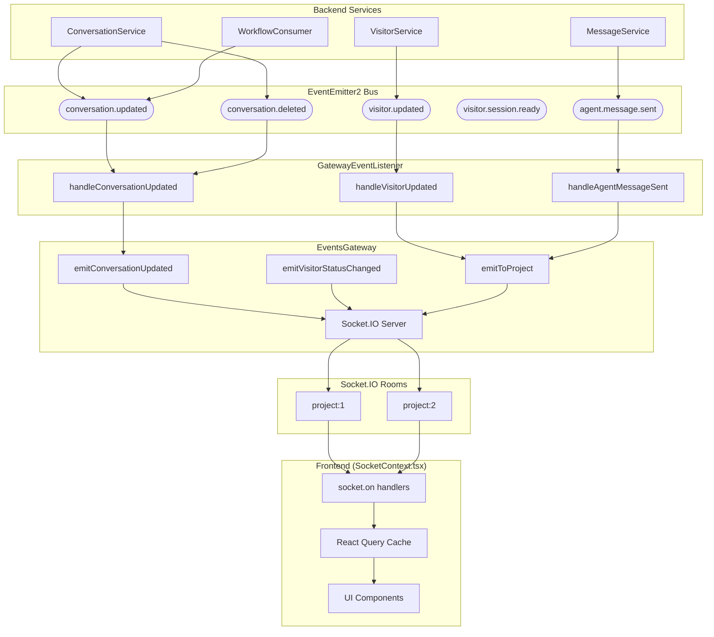

# Feature Investigation: Project Event Flow

## Overview

This document provides a **complete investigation of the real-time event flow** within the Projects feature. All WebSocket events are **scoped to projects** via Socket.IO rooms named `project:{projectId}`. This ensures data isolation - agents only receive events for projects they are members of.

The event flow follows a consistent pattern:

```
Service Action → Domain Event → GatewayEventListener → EventsGateway → Socket.IO Broadcast → Frontend Handler
```

## Requirement Traceability

### User Story
**As an** agent, **I want** to receive real-time updates for conversations and visitor activities, **so that** I can respond promptly to new interactions and provide immediate support.

### Acceptance Criteria
1. Real-time events must be isolated per project using Socket.IO rooms.
2. Broadcast updates for conversation assignments, status changes, and new messages.
3. Track and broadcast visitor online/offline status and typing indicators.

## Verification
- **Unit Tests**: `packages/backend/src/gateway/events.gateway.spec.ts`
- **E2E Tests**: `packages/backend/test/chat.e2e-spec.ts`, `packages/backend/test/visitors.e2e-spec.ts`

## Event Architecture



## Complete Event Catalog

### Client → Server Events

| Event Name           | Payload Type                | Emitted By                       | Handler                                    |
| -------------------- | --------------------------- | -------------------------------- | ------------------------------------------ |
| `identify`           | `IdentifyPayload`           | Widget (visitor connects)        | `EventsGateway.handleIdentify()`           |
| `sendMessage`        | `SendMessagePayload`        | Widget (visitor sends message)   | `EventsGateway.handleSendMessage()`        |
| `visitorIsTyping`    | `VisitorTypingPayload`      | Widget (visitor types)           | `EventsGateway.handleVisitorTyping()`      |
| `updateContext`      | `UpdateContextPayload`      | Widget (URL changes)             | `EventsGateway.handleUpdateContext()`      |
| `joinProjectRoom`    | `JoinRoomPayload`           | Agent dashboard (enters project) | `EventsGateway.handleJoinProjectRoom()`    |
| `leaveProjectRoom`   | `JoinRoomPayload`           | Agent dashboard (leaves project) | `EventsGateway.handleLeaveProjectRoom()`   |
| `submitForm`         | `SubmitFormPayload`         | Widget (submits form)            | `EventsGateway.handleSubmitForm()`         |
| `visitorFillingForm` | `VisitorFillingFormPayload` | Widget (filling form indicator)  | `EventsGateway.handleVisitorFillingForm()` |

### Server → Client Events (Project-Scoped)

| Event Name              | Payload Type                    | Emitted By                                           | Frontend Handler                      |
| ----------------------- | ------------------------------- | ---------------------------------------------------- | ------------------------------------- |
| `conversationUpdated`   | `ConversationUpdatedPayload`    | `EventsGateway.emitConversationUpdated()`            | `handleConversationUpdated()`         |
| `conversationDeleted`   | `{ conversationId }`            | `EventsGateway.emitConversationDeleted()`            | (invalidates cache)                   |
| `newMessage`            | `Message`                       | `GatewayEventListener.handleAgentMessageSent()`      | `handleNewMessage()`                  |
| `visitorIsTyping`       | `VisitorTypingBroadcastPayload` | `EventsGateway.handleVisitorTyping()`                | `handleVisitorTyping()`               |
| `visitorContextUpdated` | `VisitorContextUpdatedPayload`  | `GatewayEventListener.handleVisitorContextUpdated()` | `handleVisitorContextUpdated()`       |
| `visitorStatusChanged`  | `VisitorStatusChangedPayload`   | `EventsGateway.emitVisitorStatusChanged()`           | `handleVisitorStatusChanged()`        |
| `visitorUpdated`        | `VisitorUpdatedPayload`         | `GatewayEventListener.handleVisitorUpdated()`        | `handleVisitorUpdated()`              |
| `visitorNoteAdded`      | `VisitorNotePayload`            | `VisitorNotesEventListener`                          | `handleVisitorNoteAdded()`            |
| `visitorNoteUpdated`    | `VisitorNotePayload`            | `VisitorNotesEventListener`                          | `handleVisitorNoteUpdated()`          |
| `visitorNoteDeleted`    | `VisitorNoteDeletedPayload`     | `VisitorNotesEventListener`                          | `handleVisitorNoteDeleted()`          |
| `formRequestSent`       | `FormRequestSentPayload`        | `GatewayEventListener.handleFormRequestSent()`       | (sent to visitor socket)              |
| `formSubmitted`         | `FormSubmittedPayload`          | `EventsGateway.emitFormSubmitted()`                  | (updates form UI)                     |
| `automation.triggered`  | `{ conversationId, message }`   | `GatewayEventListener.handleAutomationTriggered()`   | `handleAutomationTriggered()` (toast) |

### Server → Visitor Events (Direct Socket)

| Event Name            | Payload Type         | Emitted By                                 | Widget Handler         |
| --------------------- | -------------------- | ------------------------------------------ | ---------------------- |
| `conversationHistory` | `{ messages }`       | `EventsGateway.prepareSocketForVisitor()`  | Loads chat history     |
| `messageSent`         | `MessageSentPayload` | `EventsGateway.visitorMessageSent()`       | Confirms message sent  |
| `agentReplied`        | `Message`            | `EventsGateway.sendReplyToVisitor()`       | Shows agent message    |
| `agentIsTyping`       | `AgentTypingPayload` | `EventsGateway.sendAgentTypingToVisitor()` | Shows typing indicator |

---

## Event Flow Details

### 1. Conversation Updated Flow

**Trigger:** Agent assigns conversation, changes status, or updates metadata.

**Chain:**

1. [`ConversationService.assign()`](../../../packages/backend/src/inbox/services/conversation.service.ts) line 343
2. Creates `ConversationUpdatedEvent` with `projectId` and `payload`
3. `this.eventEmitter.emit('conversation.updated', event)`
4. [`GatewayEventListener.handleConversationUpdated()`](../../../packages/backend/src/gateway/gateway.event-listener.ts) line 33-36
5. `this.eventsGateway.emitConversationUpdated(event.projectId, event.payload)`
6. [`EventsGateway.emitConversationUpdated()`](../../../packages/backend/src/gateway/events.gateway.ts) line 78-81
7. `this.server.to(\`project:${projectId}\`).emit(WebSocketEvent.CONVERSATION_UPDATED, payload)`
8. [`SocketContext.tsx` `handleConversationUpdated()`](../../../packages/frontend/src/contexts/SocketContext.tsx) line 261-283
9. Updates URL if status changed, invalidates React Query conversations cache

**Payload:**

```typescript
interface ConversationUpdatedPayload {
  conversationId: string;
  fields: Record<string, any>; // e.g., { status: 'resolved', assigneeId: 'uuid' }
}
```

---

### 2. Visitor Status Changed Flow (Online/Offline)

**Trigger:** Visitor connects to or disconnects from widget.

**Chain (Online):**

1. [`EventsGateway.handleIdentify()`](../../../packages/backend/src/gateway/events.gateway.ts) line 210-232
2. `this.emitVisitorStatusChanged(payload.projectId, payload.visitorUid, true)`
3. [`EventsGateway.emitVisitorStatusChanged()`](../../../packages/backend/src/gateway/events.gateway.ts) line 94-98
4. `this.server.to(\`project:${projectId}\`).emit(WebSocketEvent.VISITOR_STATUS_CHANGED, payload)`
5. [`SocketContext.tsx` `handleVisitorStatusChanged()`](../../../packages/frontend/src/contexts/SocketContext.tsx) line 173-223
6. Updates `visitor.isOnline` in conversations cache and visitor cache

**Chain (Offline):**

1. [`EventsGateway.handleDisconnect()`](../../../packages/backend/src/gateway/events.gateway.ts) line 116-130
2. `this.emitVisitorStatusChanged(client.data.projectId, client.data.visitorUid, false)`
3. Same as above from step 3

**Payload:**

```typescript
interface VisitorStatusChangedPayload {
  visitorUid: string;
  projectId: number;
  isOnline: boolean;
}
```

---

### 3. New Message Flow

**Trigger:** Agent sends reply to conversation.

**Chain:**

1. [`MessageService.sendMessageAsAgent()`](../../../packages/backend/src/inbox/services/message.service.ts) line 134
2. `this.eventEmitter.emit('agent.message.sent', event)`
3. [`GatewayEventListener.handleAgentMessageSent()`](../../../packages/backend/src/gateway/gateway.event-listener.ts) line 48-55
4. `this.eventsGateway.sendReplyToVisitor(event.visitorSocketId, event.message)` (to visitor)
5. `this.eventsGateway.server.to(\`project:${event.projectId}\`).emit(WebSocketEvent.NEW_MESSAGE, event.message)` (to agents)
6. [`SocketContext.tsx` `handleNewMessage()`](../../../packages/frontend/src/contexts/SocketContext.tsx) line 43-104
7. Optimistically updates messages cache, auto-marks as read if viewing, invalidates conversations

**Payload:** Full `Message` entity

---

### 4. Visitor Context Updated Flow

**Trigger:** Visitor navigates to new URL in widget.

**Chain:**

1. Widget emits `updateContext` with `{ currentUrl }`
2. [`EventsGateway.handleUpdateContext()`](../../../packages/backend/src/gateway/events.gateway.ts) line 269-303
3. `this.eventEmitter.emit('update.context.request', contextEvent)`
4. [`InboxEventHandlerService.handleUpdateContextRequest()`](../../../packages/backend/src/inbox/inbox-event.handler.ts) line 272-298
5. Updates visitor's `currentUrl` in Redis and conversation metadata
6. [`ConversationService.updateVisitorContext()`](../../../packages/backend/src/inbox/services/conversation.service.ts) emits `visitor.context.updated`
7. [`GatewayEventListener.handleVisitorContextUpdated()`](../../../packages/backend/src/gateway/gateway.event-listener.ts) line 74-81
8. `this.eventsGateway.server.to(\`project:${event.projectId}\`).emit(WebSocketEvent.VISITOR_CONTEXT_UPDATED, broadcastPayload)`
9. [`SocketContext.tsx` `handleVisitorContextUpdated()`](../../../packages/frontend/src/contexts/SocketContext.tsx) line 110-170
10. Updates `visitor.currentUrl` in conversations cache and visitor cache

**Payload:**

```typescript
interface VisitorContextUpdatedPayload {
  conversationId: string;
  currentUrl: string;
}
```

---

### 5. Visitor Typing Flow

**Trigger:** Visitor starts/stops typing in widget.

**Chain:**

1. Widget emits `visitorIsTyping` with `{ isTyping: boolean }`
2. [`EventsGateway.handleVisitorTyping()`](../../../packages/backend/src/gateway/events.gateway.ts) line 253-267
3. `this.server.to(\`project:${projectId}\`).emit(WebSocketEvent.VISITOR_TYPING, broadcastPayload)`
4. [`SocketContext.tsx` `handleVisitorTyping()`](../../../packages/frontend/src/contexts/SocketContext.tsx) line 106-108
5. `setTypingStatus(payload.conversationId, payload.isTyping)` (Zustand store)

**Payload:**

```typescript
interface VisitorTypingBroadcastPayload {
  conversationId: number;
  isTyping: boolean;
}
```

---

## Project Room Isolation Mechanism

### How Agents Join Rooms

```typescript
// EventsGateway.handleJoinProjectRoom() - line 306-327
@SubscribeMessage(WebSocketEvent.JOIN_PROJECT_ROOM)
async handleJoinProjectRoom(
  @ConnectedSocket() client: Socket,
  @MessageBody() payload: JoinRoomPayload
): Promise<{ status: string; roomName: string }> {
  // Security Check: User must be authenticated
  if (!client.data.user) {
    throw new WsException('Unauthorized');
  }

  // Security Check: User must be project member
  await this.projectService.validateProjectMembership(payload.projectId, client.data.user.id);

  // Join Socket.IO room
  const roomName = `project:${payload.projectId}`;
  client.join(roomName);
  return { status: 'ok', roomName };
}
```

### How Events Are Broadcast

All project-scoped events use the pattern:

```typescript
this.server.to(`project:${projectId}`).emit(eventName, payload);
```

This ensures only sockets in the `project:{id}` room receive the event.

---

## Frontend Handler Implementation

### SocketContext.tsx Structure

Located at [`packages/frontend/src/contexts/SocketContext.tsx`](../../../packages/frontend/src/contexts/SocketContext.tsx):

1. **useRealtimeCacheUpdater hook** (line 24-361): Defines all event handlers
2. **SocketProvider** (line 372-421): Manages socket connection with JWT auth
3. **Event Listener Registration** (line 326-336):

```typescript
socket.on(WebSocketEvent.NEW_MESSAGE, handleNewMessage);
socket.on(WebSocketEvent.AGENT_REPLIED, handleNewMessage);
socket.on(WebSocketEvent.VISITOR_TYPING, handleVisitorTyping);
socket.on(WebSocketEvent.VISITOR_CONTEXT_UPDATED, handleVisitorContextUpdated);
socket.on(WebSocketEvent.CONVERSATION_UPDATED, handleConversationUpdated);
socket.on(WebSocketEvent.VISITOR_NOTE_ADDED, handleVisitorNoteAdded);
socket.on(WebSocketEvent.VISITOR_NOTE_UPDATED, handleVisitorNoteUpdated);
socket.on(WebSocketEvent.VISITOR_NOTE_DELETED, handleVisitorNoteDeleted);
socket.on(WebSocketEvent.VISITOR_STATUS_CHANGED, handleVisitorStatusChanged);
socket.on(WebSocketEvent.VISITOR_UPDATED, handleVisitorUpdated);
socket.on("automation.triggered", handleAutomationTriggered);
```

4. **React Query Cache Updates**: Most handlers use `queryClient.setQueryData()` or `queryClient.invalidateQueries()` to update UI without refetching.

---

## Orphan Audit

> [!NOTE] > **No orphaned events found.** All domain events emitted have registered handlers:

| Domain Event                | Emitter                                   | Handler                                                   | Status     |
| --------------------------- | ----------------------------------------- | --------------------------------------------------------- | ---------- |
| `conversation.updated`      | `ConversationService`, `WorkflowConsumer` | `GatewayEventListener.handleConversationUpdated()`        | ✅ Handled |
| `conversation.deleted`      | `ConversationService`                     | `GatewayEventListener.handleConversationDeleted()`        | ✅ Handled |
| `visitor.identified`        | `EventsGateway.handleIdentify()`          | `InboxEventHandlerService.handleVisitorIdentified()`      | ✅ Handled |
| `visitor.connected`         | `EventsGateway.handleIdentify()`          | `VisitorConnectionHandler`                                | ✅ Handled |
| `visitor.disconnected`      | `EventsGateway.handleDisconnect()`        | `InboxEventHandlerService.handleVisitorDisconnected()`    | ✅ Handled |
| `visitor.message.received`  | `EventsGateway.handleSendMessage()`       | `InboxEventHandlerService.handleVisitorMessageReceived()` | ✅ Handled |
| `visitor.session.ready`     | `InboxEventHandlerService`                | `GatewayEventListener.handleVisitorSessionReady()`        | ✅ Handled |
| `visitor.message.processed` | `InboxEventHandlerService`                | `GatewayEventListener.handleVisitorMessageProcessed()`    | ✅ Handled |
| `visitor.context.updated`   | `ConversationService`                     | `GatewayEventListener.handleVisitorContextUpdated()`      | ✅ Handled |
| `visitor.updated`           | `VisitorService`                          | `GatewayEventListener.handleVisitorUpdated()`             | ✅ Handled |
| `agent.typing`              | `ConversationService`                     | `GatewayEventListener.handleAgentTyping()`                | ✅ Handled |
| `agent.message.sent`        | `MessageService`, `InboxEventHandler`     | `GatewayEventListener.handleAgentMessageSent()`           | ✅ Handled |
| `update.context.request`    | `EventsGateway`                           | `InboxEventHandlerService.handleUpdateContextRequest()`   | ✅ Handled |
| `form.request.sent`         | `ActionsService`                          | `GatewayEventListener.handleFormRequestSent()`            | ✅ Handled |
| `automation.triggered`      | `WorkflowConsumer`                        | `GatewayEventListener.handleAutomationTriggered()`        | ✅ Handled |

**Frontend WebSocket Events - All Handled:**

- All `WebSocketEvent` enum values emitted to project rooms have corresponding `socket.on()` handlers in `SocketContext.tsx`
- Handlers update React Query cache ensuring UI consistency

---

## Data Lineage Summary

| Event                  | Origin                             | Path                                                                    | Destination                    |
| ---------------------- | ---------------------------------- | ----------------------------------------------------------------------- | ------------------------------ |
| `conversation.updated` | ConversationService (assign)       | Service → EventEmitter → GatewayEventListener → EventsGateway → Room    | Frontend cache, UI update      |
| `visitor.status`       | EventsGateway (connect/disconnect) | Gateway → Room                                                          | Frontend cache, online badge   |
| `agent.message.sent`   | MessageService (sendAsAgent)       | Service → EventEmitter → GatewayEventListener → Room + Visitor Socket   | Messages list, conversation UI |
| `visitor.context`      | Widget (URL change)                | Gateway → InboxEventHandler → ConversationService → EventEmitter → Room | Visitor panel URL display      |
| `visitor.updated`      | VisitorService (update name)       | Service → EventEmitter → GatewayEventListener → Room                    | Visitor name in conversation   |

---

## Files Investigated

| File                                                                                            | Lines Read | Key Findings                                        |
| ----------------------------------------------------------------------------------------------- | ---------- | --------------------------------------------------- |
| [events.gateway.ts](../../../packages/backend/src/gateway/events.gateway.ts)                    | L1-479     | All emit methods, room join/leave, visitor handlers |
| [gateway.event-listener.ts](../../../packages/backend/src/gateway/gateway.event-listener.ts)    | L1-129     | @OnEvent decorators bridging services to gateway    |
| [events.ts](../../../packages/backend/src/inbox/events.ts)                                      | L1-75      | Domain event class definitions                      |
| [websocket.types.ts](../../../packages/shared-types/src/websocket.types.ts)                     | L1-168     | WebSocketEvent enum, all payload interfaces         |
| [SocketContext.tsx](../../../packages/frontend/src/contexts/SocketContext.tsx)                  | L1-422     | Frontend socket connection, all event handlers      |
| [conversation.service.ts](../../../packages/backend/src/inbox/services/conversation.service.ts) | L343-531   | conversation.updated/deleted event emissions        |
| [message.service.ts](../../../packages/backend/src/inbox/services/message.service.ts)           | L134       | agent.message.sent emission                         |
| [visitors.service.ts](../../../packages/backend/src/visitors/visitors.service.ts)               | L104       | visitor.updated emission                            |
| [inbox-event.handler.ts](../../../packages/backend/src/inbox/inbox-event.handler.ts)            | L1-300     | Visitor identified/message/context event handling   |
