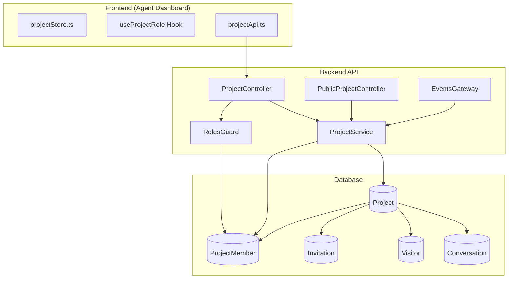

# Feature Investigation: Projects Feature

## Overview

The **Projects** feature is the **core multi-tenancy isolation unit** for the live chat application. A Project represents a distinct workspace (e.g., a website or business unit) where:

- **Visitors** (customers) connect via an embeddable chat widget
- **Conversations** are created and managed between visitors and agents
- **Users** (agents/managers) are assigned with specific roles to handle those conversations

The project model enables complete data isolation between different clients/tenants while allowing users to belong to multiple projects with different roles.

## Entry Points

| Function/Method           | File                                                                                                | Purpose                                                        |
| ------------------------- | --------------------------------------------------------------------------------------------------- | -------------------------------------------------------------- |
| `create()`                | [project.controller.ts](../../../packages/backend/src/projects/project.controller.ts)               | POST /projects - Create new project                            |
| `findAll()`               | [project.controller.ts](../../../packages/backend/src/projects/project.controller.ts)               | GET /projects - List user's projects                           |
| `update()`                | [project.controller.ts](../../../packages/backend/src/projects/project.controller.ts)               | PATCH /projects/:projectId - Update project                    |
| `getWidgetSettings()`     | [public-project.controller.ts](../../../packages/backend/src/projects/public-project.controller.ts) | GET /public/projects/:id/settings - Public endpoint for widget |
| `handleJoinProjectRoom()` | [events.gateway.ts](../../../packages/backend/src/gateway/events.gateway.ts)                        | WebSocket - Agent joins project room                           |

## Execution Flow

### 1. Project Creation Flow

1. **Step 1:** User sends POST `/projects` with `CreateProjectDto` containing project name

   - Guards: `JwtAuthGuard`, `RolesGuard`
   - Auditable with `AuditAction.CREATE`

2. **Step 2:** `ProjectService.create()` wraps in a transaction:
   - Creates `Project` entity in database
   - Creates `ProjectMember` with `role: MANAGER` for the creator
   - Returns saved project

### 2. Project Access Isolation Flow

1. **HTTP Requests:**

   - `RolesGuard` extracts `projectId` from route params ONLY (security fix)
   - Checks `ProjectMember` table (with cache) to verify user membership
   - Applies role hierarchy: MANAGER > AGENT

2. **WebSocket Connections:**
   - `handleJoinProjectRoom()` validates membership via `projectService.validateProjectMembership()`
   - Client joins Socket.IO room named `project:{projectId}`
   - All real-time events are scoped to this room

### 3. Widget Connection Flow (Public)

1. **Step 1:** Widget requests `GET /public/projects/:id/settings` with Origin header
2. **Step 2:** `getWidgetSettings()` validates:
   - Origin header must be present (fail-closed)
   - `whitelistedDomains` must be configured
   - Origin hostname must be in whitelist
3. **Step 3:** Returns widget configuration (appearance, settings)

## Data Flow



## Interfaces & Abstractions

### Core Entities

```typescript
// Project Entity (project.entity.ts)
@Entity("projects")
export class Project {
  id: number; // Auto-increment PK
  name: string; // Project display name
  widgetSettings: IWidgetSettingsDto; // JSONB - widget appearance config
  whitelistedDomains: string[]; // Array - allowed origins for widget
  autoResolveMinutes: number | null; // Auto-close inactive conversations
  conversations: Conversation[]; // OneToMany
  members: ProjectMember[]; // OneToMany
  createdAt: Date;
}
```

```typescript
// ProjectMember Entity (project-member.entity.ts)
@Entity("project_members")
@Unique(["userId", "projectId"]) // Composite unique constraint
export class ProjectMember {
  id: number;
  projectId: number; // FK to Project
  userId: string; // UUID - FK to User
  role: ProjectRole; // ENUM: 'manager' | 'agent'
  project: Project; // ManyToOne
  user: User; // ManyToOne
  createdAt: Date;
  updatedAt: Date;
}
```

### Role Enum

```typescript
// project-roles.enum.ts
export enum ProjectRole {
  MANAGER = "manager", // Can manage settings, invite members, handle conversations
  AGENT = "agent", // Can handle customer conversations only
}
```

### Key DTOs

```typescript
// CreateProjectDto
interface CreateProjectDto {
  name: string;
}

// UpdateProjectDto
interface UpdateProjectDto {
  name?: string;
  whitelistedDomains?: string[];
  autoResolveMinutes?: number | null;
}

// ProjectWithRole (returned by findAllForUser)
interface ProjectWithRole extends IProject {
  myRole: ProjectRole; // Current user's role in this project
  members: ProjectMemberDto[];
}
```

## Dependencies

### Internal Dependencies

| Dependency                                   | Type           | What It Does (Verified)                                                                                                                                               |
| -------------------------------------------- | -------------- | --------------------------------------------------------------------------------------------------------------------------------------------------------------------- |
| `ProjectService.validateProjectMembership()` | Core           | Queries `ProjectMember` table with `{ projectId, userId }` and relations `['project']`. Throws `ForbiddenException` if not found. Returns `Project` entity.           |
| `RolesGuard.canActivate()`                   | Infrastructure | Extracts `projectId` from route params ONLY (security). Checks cache first (`project_member:{projectId}:{userId}`, 60s TTL), then queries DB. Applies role hierarchy. |
| `EventsGateway.emitToProject()`              | Infrastructure | Emits event to Socket.IO room `project:{projectId}`                                                                                                                   |
| `InvitationService`                          | Core           | Creates/manages project invitations with token-based email flow                                                                                                       |

### External Dependencies

| Dependency              | Type        | Standard Behavior                        |
| ----------------------- | ----------- | ---------------------------------------- |
| `TypeORM EntityManager` | Third-Party | Database operations (CRUD, transactions) |
| `Socket.IO Server`      | Third-Party | WebSocket room management                |
| `cache-manager`         | Third-Party | In-memory caching for membership checks  |

## Error Handling

| Error                                                             | When It Occurs                | How It's Handled                        |
| ----------------------------------------------------------------- | ----------------------------- | --------------------------------------- |
| `ForbiddenException('Access to this project is denied.')`         | User not a member of project  | Thrown by `validateProjectMembership()` |
| `ForbiddenException('Access from this origin is not allowed.')`   | Widget origin not whitelisted | Thrown by `getWidgetSettings()`         |
| `NotFoundException('Project with ID ${id} not found.')`           | Project doesn't exist         | Thrown by `getWidgetSettings()`         |
| `WsException('Forbidden: You are not a member of this project.')` | Unauthorized room join        | Thrown by `handleJoinProjectRoom()`     |

## Side Effects

- **Database:**
  - `Project` record created/updated
  - `ProjectMember` record created on project creation or invitation accept
- **Cache:**

  - `project_member:{projectId}:{userId}` cached for 60 seconds in `RolesGuard`

- **Events:**

  - Real-time events scoped to `project:{projectId}` room
  - All conversation/visitor events broadcast only to project members

- **External APIs:**
  - Email sent via `MailService` for invitations

## Data Lineage (Origin → Destination)

| Data Artifact    | Origin                                     | Components in Path                   | Final Destination       |
| ---------------- | ------------------------------------------ | ------------------------------------ | ----------------------- |
| Project creation | `ProjectController.create()` (user input)  | Controller → Service → EntityManager | `projects` table        |
| ProjectMember    | `ProjectService.create()` (auto-created)   | Service → EntityManager              | `project_members` table |
| Widget Settings  | `PublicProjectController` (public request) | Controller → Service → EntityManager | HTTP Response to widget |
| Room membership  | `handleJoinProjectRoom()`                  | Gateway → Socket.IO                  | Socket.IO room state    |

### Event Flow (Emitter → Handler)

| Event Name               | Emitted By                                                          | Handled By                          | Purpose                             |
| ------------------------ | ------------------------------------------------------------------- | ----------------------------------- | ----------------------------------- |
| `conversation_updated`   | `ConversationService` via `EventsGateway.emitConversationUpdated()` | Frontend WebSocket listener         | Update inbox UI                     |
| `visitor_status_changed` | `EventsGateway`                                                     | Frontend WebSocket listener         | Show online/offline status          |
| Project room events      | Multiple services                                                   | Agent dashboard WebSocket listeners | Real-time updates scoped to project |

### Orphan Audit

> [!NOTE] > **None found** - All data producers have identified consumers:
>
> - Projects consumed by Conversations, Visitors, Invitations, ProjectMembers
> - ProjectMembers consumed by RolesGuard, ProjectService validation methods
> - Widget settings consumed by embeddable widget
> - Room events consumed by frontend WebSocket listeners

## Configuration

| Config Key               | Default                 | Purpose                                   |
| ------------------------ | ----------------------- | ----------------------------------------- |
| `whitelistedDomains`     | `[]` (empty = deny all) | Allowed origins for widget embedding      |
| `autoResolveMinutes`     | `null` (disabled)       | Auto-close conversations after inactivity |
| Cache TTL for membership | 60000ms                 | RolesGuard membership cache duration      |

## How Projects Provide Isolation

### 1. Data Isolation

Every key entity has a `projectId` foreign key:

- `Conversation.projectId → Project.id`
- `Visitor.projectId → Project.id`
- `Invitation.projectId → Project.id`
- `ProjectMember.projectId → Project.id`

Queries for conversations, visitors, etc. are always scoped by `projectId`.

### 2. Access Control Isolation

**HTTP Layer:**

- `RolesGuard` enforces that users can only access projects they are members of
- Project-specific endpoints require `projectId` in route params
- Role hierarchy: MANAGER has all AGENT permissions

**WebSocket Layer:**

- Agents join Socket.IO rooms named `project:{projectId}`
- All broadcast events use `server.to(\`project:${projectId}\`).emit(...)`
- `handleJoinProjectRoom()` validates membership before allowing room join

### 3. Widget Isolation

- Public widget endpoint validates Origin header
- `whitelistedDomains` provides domain-level access control (fail-closed)
- Each project has independent widget configuration

## Integration Points

### To Use Project Isolation in New Features

```typescript
// In a new service/controller:
import { ProjectService } from "../projects/project.service";

@Injectable()
export class NewFeatureService {
  constructor(private readonly projectService: ProjectService) {}

  async doSomething(projectId: number, userId: string) {
    // This throws ForbiddenException if user is not a member
    const project = await this.projectService.validateProjectMembership(
      projectId,
      userId
    );

    // Now safe to proceed with project-scoped operations
  }
}
```

### To Check Role Permissions

```typescript
// Check if user has specific role
const isManager = await this.projectService.hasProjectRole(userId, projectId, ProjectRole.MANAGER);

// Or use @Roles decorator on controller endpoints
@Roles(ProjectRole.MANAGER)
@Patch(':projectId/settings')
updateSettings(...) { }
```

### Frontend Integration

```typescript
// In React component:
import { useProjectRole, useIsProjectManager } from "../hooks/useProjectRole";

const MyComponent = ({ projectId }) => {
  const role = useProjectRole(projectId);
  const isManager = useIsProjectManager(projectId);

  return isManager ? <ManagerUI /> : <AgentUI />;
};
```

## Files Investigated

| File                                                                                                 | Lines Read | Key Findings                                                            |
| ---------------------------------------------------------------------------------------------------- | ---------- | ----------------------------------------------------------------------- |
| [project.entity.ts](../../../packages/backend/src/database/entities/project.entity.ts)               | L1-45      | Core entity with widgetSettings, whitelistedDomains, autoResolveMinutes |
| [project-member.entity.ts](../../../packages/backend/src/database/entities/project-member.entity.ts) | L1-56      | RBAC junction table with ProjectRole enum                               |
| [project.service.ts](../../../packages/backend/src/projects/project.service.ts)                      | L1-311     | All CRUD, validation, member management logic                           |
| [project.controller.ts](../../../packages/backend/src/projects/project.controller.ts)                | L1-168     | REST endpoints with @Roles and @Auditable decorators                    |
| [public-project.controller.ts](../../../packages/backend/src/projects/public-project.controller.ts)  | L1-26      | Public widget settings endpoint with origin validation                  |
| [project.module.ts](../../../packages/backend/src/projects/project.module.ts)                        | L1-22      | Module exports ProjectService, InvitationService                        |
| [roles.guard.ts](../../../packages/backend/src/rbac/roles.guard.ts)                                  | L1-165     | RBAC enforcement with caching and role hierarchy                        |
| [events.gateway.ts](../../../packages/backend/src/gateway/events.gateway.ts)                         | L1-479     | WebSocket room-based isolation via validateProjectMembership            |
| [project-roles.enum.ts](../../../packages/shared-types/src/project-roles.enum.ts)                    | L1-9       | MANAGER and AGENT role definitions                                      |
| [projectStore.ts](../../../packages/frontend/src/stores/projectStore.ts)                             | L1-13      | Frontend Zustand store for currentProjectId                             |
| [projectApi.ts](../../../packages/frontend/src/services/projectApi.ts)                               | L1-175     | All frontend API calls for projects/invitations/members                 |
| [useProjectRole.ts](../../../packages/frontend/src/hooks/useProjectRole.ts)                          | L1-45      | React hooks for role checking                                           |
| [conversation.entity.ts](../../../packages/backend/src/database/entities/conversation.entity.ts)     | L1-86      | Conversation scoped to projectId                                        |
| [visitor.entity.ts](../../../packages/backend/src/database/entities/visitor.entity.ts)               | L1-57      | Visitor scoped to projectId                                             |
| [invitation.entity.ts](../../../packages/backend/src/database/entities/invitation.entity.ts)         | L1-93      | Invitation with token-based workflow                                    |
