# Feature Investigation: User (Agent/Manager) Authentication Flow

## Overview

This document investigates the complete authentication flow for users (agents and managers) in the live chat application. The system implements a multi-layered authentication architecture supporting:

1. **Email/Password Authentication** with email verification
2. **OAuth (Google) Authentication** with account linking
3. **Two-Factor Authentication (2FA)** using TOTP
4. **JWT-based Session Management** with access and refresh tokens
5. **Role-Based Access Control** at both global and project levels
6. **WebSocket Authentication** for real-time features

Users in this system are stored in the `users` table and can have either a `GlobalRole` (ADMIN, USER) for system-level access, and a `ProjectRole` (MANAGER, AGENT) for project-specific permissions via the `project_members` join table.

---

## Entry Points

| Function/Method              | File                                                                                                                   | Purpose                                         |
| ---------------------------- | ---------------------------------------------------------------------------------------------------------------------- | ----------------------------------------------- |
| `POST /auth/register`        | [auth.controller.ts](../../packages/backend/src/auth/auth.controller.ts)                                               | Register new user with email/password           |
| `GET /auth/verify-email`     | [auth.controller.ts](../../packages/backend/src/auth/auth.controller.ts)                                               | Verify email with token                         |
| `POST /auth/login`           | [auth.controller.ts](../../packages/backend/src/auth/auth.controller.ts)                                               | Email/password login (with 2FA support)         |
| `GET /auth/refresh`          | [auth.controller.ts](../../packages/backend/src/auth/auth.controller.ts)                                               | Refresh access token using refresh token cookie |
| `POST /auth/logout`          | [auth.controller.ts](../../packages/backend/src/auth/auth.controller.ts)                                               | Logout from current session                     |
| `POST /auth/logout-all`      | [auth.controller.ts](../../packages/backend/src/auth/auth.controller.ts)                                               | Logout from all sessions                        |
| `GET /auth/google`           | [auth.controller.ts](../../packages/backend/src/auth/auth.controller.ts)                                               | Initiate Google OAuth login                     |
| `GET /auth/google/callback`  | [auth.controller.ts](../../packages/backend/src/auth/auth.controller.ts)                                               | Handle Google OAuth callback                    |
| `POST /auth/exchange-code`   | [auth.controller.ts](../../packages/backend/src/auth/auth.controller.ts)                                               | Exchange one-time code for tokens (OAuth)       |
| `POST /2fa/authenticate`     | [two-factor-authentication.controller.ts](../../packages/backend/src/auth/2fa/two-factor-authentication.controller.ts) | Complete 2FA verification                       |
| `POST /2fa/recover`          | [two-factor-authentication.controller.ts](../../packages/backend/src/auth/2fa/two-factor-authentication.controller.ts) | Login using 2FA recovery code                   |
| WebSocket `handleConnection` | [ws-auth.service.ts](../../packages/backend/src/gateway/services/ws-auth.service.ts)                                   | Authenticate WebSocket connections              |

---

## Execution Flow

### 1. User Registration Flow

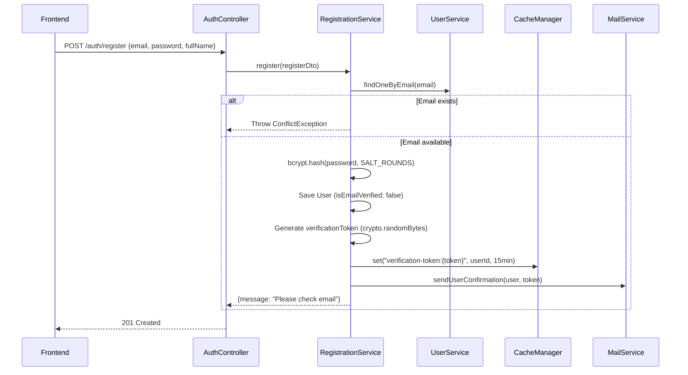

**Key Details:**

- Password is hashed using bcrypt with `BCRYPT_SALT_ROUNDS` (default: 10)
- Verification token stored in cache for 15 minutes
- User is created with `isEmailVerified: false`
- Optional `invitationToken` stored for project invitation flow

### 2. Email Verification Flow

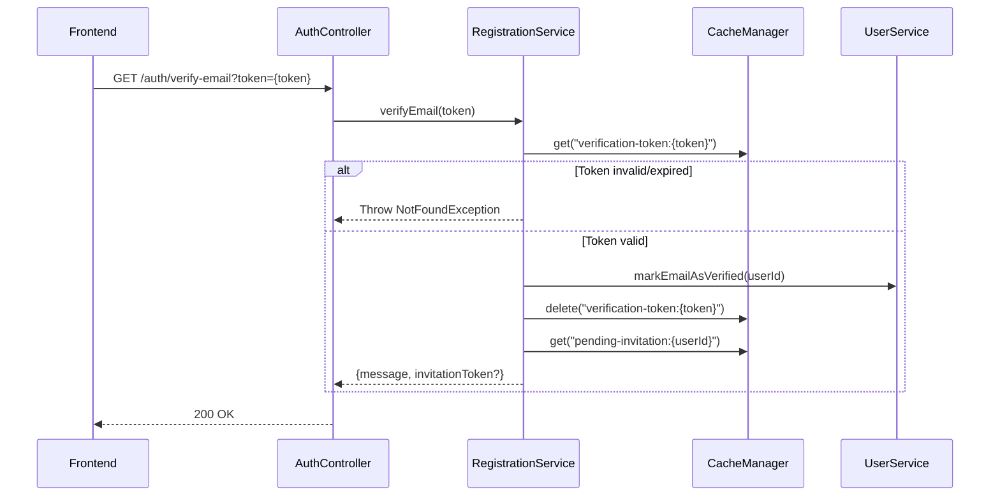

### 3. Email/Password Login Flow

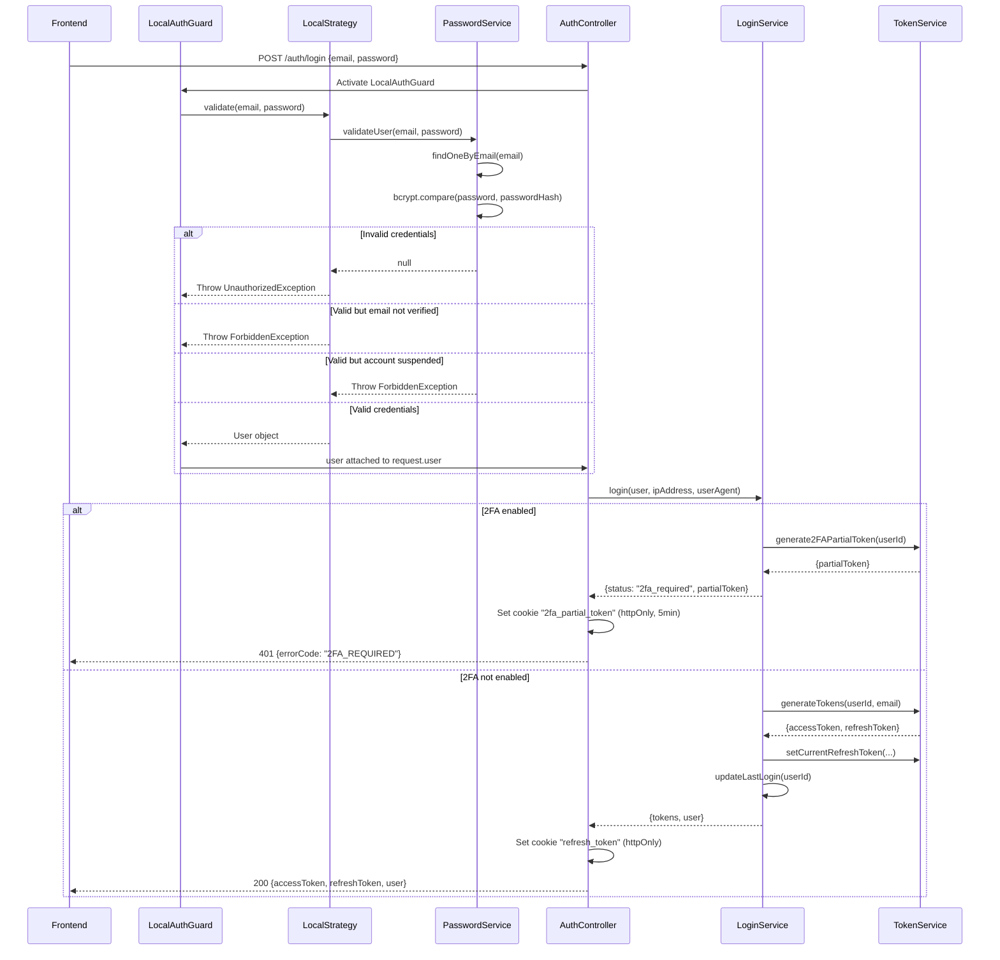

**Key Details:**

- `LocalAuthGuard` activates `LocalStrategy` (passport-local)
- `LocalStrategy` uses `PasswordService.validateUser()` to verify credentials
- Password validation checks: bcrypt compare, account status (SUSPENDED/INACTIVE/ACTIVE)
- INACTIVE users are automatically reactivated upon login
- If 2FA is enabled, a partial token is issued instead of full tokens
- Refresh token stored as bcrypt hash in `refresh_tokens` table with session metadata

### 4. Token Generation and Storage

The `TokenService` handles all token operations:

| Token Type        | Secret                       | Expiry Config                          | Storage                       |
| ----------------- | ---------------------------- | -------------------------------------- | ----------------------------- |
| Access Token      | `JWT_SECRET`                 | `JWT_EXPIRES_IN` (e.g., "15m")         | Client memory/localStorage    |
| Refresh Token     | `JWT_REFRESH_SECRET`         | `JWT_REFRESH_EXPIRES_IN` (e.g., "30d") | HttpOnly cookie + DB (hashed) |
| 2FA Partial Token | `TWO_FACTOR_AUTH_JWT_SECRET` | `TWO_FACTOR_AUTH_JWT_EXPIRES_IN`       | HttpOnly cookie               |

**JWT Payload Structure:**

```typescript
// Access Token & Refresh Token
{
  sub: string; // User ID
  email: string; // User email
  iat: number; // Issued at (auto-generated)
  exp: number; // Expiration (auto-generated)
}

// 2FA Partial Token
{
  sub: string; // User ID
  isTwoFactorAuthenticated: false; // Always false for partial
  is2FA: true; // Marker for 2FA flow
}
```

**Session Limit Enforcement:**

- Configured via `SESSION_LIMIT` environment variable (default: 5)
- When limit exceeded, oldest sessions are automatically removed
- Each refresh token stored with `ipAddress` and `userAgent` for audit

### 5. Token Refresh Flow

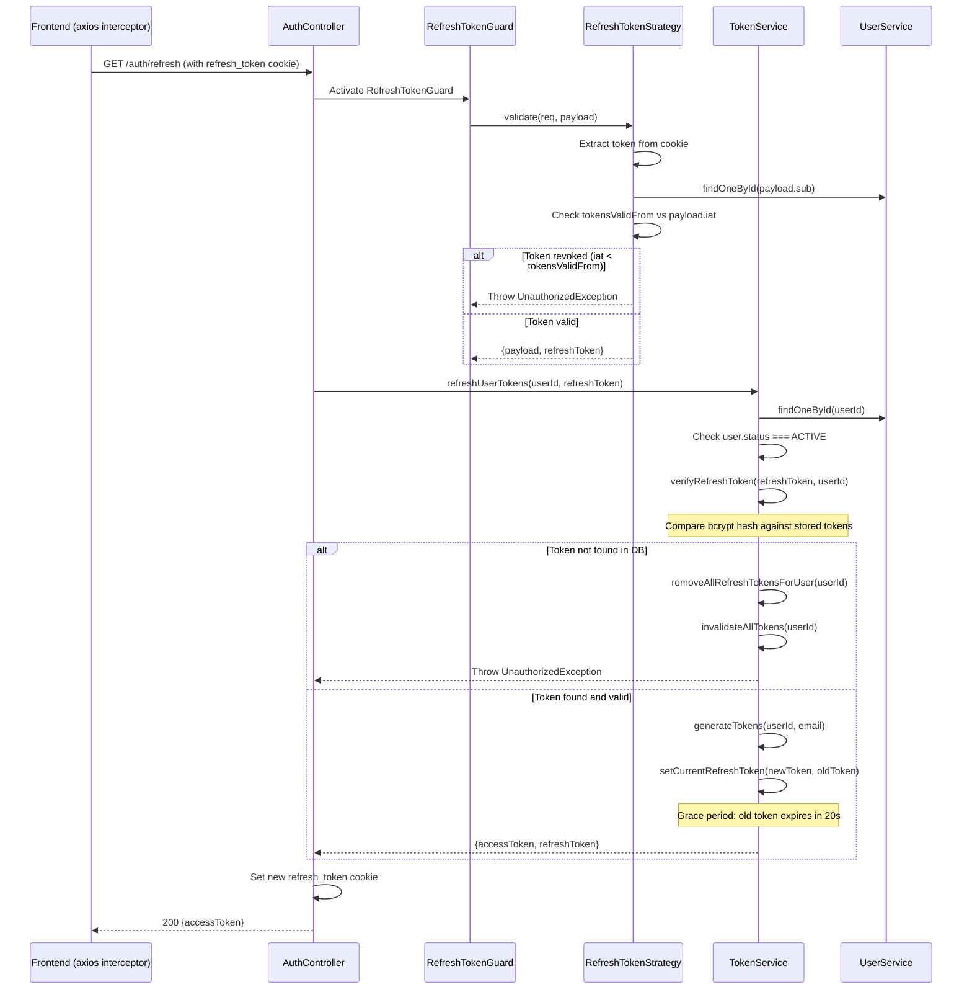

**Grace Period Implementation:**

- When rotating tokens, the old token is NOT immediately deleted
- Instead, its expiry is set to 20 seconds from now
- This prevents "infinite logout" loops from concurrent requests using the old token

### 6. Two-Factor Authentication (2FA) Flow

#### 6.1 Enabling 2FA

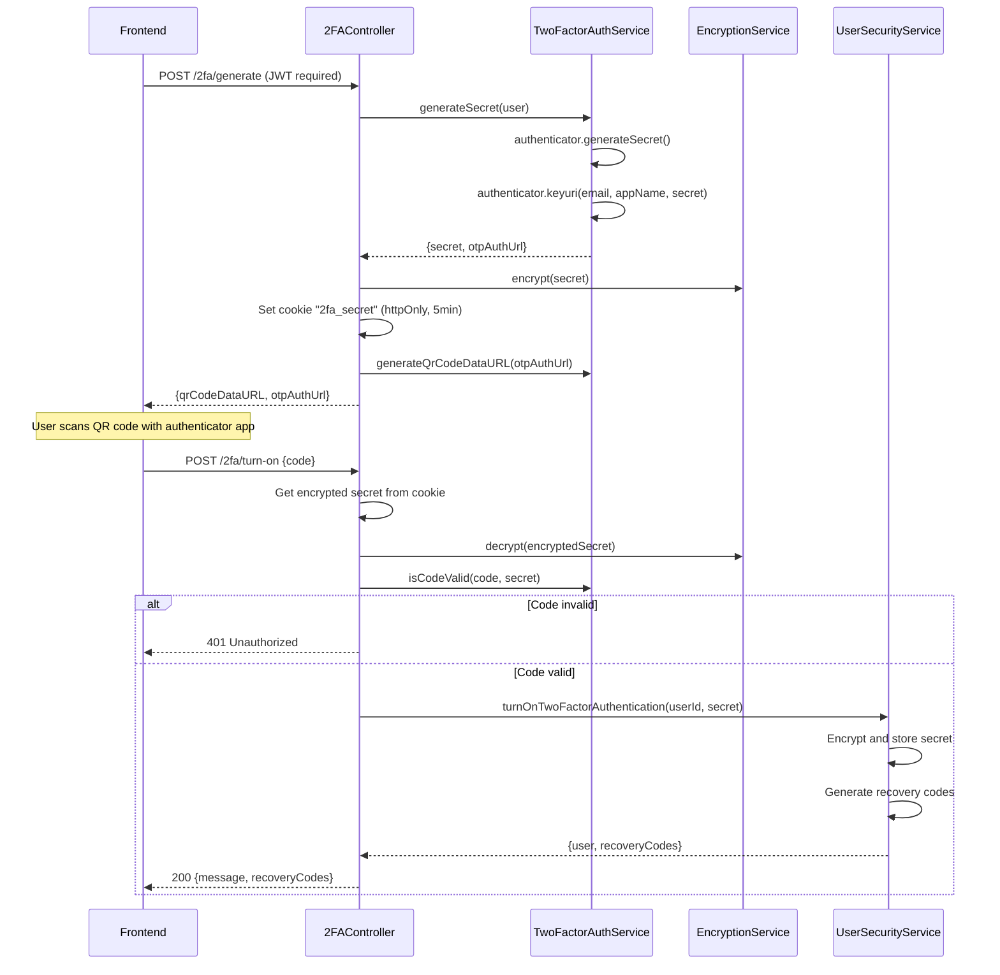

#### 6.2 Logging in with 2FA

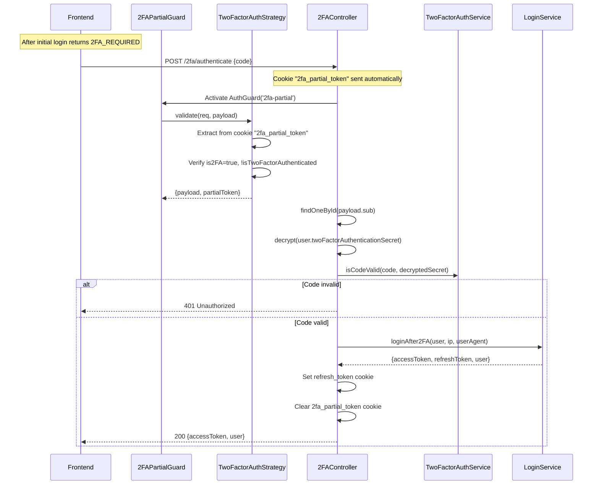

### 7. OAuth (Google) Authentication Flow

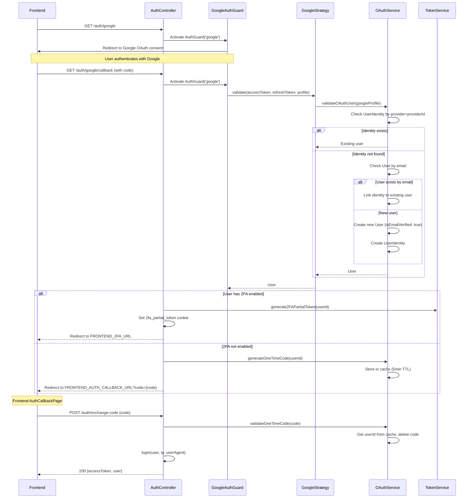

**Key Details:**

- Google profile mapped to: `provider="google"`, `providerId`, `email`, `name`, `avatarUrl`
- OAuth users created with `isEmailVerified: true` (trusted from Google)
- One-time code prevents token exposure in URL (PKCE-like flow)
- OAuth users can set a password later via `POST /auth/set-password`

### 8. Protected Route Authentication (JwtAuthGuard)

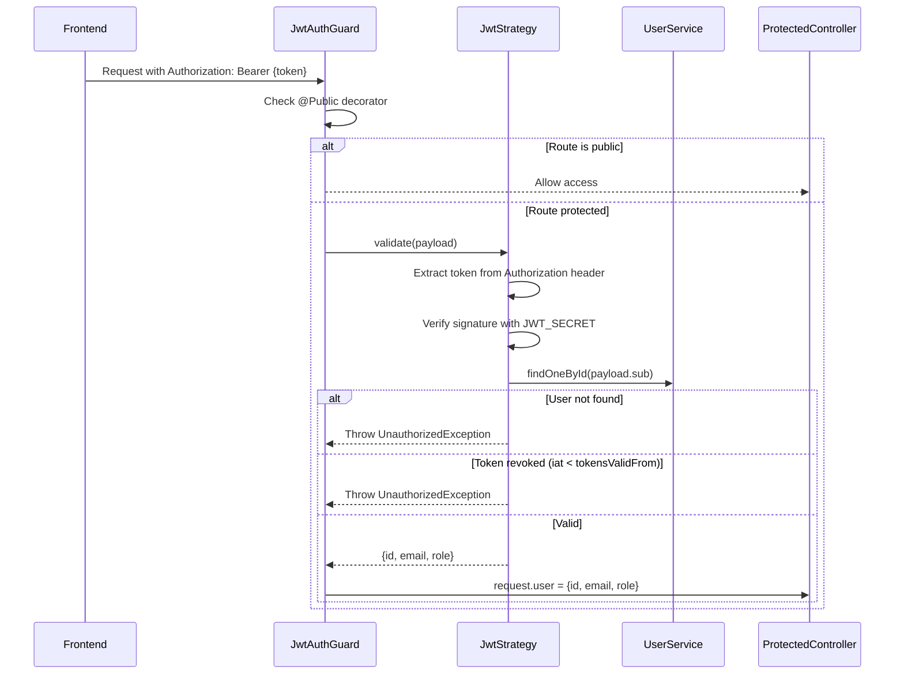

### 9. WebSocket Authentication Flow

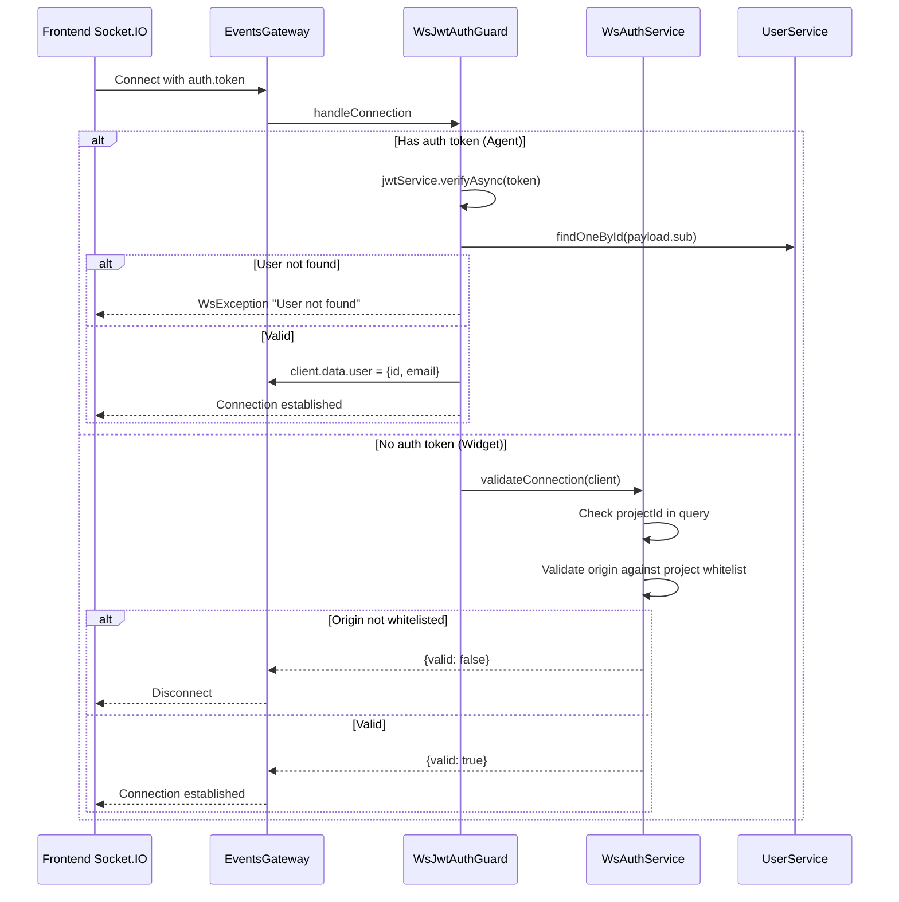

**Key Details:**

- Agents authenticate with JWT in `handshake.auth.token`
- Widgets authenticate via origin whitelist + projectId
- Token revocation checked via `tokensValidFrom` timestamp

### 10. Role-Based Authorization (RolesGuard)

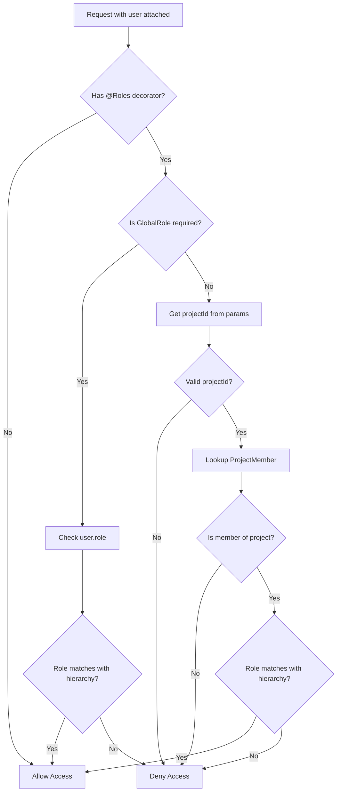

**Role Hierarchies:**

- **Global**: `ADMIN` inherits `USER` permissions
- **Project**: `MANAGER` inherits `AGENT` permissions

---

## Data Flow

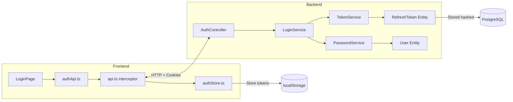

---

## Interfaces & Abstractions

### Input Types

```typescript
// Login DTO
interface LoginDto {
  email: string;
  password: string;
}

// Register DTO
interface RegisterDto {
  email: string;
  password: string;
  fullName: string;
  invitationToken?: string;
}
```

### Output Types

```typescript
// Auth Response
interface AuthResponseDto {
  accessToken: string;
  refreshToken?: string;
  user: UserResponse;
}

// User Response (safe, no passwordHash)
interface UserResponse {
  id: string;
  email: string;
  fullName: string;
  avatarUrl: string;
  role: GlobalRole;
  hasPassword: boolean;
  isTwoFactorAuthenticationEnabled: boolean;
  // ... other fields
}
```

### Key Abstractions

| Abstraction                       | Location                                                                                                  | Purpose                                  |
| --------------------------------- | --------------------------------------------------------------------------------------------------------- | ---------------------------------------- |
| `LocalStrategy`                   | [local.strategy.ts](../../packages/backend/src/auth/strategies/local.strategy.ts)                         | Email/password validation                |
| `JwtStrategy`                     | [jwt.strategy.ts](../../packages/backend/src/auth/strategies/jwt.strategy.ts)                             | Access token validation                  |
| `RefreshTokenStrategy`            | [refresh-token.strategy.ts](../../packages/backend/src/auth/strategies/refresh-token.strategy.ts)         | Refresh token validation                 |
| `TwoFactorAuthenticationStrategy` | [2fa-partial-token.strategy.ts](../../packages/backend/src/auth/strategies/2fa-partial-token.strategy.ts) | 2FA partial token validation             |
| `GoogleStrategy`                  | [google.strategy.ts](../../packages/backend/src/auth/strategies/google.strategy.ts)                       | Google OAuth validation                  |
| `TokenService`                    | [token.service.ts](../../packages/backend/src/auth/services/token.service.ts)                             | Token generation, verification, rotation |
| `RolesGuard`                      | [roles.guard.ts](../../packages/backend/src/rbac/roles.guard.ts)                                          | Role-based authorization                 |

---

## Dependencies

### Internal Dependencies

| Dependency                              | Type           | What It Does                                                           |
| --------------------------------------- | -------------- | ---------------------------------------------------------------------- |
| `TokenService.generateTokens()`         | Core           | Creates signed JWT access and refresh tokens using configured secrets  |
| `TokenService.setCurrentRefreshToken()` | Core           | Hashes and stores refresh token in DB with session limit enforcement   |
| `TokenService.verifyRefreshToken()`     | Core           | Compares raw token against all stored hashes for user, deletes expired |
| `PasswordService.validateUser()`        | Core           | Finds user by email, compares password hash, checks account status     |
| `OAuthService.validateOAuthUser()`      | Core           | Links or creates user from OAuth profile, creates UserIdentity record  |
| `EncryptionService.encrypt/decrypt()`   | Infrastructure | AES encryption for 2FA secrets (at rest)                               |
| `CacheManager.set/get/del()`            | Infrastructure | Redis/memory cache for verification tokens, one-time codes             |
| `UserService.findOneById/ByEmail()`     | Core           | Database lookup for User entity                                        |

### External Dependencies

| Dependency                       | Type        | Standard Behavior                        |
| -------------------------------- | ----------- | ---------------------------------------- |
| `@nestjs/passport`               | Third-Party | Passport.js integration for NestJS       |
| `passport-local`                 | Third-Party | Local (username/password) authentication |
| `passport-jwt`                   | Third-Party | JWT authentication strategy              |
| `passport-google-oauth20`        | Third-Party | Google OAuth 2.0 strategy                |
| `bcrypt`                         | Third-Party | Password hashing and comparison          |
| `otplib`                         | Third-Party | TOTP generation and verification for 2FA |
| `jsonwebtoken` (via @nestjs/jwt) | Third-Party | JWT signing and verification             |
| `qrcode`                         | Third-Party | QR code generation for 2FA setup         |

---

## Error Handling

| Error                   | When It Occurs                                 | How It's Handled                          |
| ----------------------- | ---------------------------------------------- | ----------------------------------------- |
| `UnauthorizedException` | Invalid credentials, invalid/expired tokens    | 401 response, frontend redirects to login |
| `ForbiddenException`    | Email not verified, account suspended          | 403 response with specific error message  |
| `ConflictException`     | Email already registered, OAuth already linked | 409 response                              |
| `NotFoundException`     | Verification token expired                     | 404 response                              |
| `BadRequestException`   | Invalid reset token, missing required fields   | 400 response                              |
| `WsException`           | Invalid WebSocket token                        | Socket disconnection with error event     |

---

## Side Effects

- **Database:**

  - User creation/update on registration and OAuth
  - RefreshToken creation/deletion on login/logout/rotation
  - UserIdentity creation on OAuth linking
  - TwoFactorRecoveryCode creation/consumption
  - `tokensValidFrom` update on "logout all" or password change

- **Cache (Redis/Memory):**

  - Verification tokens (15min TTL)
  - Password reset tokens (15min TTL)
  - One-time OAuth codes (5min TTL)
  - Project membership cache (60s TTL)

- **Cookies:**

  - `refresh_token` (HttpOnly, Secure in prod, SameSite: strict/none)
  - `2fa_partial_token` (HttpOnly, 5min expiry)
  - `2fa_secret` (HttpOnly, 5min expiry, during setup only)

- **Email:**
  - Verification email on registration
  - Password reset email on forgot password

---

## Data Lineage (Origin → Destination)

| Data Artifact      | Origin                                 | Components in Path                                         | Final Destination                      |
| ------------------ | -------------------------------------- | ---------------------------------------------------------- | -------------------------------------- |
| User credentials   | Frontend LoginPage form                | authApi → LocalAuthGuard → LocalStrategy → PasswordService | Validated against User.passwordHash    |
| Access Token       | TokenService.generateTokens()          | LoginService → AuthController → Response body              | Frontend localStorage (via authStore)  |
| Refresh Token      | TokenService.generateTokens()          | LoginService → TokenService.setCurrentRefreshToken() → DB  | HttpOnly cookie + refresh_tokens table |
| 2FA Partial Token  | TokenService.generate2FAPartialToken() | LoginService → AuthController → HttpOnly cookie            | 2fa_partial_token cookie               |
| Google Profile     | Google OAuth callback                  | GoogleStrategy → OAuthService.validateOAuthUser()          | User + UserIdentity entities           |
| Verification Token | RegistrationService.register()         | CacheManager → Email link → verifyEmail()                  | Deleted after verification             |

### Event Flow (Emitter → Handler)

| Event Name             | Emitted By            | Consumed By                    | Purpose                 |
| ---------------------- | --------------------- | ------------------------------ | ----------------------- |
| Token rotation trigger | API interceptor (401) | Frontend api.ts                | Automatic token refresh |
| Logout                 | User action           | authStore → API → TokenService | Session termination     |

### Orphan Audit

- **None found** - All data flows have clear producers and consumers

---

## Configuration

| Config Key                       | Purpose                                               |
| -------------------------------- | ----------------------------------------------------- |
| `JWT_SECRET`                     | Secret for signing access tokens                      |
| `JWT_EXPIRES_IN`                 | Access token lifetime (e.g., "15m")                   |
| `JWT_REFRESH_SECRET`             | Secret for signing refresh tokens                     |
| `JWT_REFRESH_EXPIRES_IN`         | Refresh token lifetime (e.g., "30d")                  |
| `TWO_FACTOR_AUTH_JWT_SECRET`     | Secret for signing 2FA partial tokens                 |
| `TWO_FACTOR_AUTH_JWT_EXPIRES_IN` | 2FA partial token lifetime                            |
| `TWO_FACTOR_APP_NAME`            | App name shown in authenticator (default: "LiveChat") |
| `SESSION_LIMIT`                  | Max concurrent sessions per user (default: 5)         |
| `GOOGLE_CLIENT_ID`               | Google OAuth client ID                                |
| `GOOGLE_CLIENT_SECRET`           | Google OAuth client secret                            |
| `FRONTEND_URL`                   | Frontend base URL for redirects                       |
| `FRONTEND_AUTH_CALLBACK_URL`     | OAuth callback page URL                               |
| `FRONTEND_2FA_URL`               | 2FA verification page URL                             |
| `API_BASE_URL`                   | Backend base URL for OAuth callbacks                  |

---

## Integration Points

### To Authenticate an API Request

The frontend automatically attaches the access token:

```typescript
// Frontend api.ts interceptor
api.interceptors.request.use((config) => {
  const token = useAuthStore.getState().accessToken;
  if (token) {
    config.headers.Authorization = `Bearer ${token}`;
  }
  return config;
});
```

### To Protect a Backend Endpoint

```typescript
// Apply guards and role requirements
@UseGuards(JwtAuthGuard, RolesGuard)
@Roles(ProjectRole.MANAGER)  // or GlobalRole.ADMIN
@Get(':projectId/settings')
async getSettings(@Req() req) {
  const user = req.user; // { id, email, role }
  // ...
}
```

### To Authenticate a WebSocket Connection

```typescript
// Frontend Socket.IO connection
const socket = io(API_URL, {
  auth: {
    token: accessToken, // JWT from authStore
  },
});
```

---

## Files Investigated

| File                                                                                                                   | Lines Read | Key Findings                                    |
| ---------------------------------------------------------------------------------------------------------------------- | ---------- | ----------------------------------------------- |
| [auth.controller.ts](../../packages/backend/src/auth/auth.controller.ts)                                               | 1-535      | All auth HTTP endpoints, cookie handling        |
| [login.service.ts](../../packages/backend/src/auth/services/login.service.ts)                                          | 1-109      | Login orchestration, 2FA branching              |
| [token.service.ts](../../packages/backend/src/auth/services/token.service.ts)                                          | 1-263      | Token generation, rotation, session limits      |
| [password.service.ts](../../packages/backend/src/auth/services/password.service.ts)                                    | 1-180      | Credential validation, password reset           |
| [registration.service.ts](../../packages/backend/src/auth/services/registration.service.ts)                            | 1-123      | User registration, email verification           |
| [oauth.service.ts](../../packages/backend/src/auth/services/oauth.service.ts)                                          | 1-212      | OAuth user creation/linking, one-time codes     |
| [local.strategy.ts](../../packages/backend/src/auth/strategies/local.strategy.ts)                                      | 1-49       | Email/password validation strategy              |
| [jwt.strategy.ts](../../packages/backend/src/auth/strategies/jwt.strategy.ts)                                          | 1-65       | Access token validation, revocation check       |
| [refresh-token.strategy.ts](../../packages/backend/src/auth/strategies/refresh-token.strategy.ts)                      | 1-103      | Refresh token extraction and validation         |
| [2fa-partial-token.strategy.ts](../../packages/backend/src/auth/strategies/2fa-partial-token.strategy.ts)              | 1-81       | 2FA partial token validation                    |
| [google.strategy.ts](../../packages/backend/src/auth/strategies/google.strategy.ts)                                    | 1-58       | Google OAuth profile handling                   |
| [jwt-auth.guard.ts](../../packages/backend/src/auth/guards/jwt-auth.guard.ts)                                          | 1-47       | JWT guard with @Public decorator support        |
| [local-auth.guard.ts](../../packages/backend/src/auth/guards/local-auth.guard.ts)                                      | 1-12       | Local (password) auth guard                     |
| [refresh-token.guard.ts](../../packages/backend/src/auth/guards/refresh-token.guard.ts)                                | 1-25       | Refresh token auth guard                        |
| [ws-jwt-auth.guard.ts](../../packages/backend/src/gateway/guards/ws-jwt-auth.guard.ts)                                 | 1-58       | WebSocket auth guard (agent/widget split)       |
| [ws-auth.service.ts](../../packages/backend/src/gateway/services/ws-auth.service.ts)                                   | 1-135      | WebSocket connection validation logic           |
| [two-factor-authentication.controller.ts](../../packages/backend/src/auth/2fa/two-factor-authentication.controller.ts) | 1-336      | 2FA enable/disable/authenticate endpoints       |
| [two-factor-authentication.service.ts](../../packages/backend/src/auth/2fa/two-factor-authentication.service.ts)       | 1-61       | TOTP secret generation and validation           |
| [roles.guard.ts](../../packages/backend/src/rbac/roles.guard.ts)                                                       | 1-165      | Role-based authorization with hierarchy         |
| [user.entity.ts](../../packages/backend/src/database/entities/user.entity.ts)                                          | 1-90       | User schema with auth-related fields            |
| [user-identity.entity.ts](../../packages/backend/src/database/entities/user-identity.entity.ts)                        | 1-30       | OAuth identity linking                          |
| [refresh-token.entity.ts](../../packages/backend/src/database/entities/refresh-token.entity.ts)                        | 1-41       | Refresh token storage schema                    |
| [project-member.entity.ts](../../packages/backend/src/database/entities/project-member.entity.ts)                      | 1-56       | Project role assignment                         |
| [global-roles.enum.ts](../../packages/shared-types/src/global-roles.enum.ts)                                           | 1-9        | ADMIN, USER roles                               |
| [project-roles.enum.ts](../../packages/shared-types/src/project-roles.enum.ts)                                         | 1-9        | MANAGER, AGENT roles                            |
| [authApi.ts](../../packages/frontend/src/services/authApi.ts)                                                          | 1-188      | Frontend auth API calls                         |
| [authStore.ts](../../packages/frontend/src/stores/authStore.ts)                                                        | 1-102      | Frontend auth state management                  |
| [api.ts](../../packages/frontend/src/lib/api.ts)                                                                       | 1-233      | Axios interceptors for token attachment/refresh |
| [AuthCallbackPage.tsx](../../packages/frontend/src/pages/auth/AuthCallbackPage.tsx)                                    | 1-74       | OAuth code exchange handler                     |
