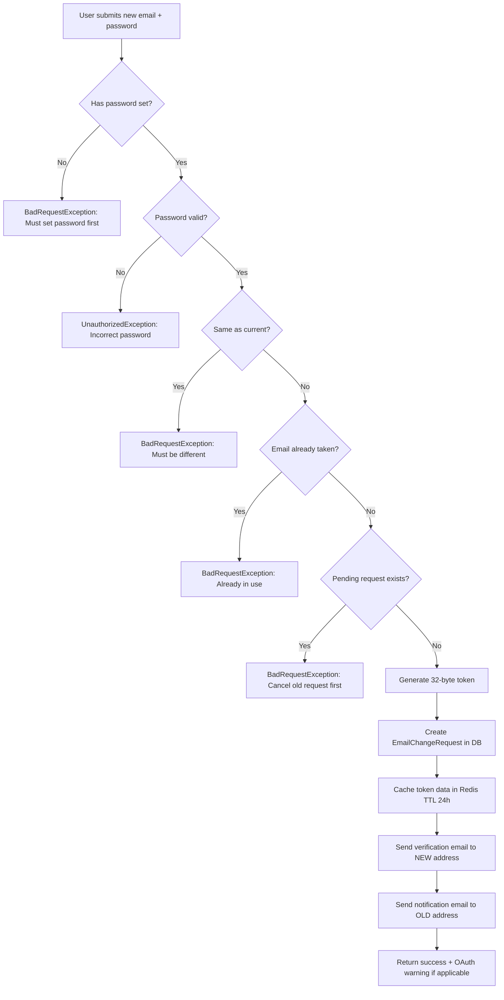
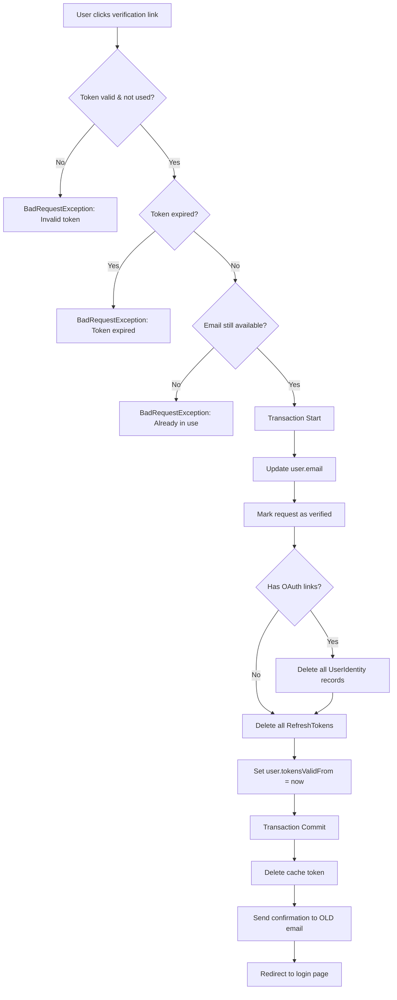
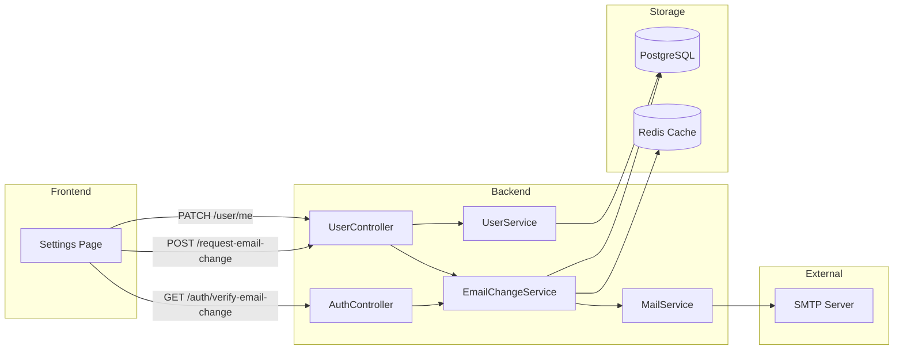

# Feature Investigation: User Profile & Settings Management

## Overview

This investigation documents the user profile and settings management flow, which allows authenticated users (agents/managers) to view and update their profile information, request email changes with verification, and deactivate their accounts. This flow is distinct from the primary authentication flow documented elsewhere.

The feature provides self-service account management capabilities, including secure email change with token-based verification that invalidates OAuth links and existing sessions upon completion.

## Entry Points

| Function/Method           | File                                                                      | Lines    | Purpose                                    |
| :------------------------ | :------------------------------------------------------------------------ | :------- | :----------------------------------------- |
| `getProfile()`            | [user.controller.ts](../../packages/backend/src/users/user.controller.ts) | L29-42   | Retrieve current user's profile            |
| `updateProfile()`         | [user.controller.ts](../../packages/backend/src/users/user.controller.ts) | L44-61   | Update profile fields (name, avatar, etc.) |
| `deactivateAccount()`     | [user.controller.ts](../../packages/backend/src/users/user.controller.ts) | L63-69   | Deactivate user account                    |
| `requestEmailChange()`    | [user.controller.ts](../../packages/backend/src/users/user.controller.ts) | L71-80   | Initiate email change with verification    |
| `getPendingEmailChange()` | [user.controller.ts](../../packages/backend/src/users/user.controller.ts) | L82-92   | Check for pending email change request     |
| `cancelEmailChange()`     | [user.controller.ts](../../packages/backend/src/users/user.controller.ts) | L94-98   | Cancel pending email change request        |
| `verifyEmailChange()`     | [auth.controller.ts](../../packages/backend/src/auth/auth.controller.ts)  | L505-533 | Verify email change via token (callback)   |

## Execution Flow

### Flow 1: Get User Profile (`GET /user/me`)

1. **Authentication Check**: `JwtAuthGuard` validates the access token
2. **Fetch User**: `UserService.findOneById(userId)` queries PostgreSQL for user record
3. **Sanitize Response**: Removes `passwordHash` from response, adds `hasPassword: boolean` flag
4. **Return**: Profile data without sensitive fields

### Flow 2: Update Profile (`PATCH /user/me`)

1. **Authentication Check**: `JwtAuthGuard` validates the access token
2. **Input Validation**: `ValidationPipe` validates `UpdateUserDto` (fullName, avatarUrl, timezone, language)
3. **Audit Logging**: `@Auditable` decorator logs action with `AuditAction.UPDATE`
4. **Update User**: `UserService.updateProfile()` runs in transaction:
   - Uses `repository.preload()` to merge updates with existing entity
   - Saves updated entity via `entityManager.save()`
5. **Sanitize Response**: Removes `passwordHash`, adds `hasPassword` flag
6. **Return**: Updated profile data

### Flow 3: Deactivate Account (`DELETE /user/me`)

1. **Authentication Check**: `JwtAuthGuard` validates the access token
2. **Audit Logging**: `@Auditable` decorator logs action with `AuditAction.DELETE`
3. **Deactivate**: `UserService.deactivate()`:
   - Fetches user by ID
   - Sets `user.status = UserStatus.INACTIVE`
   - Saves to database
4. **Return**: `{ message: 'Your account has been deactivated successfully.' }`

### Flow 4: Request Email Change (`POST /user/request-email-change`)



1. **Password Verification**: Validates current password with bcrypt
2. **Uniqueness Checks**: Ensures new email differs and isn't taken
3. **Pending Request Check**: Prevents multiple concurrent requests
4. **Token Generation**: `crypto.randomBytes(32).toString('hex')`
5. **Database Record**: Creates `EmailChangeRequest` entity (24h expiry)
6. **Cache Storage**: Stores `{ userId, newEmail, oldEmail }` in cache with key `email-change:${token}`
7. **Email Notifications**:
   - Verification email → new address (contains verification link)
   - Notification email → old address (security alert)
8. **OAuth Warning**: If user has linked OAuth accounts, warns they will be unlinked

### Flow 5: Verify Email Change (`GET /auth/verify-email-change?token=xxx`)



1. **Token Validation**: Finds unverified, uncancelled request by token
2. **Expiry Check**: Ensures token hasn't expired (24h limit)
3. **Re-validation**: Confirms new email is still available
4. **Atomic Transaction**:
   - Updates user's email
   - Marks request as verified
   - Deletes all OAuth identities (if any)
   - Deletes all refresh tokens
   - Sets `tokensValidFrom` to invalidate all access tokens
5. **Cleanup**: Removes token from cache
6. **Confirmation**: Sends email to old address confirming change
7. **Redirect**: Sends user to `${FRONTEND_URL}/login?emailChanged=true&newEmail=xxx`

## Data Flow



## Interfaces & Abstractions

### Input Types

```typescript
// Profile update fields
interface UpdateUserDto {
  fullName?: string; // User's display name
  avatarUrl?: string; // URL to avatar image (validated as URL)
  timezone?: string; // e.g., 'Asia/Ho_Chi_Minh'
  language?: string; // e.g., 'en-US'
}

// Email change request
interface EmailChangeDto {
  newEmail: string; // Destination email address
  password: string; // Current password for verification
}
```

### Output Types

```typescript
// Profile response (passwordHash excluded)
interface ProfileResponse {
  id: string;
  email: string;
  fullName: string;
  avatarUrl?: string;
  timezone?: string;
  language?: string;
  status: UserStatus;
  isEmailVerified: boolean;
  isTwoFactorAuthenticationEnabled: boolean;
  hasPassword: boolean; // Computed from !!passwordHash
  // ... other User fields
}

// Email change request response
interface EmailChangeResponse {
  message: string;
  newEmail: string;
  warning?: string; // OAuth unlink warning if applicable
}
```

### Key Abstractions

| Abstraction          | Location                                                                                     | Purpose                 | Key Methods                                                          |
| :------------------- | :------------------------------------------------------------------------------------------- | :---------------------- | :------------------------------------------------------------------- |
| `UserService`        | [user.service.ts](../../packages/backend/src/users/user.service.ts)                          | User CRUD operations    | `findOneById()`, `updateProfile()`, `deactivate()`                   |
| `EmailChangeService` | [email-change.service.ts](../../packages/backend/src/users/services/email-change.service.ts) | Email change workflow   | `requestEmailChange()`, `verifyEmailChange()`, `cancelEmailChange()` |
| `MailService`        | [mail.service.ts](../../packages/backend/src/mail/mail.service.ts)                           | Email delivery via SMTP | `sendEmailChangeVerification()`, `sendEmailChangeNotification()`     |

## Dependencies

### Internal Dependencies

| Dependency                                  | Type           | What It Does                                                           |
| :------------------------------------------ | :------------- | :--------------------------------------------------------------------- |
| `UserService.findOneById()`                 | Core           | Queries PostgreSQL for user by ID, throws Error if not found           |
| `UserService.updateProfile()`               | Core           | Transaction: preloads entity with updates, saves via EntityManager     |
| `UserService.deactivate()`                  | Core           | Sets `user.status = UserStatus.INACTIVE`, saves to DB                  |
| `EmailChangeService.requestEmailChange()`   | Core           | Validates password, creates DB record + cache, sends 2 emails          |
| `EmailChangeService.verifyEmailChange()`    | Core           | Transaction: updates email, deletes OAuth + tokens, sends confirmation |
| `cacheManager.set()`                        | Infrastructure | Stores JSON data in Redis with TTL (24h for email change tokens)       |
| `cacheManager.del()`                        | Infrastructure | Removes key from Redis cache                                           |
| `MailService.sendEmailChangeVerification()` | Infrastructure | Sends verification email to NEW address via SMTP                       |
| `MailService.sendEmailChangeNotification()` | Infrastructure | Sends notification email to OLD address via SMTP                       |

### External Dependencies

| Dependency              | Type        | Standard Behavior                               |
| :---------------------- | :---------- | :---------------------------------------------- |
| `bcrypt.compare()`      | Third-Party | Compares plaintext password against hash        |
| `crypto.randomBytes()`  | Third-Party | Generates cryptographically secure random bytes |
| `nodemailer.sendMail()` | Third-Party | Sends email via configured SMTP transport       |

## Error Handling

| Error                   | When It Occurs                     | How It's Handled               |
| :---------------------- | :--------------------------------- | :----------------------------- |
| `Error: User not found` | User ID doesn't exist in DB        | Propagated to caller (500)     |
| `BadRequestException`   | No password set for email change   | Returns 400 with message       |
| `UnauthorizedException` | Incorrect current password         | Returns 401 with message       |
| `BadRequestException`   | New email same as current          | Returns 400 with message       |
| `BadRequestException`   | Email already taken                | Returns 400 with message       |
| `BadRequestException`   | Pending request already exists     | Returns 400 with message       |
| `BadRequestException`   | Email send failure                 | Returns 400, request NOT saved |
| `BadRequestException`   | Invalid/expired verification token | Returns 400 with message       |

## Side Effects

- **Database (PostgreSQL)**:

  - `user` table: Profile updates, email changes, status changes, `tokensValidFrom` updates
  - `email_change_requests` table: Request creation, verification marking, cancellation
  - `user_identities` table: Deletion of all OAuth links upon email change
  - `refresh_tokens` table: Deletion of all tokens upon email change

- **Cache (Redis)**:

  - Key `email-change:${token}`: Stores email change metadata for 24h

- **Events**: None emitted

- **External APIs**:
  - SMTP server: Verification, notification, and confirmation emails

## Data Lineage (Origin → Destination)

| Data Artifact        | Origin                 | Components in Path                                 | Final Destination               |
| :------------------- | :--------------------- | :------------------------------------------------- | :------------------------------ |
| `UpdateUserDto`      | HTTP Request Body      | `UserController` → `UserService` → `EntityManager` | `user` table in PostgreSQL      |
| `EmailChangeDto`     | HTTP Request Body      | `UserController` → `EmailChangeService`            | Validation only (not persisted) |
| `EmailChangeRequest` | `EmailChangeService`   | Service → EntityManager → PostgreSQL               | `email_change_requests` table   |
| `email-change:token` | `EmailChangeService`   | Service → CacheManager → Redis                     | Redis cache (TTL 24h)           |
| Verification Email   | `EmailTemplateService` | `EmailChangeService` → `MailService` → Nodemailer  | User's new email inbox          |

### Event Flow (Emitter → Handler)

| Event Name | Emitted By | Handled By | Purpose |
| :--------- | :--------- | :--------- | :------ |
| (none)     | —          | —          | —       |

### Orphan Audit

> [!NOTE]
> No orphaned events, producers, or consumers found. All data artifacts have clear destinations.

## Configuration

| Config Key          | Default | Purpose                                       |
| :------------------ | :------ | :-------------------------------------------- |
| `MAIL_HOST`         | —       | SMTP server hostname                          |
| `MAIL_PORT`         | —       | SMTP server port                              |
| `MAIL_SECURE`       | —       | Use TLS for SMTP                              |
| `MAIL_USER`         | —       | SMTP authentication username                  |
| `MAIL_APP_PASSWORD` | —       | SMTP authentication password                  |
| `API_BASE_URL`      | —       | Base URL for verification links               |
| `FRONTEND_URL`      | —       | Frontend URL for redirects after verification |

## Integration Points

### To Call This Feature

```typescript
// Update profile
const response = await fetch("/user/me", {
  method: "PATCH",
  headers: {
    Authorization: `Bearer ${accessToken}`,
    "Content-Type": "application/json",
  },
  body: JSON.stringify({ fullName: "New Name" }),
});

// Request email change
const response = await fetch("/user/request-email-change", {
  method: "POST",
  headers: {
    Authorization: `Bearer ${accessToken}`,
    "Content-Type": "application/json",
  },
  body: JSON.stringify({
    newEmail: "new@example.com",
    password: "currentPassword123",
  }),
});
```

### Security Considerations

1. **Email change requires current password** - Prevents unauthorized email takeover
2. **OAuth links are deleted on email change** - Prevents orphaned identity associations
3. **All sessions invalidated on email change** - Forces re-authentication with new email
4. **Token expiry (24h)** - Limits window for token abuse
5. **Audit logging** - All profile updates and email changes are logged via `@Auditable`

## Files Investigated

| File                                                                                                          | Lines Read | Key Findings                                 |
| :------------------------------------------------------------------------------------------------------------ | :--------- | :------------------------------------------- |
| [user.controller.ts](../../packages/backend/src/users/user.controller.ts)                                     | L1-100     | All profile/settings endpoints               |
| [user.service.ts](../../packages/backend/src/users/user.service.ts)                                           | L1-90      | CRUD operations with transactions            |
| [email-change.service.ts](../../packages/backend/src/users/services/email-change.service.ts)                  | L1-302     | Complete email change flow with verification |
| [auth.controller.ts](../../packages/backend/src/auth/auth.controller.ts)                                      | L505-533   | Email verification callback endpoint         |
| [mail.service.ts](../../packages/backend/src/mail/mail.service.ts)                                            | L1-118     | SMTP email delivery methods                  |
| [update-user-dto.ts](../../packages/shared-dtos/src/update-user-dto.ts)                                       | L1-25      | Profile update validation schema             |
| [email-change-request.entity.ts](../../packages/backend/src/database/entities/email-change-request.entity.ts) | L1-63      | Entity structure for email change requests   |
