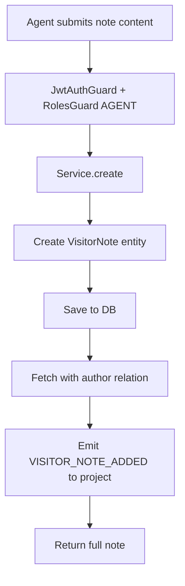
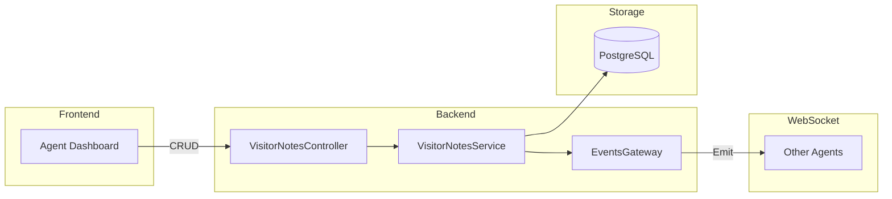

# Feature Investigation: Visitor Notes

## Overview

Visitor notes allow agents to add private notes about visitors. These notes are visible to all agents in the project and help provide context when handling conversations. Notes are tied to visitors (not conversations) and persist across sessions.

The feature includes real-time updates via WebSocket, so all connected agents see note changes immediately.

## Entry Points

| Function/Method | File                                                                                                | Lines  | Purpose                    |
| :-------------- | :-------------------------------------------------------------------------------------------------- | :----- | :------------------------- |
| `create()`      | [visitor-notes.controller.ts](../../packages/backend/src/visitor-notes/visitor-notes.controller.ts) | L16-25 | Add note to visitor        |
| `findAll()`     | [visitor-notes.controller.ts](../../packages/backend/src/visitor-notes/visitor-notes.controller.ts) | L27-34 | List all notes for visitor |
| `update()`      | [visitor-notes.controller.ts](../../packages/backend/src/visitor-notes/visitor-notes.controller.ts) | L36-44 | Update note content        |
| `remove()`      | [visitor-notes.controller.ts](../../packages/backend/src/visitor-notes/visitor-notes.controller.ts) | L46-53 | Delete note                |

## Execution Flow

### Flow 1: Create Note (`POST /projects/:projectId/visitors/:visitorId/notes`)



1. **Authorization**: Requires `AGENT` role (or higher)
2. **Entity Creation**: Sets `visitorId`, `authorId` (from JWT), `content`
3. **Refetch**: Gets saved note with `author` relation populated
4. **Real-time**: Emits `VISITOR_NOTE_ADDED` to project WebSocket channel

### Flow 2: List Notes (`GET /projects/:projectId/visitors/:visitorId/notes`)

1. **Query**: `find()` with visitor.projectId check, includes author
2. **Order**: Newest first (`createdAt: DESC`)
3. **Returns**: Array of notes with author populated

### Flow 3: Update Note (`PATCH /projects/:projectId/visitors/:visitorId/notes/:id`)

1. **Lookup**: `findOne()` with project validation
2. **Update**: Merges content if provided
3. **Save**: Persists changes
4. **Real-time**: Emits `VISITOR_NOTE_UPDATED` to project

### Flow 4: Delete Note (`DELETE /projects/:projectId/visitors/:visitorId/notes/:id`)

1. **Lookup**: `findOne()` with project validation
2. **Delete**: `remove()` via TypeORM
3. **Real-time**: Emits `VISITOR_NOTE_DELETED` with noteId

## Data Flow



## Interfaces & Abstractions

### Input Types

```typescript
// Create note
interface CreateVisitorNoteDto {
  content: string; // Max 2000 chars
}

// Update note (partial)
type UpdateVisitorNoteDto = Partial<CreateVisitorNoteDto>;
```

### Output Types

```typescript
interface VisitorNote {
  id: string; // UUID
  visitorId: number;
  authorId: string; // UUID of agent who wrote
  author: User; // Populated relation
  content: string;
  createdAt: Date;
  updatedAt: Date;
}
```

### Key Abstractions

| Abstraction           | Location                                                                                      | Purpose        | Key Methods                                     |
| :-------------------- | :-------------------------------------------------------------------------------------------- | :------------- | :---------------------------------------------- |
| `VisitorNotesService` | [visitor-notes.service.ts](../../packages/backend/src/visitor-notes/visitor-notes.service.ts) | CRUD + events  | `create()`, `findAll()`, `update()`, `remove()` |
| `EventsGateway`       | [events.gateway.ts](../../packages/backend/src/gateway/events.gateway.ts)                     | WebSocket emit | `emitToProject()`                               |

## Dependencies

### Internal Dependencies

| Dependency                      | Type           | What It Does                                          |
| :------------------------------ | :------------- | :---------------------------------------------------- |
| `VisitorNotesService.findOne()` | Core           | Queries note by id + visitor.projectId, throws 404    |
| `EventsGateway.emitToProject()` | Infrastructure | Broadcasts WebSocket event to all project connections |

### External Dependencies

| Dependency           | Type        | Standard Behavior |
| :------------------- | :---------- | :---------------- |
| `TypeORM Repository` | Third-Party | Standard CRUD     |

## Error Handling

| Error                | When It Occurs        | How It's Handled |
| :------------------- | :-------------------- | :--------------- |
| `NotFoundException`  | Note ID not found     | Returns 404      |
| `ForbiddenException` | User lacks AGENT role | Returns 403      |

## Side Effects

- **Database (PostgreSQL)**:

  - `visitor_notes` table: Create, update, delete operations

- **Cache (Redis)**: None

- **WebSocket Events Emitted**:
  - `VISITOR_NOTE_ADDED` - Payload: `{ visitorId, note }`
  - `VISITOR_NOTE_UPDATED` - Payload: `{ visitorId, note }`
  - `VISITOR_NOTE_DELETED` - Payload: `{ visitorId, noteId }`

## Data Lineage (Origin → Destination)

| Data Artifact          | Origin       | Components in Path          | Final Destination            |
| :--------------------- | :----------- | :-------------------------- | :--------------------------- |
| `CreateVisitorNoteDto` | HTTP Request | Controller → Service → Repo | `visitor_notes` table        |
| Note created event     | Service      | EventsGateway               | Agent dashboards (WebSocket) |

### Event Flow (Emitter → Handler)

| Event Name             | Emitted By                | Handled By                | Purpose                |
| :--------------------- | :------------------------ | :------------------------ | :--------------------- |
| `VISITOR_NOTE_ADDED`   | `VisitorNotesService:L29` | Frontend WebSocket client | Update UI in real-time |
| `VISITOR_NOTE_UPDATED` | `VisitorNotesService:L70` | Frontend WebSocket client | Update UI in real-time |
| `VISITOR_NOTE_DELETED` | `VisitorNotesService:L82` | Frontend WebSocket client | Update UI in real-time |

### Orphan Audit

> [!NOTE]
> No orphaned events. WebSocket events are consumed by frontend clients connected to the project channel.

## Configuration

| Config Key | Default | Purpose |
| :--------- | :------ | :------ |
| (none)     | —       | —       |

## Integration Points

### To Manage Visitor Notes

```typescript
// List notes
const notes = await fetch(
  `/projects/${projectId}/visitors/${visitorId}/notes`,
  { headers: { Authorization: `Bearer ${accessToken}` } }
);

// Add note
await fetch(`/projects/${projectId}/visitors/${visitorId}/notes`, {
  method: "POST",
  headers: {
    Authorization: `Bearer ${accessToken}`,
    "Content-Type": "application/json",
  },
  body: JSON.stringify({ content: "VIP customer, handle with care" }),
});

// Update note
await fetch(`/projects/${projectId}/visitors/${visitorId}/notes/${noteId}`, {
  method: "PATCH",
  headers: {
    Authorization: `Bearer ${accessToken}`,
    "Content-Type": "application/json",
  },
  body: JSON.stringify({ content: "Updated note text" }),
});

// Delete note
await fetch(`/projects/${projectId}/visitors/${visitorId}/notes/${noteId}`, {
  method: "DELETE",
  headers: { Authorization: `Bearer ${accessToken}` },
});
```

## Files Investigated

| File                                                                                                | Lines Read | Key Findings                           |
| :-------------------------------------------------------------------------------------------------- | :--------- | :------------------------------------- |
| [visitor-notes.controller.ts](../../packages/backend/src/visitor-notes/visitor-notes.controller.ts) | L1-55      | CRUD endpoints with AGENT role         |
| [visitor-notes.service.ts](../../packages/backend/src/visitor-notes/visitor-notes.service.ts)       | L1-88      | CRUD + WebSocket events                |
| [visitor-note.entity.ts](../../packages/backend/src/database/entities/visitor-note.entity.ts)       | L1-33      | Entity with visitor + author relations |
| [visitor-note.dto.ts](../../packages/shared-dtos/src/visitor-note.dto.ts)                           | L1-12      | Content validation (max 2000 chars)    |
