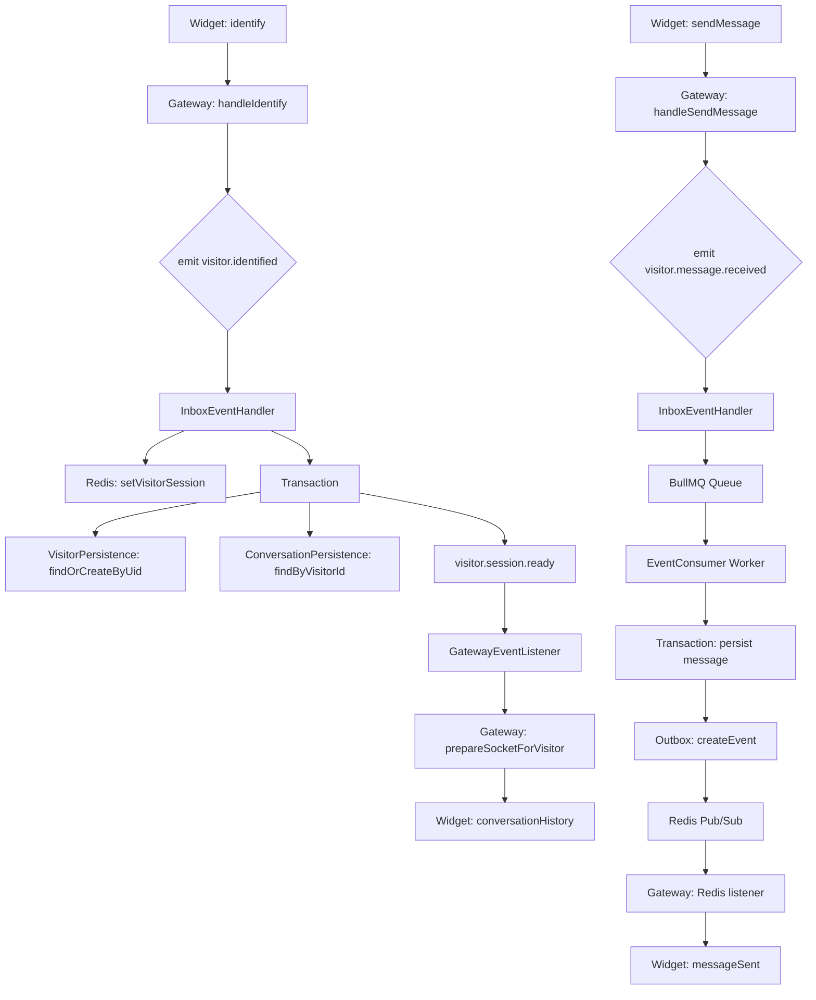

# Feature Investigation: Visitor Session Management

## Overview

This investigation traces the visitor identification and session management flow after a WebSocket connection is established. The flow handles visitor creation/lookup, conversation retrieval, Redis session storage, and message processing through a BullMQ worker. The design uses **lazy conversation creation** (conversation created on first message, not on identify) and supports configurable **history visibility modes**.

## Requirement Traceability

### User Story
**As a** visitor, **I want** my chat session and history to persist across page refreshes and navigations, **so that** I can continue my support conversation without repeating information.

### Acceptance Criteria
1. Persistence of visitor identity via UID in browser localStorage.
2. Retrieval of previous messages based on project `historyVisibility` settings.
3. Redis-backed real-time session tracking with a 3-day TTL.
4. Guaranteed message delivery confirmation using a worker-driven processing flow.

## Verification
- **Unit Tests**: `packages/backend/src/realtime-session/realtime-session.service.spec.ts`
- **E2E Tests**: `packages/backend/test/visitors.e2e-spec.ts`, `packages/backend/test/chat.e2e-spec.ts`

## Entry Points

| Function/Method               | File                                                                                                    | Purpose                  |
| ----------------------------- | ------------------------------------------------------------------------------------------------------- | ------------------------ |
| `handleIdentify()`            | [events.gateway.ts](../../../packages/backend/src/gateway/events.gateway.ts)#L209                       | Gateway identify handler |
| `handleVisitorIdentified()`   | [inbox-event.handler.ts](../../../packages/backend/src/inbox/inbox-event.handler.ts)#L79                | Domain event handler     |
| `handleVisitorSessionReady()` | [gateway.event-listener.ts](../../../packages/backend/src/gateway/gateway.event-listener.ts)#L57        | Event listener           |
| `processEvent()`              | [event-consumer.service.ts](../../../packages/backend/src/event-consumer/event-consumer.service.ts)#L33 | BullMQ worker            |

## Execution Flow

### Phase 1: Gateway Identify Handler

1. **Widget emits identify** ([socketService.ts](../../../packages/frontend/src/widget/services/socketService.ts)#L287-300)

   - Calls: `socket.emit(WebSocketEvent.IDENTIFY, { projectId, visitorUid })`

2. **Gateway receives identify** ([events.gateway.ts](../../../packages/backend/src/gateway/events.gateway.ts)#L209-232)
   - Creates: `VisitorIdentifiedEvent` with `projectId`, `visitorUid`, `socketId`
   - Calls: `eventEmitter.emit('visitor.identified', event)`
   - Calls: `emitVisitorStatusChanged(projectId, visitorUid, true)` — Broadcasts to `project:${projectId}` room
   - Calls: `eventEmitter.emit('visitor.connected', connectedEvent)` — Triggers automations

### Phase 2: Session & Visitor Creation

3. **InboxEventHandler receives event** ([inbox-event.handler.ts](../../../packages/backend/src/inbox/inbox-event.handler.ts)#L79-145)

   - Calls: `realtimeSessionService.setVisitorSession(visitorUid, socketId)`
   - Side effect: Redis key `session:visitor:${visitorUid}` set to `socketId` with 3-day TTL

4. **Database transaction** ([inbox-event.handler.ts](../../../packages/backend/src/inbox/inbox-event.handler.ts)#L90-119)

   - Calls: `visitorService.findOrCreateByUid(projectId, visitorUid, manager)`
   - Calls: `projectRepo.findOne()` to get `widgetSettings.historyVisibility`
   - Calls: `conversationService.findConversationForWidget(projectId, visitorId, manager, historyMode)`

5. **Visitor persistence** ([visitor.persistence.service.ts](../../../packages/backend/src/inbox/services/persistence/visitor.persistence.service.ts)#L16-43)

   - Query: `manager.findOne(Visitor, { where: { visitorUid } })`
   - If not found: Creates new visitor with `displayName: "Visitor #${visitorUid.substring(0,6)}"`
   - Always: Updates `lastSeenAt` to current timestamp

6. **Conversation lookup** ([conversation.persistence.service.ts](../../../packages/backend/src/inbox/services/persistence/conversation.persistence.service.ts)#L19-57)
   - Mode `'forever'`: Finds most recent conversation NOT in SPAM status
   - Mode `'limit_to_active'` (default): Finds conversation with status OPEN or PENDING
   - Returns `null` if no matching conversation (lazy creation)

### Phase 3: History Delivery

7. **Prepare messages for frontend** ([inbox-event.handler.ts](../../../packages/backend/src/inbox/inbox-event.handler.ts)#L121-135)

   - Maps: `conversation.messages` → `WidgetMessageDto[]`
   - Include: `id`, `content`, `sender.type`, `status`, `timestamp`, `contentType`, `metadata`

8. **Emit session ready** ([inbox-event.handler.ts](../../../packages/backend/src/inbox/inbox-event.handler.ts)#L137-144)

   - Creates: `VisitorSessionReadyEvent` with `socketId`, `visitor`, `conversation`, `messages`
   - Calls: `eventEmitter.emit('visitor.session.ready', event)`

9. **Gateway listener routes event** ([gateway.event-listener.ts](../../../packages/backend/src/gateway/gateway.event-listener.ts)#L57-67)

   - Calls: `eventsGateway.prepareSocketForVisitor(socketId, visitor, conversation, projectId, visitorUid, messages)`

10. **Socket prepared and history sent** ([events.gateway.ts](../../../packages/backend/src/gateway/events.gateway.ts)#L159-207)
    - Sets: `socket.data.projectId`, `socket.data.visitorUid`, `socket.data.visitorId`, `socket.data.conversationId`
    - Emits: `socket.emit(WebSocketEvent.CONVERSATION_HISTORY, { messages })`

### Phase 4: Message Processing (Worker)

11. **Message queued** ([inbox-event.handler.ts](../../../packages/backend/src/inbox/inbox-event.handler.ts)#L147-175)

    - Calls: `bullMqProducerService.sendMessage(eventPayload)`
    - Queue: `live-chat-events-queue`
    - Payload type: `WorkerEventTypes.NEW_MESSAGE_FROM_VISITOR`

12. **Worker processes job** ([event-consumer.service.ts](../../../packages/backend/src/event-consumer/event-consumer.service.ts)#L54-133)

    - Transaction:
      - Calls: `visitorPersistenceService.findOrCreateByUid()` — Re-fetch visitor
      - Calls: `conversationPersistenceService.findOrCreateByVisitorId()` — Creates conversation if null
      - Calls: `messagePersistenceService.createMessage()` — Persist message
      - Calls: `conversationPersistenceService.updateLastMessage()` — Update conversation metadata
      - Calls: `outboxPersistenceService.createEvent()` — Insert into outbox for Redis pub

13. **Outbox processor publishes to Redis** (via outbox pattern)

    - Publishes to: `NEW_MESSAGE_CHANNEL`
    - Payload: `{ message, tempId, visitorUid, projectId }`

14. **Gateway receives Redis message** ([inbox-event.handler.ts](../../../packages/backend/src/inbox/inbox-event.handler.ts)#L177-255)

    - Calls: `realtimeSessionService.getVisitorSession(visitorUid)` — Get socketId
    - Emits: `visitor.message.processed` event

15. **Widget receives confirmation** ([gateway.event-listener.ts](../../../packages/backend/src/gateway/gateway.event-listener.ts)#L69-72)
    - Calls: `eventsGateway.visitorMessageSent(socketId, { tempId, finalMessage })`
    - Emits: `WebSocketEvent.MESSAGE_SENT` to widget

## Data Flow



## Interfaces & Abstractions

### Input Types

```typescript
class VisitorIdentifiedEvent {
  projectId: number;
  visitorUid: string;
  socketId: string;
}

class VisitorSessionReadyEvent {
  socketId: string;
  visitor: Visitor;
  conversation: Conversation | null;
  projectId: number;
  visitorUid: string;
  messages: WidgetMessageDto[];
}

interface NewMessageFromVisitorPayload {
  tempId: string;
  content: string;
  visitorUid: string;
  projectId: number;
  socketId: string;
  sessionMetadata?: VisitorSessionMetadata;
}
```

### Output Types

```typescript
interface ConversationHistoryPayload {
  messages: WidgetMessageDto[];
}

interface MessageSentPayload {
  tempId: string;
  finalMessage: WidgetMessageDto;
}
```

### Key Abstractions

| Abstraction                      | Location                                                                                                                            | Purpose           | Key Methods                                                             |
| -------------------------------- | ----------------------------------------------------------------------------------------------------------------------------------- | ----------------- | ----------------------------------------------------------------------- |
| `VisitorPersistenceService`      | [visitor.persistence.service.ts](../../../packages/backend/src/inbox/services/persistence/visitor.persistence.service.ts)           | Visitor CRUD      | `findOrCreateByUid()`                                                   |
| `ConversationPersistenceService` | [conversation.persistence.service.ts](../../../packages/backend/src/inbox/services/persistence/conversation.persistence.service.ts) | Conversation CRUD | `findByVisitorId()`, `findOrCreateByVisitorId()`, `updateLastMessage()` |
| `EventConsumerService`           | [event-consumer.service.ts](../../../packages/backend/src/event-consumer/event-consumer.service.ts)                                 | BullMQ worker     | `processEvent()`, `handleNewMessageFromVisitor()`                       |

## Dependencies

### Internal Dependencies

| Dependency                                                 | Type           | What It Does (NOT what you assume)                                                                                                       |
| ---------------------------------------------------------- | -------------- | ---------------------------------------------------------------------------------------------------------------------------------------- |
| `RealtimeSessionService.setVisitorSession()`               | Infrastructure | `redis.set(key, socketId)` then `redis.expire(key, 3 * 24 * 60 * 60)` — 3-day TTL                                                        |
| `RealtimeSessionService.getVisitorSession()`               | Infrastructure | `redis.get(key)` — Returns socketId or null                                                                                              |
| `VisitorPersistenceService.findOrCreateByUid()`            | Core           | `manager.findOne(Visitor, { where: { visitorUid } })`, creates with auto-generated displayName if not found, always updates `lastSeenAt` |
| `ConversationPersistenceService.findByVisitorId()`         | Core           | Queries based on `historyVisibility` mode, does NOT create new conversation                                                              |
| `ConversationPersistenceService.findOrCreateByVisitorId()` | Core           | Used in worker, DOES create new conversation if none exists, assigns sessionMetadata                                                     |
| `MessagePersistenceService.createMessage()`                | Core           | Creates message entity, returns saved message with ID                                                                                    |
| `OutboxPersistenceService.createEvent()`                   | Infrastructure | Inserts into outbox table for transactional outbox pattern                                                                               |

### External Dependencies

| Dependency              | Type        | Standard Behavior      |
| ----------------------- | ----------- | ---------------------- |
| `@nestjs/event-emitter` | Third-Party | In-process event bus   |
| `bullmq`                | Third-Party | Redis-backed job queue |
| `ioredis`               | Third-Party | Redis client           |
| `typeorm`               | Third-Party | ORM for PostgreSQL     |

## Error Handling

| Error                | When It Occurs              | How It's Handled                                     |
| -------------------- | --------------------------- | ---------------------------------------------------- |
| Redis unavailable    | `setVisitorSession()` fails | Exception propagates, socket may not receive history |
| Visitor find fails   | DB transaction error        | Transaction rolled back, logged                      |
| BullMQ queue failure | `sendMessage()` fails       | Exception thrown, BullMQ retries based on config     |
| Worker job failure   | `processEvent()` throws     | Job moved to failed queue (`removeOnFail: false`)    |

## Side Effects

- **Database:**
  - Visitor record created/updated (`lastSeenAt`)
  - Conversation created on first message (not on identify)
  - Message created with status `SENT`
  - Conversation `lastMessageSnippet`, `lastMessageTimestamp`, `unreadCount` updated
- **Cache/Redis:**
  - `session:visitor:${visitorUid}` → socketId (3-day TTL)
- **Events:**
  - `visitor.identified` → `visitor.session.ready` → `visitor.message.processed`
  - `VISITOR_STATUS_CHANGED` broadcast to project room
- **External APIs:** None

## Data Lineage (Origin → Destination)

| Data Artifact           | Origin                     | Components in Path                          | Final Destination                 |
| ----------------------- | -------------------------- | ------------------------------------------- | --------------------------------- |
| `visitorUid`            | Widget localStorage        | `identify` event → InboxEventHandler        | Visitor.visitorUid in PostgreSQL  |
| `socketId`              | Socket.IO server           | Gateway → InboxEventHandler                 | Redis session, socket.data        |
| `conversation.messages` | PostgreSQL                 | ConversationPersistence → InboxEventHandler | Widget `conversationHistory`      |
| `tempId`                | Widget crypto.randomUUID() | `sendMessage` → Worker → Outbox             | Widget `messageSent` confirmation |

### Event Flow (Emitter → Handler)

| Event Name                  | Emitted By                                                                                | Handled By                                                                                       | Purpose                    |
| --------------------------- | ----------------------------------------------------------------------------------------- | ------------------------------------------------------------------------------------------------ | -------------------------- |
| `visitor.identified`        | [events.gateway.ts](../../../packages/backend/src/gateway/events.gateway.ts)#L222         | [inbox-event.handler.ts](../../../packages/backend/src/inbox/inbox-event.handler.ts)#L79         | Session + visitor creation |
| `visitor.session.ready`     | [inbox-event.handler.ts](../../../packages/backend/src/inbox/inbox-event.handler.ts)#L144 | [gateway.event-listener.ts](../../../packages/backend/src/gateway/gateway.event-listener.ts)#L57 | Send history to widget     |
| `visitor.message.received`  | [events.gateway.ts](../../../packages/backend/src/gateway/events.gateway.ts)#L250         | [inbox-event.handler.ts](../../../packages/backend/src/inbox/inbox-event.handler.ts)#L147        | Queue message              |
| `redis.message.received`    | Gateway (afterInit)                                                                       | [inbox-event.handler.ts](../../../packages/backend/src/inbox/inbox-event.handler.ts)#L177        | Process Redis pub          |
| `visitor.message.processed` | [inbox-event.handler.ts](../../../packages/backend/src/inbox/inbox-event.handler.ts)#L215 | [gateway.event-listener.ts](../../../packages/backend/src/gateway/gateway.event-listener.ts)#L69 | Confirm to widget          |
| `visitor.connected`         | [events.gateway.ts](../../../packages/backend/src/gateway/events.gateway.ts)#L231         | Automation handlers                                                                              | Trigger welcome messages   |
| `visitor.disconnected`      | [events.gateway.ts](../../../packages/backend/src/gateway/events.gateway.ts)#L128         | [inbox-event.handler.ts](../../../packages/backend/src/inbox/inbox-event.handler.ts)#L257        | URL history truncation     |

### Orphan Audit

> [!NOTE]
> No orphaned artifacts found. All emitted events have registered handlers.

## Configuration

| Config Key                                 | Default             | Purpose                                                                     |
| ------------------------------------------ | ------------------- | --------------------------------------------------------------------------- |
| `project.widgetSettings.historyVisibility` | `'limit_to_active'` | `'forever'` shows all non-spam, `'limit_to_active'` shows only OPEN/PENDING |
| Redis session TTL                          | 3 days              | `3 * 24 * 60 * 60` seconds                                                  |
| BullMQ `removeOnComplete`                  | `true`              | Delete successful jobs                                                      |
| BullMQ `removeOnFail`                      | `false`             | Keep failed jobs for inspection                                             |

## Integration Points

### To Call This Feature

This feature is triggered automatically when a widget emits the `identify` event after WebSocket connection.

### To Extend This Feature

- Add new visitor metadata: Modify `VisitorPersistenceService.findOrCreateByUid()` to accept additional fields
- Add new session data: Store in Redis via `RealtimeSessionService`
- Add new message types: Extend `EventConsumerService.handleNewMessageFromVisitor()` or add new `WorkerEventTypes`

## Files Investigated

| File                                                                                                                                | Lines Read | Key Findings                                                |
| ----------------------------------------------------------------------------------------------------------------------------------- | ---------- | ----------------------------------------------------------- |
| [events.gateway.ts](../../../packages/backend/src/gateway/events.gateway.ts)                                                        | L209-251   | Identify/sendMessage handlers, event emission               |
| [inbox-event.handler.ts](../../../packages/backend/src/inbox/inbox-event.handler.ts)                                                | L79-255    | Domain event handlers, transaction, BullMQ                  |
| [gateway.event-listener.ts](../../../packages/backend/src/gateway/gateway.event-listener.ts)                                        | L57-72     | Event routing to gateway                                    |
| [visitor.persistence.service.ts](../../../packages/backend/src/inbox/services/persistence/visitor.persistence.service.ts)           | L1-45      | findOrCreateByUid with displayName generation               |
| [conversation.persistence.service.ts](../../../packages/backend/src/inbox/services/persistence/conversation.persistence.service.ts) | L1-172     | findByVisitorId, findOrCreateByVisitorId, updateLastMessage |
| [event-consumer.service.ts](../../../packages/backend/src/event-consumer/event-consumer.service.ts)                                 | L1-135     | Worker message processing                                   |
| [events.ts](../../../packages/backend/src/inbox/events.ts)                                                                          | L1-75      | Event class definitions                                     |
| [realtime-session.service.ts](../../../packages/backend/src/realtime-session/realtime-session.service.ts)                           | L1-143     | Redis session storage                                       |
