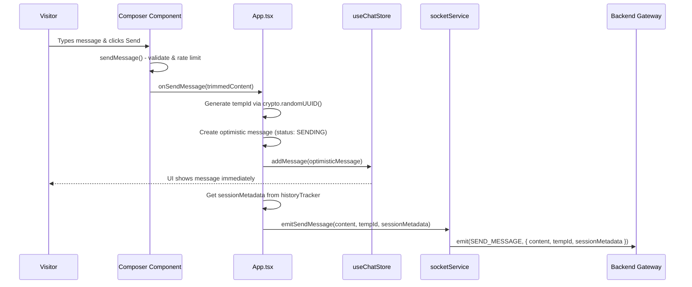
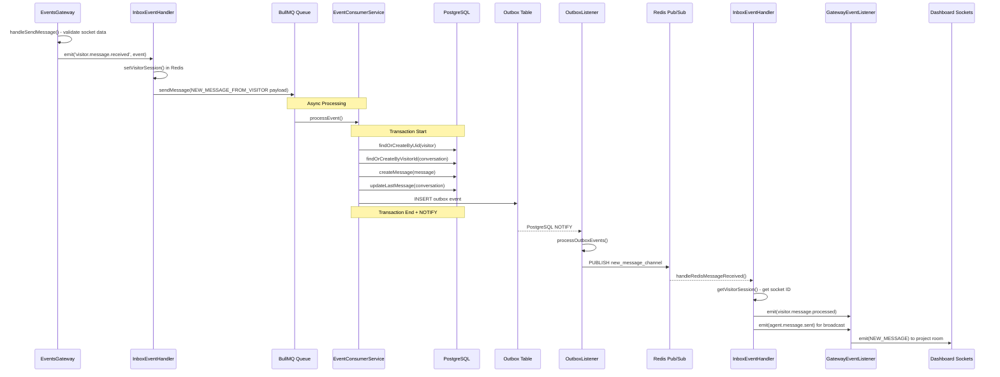
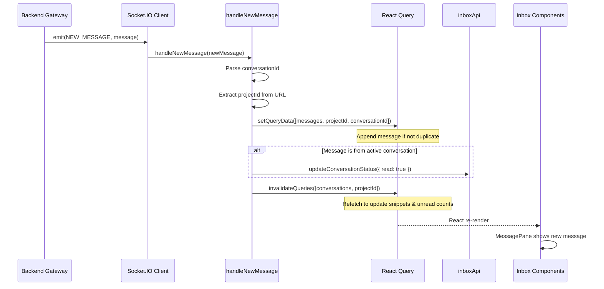

# Feature Investigation: Widget to Dashboard Message Flow

## Overview

This document investigates the complete message flow when a visitor sends a message from the widget to the agent dashboard. The flow spans: Widget → WebSocket Gateway → BullMQ Worker → PostgreSQL + Outbox → Redis Pub/Sub → Dashboard.

## Requirement Traceability

### User Story
**As a** visitor, **I want** my messages to be delivered reliably to the agent dashboard, **so that** I can get a timely response to my inquiries.

### Acceptance Criteria
1. Reliable message queuing using BullMQ to handle high traffic and ensure delivery.
2. Transactional persistence in PostgreSQL with an outbox for guaranteed Redis broadcast.
3. Real-time delivery of visitor messages to all connected agent dashboards.
4. Optimistic UI updates in the widget with server-side confirmation.

## Verification
- **Unit Tests**: `packages/backend/src/inbox/services/message.service.spec.ts`, `packages/backend/src/event-consumer/event-consumer.service.spec.ts`
- **E2E Tests**: `packages/backend/test/chat.e2e-spec.ts`

---

## Slice 1: Widget → Backend

### Entry Points

| Function/Method       | File                                                                                         | Purpose                                        |
| --------------------- | -------------------------------------------------------------------------------------------- | ---------------------------------------------- |
| `sendMessage()`       | [Composer.tsx](../../../packages/frontend/src/widget/components/Composer.tsx#L176)           | Validates input, calls `onSendMessage` prop    |
| `handleSendMessage()` | [App.tsx](../../../packages/frontend/src/widget/App.tsx#L136-152)                            | Creates optimistic message, emits socket event |
| `emitSendMessage()`   | [socketService.ts](../../../packages/frontend/src/widget/services/socketService.ts#L261-272) | Emits `SEND_MESSAGE` via Socket.IO             |

### Execution Flow



### Step-by-step Description

1. **User Action:** Visitor types message in `Composer` textarea, presses Enter or clicks Send button.

2. **Composer.sendMessage():**
   - Trims content, validates non-empty
   - Checks rate limit (10 messages per 60 seconds)
   - Records timestamp for rate limiting
   - Calls `onSendMessage(trimmedContent)` prop
   - Clears input, stops typing indicator

3. **App.handleSendMessage():**
   - Generates `tempId` via `crypto.randomUUID()`
   - Creates optimistic message:
     ```typescript
     { id: tempId, content, sender: { type: "visitor" },
       status: MessageStatus.SENDING, timestamp: new Date().toISOString() }
     ```
   - Calls `addMessage(optimisticMessage)` to update store immediately
   - Gets `sessionMetadata` from `historyTracker.getMetadata()` (browsing history)
   - Calls `socketService.emitSendMessage(content, tempId, sessionMetadata)`

4. **socketService.emitSendMessage():**
   - Verifies socket is connected
   - Creates `SendMessagePayload`: `{ content, tempId, sessionMetadata }`
   - Emits `WebSocketEvent.SEND_MESSAGE` to server

### Payload Structure

```typescript
interface SendMessagePayload {
  content: string; // Message text
  tempId: string; // UUID for optimistic update tracking
  sessionMetadata?: VisitorSessionMetadata; // Browsing history
}
```

### Files Investigated

| File                                                                                | Lines Read | Key Findings                                        |
| ----------------------------------------------------------------------------------- | ---------- | --------------------------------------------------- |
| [Composer.tsx](../../../packages/frontend/src/widget/components/Composer.tsx)       | L176-216   | Rate limiting, validation, calls onSendMessage prop |
| [App.tsx](../../../packages/frontend/src/widget/App.tsx)                            | L136-152   | Creates optimistic msg, adds to store, emits socket |
| [socketService.ts](../../../packages/frontend/src/widget/services/socketService.ts) | L261-272   | Socket.IO emit with SEND_MESSAGE event              |

---

## Slice 2: Backend Processing

### Entry Points

| Function/Method                  | File                                                                                                          | Purpose                                 |
| -------------------------------- | ------------------------------------------------------------------------------------------------------------- | --------------------------------------- |
| `handleSendMessage()`            | [events.gateway.ts](../../../packages/backend/src/gateway/events.gateway.ts#L235-251)                         | WebSocket handler, emits internal event |
| `handleVisitorMessageReceived()` | [inbox-event.handler.ts](../../../packages/backend/src/inbox/inbox-event.handler.ts#L147-175)                 | Queues job to BullMQ                    |
| `handleNewMessageFromVisitor()`  | [event-consumer.service.ts](../../../packages/backend/src/event-consumer/event-consumer.service.ts#L54-134)   | Saves message to DB                     |
| `processOutboxEvents()`          | [outbox-listener.service.ts](../../../packages/backend/src/event-consumer/outbox-listener.service.ts#L62-103) | Publishes to Redis                      |

### Execution Flow



### Step-by-step Description

1. **EventsGateway.handleSendMessage():**
   - Validates `client.data.visitorUid` and `client.data.projectId` exist
   - Creates `VisitorMessageReceivedEvent` with tempId, content, visitorUid, projectId, socketId, sessionMetadata
   - Emits `visitor.message.received` internal event

2. **InboxEventHandlerService.handleVisitorMessageReceived():**
   - Resets visitor session in Redis via `setVisitorSession()`
   - Creates job payload with type `WorkerEventTypes.NEW_MESSAGE_FROM_VISITOR`
   - Queues to BullMQ via `bullMqProducerService.sendMessage()`

3. **EventConsumerService.handleNewMessageFromVisitor()** (in worker process):
   - Runs in database transaction:
     - Finds or creates `Visitor` by UID
     - Fetches `Project` settings for `historyVisibility` mode
     - Finds or creates `Conversation` for visitor
     - Creates `Message` entity with status `SENT`, `fromCustomer: true`
     - Updates `Conversation.lastMessage`
     - Inserts event into `outbox` table + calls `pg_notify()` (app-level, not a trigger)

4. **OutboxListenerService.processOutboxEvents():**
   - Listens to PostgreSQL NOTIFY on `outbox_channel`
   - Fetches unprocessed events with `SELECT FOR UPDATE SKIP LOCKED`
   - Publishes each event to Redis channel `new_message_channel`
   - Deletes processed events from outbox

5. **InboxEventHandlerService.handleRedisMessageReceived():**
   - Parses message from Redis
   - Looks up visitor socket ID from Redis
   - Emits `visitor.message.processed` event (sends MESSAGE_SENT ack to widget)
   - Emits `agent.message.sent` event for project room broadcast

6. **GatewayEventListener.handleAgentMessageSent():**
   - Broadcasts `NEW_MESSAGE` to `project:${projectId}` room

### Queue & Outbox Pattern

| Component     | Technology     | Purpose                                         |
| ------------- | -------------- | ----------------------------------------------- |
| BullMQ Queue  | Redis + BullMQ | Async processing, worker isolation              |
| Outbox Table  | PostgreSQL     | Transactional consistency, exactly-once publish |
| Redis Pub/Sub | Redis          | Real-time broadcast to all server instances     |

### Files Investigated

| File                                                                                                  | Lines Read | Key Findings                                      |
| ----------------------------------------------------------------------------------------------------- | ---------- | ------------------------------------------------- |
| [events.gateway.ts](../../../packages/backend/src/gateway/events.gateway.ts)                          | L235-251   | handleSendMessage, emits internal event           |
| [inbox-event.handler.ts](../../../packages/backend/src/inbox/inbox-event.handler.ts)                  | L147-255   | Queues to BullMQ, handles Redis messages          |
| [event-consumer.service.ts](../../../packages/backend/src/event-consumer/event-consumer.service.ts)   | L54-134    | Transaction: save message + outbox                |
| [outbox-listener.service.ts](../../../packages/backend/src/event-consumer/outbox-listener.service.ts) | L62-103    | LISTEN/NOTIFY, publish to Redis                   |
| [bullmq-producer.service.ts](../../../packages/backend/src/event-producer/bullmq-producer.service.ts) | L13-36     | Queue: `live-chat-events-queue`, job: `event-job` |

---

## Slice 3: Backend → Frontend Dashboard

### Entry Points

| Function/Method      | File                                                                                   | Purpose                                         |
| -------------------- | -------------------------------------------------------------------------------------- | ----------------------------------------------- |
| `handleNewMessage()` | [SocketContext.tsx](../../../packages/frontend/src/contexts/SocketContext.tsx#L43-104) | Socket event handler, updates React Query cache |

### Execution Flow



### Step-by-step Description

1. **Socket Event Received:**
   - Dashboard socket receives `NEW_MESSAGE` event at `SocketContext.tsx:L326`
   - Handler registered via `useRealtimeCacheUpdater()` hook

2. **handleNewMessage():**
   - Parses `conversationId` from message
   - Extracts `projectId` from current URL via regex `/\/projects\/(\d+)/`
   - Updates React Query cache for messages:
     ```typescript
     queryClient.setQueryData(
       ["messages", projectIdFromUrl, conversationId],
       (oldData?: Message[]) => {
         if (oldData && !oldData.some((msg) => msg.id === newMessage.id)) {
           return [...oldData, newMessage];
         }
         return oldData || [newMessage];
       },
     );
     ```

3. **Auto-Read Marking:**
   - Checks if message is from currently viewed conversation
   - If yes AND `newMessage.fromCustomer === true`:
     - Calls `updateConversationStatus({ read: true })`

4. **Cache Invalidation:**
   - Invalidates conversations query with `refetchType: 'all'`
   - Forces immediate refetch to update snippets, unread counts, timestamps

5. **UI Re-render:**
   - `MessagePane` component subscribed to messages query
   - New message appears in chat
   - Conversation list updates with new snippet/timestamp

### Data Transformation

| Backend Field    | Dashboard Usage     | Notes                                |
| ---------------- | ------------------- | ------------------------------------ |
| `id`             | Deduplication key   | Check `!oldData.some(msg => msg.id)` |
| `conversationId` | Cache key + routing | Parsed to number                     |
| `fromCustomer`   | Auto-read logic     | Only mark read if visitor message    |
| All fields       | Direct insert       | No transformation needed             |

### Side Effects

- **React Query Cache:** Messages array updated, conversations invalidated
- **API Call:** `PATCH /inbox/conversations/:id` if auto-read triggered
- **UI:** MessagePane renders new message, ConversationList updates

### Files Investigated

| File                                                                           | Lines Read | Key Findings                                    |
| ------------------------------------------------------------------------------ | ---------- | ----------------------------------------------- |
| [SocketContext.tsx](../../../packages/frontend/src/contexts/SocketContext.tsx) | L43-104    | handleNewMessage updates cache, auto-read logic |

---

## Complete End-to-End Data Lineage

```mermaid
flowchart LR
    A[Visitor types message] --> B[Composer.sendMessage]
    B --> C[App.handleSendMessage]
    C --> D[Optimistic UI update]
    C --> E[socketService.emitSendMessage]
    E --> F[Gateway.handleSendMessage]
    F --> G[InboxEventHandler]
    G --> H[BullMQ Queue]
    H --> I[EventConsumerService]
    I --> J[(PostgreSQL: Message + Outbox)]
    J --> K[OutboxListener NOTIFY]
    K --> L[Redis PUBLISH]
    L --> M[InboxEventHandler.handleRedisMessage]
    M --> N[Gateway broadcast NEW_MESSAGE]
    N --> O[Dashboard SocketContext]
    O --> P[React Query cache update]
    P --> Q[MessagePane renders message]
```



## Event Flow Summary

| Event                       | Emitter                              | Handler                   | Transport     |
| --------------------------- | ------------------------------------ | ------------------------- | ------------- |
| `SEND_MESSAGE`              | Widget socketService                 | Gateway.handleSendMessage | Socket.IO     |
| `visitor.message.received`  | Gateway                              | InboxEventHandler         | EventEmitter2 |
| BullMQ job                  | InboxEventHandler                    | EventConsumerService      | BullMQ/Redis  |
| PostgreSQL NOTIFY           | OutboxPersistenceService (pg_notify) | OutboxListenerService     | PostgreSQL    |
| Redis PUBLISH               | OutboxListenerService                | InboxEventHandler         | Redis Pub/Sub |
| `visitor.message.processed` | InboxEventHandler                    | GatewayEventListener      | EventEmitter2 |
| `agent.message.sent`        | InboxEventHandler                    | GatewayEventListener      | EventEmitter2 |
| `NEW_MESSAGE`               | GatewayEventListener                 | Dashboard SocketContext   | Socket.IO     |
| React Query update          | handleNewMessage                     | MessagePane               | React         |
