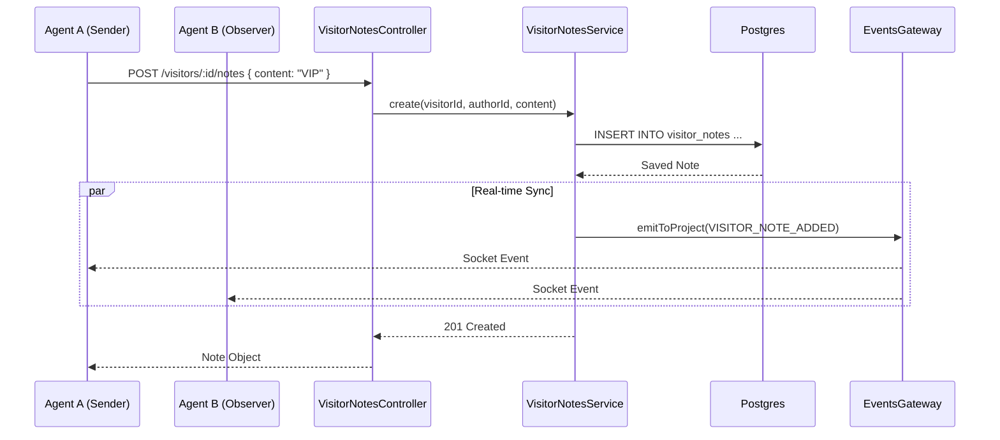

# Architecture: Internal Visitor Notes

## System Diagram

## Components

### VisitorNotesService
-   **Location**: `packages/backend/src/visitor-notes/visitor-notes.service.ts`
-   **Purpose**: Central logic for note management.
-   **Responsibilities**:
    -   Validate access (ensure Visitor belongs to Project).
    -   CRUD operations on `VisitorNote` entity.
    -   Emit real-time events via `EventsGateway`.

### VisitorNotesController
-   **Location**: `packages/backend/src/visitor-notes/visitor-notes.controller.ts`
-   **Purpose**: REST API interface.
-   **Security**: Protected by `JwtAuthGuard` and `RolesGuard(ProjectRole.AGENT)`.

### VisitorContextPanel (Frontend)
-   **Location**: `packages/frontend/src/components/features/inbox/VisitorContextPanel.tsx` (Logic in `VisitorNoteList.tsx`)
-   **Purpose**: UI container for visitor details and notes.
-   **Integration**: Uses `visitorApi` hooks to fetch data and `SocketContext` to listen for updates.

## Data Model

### VisitorNote Entity
-   **Table**: `visitor_notes`
-   **Columns**:
    -   `id`: UUID (PK)
    -   `visitorId`: Int (FK to `Visitor`)
    -   `authorId`: UUID (FK to `User`)
    -   `content`: Text
    -   `createdAt`: Timestamp
    -   `updatedAt`: Timestamp
-   **Relationships**:
    -   Many-to-One with `Visitor` (Cascade Delete).
    -   Many-to-One with `User` (Cascade Delete).

## Real-time Events
-   `VISITOR_NOTE_ADDED`: Sent when a note is created.
-   `VISITOR_NOTE_UPDATED`: Sent when content changes.
-   `VISITOR_NOTE_DELETED`: Sent when a note is removed.
-   **Scope**: Broadcast to all clients in the Project room (`project:{projectId}`).
