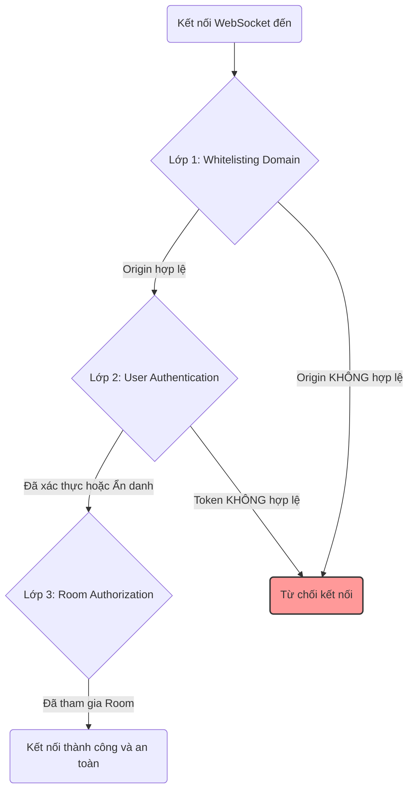
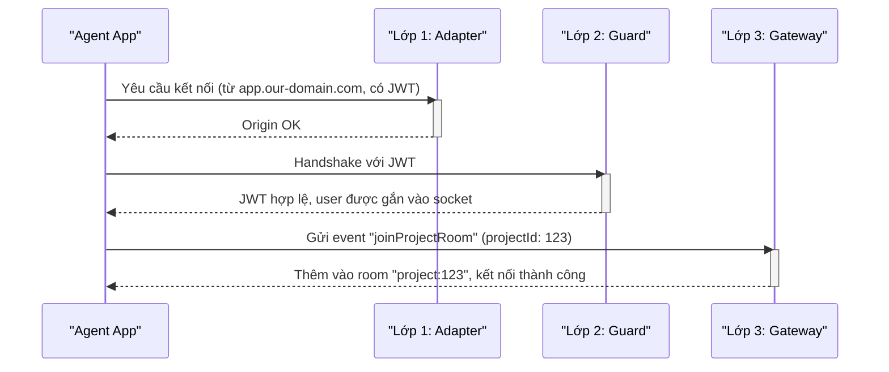
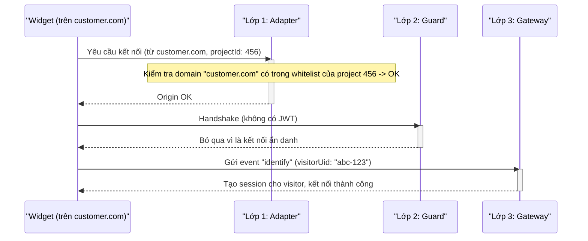

# Slide 1: Tiêu đề

## Bảo Mật API & WebSocket

### **Người trình bày:** Đinh Việt Hoàng

**Chương trình:**

1.  Tổng quan về Bảo mật Endpoint.
2.  Bảo mật REST API (Tóm tắt).
3.  Thách thức của Bảo mật WebSocket.
4.  Kiến trúc Bảo mật WebSocket 3 Lớp.
5.  Luồng kết nối ví dụ (Agent vs. Widget).

---

# Slide 2: Bảo mật REST API (Tóm tắt)

## Các biện pháp bảo vệ cho các endpoint HTTP

Bảo mật cho các API RESTful của chúng ta được xây dựng trên bốn trụ cột chính, tạo thành một hệ thống phòng thủ theo chiều sâu.

| Biện pháp            | Công cụ / File                 | Chức năng                                                                                                                                                               |
| :------------------- | :----------------------------- | :---------------------------------------------------------------------------------------------------------------------------------------------------------------------- |
| **Authentication**   | `jwt.guard.ts`                 | Đảm bảo mọi request (trừ các endpoint được đánh dấu `@Public`) phải có một JWT hợp lệ trong header `Authorization`.                                                     |
| **Authorization**    | `roles.guard.ts`               | Sau khi xác thực, guard này sẽ thực thi việc phân quyền dựa trên vai trò (cả `GlobalRole` và `ProjectRole`) cho các endpoint được đánh dấu `@Roles()`.                  |
| **Input Validation** | `main.ts` (`ValidationPipe`)   | Được áp dụng toàn cục, `ValidationPipe` tự động xác thực và làm sạch dữ liệu DTOs đến, bảo vệ hệ thống khỏi dữ liệu không hợp lệ và các cuộc tấn công injection cơ bản. |
| **CORS**             | `main.ts` (`app.enableCors()`) | Kiểm soát chặt chẽ các domain nào từ phía trình duyệt được phép gửi request đến API, ngăn chặn các cuộc tấn công Cross-Site Request Forgery (CSRF) đơn giản.            |

---

# Slide 3: Thách thức của Bảo mật WebSocket

## Tại sao WebSocket cần một mô hình bảo mật riêng?

Không giống như REST API, WebSocket có những đặc thù riêng đòi hỏi một phương pháp tiếp cận bảo mật khác biệt.

- **REST API: Stateless (Phi trạng thái)**

  - Mỗi request HTTP là một giao dịch độc lập, tự chứa. Client gửi một request, server xử lý và trả về một response, sau đó kết nối đóng lại. Việc xác thực được thực hiện trên từng request bằng cách gửi JWT trong header.

- **WebSocket: Stateful (Có trạng thái)**
  - Client và server thiết lập một kết nối bền vững (persistent connection). Kết nối này được duy trì để cho phép giao tiếp hai chiều bất cứ lúc nào.
  - Do đó, việc xác thực chỉ cần thực hiện **một lần** vào lúc bắt đầu kết nối (handshake). Toàn bộ phiên kết nối sau đó phải được bảo vệ.

### Hai loại Client của Hệ thống

Kiến trúc của chúng ta phải hỗ trợ đồng thời hai loại client có nhu cầu bảo mật hoàn toàn khác nhau:

1.  **Người dùng đã xác thực (Authenticated Users):**

    - Là các Agent hoặc Manager sử dụng ứng dụng web chính của chúng ta.
    - Họ **có** JWT sau khi đăng nhập và cần được phân quyền để truy cập dữ liệu của các dự án cụ thể.

2.  **Khách truy cập ẩn danh (Anonymous Visitors):**
    - Là những người dùng cuối tương tác với widget trò chuyện được nhúng trên các trang web của khách hàng.
    - Họ **không có** JWT và phải được phép kết nối để bắt đầu một cuộc trò chuyện.

---

# Slide 4: Kiến trúc Bảo mật WebSocket 3 Lớp

## Một mô hình phòng thủ theo chiều sâu cho giao tiếp thời gian thực

Để giải quyết các thách thức trên, chúng ta đã xây dựng một mô hình bảo mật gồm 3 lớp riêng biệt. Mọi kết nối WebSocket đều phải đi qua cả 3 lớp này.

1.  **Lớp 1: Whitelisting Domain (`RedisIoAdapter`)**

    - **Mục tiêu:** Ngăn chặn các trang web lạ kết nối.
    - **Cơ chế:** Kiểm tra header `origin` của kết nối. Chỉ cho phép các kết nối từ frontend chính của chúng ta, hoặc từ một domain đã được chủ dự án thêm vào "danh sách trắng" (whitelisted domains) trong cài đặt.

2.  **Lớp 2: User Authentication (`WsJwtAuthGuard`)**

    - **Mục tiêu:** Xác định danh tính của người dùng (nếu có).
    - **Cơ chế:** Kiểm tra sự tồn tại của JWT trong `handshake.auth.token`.
      - Nếu có token (Agent/Manager), guard sẽ xác thực nó và gắn thông tin `user` vào socket.
      - Nếu không có token (Widget ẩn danh), guard cho phép kết nối đi tiếp.

3.  **Lớp 3: Room-Based Authorization (`EventsGateway`)**
    - **Mục tiêu:** Đảm bảo người dùng chỉ nhận được dữ liệu họ được phép xem.
    - **Cơ chế:** Một kết nối sau khi được xác thực vẫn chưa có quyền truy cập dữ liệu nào. Client phải gửi một event `joinProjectRoom` để tham gia vào một "room" cụ thể của dự án (ví dụ: `project:123`). Server chỉ phát các sự kiện và tin nhắn tới các thành viên trong room đó, đảm bảo dữ liệu được cô lập hoàn toàn giữa các dự án.

---

# Slide 5: Luồng kết nối ví dụ

## Minh họa hoạt động của kiến trúc 3 lớp

### Kịch bản 1: Agent Đăng nhập

### Kịch bản 2: Widget của Khách hàng

---

# Slide 6: Hỏi & Đáp

## Cảm ơn!

**Có câu hỏi nào không?**
