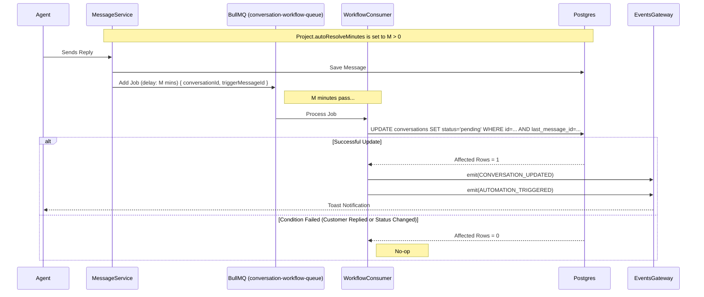

# Architecture: Status Automation

## System Diagram

## Components

### WorkflowModule
-   **Location**: `packages/backend/src/workflow/workflow.module.ts`
-   **Purpose**: Encapsulates workflow logic and registers the BullMQ queue.
-   **Dependencies**: `@nestjs/bullmq`.

### WorkflowConsumer
-   **Location**: `packages/backend/src/workflow/consumers/workflow.consumer.ts`
-   **Purpose**: Processes background jobs.
-   **Logic**: Performs the atomic database update to ensure data integrity (prevents race conditions).

### MessageService (Update)
-   **Location**: `packages/backend/src/inbox/services/message.service.ts`
-   **Role**: Producer.
-   **Logic**: Checks `project.autoResolveMinutes` and schedules the job upon sending an agent reply.

### ConversationPersistenceService (Update)
-   **Location**: `packages/backend/src/inbox/services/persistence/conversation.persistence.service.ts`
-   **Logic**:
    -   Updates `last_message_id` on new messages.
    -   Enforces **Spam Immunity**: Does not transition `SPAM` conversations to `OPEN`.

### ProjectBasicSettingsForm (Frontend)
-   **Location**: `packages/frontend/src/components/features/projects/ProjectBasicSettingsForm.tsx`
-   **Purpose**: UI for configuring `autoResolveMinutes`.

## Data Model Changes

### Projects Table
-   `auto_resolve_minutes`: Integer (Nullable). Default `NULL` (Disabled).

### Conversations Table
-   `last_message_id`: BigInt (Nullable). Foreign Key to `messages.id`.
    -   *Why?* Required for the atomic check in the worker (`WHERE last_message_id = :triggerId`).

## Failure Modes
-   **Worker Down**: Jobs will pile up in Redis. When the worker restarts, they will process. If the time passed, the logic still holds (customer still hasn't replied).
-   **Race Condition**: Customer replies *exactly* when the worker runs.
    -   **Handled by**: Atomic SQL Update. If customer replied, `last_message_id` changed, so `UPDATE ... WHERE last_message_id = :triggerId` returns 0 affected rows. The job does nothing.
