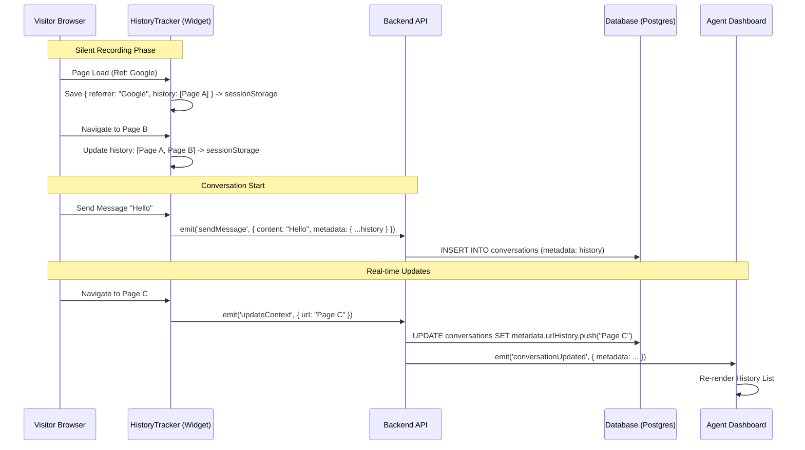

# Architecture: Session-Based URL History & Referrer Tracking

## System Diagram



## Components

### Frontend: HistoryTracker
- **Location:** `packages/frontend/src/widget/services/historyTracker.ts`
- **Purpose:** Manages the client-side state of the visitor's session.
- **Responsibilities:**
    - Capture `document.referrer` on first load.
    - Sanitize URLs (remove `token`, `password`, etc.).
    - Maintain a FIFO buffer of the last 50 visited URLs.
    - Persist state to `sessionStorage` to survive page reloads.

### Backend: Conversation Persistence
- **Location:** `packages/backend/src/inbox/services/persistence/conversation.persistence.service.ts`
- **Purpose:** Handles the storage of conversation data.
- **Responsibilities:**
    - Saves the `metadata` payload from the initial message.
    - Updates `metadata` for existing conversations (idempotency).

### Database Schema
- **Entity:** `Conversation` (`packages/backend/src/database/entities/conversation.entity.ts`)
- **Column:** `metadata` (`jsonb`)
- **Structure:**
    ```typescript
    interface VisitorSessionMetadata {
      referrer: string | null;
      landingPage: string;
      urlHistory: NavigationEntry[]; // { url, title, timestamp }
    }
    ```

## Data Flow
1.  **Capture**: Widget captures data from `window.location` and `document`.
2.  **Buffer**: Data is buffered in `sessionStorage`.
3.  **Transmit**: Data is sent via WebSocket (`socket.io`).
4.  **Persist**: Data is stored in PostgreSQL as a JSON document.
5.  **Broadcast**: Updates are broadcast to Redis (Project Room) and pushed to Agent clients.

## Error Handling
- **Storage Quota**: If `sessionStorage` is full, `HistoryTracker` fails silently to prevent breaking the core chat experience.
- **Payload Bloat**: The history list is capped at 50 entries to prevent WebSocket message size issues.
- **Sanitization**: Sensitive query parameters are stripped before storage to prevent leaking PII/secrets.

## Failure Modes
- **Offline**: If the user is offline, history accumulates in `sessionStorage` and syncs on the next successful message or reconnection.
- **Tab Close**: Closing the tab clears `sessionStorage` (by browser design), resetting the session context.
