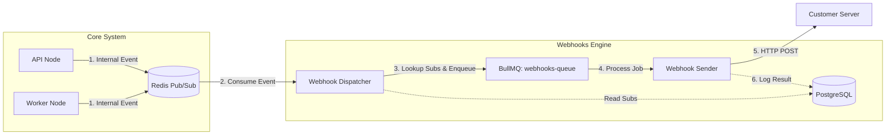

# Architecture: Webhooks Engine

## System Diagram

## Components

### Webhook Dispatcher
- **Location:** `packages/backend/src/webhooks/webhook.dispatcher.ts`
- **Purpose:** Acts as the bridge between the internal event loop and the external notification system. It decouples the "Realtime" path from the "Notification" path.
- **Dependencies:** 
  - `RedisModule` (for Pub/Sub)
  - `WebhooksService` (for subscription lookup)
  - `BullMQ` (for job queuing)
- **Flow:**
  1. Subscribes to `NEW_MESSAGE_CHANNEL`.
  2. On event, identifies the `projectId`.
  3. Queries active subscriptions for that project and event type.
  4. Enqueues a `send-webhook` job for each subscription.

### Webhook Processor (Sender)
- **Location:** `packages/backend/src/webhooks/webhook.processor.ts`
- **Purpose:** Handles the "unreliable" part of the process—sending HTTP requests over the internet.
- **Dependencies:**
  - `BullMQ` (Worker)
  - `Axios` (HTTP Client)
  - `WebhookDelivery` (Entity)
- **Flow:**
  1. Reads job data (Subscription ID, Payload).
  2. Generates `X-Hub-Signature-256`.
  3. Sends HTTP POST with a 5-second timeout.
  4. Records success/failure in `webhook_deliveries`.
  5. Throws error on failure to trigger BullMQ retry.

### Security: SSRF Protection
- **Location:** `packages/backend/src/webhooks/webhooks.service.ts` -> `validateUrl`
- **Purpose:** Prevent malicious users from using the webhook engine to scan internal infrastructure (e.g., `localhost`, AWS metadata service).
- **Mechanism:**
  - Resolves the DNS of the target URL.
  - Checks resolved IPs against private ranges (IPv4 and IPv6).
  - Blocks loopback, private, unique local, and carrier-grade NAT ranges.

## Data Flow

### 1. Subscription Creation
`Client -> API -> WebhooksController -> WebhooksService -> DB`
- **Validation:** URL is checked against SSRF rules. Secret is generated (`sk_wh_...`).

### 2. Event Processing
`Redis -> Dispatcher -> Queue -> Processor -> External URL`
- **Isolation:** Failures in `Processor` do not affect `Dispatcher` or the Core System.

## Error Handling

### Delivery Failures
- **Strategy:** Exponential Backoff via BullMQ.
- **Settings:** 5 attempts. Delays: 1s, 2s, 4s, 8s, 16s.
- **Permanent Failure:** After 5 attempts, the job is discarded (audit log remains as `FAILURE`).

### System Failures
- **Redis Down:** Dispatcher logs error but catches exception to prevent crashing the application process.
- **Database Down:** Delivery logs might fail, but Queue will retry the job until DB is back.

## Failure Modes

1.  **Target Slow/Timeout:**
    - If the customer's server takes >5s to respond, the request is aborted.
    - Result: `FAILURE` (Timeout).
    - Retry: Yes.

2.  **Target Down (500/502):**
    - Result: `FAILURE` (HTTP 5xx).
    - Retry: Yes.

3.  **Invalid/Inactive Subscription:**
    - If a subscription is deleted/deactivated while a job is in the queue, the Processor detects this before sending.
    - Result: `FAILURE` (Subscription inactive).
    - Retry: No.
